# 1. 进程间通信

**IPC**（Inter-Process Communication，进程间通信）是指两个或多个进程之间进行数据交换、同步或通知的机制。由于进程拥有独立的地址空间，它们不能像线程那样直接读写全局变量，必须通过内核提供的特殊通道进行交互。

下表总结了 Linux 下主流 IPC 方式的特性：

| IPC 方式 | 数据传输能力 | 通信速度 | 跨主机能力 | 关键特性与适用场景 |
| :--- | :--- | :--- | :--- | :--- |
| **管道** | 较小 (流式) | 中等 | ❌ 否 | **半双工/单向流**。适用于简单的命令行数据流转 (`ls \| grep`)。 |
| **FIFO (有名管道)** | 较小 (流式) | 中等 | ❌ 否 | **文件系统路径**。允许无亲缘关系的进程通信。 |
| **信号** | 仅一个整数 | 极快 (异步) | ❌ 否 | **异步通知**。不传数据，仅用于控制（如 `Ctrl+C` 杀死进程）。 |
| **信号量** | 无 (仅计数) | 快 | ❌ 否 | **同步锁机制**。不传递数据，主要用于协调共享资源的访问（PV 操作）。 |
| **消息队列** | 中等 (有界) | 中等 | ❌ 否 | **链表结构**。支持按类型优先接收，实现进程解耦。 |
| **共享内存** | **极大** | **极快** | ❌ 否 | **零拷贝**。直接映射物理内存。**最快**的 IPC，但必须配合信号量使用。 |
| **套接字** | 大 | 较慢 (有协议栈开销) | ✅ **是** | **通用接口**。支持 TCP/IP (跨网络) 和 Unix Domain (本地高效)。 |

## 1.1 管道

管道是最古老、最基本的 IPC 形式，本质是内核内存中的一个**环形缓冲区**。

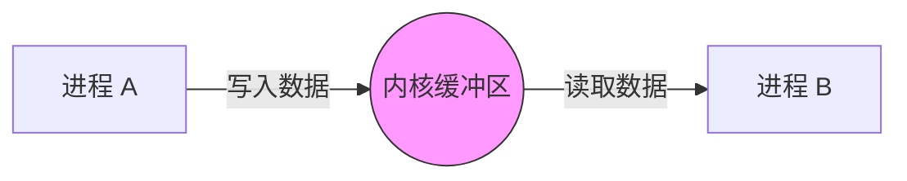

### 1.1.1 工作原理

管道分为**匿名管道**和**命名管道 (FIFO)**。

- **匿名管道**：只能用于具有亲缘关系的进程之间（如父子进程、兄弟进程）。它是通过 `fork` 继承文件描述符实现的。
- **命名管道 (FIFO)**：在文件系统中拥有一个路径名，允许无亲缘关系的进程通过打开该文件进行通信。

### 1.1.2 特性与限制

1. **单向流**：数据只能从一个方向流动（半双工）。如果要双向通信，需要创建两个管道。
2. **字节流**：没有消息边界，读进程可以读取任意大小的数据块。
3. **随进程消亡**：匿名管道的生命周期随进程结束而结束。

> [!example] 例子
> 在 shell 里执行 `ls | grep "test"`。`ls` 的**输出**作为 `grep` 的**输入**。
> **代码层**：`pipe(fd[2])` 创建两个文件描述符，`write(fd[1], ...)` 写入，`read(fd[0], ...)` 读取。

## 1.2 信号

信号是一种**异步通信机制**，用于通知接收进程某个事件已经发生。

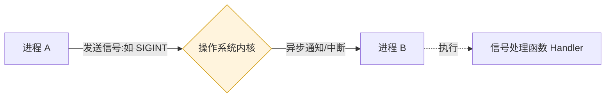

### 1.2.1 机制详解

- **本质**：软件中断。
- **传输内容**：仅传递一个信号编号（整数），无法携带复杂数据。
- **处理方式**：
    1. **默认处理**：终止进程、停止进程或忽略。
    2. **捕获处理**：注册信号处理函数，自定义行为。
    3. **忽略**：忽略该信号（除 `SIGKILL` 和 `SIGSTOP` 外）。

> [!note] 软件中断 vs 硬件中断
> 
> | 特性 | 硬件中断 (Hard Interrupt) | 软件中断 (Software Interrupt) |
> | :--- | :--- | :--- |
> | **触发源** | 外部设备（磁盘、网卡、定时器） | 正在执行的程序指令（`int`, `syscall`） |
> | **同步性** | **异步**（随时可能发生，不可预知） | **同步**（执行到特定指令时触发） |
> | **优先级** | 通常更高 | 相对较低 |
> | **目的** | 响应外部事件 | 请求系统服务或处理错误 |

### 1.2.2 常见信号列表

| 信号名 | 编号 | 默认动作 | 含义与用途 |
| :--- | :--- | :--- | :--- |
| `SIGINT` | 2 | Term | 键盘中断 (`Ctrl+C`)，请求进程停止。 |
| `SIGKILL` | 9 | Term | **强制杀死**，不可被捕获或忽略。 |
| `SIGTERM` | 15 | Term | 终止信号，可被捕获，通常用于优雅关闭服务。 |
| `SIGCHLD` | 17 | Ign | 子进程停止或终止时通知父进程（用于防止僵尸进程）。 |
| `SIGSTOP` | 19 | Stop | 暂停进程执行（类似 `Ctrl+Z`）。 |

> [!example] 例子
> 你在终端按下 `Ctrl + C`，内核会向当前进程发送 `SIGINT` 信号，进程收到后默认会结束运行。
> **代码层**：`kill(pid, SIGUSR1)` 发送信号，目标进程通过 `signal()` 或 `sigaction()` 注册回调函数来处理。

> [!warning] 信号处理的陷阱
> 信号处理函数中只能调用**异步信号安全** 的函数（如 `write`，不能调用 `printf` 或 `malloc`），否则可能导致死锁或未定义行为。

## 1.3 信号量

信号量**不是**用来传输数据的，而是用来**协调进程对共享资源的访问**，即**同步与互斥**。

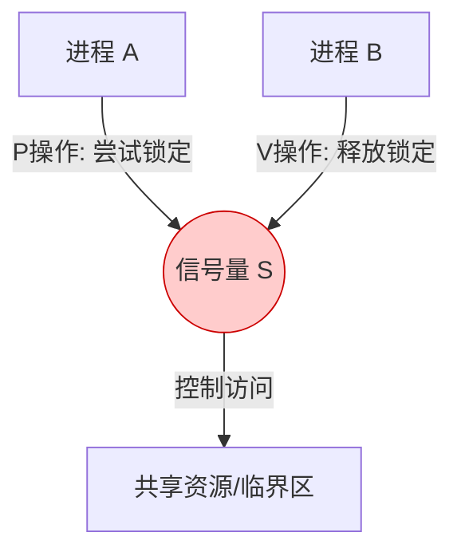

### 1.3.1 核心概念

信号量本质上是一个**整数计数器**，通过两个原子操作 `P` (wait) 和 `V` (signal) 来控制：

- **P 操作 (申请资源)**：`sem - 1`。如果 `sem < 0`，则进程**阻塞**等待。
- **V 操作 (释放资源)**：`sem + 1`。如果有进程在等待，则唤醒其中一个。

> [!example] 例子
> 停车场有 5 个车位（计数器=5）。每进一辆车（`P` 操作），计数减 1；车开走（`V` 操作），计数加 1。当计数为 0 时，后来的车必须等待。
> **代码层**：`semop()` 执行 P/V 操作。

**应用场景**：在使用**共享内存**时，多个进程同时写入会导致数据错乱。必须配合信号量作为“锁”，确保同一时间只有一个进程在写入。

## 1.4 消息队列

消息队列是保存在内核中的**消息链表**。

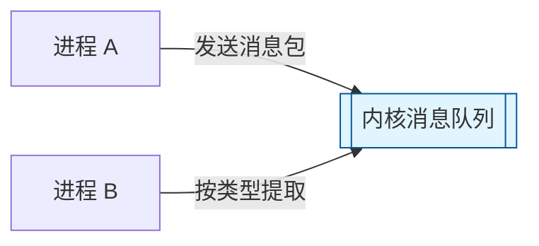

### 1.4.1 特点

1.  **面向记录**：与管道的字节流不同，消息队列接收方可以根据**消息类型**有选择地读取数据。
2.  **异步解耦**：发送方不需要等待接收方准备就绪，消息会一直缓存在内核中，直到被取走。
3.  **生命周期随内核**：除非内核重启或显式删除，否则消息队列一直存在。

> [!example] 例子
> 进程 A 负责收集日志，进程 B 负责处理警报。
> - 进程 A 发送类型为 `1` 的普通日志和类型为 `2` 的紧急警报。
> - 进程 B 可以只接收类型 `2` 的消息，实现优先级处理。

## 1.5 共享内存

共享内存是**最快**的 IPC 方式。

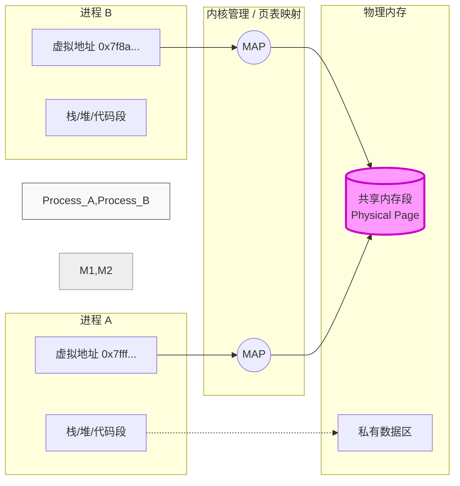

> [!question] 为什么最快？
> 因为多个进程将各自的虚拟地址空间直接映射到**同一块物理内存**。
> - **管道/消息队列**：数据需要从用户内存 -> 内核缓冲区 -> 用户内存（两次拷贝）。
> - **共享内存**：数据直接在用户空间读写，**零拷贝**。

### 1.5.1 关键 API 流程

1. **创建/获取**：`shmget()` 获取共享内存标识符。
2. **挂载**：`shmat()` 将共享内存附加到进程的地址空间。
3. **读写**：直接像读写普通数组一样操作内存指针。
4. **卸载**：`shmdt()` 将共享内存从进程地址空间分离。
5. **删除**：`shmctl()` 删除共享内存对象。

> [!danger] 必须注意同步
> 共享内存本身**不提供**任何同步机制。如果进程 A 正在写数据，进程 B 同时读取，可能会读到一半旧数据一半新数据。**必须配合信号量或互斥锁使用**。

## 1.6 套接字

套接字是网络通信的基础，也是 IPC 的重要方式。


### 1.6.1 两种主要模式

1.  **网络套接字**
    - 基于 TCP/IP 协议栈。
    - **跨主机通信**：允许不同机器上的进程通信（如浏览器访问 Web 服务器）。
    - 优点：通用性强，突破物理限制。
    - 缺点：数据需经过协议栈封装/解包，开销相对较大。

2.  **Unix Domain Socket (UDS)**
    - 基于文件系统（文件类型 `s`）。
    - **仅限本机通信**。
    - 优点：效率远高于 TCP/IP Loopback（绕过网络协议栈处理），常用于本地服务间通信（如 Nginx 与 PHP-FPM，Docker 守护进程与客户端）。

### 1.6.2 通用 API 流程

服务端：`socket()` -> `bind()` -> `listen()` -> `accept()` -> `recv()/send()`
客户端：`socket()` -> `connect()` -> `send()/recv()`

> [!example] 例子
> 你用浏览器访问网页。浏览器进程和 Web 服务器进程通过 Socket 进行数据交换。或者两个 Docker 容器之间通过本地网络接口通信。
> **代码层**：`socket()` 创建，`bind()` 绑定地址，`connect()` / `accept()` 建立连接。

---

# 2. 套接字（Socket）详解

socket 的原意是“插座”，在计算机通信领域，socket 被翻译为“套接字”（一**套**用于连**接**的数**字**），它是计算机之间进行通信的一种约定或一种方式，==本质是操作系统提供的一套网络通信编程接口（API）==。

## 2.1 连接通信的 API

### 2.1.1 `sock()`——获取套接字文件描述符

> server 和 client 都需要用这个函数。

`socket()` 用于在操作系统内核中创建一个新的套接字。该套接字可被用于后续的网络通信操作，如绑定地址（`bind`）、监听连接（`listen`）、发送与接收数据等。

```cpp
#include <sys/socket.h>

// 创建一个套接字
int socket(int domain, int type, int protocol);
```

- **返回值**: 
	- **成功**：返回一个非负整数的**文件描述符**（`int` 类型，一般命名为 `sockfd`、`listen_fd` 或者 `server_fd`），表示新创建的套接字；
	- **失败**：返回 `-1`，并设置 `errno` 错误码。
- **参数**:
    - `domain`: 指定通信域（地址族）
	    - `AF_INET`：使用 IPv4 格式的 ip 地址。
	    - `AF_INET6`：使用 IPv6 格式的 ip 地址。
	    - `AF_UNIX`：本地进程间通信。
    - `type`: 套接字类型
	    - `SOCK_STREAM`： 使用流式的传输协议；
	    - `SOCK_DGRAM`：使用报式(报文)的传输协议。
    - `protocol`: 具体协议编号，通常设为 `0`，表示由系统根据 `domain` 和 `type` 自动选择
	    - `SOCK_STREAM`: 流式传输默认使用的是面向连接的 TCP；
		- `SOCK_DGRAM`: 报式传输默认使用的是无连接的 UDP。
- **作用**: 在内核中分配资源，创建一个可用于通信的套接字对象。

此函数是所有网络编程的起点，必须在调用 `bind`、`connect` 等函数前调用。

> [!tip]
> 对于网络编程，文件描述符可以这样简单记忆：文件描述符就是用来**操作内核中的某一块内存**的。

### 2.1.2 `bind()`

> 只有 server 才用这个函数。

`bind()` 用于**将一个已创建的套接字（socket）与本地地址（IP 和端口）关联起来**。这个操作通常在调用 `listen()` 之前完成，是 TCP 服务器建立监听前的必要步骤。

```cpp
// 将文件描述符和本地的IP与端口进行绑定   
int bind(int sockfd, const struct sockaddr *addr, socklen_t addrlen);
```

- **返回值**: 成功时返回 `0`；失败时返回 `-1`，并设置 `errno` 错误码。
- **参数**:
    - `sockfd`: 套接字文件描述符，由 `socket()` 创建。
    - `addr`: 指向 [struct sockaddr](00_基础知识) 类型的指针，包含要绑定的地址信息（如 IP 地址和端口号）。
    - `addrlen`: 地址结构体的实际字节长度（例如 `sizeof(struct sockaddr_in)`）。
- **作用**: 修改套接字的内部状态，将其绑定到指定的本地地址。
- **线程安全**: 函数本身是线程安全的，但多个线程操作同一套接字仍需同步。

该函数本质上是对内核的系统调用封装，通知操作系统：“这个套接字将来要使用这个本地地址”。

### 2.1.3 `listen()`

> 只有 server 采用这个函数。

`listen()` 用于将一个已创建并绑定地址的套接字（socket）从“**主动**”状态转换为“**被动**”状态，使其能够接收来自客户端的连接请求。该函数并不会阻塞或处理实际的连接，仅**设置监听队列的容量**。

```cpp
// 给监听的套接字设置监听
int listen(int sockfd, int backlog);
```

- **返回值**: 成功时返回 `0`，失败时返回 `-1` 并设置 `errno`。
- **参数**:
    - `sockfd`: 已通过 `socket()` 创建且通过 `bind()` 绑定地址的套接字文件描述符。
    - `backlog`: 最大待处理连接数（即**全连接队列长度**），通常称为 **backlog**。
- **作用**: 修改套接字内核状态，开启连接请求排队机制。
- **注意**: 该函数仅适用于面向连接的协议（如 TCP），对 UDP 无效。

### 2.1.4 `accept()`

> 只有 server 才用这个函数。

`accept()` 用于从**处于监听状态**的套接字（通过 `listen(...)` 设置）中接受一个传入的连接请求。

```cpp
// 等待并接受客户端的连接请求, 建立新的连接, 会得到一个新的文件描述符(通信的)		
int accept(int sockfd, struct sockaddr *addr, socklen_t *addrlen);
```

- **返回类型**: `int` — 成功时返回一个新的非负整数文件描述符（`connfd`），表示与客户端之间的连接；失败时返回 `-1` 并设置 `errno`。
- **参数**:
    - `sockfd`: 监听套接字的文件描述符（通常由 `socket()` 创建并经 `listen()` 激活）。
    - `addr`: **传出参数**, 该函数成功执行完毕后，里边存储了建立连接的**客户端的地址信息**，用于接收客户端的地址信息（如 IP 和端口）；只关心“连接建立了”，而不关心“对方是谁”，就设为 `nullptr`。
    - `addrlen`: **传入传出**参数，指向 `socklen_t` 的指针
	    - 传入时：告诉内核你的 addr 缓冲区有多大（防止内核写越界）；
	    - 传出时：内核告诉你实际写入了多少字节（因为 IPv4/IPv6 地址结构体大小不同）。
	    - 若 `addr` 为 `nullptr`，则此值也应为 `nullptr`。
- **作用**: 阻塞当前线程（除非套接字设置为非阻塞模式），直到有客户端连接到达。
- **线程安全性**: 是取消点（cancellation point），因此不使用 `__THROW` 标记。

### 2.1.5 `connect()`

> 只有 client 才用这个函数。

`connect` 用于在已创建的套接字上发起与远程地址的连接。该函数通常由客户端调用，以连接指定的服务器地址和端口。

```cpp
// 成功连接服务器之后, 客户端会自动随机绑定一个端口
// 服务器端调用 accept() 的函数的第二个参数存储的就是客户端的 IP 和端口信息
int connect(int sockfd, const struct sockaddr *addr, socklen_t addrlen);
```

- **返回值**: 成功时返回 0；失败时返回 -1，并设置 `errno` 以指示错误原因。
- **参数**:
    - `sockfd`: 已通过 `socket()` 创建的套接字文件描述符。
    - `addr`: 指向 `struct sockaddr` 的指针，包含**目标服务器**的协议族、IP 地址和端口号。
    - `addrlen`: 地址结构体的实际长度（以字节为单位）。
- **作用**: 改变套接字状态为“已连接”；对于 TCP 协议，会触发三次握手过程。

该函数是一个**取消点（cancellation point）**，意味着在多线程环境中，若线程被取消，`connect` 可能提前中断。因此，它未使用 `__THROW` 标记，表明其可能因信号而中断。

### 2.1.6 `recv()`

> server 和 client 都可以使用这两个函数。

`recv()` 是一个**系统调用**函数，用于通过指定的套接字文件描述符中**读取数据**（从**内核缓冲区**读到**用户缓冲区**）。与普通的 `read()` 函数不同，`recv` 提供了额外的标志参数，支持更灵活的数据接收方式（如窥探数据而不移除缓冲区内容）。它是阻塞或非阻塞 I/O 的关键部分，且是线程取消点（cancellation point），意味着在多线程环境下可能被中断。

```cpp
// 接收数据
ssize_t recv(int sockfd, void *buf, size_t len, int flags);
```

- **返回类型**: `ssize_t` — 成功时返回**实际接收的字节数**；连接关闭时返回 `0`；出错时返回 `-1`。
- **参数**:
    - `sockfd`: 套接字文件描述符（由 `socket()` 创建）。
    - `buf`: 指向接收缓冲区的指针，该接收缓冲区**由用户创建**，处于用户态。
    - `len`: 用户接收缓冲区最大容量（即最多接收的字节数）。
    - `flags`: 控制接收行为的标志位（如 `MSG_PEEK`、`MSG_WAITALL` 等）。
- **作用**: 修改用户提供的缓冲区内容；在阻塞模式下会挂起线程直到有数据到达。
- **备注**: 此函数是一个**取消点**（cancellation point），因此不能使用 `__THROW` 标记。

### 2.1.7 `send()`

> server 和 client 都可以使用这两个函数。

`send()` 用于在已建立连接的套接字上发送数据（从**用户缓冲区**读到**内核缓冲区**）。与更通用的 `sendto` 或 `sendmsg` 不同，`send` 专用于**已连接的套接字**（如 TCP 连接），因此不需要指定目标地址。它是阻塞或非阻塞 I/O 的关键接口，也是网络应用实现数据传输的基础。

```cpp
// 发送数据的函数
ssize_t send(int sockfd, const void *buf, size_t len, int flags);
```

- **返回值**: `ssize_t` — 成功时返回**实际发送的字节数**（可能小于请求的 `__n`）；失败时返回 -1，并设置 `errno`
- **参数**:
    - `sockfd`: 套接字文件描述符（由 `socket()` 创建，通常已通过 `connect()` 连接）
    - `buf`: 指向待发送数据缓冲区的指针，该发送缓冲区**由用户创建**，处于用户态。
    - `len`: 请求发送的字节数。
    - `flags`: 控制发送行为的标志位（如 `MSG_NOSIGNAL` 可避免在断开连接时触发 `SIGPIPE` 信号）。
- **作用**: 实际调用内核发送数据，会触发网络 I/O；若套接字阻塞或缓冲区满，则函数阻塞；若使用 `MSG_NOSIGNAL`，可避免进程被 `SIGPIPE` 终止。

此函数是**可取消点（cancellation point）**，因此未标记 `__THROW`（即可能被线程取消机制中断）。

### 2.1.8 七个套接字函数的返回值区别

| 函数          | 返回类型      | 成功返回          | 失败返回 | 返回值的额外含义                         |
| ----------- | --------- | ------------- | ---- | -------------------------------- |
| `socket()`  | `int`     | 新的 fd（≥0）     | `-1` | fd 本身就是资源，后续所有操作都靠它              |
| `bind()`    | `int`     | `0`           | `-1` | 无额外含义，只看成功与否                     |
| `listen()`  | `int`     | `0`           | `-1` | 无额外含义，只看成功与否                     |
| `accept()`  | `int`     | 新的 connfd（≥0） | `-1` | fd 代表一条具体连接，是后续 recv/send 的操作对象  |
| `connect()` | `int`     | `0`           | `-1` | 无额外含义，只看成功与否（成功即三次握手完成）          |
| `recv()`    | `ssize_t` | 实际读到的字节数（≥1）  | `-1` | **`0` 单独表示对端已关闭连接（收到 FIN）**，不算出错 |
| `send()`    | `ssize_t` | 实际发出的字节数（≥1）  | `-1` | 返回值可能**小于你想发的长度**，剩余部分需要继续发      |

> [!warning] 易混淆点
> **`recv` 返回 0 不是出错**，是对端正常关闭的信号，必须单独处理：
> ```cpp
> ssize_t n = ::recv(connfd, buf, sizeof(buf), 0);
> if (n < 0) { /* 真正的错误 */ }
> if (n == 0) { /* 对端关闭，应该 close(connfd) */ }
> if (n > 0)  { /* 正常数据 */ }
> ```

## 2.2 C/S 通信顺序

下面是客户端和服务端通过 Socket 通信的先后顺序：

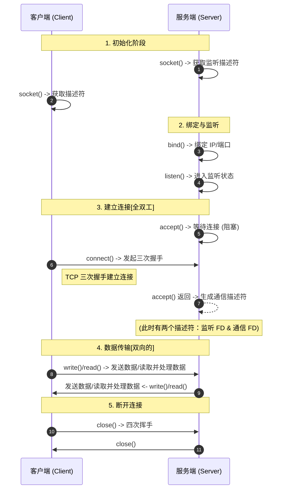

1. <font color="red">服务端</font>和<font color="yellow">客户端</font>初始化 **Socket**，得到文件描述符（fd）
2. <font color="red">服务端</font>调用 `bind`，绑定 IP 和端口
3. <font color="red">服务端</font>调用 `listen`，进行监听
4. <font color="red">服务端</font>调用 `accept`，等待<font color="yellow">客户端</font>连接
5. <font color="yellow">客户端</font>调用 `connect`，向<font color="red">服务端</font>发起连接请求（TCP 三次握手）
6. <font color="red">服务端</font>调用 `accept` 返回用于传输的 Socket 的文件描述符（和第一点得到的 Socket 不同）
7. <font color="yellow">客户端</font>使用 `write` 写入数据，<font color="red">服务端</font>调用 `read` 读取数据
8. <font color="yellow">客户端</font>断开连接时会调用 `close`，<font color="red">服务端</font>也会调用 `close`（TCP 四次挥手）

---

# 3. 简单的 C/S 模型示例

## 3.1 Server

```cpp
#include <arpa/inet.h>
#include <netinet/in.h>
#include <sys/socket.h>
#include <unistd.h>
#include <cerrno>
#include <cstddef>
#include <cstdint>
#include <cstring>
#include <print>
#include <string>

int main() {
  // 1. 创建 socket（:: 表示调用全局的 socket 函数）
  int server_fd = ::socket(AF_INET, SOCK_STREAM, IPPROTO_TCP);
  if (server_fd < 0) {
    std::println("create socket error: errno = {}, errmsg = {}", errno, strerror(errno));
    return 1;
  } else {
    std::println("socket create success!");
  }

  // 2. 绑定 socket
  std::string ip = "127.0.0.1";
  uint16_t port = 8080;  // 在 TCP/IP 协议栈中，端口号占用 16 位（2 字节）

  struct sockaddr_in server_addr;
  memset(&server_addr, 0, sizeof(server_addr));
  server_addr.sin_family = AF_INET;                     // 设置为 IPV4 的地址簇
  server_addr.sin_addr.s_addr = inet_addr(ip.c_str());  // 地址转换：点分十进制 -> 32位整数
  server_addr.sin_port = htons(port);                   // 端口转换：主机字节序 -> 网络字节序

  if (::bind(server_fd, reinterpret_cast<struct sockaddr *>(&server_addr), sizeof(server_addr)) < 0) {
    std::println("socket bind error: errno = {}, errmsg = {}", errno, strerror(errno));
    return 1;
  } else {
    std::println("socket bind success!");
  }

  // 3. 监听
  if (::listen(server_fd, 1024) < 0) {
    std::println("socket listen error: errno = {}, errmsg = {}", errno, strerror(errno));
    return 1;
  } else {
    std::println("socket listening ...");
  }

  while (true) {
    // 4. 接受客户端连接
    int connfd = ::accept(server_fd, nullptr, nullptr);
    if (connfd < 0) {
      std::println("accept error: errno = {}, errmsg = {}", errno, strerror(errno));
      return 1;
    }
    std::println("accept success!");

    char buf[1024] = {0};

    // 5. 接收客户端的数据
    // 假设一次 recv 能读完所有数据
    ssize_t len = ::recv(connfd, buf, sizeof(buf), 0);
    if (len < 0) {
      std::println("recv error: errno = {}, errmsg = {}", errno, strerror(errno));
      return 1;
    }
    std::println("- recv: connfd = {}, msg = {}, len = {}", connfd, std::string(buf), len);

    // 6. 向客户端发送数据
    ::send(connfd, buf, static_cast<size_t>(len), 0);
  }

  // 7. 关闭 socket
  ::close(server_fd);
  return 0;
}
```

### 3.1.1 bind() 的补充

> [!note]
> 第二步中绑定是指：**绑定的是“监听哪个网卡”，而不只是“我的地址是什么”**。

很多初学者会误以为：

```
bind = 告诉别人“我是谁”
```

但更准确地说：

```
bind = 告诉内核：这个 socket 要接收哪些网卡 / IP 上的数据
```

这是非常底层、非常关键的理解。

一台机器通常有多个网络接口（网卡），每个接口有自己的 IP：

```
lo        127.0.0.1     ← 本地回环（loopback）
eth0      192.168.1.10  ← 局域网网卡
eth1      10.0.0.5      ← 另一块网卡（如果有的话）
```

绑定 `127.0.0.1:8080` 的意思是：**只接收从 loopback 接口进来的连接**。

```
外部机器 192.168.1.20 → 访问 192.168.1.10:8080 → ❌ 被内核直接拒绝
本机自己              → 访问 127.0.0.1:8080    → ✅ 可以连接
```

所以这段代码写的服务器，**其他机器根本连不上**，只有本机自己能访问。

**实际开发中的常见写法**：

```cpp
// 只允许本机访问（测试用）
server_addr.sin_addr.s_addr = inet_addr("127.0.0.1");

// 监听所有网卡 → 任何人都能连（生产环境常用）
server_addr.sin_addr.s_addr = INADDR_ANY;  // 等价于 0.0.0.0

// 只监听某块特定网卡
server_addr.sin_addr.s_addr = inet_addr("192.168.1.10");
```

`INADDR_ANY`（即 `0.0.0.0`）是最常见的写法，意思是"不挑网卡，从哪个接口来的连接都接受"。

端口和 IP 的分工不同：
- **IP（网卡）**：
	- 定位到具体的计算机
	- 路由数据包到目标主机
	- 可以是公网 IP 或私网 IP
- **端口**：
	- 区分同一台主机上的不同网络服务
	- 让操作系统知道将数据交给哪个进程
	- 范围：0-65535（正好 16 位，用 `uint16_t` 表示）

同一台机器上可以同时跑：

```
0.0.0.0:8080  → 你的 HTTP 服务
0.0.0.0:3306  → MySQL
0.0.0.0:22    → SSH
```

内核收到一个数据包，先看目标 IP 匹配哪个网卡，再看目标端口交给哪个进程，这样就能精确路由到对应的 `server_fd`。

### 3.1.2 close() 的作用

简单来说：`close(sockfd)` 的直接操作是**减少引用计数**，而“关闭连接”是引用计数归零后的副作用。在 Linux 中，Socket 也是一个文件，遵循“一切皆文件”的原则。

> [!question] 为什么会有“引用计数”？
> 这是为了处理 **`fork()`** 或 **`dup()`** 产生的情况。

假设有这样一个场景：
1. 你的主进程创建了一个 Socket（`sockfd`），此时**引用计数为 1**。
2. 主进程调用 `fork()` 创建了一个子进程。
3. 因为子进程会克隆父进程的文件描述符表，现在父子进程都指向同一个内核 Socket 对象。此时**引用计数变为 2**。

**关键点来了**：如果你在父进程里调用 `close(sockfd)`，父进程只是断开了它自己与这个 Socket 的联系。
- 内核检查引用计数：$2 - 1 = 1$。
- 因为计数不为 0，内核**不会**发起 TCP 四次挥手，连接依然保持开启。
- 子进程仍然可以继续使用这个 Socket 正常通信。

> 只有当子进程也调用了 `close()`，**计数减为 0**，内核才会真正启动清理流程（发送 FIN 包，回收缓冲区等）。

如果你想**强制关闭连接**而不关心有多少个进程在引用它，你应该用 `shutdown()`。

|**函数**|**操作对象**|**影响**|
|---|---|---|
|**`close()`**|进程的文件描述符|递减引用计数。只有归零时才真正关闭 TCP 连接。|
|**`shutdown()`**|底层的 TCP 连接|**无视引用计数**，直接切断连接（可以只切断读、只切断写、或两者都切断）。|

> [!question] 引用计数归零后会发生什么？
> 当最后一个持有该 `sockfd` 的进程调用 `close()`，或者进程异常退出时，内核会接管剩下的扫尾工作：
> 1. **发送残余数据**：如果发送缓冲区里还有数据（且你没设置特殊的 `SO_LINGER`），内核会尝试把它们发完。
> 2. **启动四次挥手**：内核向对方发送 `FIN` 包。
> 3. **回收资源**：释放该 Socket 占用的发送/接收缓冲区内存，归还端口号。

你会发现在很多经典的 C 语言服务器代码里有这样的逻辑（多进程 Web 服务器）：

```cpp
while (1) {
    int conn_fd = accept(listen_fd, ...);
    if (fork() == 0) { // 子进程
        close(listen_fd); // 子进程不需要监听，关掉它的引用
        handle_client(conn_fd);
        close(conn_fd);   // 处理完，减掉子进程的引用
        exit(0);
    }
    close(conn_fd); // 父进程不需要处理具体业务，减掉父进程的引用
}
```

**注意父进程末尾的 `close(conn_fd)`**：如果父进程不写这一行，`conn_fd` 的引用计数永远是 1（由父进程持有），即便子进程退出了，这个 TCP 连接也会一直处于“僵死”状态无法释放，最终导致系统句柄耗尽。

## 3.2 Client

```cpp
#include <print>
#include <sys/socket.h>
#include <netinet/in.h>
#include <arpa/inet.h>
#include <unistd.h>
#include <cerrno>
#include <cstring>
#include <string>

int main() {
  // 1. 创建 socket
  int client_fd = ::socket(AF_INET, SOCK_STREAM, IPPROTO_TCP);
  if (client_fd < 0) {
    std::println("create socket error: errno = {}, errmsg = {}", errno, strerror(errno));
    return 1;
  } else {
    std::println("socket create success!");
  }

  // 2. 连接服务端（服务端也是这个 IP 和端口）
  std::string ip = "127.0.0.1";
  uint16_t port = 8080;

  struct sockaddr_in server_addr;
  memset(&server_addr, 0, sizeof(server_addr));
  server_addr.sin_family = AF_INET;
  server_addr.sin_addr.s_addr = inet_addr(ip.c_str());
  server_addr.sin_port = htons(port);

  if (::connect(client_fd, reinterpret_cast<struct sockaddr *>(&server_addr), sizeof(server_addr)) < 0) {
    std::println("connect error: errno = {}, errmsg = {}", errno, strerror(errno));
    return 1;
  } else {
    std::println("connect success!");
  }

  // 3. 向服务端发送数据
  std::string message = "Hello, server!";
  if (::send(client_fd, message.c_str(), message.size(), 0) < 0) {
    std::println("send error: errno = {}, errmsg = {}", errno, strerror(errno));
    return 1;
  } else {
    std::println("send success!");
  }

  // 4. 客户端接受服务端的数据
  char buf[1024] = {0};
  ssize_t len = ::recv(client_fd, buf, sizeof(buf), 0);
  if (len < 0) {
    std::println("recv error: errno = {}, errmsg = {}", errno, strerror(errno));
    return 1;
  }
  std::println("- recv: msg = {}, len = {}", std::string(buf), len);

  // 5. 关闭 socket
  ::close(client_fd);
  return 0;
}
```


### 3.2.1 send 补充

`send(...)` 并不是直接把数据发到网线上，它的实际工作是：**把数据从你的进程拷贝到内核的发送缓冲区**，真正发送到对端的事情由内核在后台做。假设这里要发送 **1000** 字节的数据：

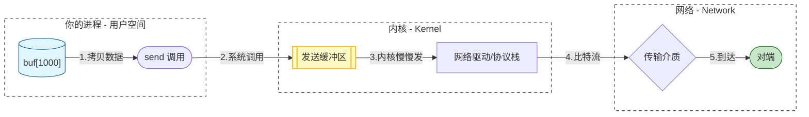

所以 `send()` 返回的是“**成功从用户态缓冲区拷贝到内核 socket 发送缓冲区中的字节数**”，而不是“已经真正通过网卡发送出去的字节数”。

如果**发送缓冲区快满了**：

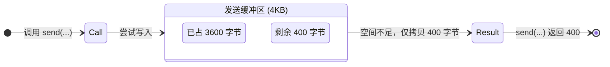

这时候 `send()` 不会等缓冲区腾出空间，**直接返回已写入的字节数**。

> 注：在计算机网络中，$K$ 表示 1000，而不是 1024。

正确的做法：循环发送

```cpp
// 重写封装 send 函数
ssize_t send_all(int fd, const char* buf, size_t total) {
    size_t sent = 0;
    while (sent < total) {
        ssize_t n = ::send(fd, buf + sent, total - sent, 0);
        if (n < 0) return -1;   // 真正出错
        sent += n;
    }
    return sent;
}
```

### 3.2.2 recv 补充

同样，`recv(...)` 也不是“直接从网线上读数据”，而是“**从内核 socket 接收缓冲区（recv buffer）拷贝数据到用户态 buf 中**”：

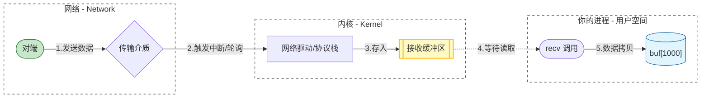

同样的问题，**接收缓冲区里现有的数据可能比你想读的少**：

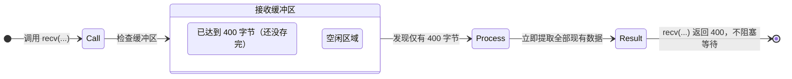

所以也需要循环接收：

```cpp
// 重写封装 recv 函数
ssize_t recv_all(int fd, char* buf, size_t total) {
    size_t received = 0;
    while (received < total) {
        ssize_t n = ::recv(fd, buf + received, total - received, 0);
        if (n < 0) return -1;  // 出错
        if (n == 0) return 0;  // 对端关闭连接
        received += n;
    }
    return received;
}
```

> 不过这里有一个比 `send` 更棘手的问题：**你怎么知道 `total` 是多少？**

在使用 `send` 时，发送方明确知道要发出多少字节。但在 `recv` 时，接收方会面临一个棘手的问题：TCP 是面向字节流的，它不保证数据的“报文边界”。如果你直接调用 `recv(1024)`，你无法判断这 1024 字节里包含的是一个完整请求、半个请求，还是三个请求粘在一起。由于不知道消息的预期总长度（total），接收端的循环接收逻辑就不知道何时该停下来处理业务。

为了解决这个“**断句**”问题，应用层协议必须自己定义消息边界。常见的成熟方案有三种：

1. 固定长度 (Fixed Length)
	- 规则：规定每条消息必须是固定的 N 字节。
	- 逻辑：`recv` 累积满 N 字节就处理一次。
	- 缺点：不够灵活，浪费空间（短消息也要补齐到 N）。

2. 特殊分隔符 (Delimiter Based)
	- 规则：在消息末尾添加特定的字符序列。
	- 逻辑：不断 `recv` 并扫描字节流，直到发现分隔符（如 HTTP Header 结尾的 `\r\n\r\n` 或 Redis 的 `\r\n`）。
	- 缺点：内容中不能包含分隔符（需转义），且扫描字节流会有一定的性能开销。

3. 自定义头部长度 (Length Field) — 最通用方案
	- 规则：将消息分为**固定长度**的 Header 和**变长**的 Body。**Header 中必须包含一个字段声明 Body 的字节数**。
	- 逻辑：
	    1. 第一步：先 `recv` 固定长度的 Header（例如 4 字节）。
	    2. 第二步：解析 Header，**得到 Body 的长度**（假设为 600）。
	    3. 第三步：循环 `recv` 直到读满 600 字节，此时 Body 接收完整。

无论是 HTTP（Content-Length）、Redis 协议还是 Protobuf，本质上都是上述方案的变体。在设计网络协议时，首要任务就是定义“如何确定长度”，以确保接收方能从连续的字节流中精准地切分出完整的消息。

---

# 4. Socket 文件描述符详解

## 4.1 sockfd 的本质

调用 `socket()` 函数时，内核会在系统级打开文件表中创建一个 `struct file` 条目，并在调用进程的 `fd_array[]` 中分配当前**最小可用的整数索引**，这个整数就是 `sockfd`。

从内核视角看，socket 与普通文件并无本质区别——它同样是关联了一个 `struct file`，同样可以被 `read()`/`write()`/`close()`/`select()`/`epoll` 操作。区别仅在于 `struct file` 中的 `f_op`（文件操作函数表）指向了 socket 专属的实现，以及它背后挂载的不是 inode 而是一个 **`struct socket` 控制块**。

**唯一性范围**：`sockfd` 只在**当前进程内**唯一。不同进程可以持有数值相同的 `sockfd`（如都是 fd=4，因为每个进程的 PCB 中都维护一个独立的 `fd_array[]`），但它们指向各自进程中完全不同的 `struct file` 条目，互不相关。

## 4.2 服务端的两类 Socket

服务端在运行时同时维护两种职责完全不同的 Socket：

|        | **监听 Socket**             | **已连接 Socket**          |
| ------ | ------------------------- | ----------------------- |
| 常见命名   | `listen_fd` / `server_fd` | `conn_fd` / `client_fd` |
| 创建时机   | `socket()`                | `accept()` 成功返回时        |
| TCP 状态 | `LISTEN`                  | `ESTABLISHED`           |
| 职责     | 等待并接受新连接请求                | 与特定客户端进行数据收发            |
| 生命周期   | 服务进程**全程持有**              | 该客户端连接**断开后关闭**         |
| 数量     | 通常只有 1 个                  | 与当前连接数相同                |

若有 100 个客户端同时连接，服务端进程中存在 1 个监听 Socket 和 100 个已连接 Socket，共 101 个 fd。

```cpp
int listen_fd = ::socket(...);          // 创建监听 socket
::bind(listen_fd, ...);                 // 绑定地址与端口（如 0.0.0.0:8080）
::listen(listen_fd, backlog);           // 进入 LISTEN 状态，backlog 指定半连接队列大小

// 每 accept() 一次，产生一个新的 conn_fd
int conn_fd = ::accept(server_fd, ...); // 每次成功调用就会产生一个新的 conn_fd

::recv(conn_fd, buf, len, 0);           // 从该客户端接收数据
::send(conn_fd, buf, len, 0);           // 向该客户端发送数据

::close(conn_fd);                       // 关闭此连接，listen_fd 不受影响
```

> [!note] **`accept()` 的内核行为**
> `listen()` 之后，内核为该端口维护两个队列：
> - **SYN 队列**（半连接队列）：存放已收到 SYN、**正在完成三次握手**的连接；
> - **Accept 队列**（全连接队列）：存放**已完成三次握手**、等待应用层取走的连接。

`accept()` 本身**不参与三次握手**，握手由内核协议栈在后台全程处理。`accept()` 只是从 **Accept 队列**中取出（dequeue）一个已建立的 `struct sock`，为其创建 `struct socket` 和 `struct file`，并返回新的 fd。若 Accept 队列为空，`accept()` 默认阻塞等待。

> **注意**：读写缓冲区（`sk_rcvbuf` / `sk_sndbuf`）在三次握手完成时就已随 `struct sock` 一并分配，**并非** `accept()` 之后才创建。`accept()` 只是将这个已就绪的 socket "交接给用户态"。

> [!question]
> 那么内核如何区分这 100 个连接呢？

所有客户端连接的目的地址都是同一个 `{服务器 IP, 8080, TCP}`，内核通过 **TCP 五元组**唯一标识每一条连接：

$$
\text{\{源 IP,\ 源端口,\ 目的 IP,\ 目的端口,\ 协议\}}
$$

虽然 `{目的 IP, 目的端口, 协议}` 对所有连接相同，但同一时刻每个客户端的 `{源 IP, 源端口}` 组合必然唯一。数据包到达网卡时，内核以五元组为 key 查找对应的 `struct tcp_sock` 控制块，再经由 `struct socket` → `struct file` → `fd_array[]` 的反向映射，将数据送达应用层对应的 `conn_fd`。

```
数据包（五元组）
     │
     ▼
内核哈希表查找 tcp_sock          O(1)
     │
     ▼
struct socket → struct file
     │
     ▼
fd_array[conn_fd]               交由应用层处理
```

这也解释了为何同一台机器上同一客户端进程可以向同一服务端建立多条连接——只要每次 `connect()` 使用不同的源端口，五元组就不同，内核就将其视为独立连接。

## 4.3 conn_fd 的完整内核链路

`accept()` 在内核中依次完成以下动作：

1. 从全连接队列中 dequeue 出一个 `struct sock`（已完成握手，状态为 `ESTABLISHED`）；
2. 创建一个新的 `struct socket`（VFS 层的 socket 抽象）；
3. 创建一个新的 `struct file`，令其 `private_data` 指向该 `struct socket`；
4. 在当前进程的 `fd_array[]` 中找一个空闲槽位，填入新的 `struct file *`；
5. 将该槽位的下标作为整数返回给用户态，即 `conn_fd`。

`conn_fd` 本质上是进程文件描述符表的一个**数组下标**，通过以下链路最终找到内核中的 TCP 收发缓冲区：

```
进程的 task_struct
    └── files_struct
            └── fd_array[]
                    ├── fd[0] → struct file (stdin)
                    ├── fd[1] → struct file (stdout)
                    ├── fd[2] → struct file (stderr)
                    │
                    ├── fd[3] → struct file          ← listen_fd / server_fd
                    │              └── struct socket
                    │                      └── struct sock（LISTEN）
                    │                              ├── syn_queue        ← 半连接队列
                    │                              └── accept_queue     ← 全连接队列
                    │                                      └── struct sock（ESTABLISHED）× N
                    │                                              （握手完成但尚未被 accept 取走）
                    │
                    └── fd[4] → struct file          ← conn_fd
                                   └── struct socket
                                           └── struct sock（ESTABLISHED）
                                                   ├── sk_receive_queue ← 接收队列
                                                   │       └── sk_buff → sk_buff → ...
                                                   └── sk_write_queue   ← 发送队列
                                                           └── sk_buff → sk_buff → ...
```

完整数据结构层级：

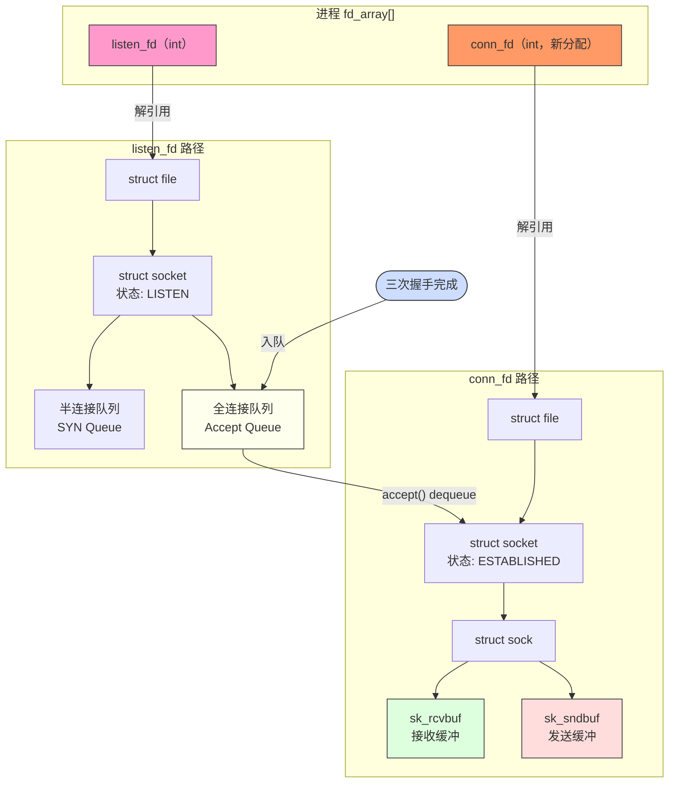

## 4.4 fd 编号的分配与复用

内核始终分配**当前最小的可用非负整数**作为新 fd，这是 POSIX 标准规定的行为。

```
初始状态（stdin/stdout/stderr 已占用 0/1/2）：

socket()  → server_fd = 3     （最小空闲）
accept()  → conn_fd_1 = 4
accept()  → conn_fd_2 = 5

close(4)                       （conn_fd_1 断开，fd=4 释放）

accept()  → conn_fd_3 = 4     （复用了刚释放的 4，而非分配 6）
```

**注意事项**：
- fd 编号会被复用，不能用 fd 的数值大小来推断连接的先后顺序或当前有效性。
- 在多线程服务端中，`accept()` 返回新 fd 到用其发起 `recv()` 之间存在竞态窗口，需注意线程安全。
- 高并发场景下应关注 `ulimit -n` 的限制，每个连接消耗一个 fd，100k 并发连接需要相应调高进程的 fd 上限。
- `select()`（后面会详细介绍）监听的 fd 编号不能超过 `FD_SETSIZE`（通常为 1024），这与 `ulimit -n` 无关，是 `select()` 的硬编码限制，也是高并发场景下 `epoll` 取代 `select()` 的核心原因之一。

## 4.4 客户端的 Socket

客户端只需一个 Socket，它同时扮演“连接发起者”和“通信信道”两个角色：

```cpp
int client_fd = ::socket(...);     // 创建 socket，此时尚未与任何地址绑定
::connect(client_fd, server_addr, addrlen);
// connect() 触发三次握手：
//   1. 内核自动选择一个可用的本地端口（临时端口，ephemeral port）
//   2. 发送 SYN，等待服务端 SYN-ACK
//   3. 发送 ACK，连接进入 ESTABLISHED 状态
// connect() 返回时，握手已完成，可以立即收发数据

::send(client_fd, buf, len, 0);    // 发送数据
::recv(client_fd, buf, len, 0);    // 接收数据

::close(client_fd);                // 触发四次挥手，释放连接
```

`connect()` 返回后，`client_fd` 背后的五元组已经确定：

$$
\text{\{本机 IP,\ 内核分配的临时端口,\ 服务器 IP,\ 服务器端口,\ TCP\}}
$$

客户端不调用 `bind()` 时，本机 IP 和临时端口由内核自动选择（临时端口范围由 `/proc/sys/net/ipv4/ip_local_port_range` 控制，默认约 32768–60999）。若客户端需要固定源端口（如某些 NAT 穿透场景），则在 `connect()` 前显式调用 `bind()`。

## 4.5 对比总结

```
服务端                              客户端

socket()                            socket()
   │ server_fd=3                       │ client_fd=3
bind()                              connect() ──── 三次握手
listen()                               │
accept() ──── 三次握手（内核完成）     │
   │ conn_fd=4                         │
   │                                   │
send(conn_fd) ◄──────────────── recv(client_fd)
recv(conn_fd) ───────────────── send(client_fd)
   │                                   │
close(conn_fd) ─── 四次挥手 ──── close(client_fd)

server_fd 继续 LISTEN，等待下一个连接
```

| | **服务端 `server_fd`** | **服务端 `conn_fd`** | **客户端 `client_fd`** |
|---|---|---|---|
| 创建方式 | `socket()` | `accept()` | `socket()` |
| 绑定端口 | 显式 `bind()` | 继承自 `server_fd` | 内核自动分配 |
| TCP 状态 | `LISTEN` | `ESTABLISHED` | `ESTABLISHED` |
| 可否收发数据 | 否 | 是 | 是 |
| 关联的内核结构 | `struct sock`（LISTEN）<br/>管理半连接/全连接队列 | `struct sock`（ESTABLISHED）<br/>含收发缓冲区 | `struct sock`（ESTABLISHED）<br/>含收发缓冲区 |
| IO 多路复用可读含义 | 全连接队列非空，<br/>可调用 `accept()` | 接收缓冲区有数据，<br/>可调用 `recv()` | 接收缓冲区有数据，<br/>可调用 `recv()` |
| 数量 | 1 | 等于当前连接数 | 1（每条连接） |

---

# 5. I/O 设置

**各操作是否阻塞**：

| 函数          | 是否阻塞      | 什么情况下阻塞                |
| ----------- | --------- | ---------------------- |
| `socket()`  | ❌ 不阻塞     | 只是创建一个 fd，纯内存操作        |
| `bind()`    | ❌ 不阻塞     | 只是登记地址信息，纯内存操作         |
| `listen()`  | ❌ 不阻塞     | 只是初始化两个队列，纯内存操作        |
| `accept()`  | ✅ **会阻塞** | 全连接队列为空时，一直等到有客户端连接    |
| `connect()` | ✅ **会阻塞** | 等待三次握手完成（等服务端 SYN-ACK） |
| `recv()`    | ✅ **会阻塞** | 接收缓冲区为空时，一直等到有数据到来     |
| `send()`    | ✅ **会阻塞** | 发送缓冲区满时，一直等到缓冲区腾出空间    |
| `close()`   | 通常不阻塞     | 开启了 `SO_LINGER` 选项时例外  |

**非阻塞模式下的返回信号**：

|系统调用|非阻塞时的立即返回信号|核心注意事项|
|:--|:--|:--|
|`accept()`|`errno == EAGAIN`：队列为空|需循环至 `EAGAIN`（ET 模式下强制要求）|
|`recv()`|`errno == EAGAIN`：缓冲区为空|需循环至 `EAGAIN` 确保数据读完|
|`send()`|`errno == EAGAIN`：缓冲区已满|需维护应用层写缓冲区，注册 `EPOLLOUT` 续传|
|`connect()`|`errno == EINPROGRESS`：握手进行中|监听 `EPOLLOUT`，用 `getsockopt` 确认最终结果|

## 5.1 阻塞 I/O

当进程发起一个 I/O 系统调用（如 `read`）时，如果数据未就绪，**该调用会一直挂起（阻塞），直到数据准备好并完成拷贝**。在此期间，进程无法执行其他代码。

用前面的代码里的 `recv` 举例，阻塞发生在两个阶段：

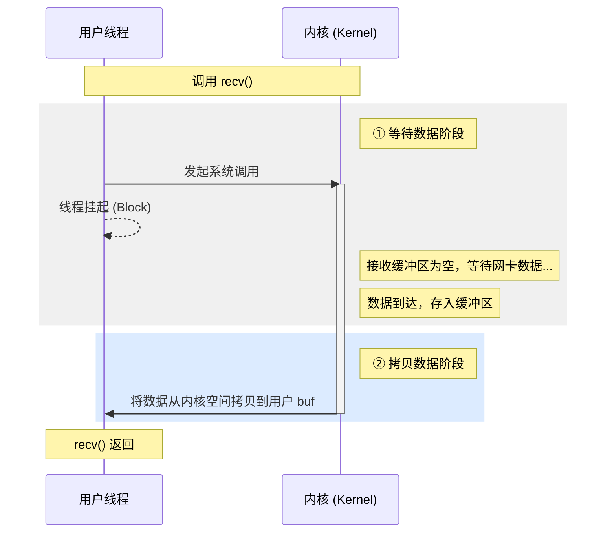

线程在这期间什么都干不了，就像打电话占线一样，只能等。

结合前面的代码来看：

```cpp
while (true) {
    // ① 阻塞在这里，直到有客户端连接
    int connfd = ::accept(server_fd, nullptr, nullptr);

    // ② 阻塞在这里，直到客户端发来数据
    ssize_t len = ::recv(connfd, buf, sizeof(buf), 0);

    // ③ 发送缓冲区满时会阻塞，通常很快
    ::send(connfd, buf, len, 0);
}
```

这段代码有一个致命问题：**同一时刻只能服务一个客户端**。

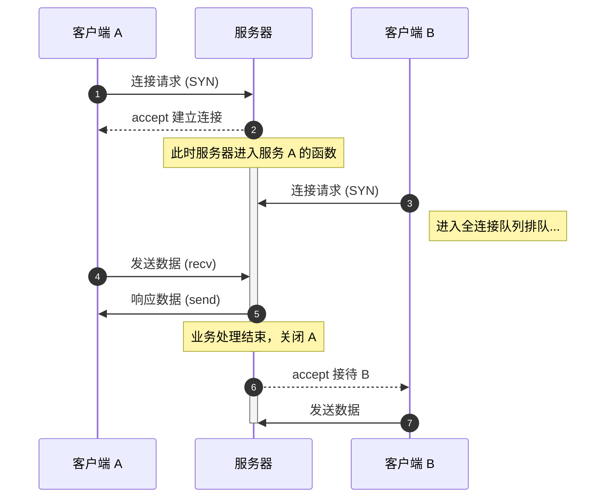

这就是为什么实际服务器需要用**多线程**或者**IO 多路复用**（`select`/`poll`/`epoll`）来解决阻塞问题，让多个客户端能被**同时**处理（其实就是提高并发性）。

## 5.2 非阻塞 I/O

> [!note]
> 当进程发起 IO 调用时，**无论数据是否就绪，系统调用都会立即返回**。如果数据**未就绪**，通常**返回错误码**（如 `EAGAIN` 或 `EWOULDBLOCK`），进程可以继续做其他事，之后再尝试。

还是用 `recv` 举例，和阻塞 IO 对比来看：

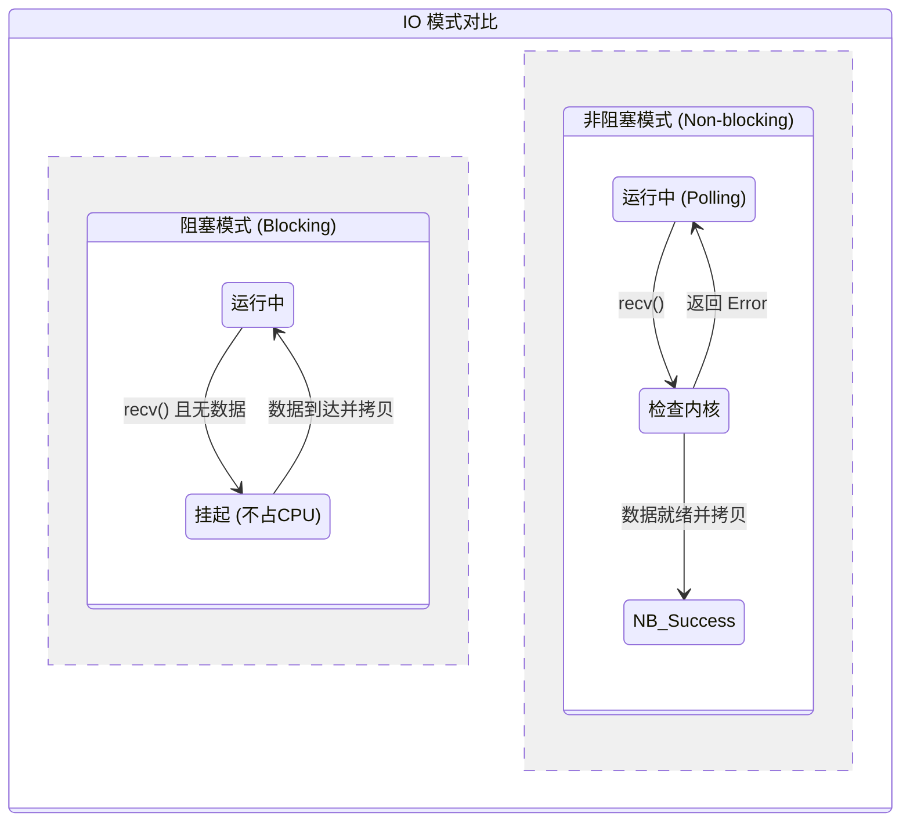

这里把代码中的 socket 设置成非阻塞：

```cpp
// 创建 socket 后，设置为非阻塞模式
int flags = fcntl(server_fd, F_GETFL, 0);
fcntl(server_fd, F_SETFL, flags | O_NONBLOCK);
```

> 1. 首先使用 F_GETFL 获取当前文件描述符 server_fd 的状态标志。
> 2. 然后使用 `F_SETFL` 将 `O_NONBLOCK` 标志加入原有标志中，使该 socket 变为非阻塞模式。

设置非阻塞后，`recv` 的行为变化：

```cpp
// 阻塞模式（默认）：缓冲区没数据就一直等
ssize_t n = ::recv(connfd, buf, sizeof(buf), 0);

// 非阻塞模式：`read()` 或 `write()` 调用不会阻塞进程，若无数据可读或缓冲区满，则立即返回 `-1` 并设置 `errno` 为 `EAGAIN` 或 `EWOULDBLOCK`
ssize_t n = ::recv(connfd, buf, sizeof(buf), 0);
if (n < 0) {
    if (errno == EAGAIN) {
        // 不是真正出错，只是数据还没来
        // 继续轮询...
    }
}
```

`EAGAIN` 的意思就是"现在没数据，你再试一次（**E**rror: try **again**）"。

具体轮询的样子如下：

```cpp
char buf[1024];

while (true) {
    ssize_t n = ::recv(connfd, buf, sizeof(buf), 0);

    if (n > 0) {
        // 读到数据了，处理
        std::println("收到: {}", std::string(buf, n));
    } else if (n == 0) {
        // 对端关闭连接
        break;
    } else {
        if (errno == EAGAIN) {
            // 数据还没来，继续转
            continue;  // ← CPU 一直在这里空转
        } else {
            // 真正出错
            break;
        }
    }
}
```

非阻塞 IO 的问题：

```
时间轴：
────────────────────────────────────────────→
线程：recv→recv→recv→recv→recv→recv→数据来了！
CPU：  转   转   转   转   转   转   有效工作

假设数据 1 秒后才来，这 1 秒内 CPU 全在空转
```

这就是描述里说的“一直占用 CPU”，白白浪费算力在无意义的轮询上。

所以实际开发中**几乎不会单独使用非阻塞 IO**，而是配合 `epoll` 使用：

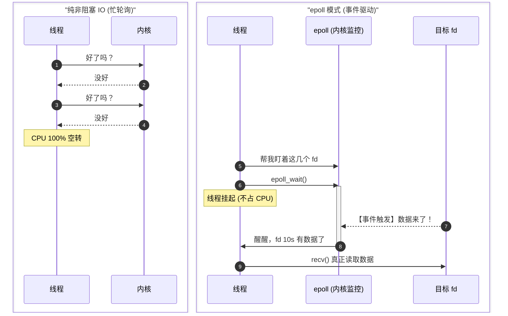

`epoll` 解决的正是“怎么等待，而不是怎么读写”的问题，读写本身还是用 `recv`/`send`，只是不再傻等了。

## 5.3 总结

`accept()`、`recv()`、`send()`、`connect()` 这几个系统调用的阻塞与非阻塞行为由 fd 自身的阻塞模式决定，但各自的细节有所不同。

### 5.3.1 `accept()`

| `listen_fd` 模式 | 全连接队列状态 | `accept()` 行为 |
|:---|:---|:---|
| 阻塞（默认） | 为空 | 线程阻塞，直至有连接到达 |
| **非阻塞** | **为空** | **立即返回 -1，`errno` 置为 `EAGAIN` 或 `EWOULDBLOCK`** |
| 非阻塞 | 非空 | 立即取出一个连接并返回 `conn_fd` |

### 5.3.2 `recv()`

|`conn_fd` 模式|内核接收缓冲区状态|行为|
|:--|:--|:--|
|阻塞|为空|线程阻塞，直至有数据到达|
|**非阻塞**|**为空**|**立即返回 -1，`errno` 为 `EAGAIN`**|
|任意|非空|立即返回，拷贝数据至用户缓冲区|
|任意|对端关闭连接|返回 0（EOF）|

> 行为与 `accept` 最为相似，逻辑直接：缓冲区有数据就取，没有数据非阻塞模式下立即返回。

### 5.3.3 `send()`

`send()` 的行为比 `recv()` 稍复杂，取决于**内核发送缓冲区是否有可用空间**：

|`conn_fd` 模式|内核发送缓冲区状态|行为|
|:--|:--|:--|
|阻塞|已满|线程阻塞，等待缓冲区腾出空间|
|**非阻塞**|**已满**|**立即返回 -1，`errno` 为 `EAGAIN`**|
|任意|有可用空间|将数据拷贝至缓冲区，返回实际写入字节数|
|任意|空间不足以容纳全部数据|**部分写入**，返回值小于请求长度|

重点在于“**部分写入**”。`send()` 的返回值不保证等于请求发送的字节数，无论阻塞还是非阻塞模式均可能发生。因此必须通过循环处理：

```cpp
// 正确的非阻塞 send 处理方式
ssize_t total_sent = 0;
while (total_sent < data_len) {
    ssize_t n = send(conn_fd, buf + total_sent, data_len - total_sent, 0);
    if (n == -1) {
        if (errno == EAGAIN || errno == EWOULDBLOCK) {
            // 发送缓冲区已满，注册 EPOLLOUT 事件，等待下次可写通知
            // 将剩余数据存入应用层写缓冲区，待 epoll 通知后续传
            register_write_event(conn_fd);
            break;
        }
        // 其他错误，关闭连接
        break;
    }
    total_sent += n;
}
```

这也是 Reactor 架构中需要维护**应用层写缓冲区**的根本原因——当 `send()` 返回 `EAGAIN` 时，未发送完的数据不能丢弃，需暂存于写缓冲区，注册 `EPOLLOUT` 事件，待内核发送缓冲区腾出空间后由 epoll 通知继续发送。

### 5.3.4 `connect()`

`connect()` 的非阻塞行为与前两者差异最大，需要特别说明。

**阻塞模式**：`connect()` 会阻塞线程，直至 TCP 三次握手完成（或超时/失败）。在高并发客户端场景中，同时发起大量阻塞 `connect()` 会导致线程数激增。

**非阻塞模式**：非阻塞 `connect()` 的行为分为下面两个阶段：

**阶段一：发起连接**

调用 `connect()` 后立即返回 -1，`errno` 为 `EINPROGRESS`。这**不是错误**，而是“握手正在进行中”的信号，内核在后台异步执行三次握手。

```cpp
int ret = connect(conn_fd, (sockaddr*)&addr, sizeof(addr));
if (ret == -1 && errno != EINPROGRESS) {
    // 真正的错误（如目标不可达）
    close(conn_fd);
}
// errno == EINPROGRESS：连接正在建立，属于正常情况
// 将 conn_fd 注册至 epoll，监听 EPOLLOUT 事件
epoll_event ev{};
ev.events  = EPOLLOUT;   // 连接建立完成时触发可写事件
ev.data.fd = conn_fd;
epoll_ctl(epfd, EPOLL_CTL_ADD, conn_fd, &ev);
```

**阶段二：确认连接结果**

TCP 握手完成后，epoll 通知 `conn_fd` 的 `EPOLLOUT` 事件就绪。此时**不能直接认为连接成功**，必须调用 `getsockopt()` 检查实际结果：

```cpp
// epoll 返回 EPOLLOUT 后的处理
int error = 0;
socklen_t len = sizeof(error);
// 检查套接字级别的错误状态
if (getsockopt(conn_fd, SOL_SOCKET, SO_ERROR, &error, &len) == -1
    || error != 0) {
    // 连接失败（如对端拒绝连接 ECONNREFUSED）
    close(conn_fd);
} else {
    // 连接成功，conn_fd 可正常用于读写
}
```

---

# 6. 缓冲区设置

## 6.1 发送缓冲区

在 Linux 网络编程中，**发送缓冲区**（Send Buffer）是介于“用户代码”与“物理网卡”之间的一块**内核内存**，可以当成一个“蓄水池”的缓冲作用。

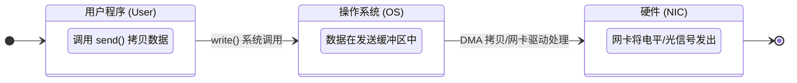

> [!note]
> socket 没法直接将数据发送到网卡，所以只能先将数据发送到操作系统数据发送缓冲区。然后网卡从数据发送缓冲区中获取数据，再发送到接收方。如果用户程序发送数据的速度比网卡读取的速度快，那么发送缓冲区将会很快被写满，这个时候 send 会被阻塞，也就是写入发生阻塞。

我们可以把这个过程拆解为三个环节：

当你调用 `send()` 或 `write()` 时，数据并不是瞬间到达网络的，而是经历以下路径：

1. **第一阶段（应用层 → 内核层）**：
    你调用 `send(sockfd, buf, len, 0)`。内核会将 `buf` 中的数据**拷贝**到该 Socket 对应的**内核发送缓冲区**中。一旦拷贝完成，`send` 函数就会立即返回，你的程序可以继续干别的事。

> [!warning] 注意：这时候数据可能还在内存里。

2. **第二阶段（内核层 → 网卡）**：
    内核的 TCP/IP 协议栈负责从缓冲区中取出数据，按照 TCP 规则进行分片、加上包头，然后通过 **DMA（直接内存存取）** 技术交给网卡。

3. **第三阶段（物理层发送）**：
    网卡将数字信号转换成光电信号，发送到网线上。

> [!question] 缓冲区为什么会写满？
> 发送缓冲区被写满，通常不是因为 CPU 不够快，而是因为**网络环境（底层管道）太窄**。
> - **TCP 流量控制**：如果接收方处理太慢，它会通过 `ACK` 包告诉发送方：“我的接收缓冲区满了，别发了！”。此时，发送端的内核会停止从发送缓冲区取数据。 
> - **网络拥塞**：如果路上的路由器丢包严重，TCP 协议栈会降低发送速度（拥塞窗口变小），导致数据积压在缓冲区。
> - **物理带宽限制**：比如你是千兆网卡，但你尝试每秒发送 2000MB 的数据。

**增大发送缓冲区**：通过 `setsockopt` 设置 `SO_SNDBUF`（send）。

```cpp
int send_size = 1024 * 1024; // 设置为1MB
setsockopt(sockfd, SOL_SOCKET, SO_SNDBUF, &send_size, sizeof(send_size));
```

- **返回类型**: `int` — 成功时返回 `0`，失败时返回 `-1` 并设置 `errno`
- **参数**:
    - `__fd`: 目标套接字的文件描述符（由 `socket()` 创建）
    - `__level`: 选项所属的协议层（如 `SOL_SOCKET` 表示套接字层）
    - `__optname`: 要设置的具体选项名称（如 `SO_REUSEADDR`）
    - `__optval`: 指向选项值的**指针**（类型取决于选项）
    - `__optlen`: `__optval` 指向数据的字节长度
- **副作用**: 修改套接字内核状态，影响其后续行为（如绑定、连接、传输等）

该函数是底层系统调用的封装，通常在调用 `bind()` 前使用，以确保套接字具备预期行为。

## 6.2 接收缓冲区

既然发送缓冲区是“蓄水池”，那么**接收缓冲区**（Receive Buffer）就是接收方的“卸货仓库”。

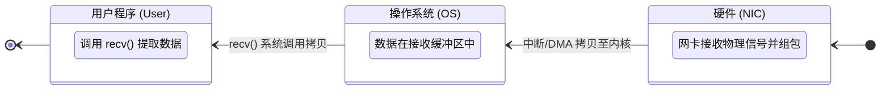

> [!note]
> 首先接收方机器网卡接收到发送方的数据后，先将数据保存到操作系统接收缓冲区。用户程序感知到操作系统缓冲区的数据后，主动调用接收数据的方法来获取数据。如果数据接收缓冲区为空，这个时候 recv 会被阻塞，也就是读取发生阻塞。

理解接收缓冲区的关键在于：**数据到达网卡**与**你的程序读走数据**是两个**异步**的过程。

同样，这里可以把这个过程拆解为三个环节：

1. **网卡到内核（物理层 → 内核层）**：
    网卡接收到电信号，将其还原成数字包。通过 **DMA** 技术，网卡直接将数据写入内存中的**接收缓冲区**。此时，你的程序可能还在处理逻辑，甚至还在睡觉，但数据已经躺在内核里了。

2. **通知与感知（内核层 → 应用层）**：
    内核收到数据后，会通过“软中断”更新 Socket 的状态。如果你的程序正阻塞在 `recv()` 上，内核会将其唤醒；如果你使用的是 `epoll`，内核会发送一个“可读”事件通知。
    
3. **拷贝数据（内核层 → 用户层）**：
    你调用 `recv(sockfd, buf, len, 0)`。内核将数据从**内核接收缓冲区**拷贝到你定义的 `buf` 中。一旦拷贝完成，缓冲区对应的空间就被释放，可以接收新数据了。

**增大接收缓冲区**：通过 `setsockopt` 设置 `SO_RCVBUF`（recv）。

```cpp
int send_size = 1024 * 1024; // 设置为1MB
setsockopt(sockfd, SOL_SOCKET, SO_RCVBUF, &send_size, sizeof(send_size));
```

发送缓冲区和接收缓冲区这两个区域是每一个 socket 连接都有的。本质上而言，就是内核中的两块内存空间，socket 创建完成后，这两块内存空间就开辟出来了。

> [!question] 为什么每个 Socket 都有独立的缓冲区？
> - **隔离性**：你正在下载一个大文件（连接 A），同时还在处理一个轻量的指令（连接 B）。连接 A 的缓冲区塞满不会影响连接 B 的正常接收。
> - **独立性**：每个连接的网络状况、带宽限制（拥塞控制）和处理进度都不同，必须独立管理。
> **内存成本提示**：在开发高并发服务器（如万级连接）时，每个 Socket 默认分配的缓冲区（通常几 KB 到几十 KB）累加起来会消耗大量内存。这也是为什么高性能架构需要精细调优内核参数的原因。

---

# 7. SO_LINGER

在 TCP 网络编程中，**`SO_LINGER`** 是一个专门用来控制 **“当连接关闭时，尚未发送完毕的数据该如何处理”** 的 Socket 选项。
****
> [!warning] 注意
> 需要明确一点：`SO_LINGER` 解决的是“**程序主动发起的正常关闭**”，而不是“**突发的物理断连**”。如果发生了物理断连（停电、拔网线），客户端内核根本没法把剩下的数据发出去，因为它和服务器之间的“路”断了，在这种情况下，`SO_LINGER` **帮不上忙**。SO_LINGER 针对的场景是当你（开发者）在代码里**显式调用**了 **`close(sockfd)`**，但此时**发送缓冲区（Send Buffer）里还堆积着没发出去的数据**。

默认情况下（非 Linger 状态）：
1. 你调用 `close()`。
2. 内核立即返回 `0` 给你的程序。
3. 内核在**后台**慢慢把发送缓冲区里的剩余数据传给对方，并执行四次挥手。

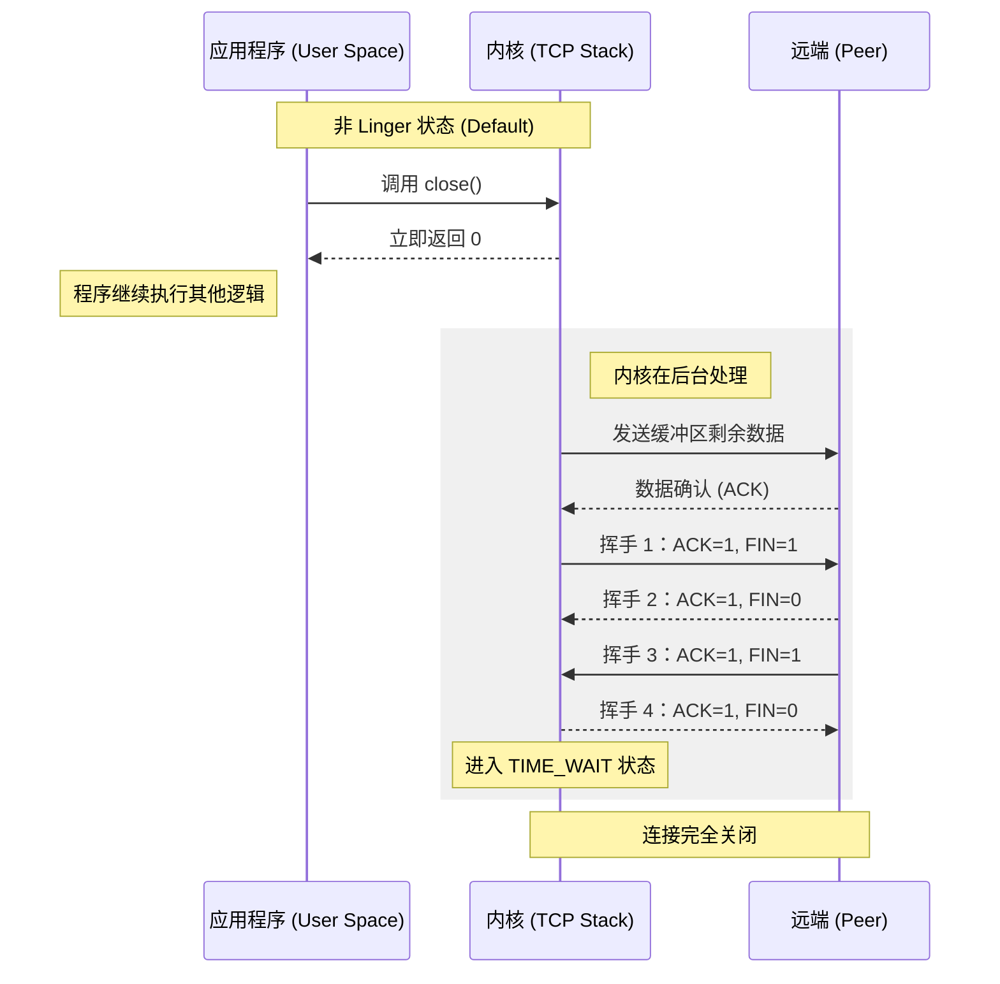

> **注**：因为 mermaid 渲染的原因，实际上是远端（服务端）发送**挥手 3**时，客户端就进入了 TIME_WAIT 状态。

**问题在于**：**你的程序并不知道数据是否真的送达了**。如果你需要确保数据在物理上已经发出，或者你想立即强行关闭连接而不进入 TIME_WAIT 状态，就需要 `SO_LINGER`。

在 C/C++ 中，通过 `struct linger` 来配置：

```cpp
struct linger {
    int l_onoff;
    int l_linger;
};
```

- **类型**: `struct linger`
- **字段**:
    - `l_onoff`: 是否启用 linger 机制。0 表示关闭，非 0 值表示启用。
    - `l_linger`: 最大等待时间（秒），仅在 `l_onoff` 非零时有效。
- **用途**: 通过 `setsockopt(sockfd, SOL_SOCKET, SO_LINGER, &ling, sizeof(ling))` 应用于套接字。
- **默认行为**: 若未设置，套接字关闭时会尝试发送剩余数据，但不保证等待完成。

> **注意**：此结构体本身不执行任何操作，必须与 `SO_LINGER` 套接字选项结合使用才能生效。

## 7.1 配置场景

这里先放一张后面三种场景的对比表：

| 特性 | 场景 A (默认关闭) | 场景 B (延迟关闭) | 场景 C (强制关闭) |
|---|---|---|---|
| close() 是否阻塞 | 不阻塞 | 阻塞 | 不阻塞 |
| 缓冲区数据处理 | 尽力发送 | 等待发完或超时丢弃 | 直接丢弃 |
| 关闭方式 | 四次挥手 (FIN) | 四次挥手 (FIN) | RST 强制断开 |
| TIME_WAIT 状态 | 有 | 有 | 无 |
| 能否确认数据到达 | 不能 | 能（ACK 层面确认） | 不能（数据已丢弃） |
| 对端感受 | 正常关闭 | 正常关闭 | 报错 ECONNRESET |

### 7.1.1 场景 A：默认行为 (`l_onoff = 0`)

`close()` 做的事情是把文件描述符的**引用计数减一**。当引用计数归零时，内核接管后续所有工作。你的程序拿回控制权时，数据可能还一个字节都没发出去。

会出问题的情况：

```cpp
// 1. 发送文件最后一块内容
write(sockfd, "The End of File", 15); 

// 2. 紧接着关闭 Socket
close(sockfd); 

// 3. 退出程序
return 0;
```

`close(sockfd)` 瞬间完成。如果此时网络刚好卡了一下，那句 `"The End of File"` 可能还在内核缓冲区里。如果内核随后尝试发送，结果失败（比如 10 秒后连接彻底断了），你的程序早已退出，无法得知接收方其实根本没收到文件结尾。

> 所以默认行为并不等于“一定能发完”，它只是“**内核会尽力发**”。

### 7.1.2 场景 B：阻塞式关闭 (`l_onoff = 非0`, `l_linger > 0`)

- **行为**：调用 `close()` 时，**进程会阻塞（卡住）**。
- **过程**：内核会等在那里，直到：
	1. 所有残留数据都被对方确认（收到 ACK）。
	2. 或者达到了你设置的 `l_linger` 秒数。

> 如果成功返回，你能确定数据发完了。如果超时返回，通常会报错 `EWOULDBLOCK` 且数据可能丢失。

阻塞式关闭成功（数据完整传输）:

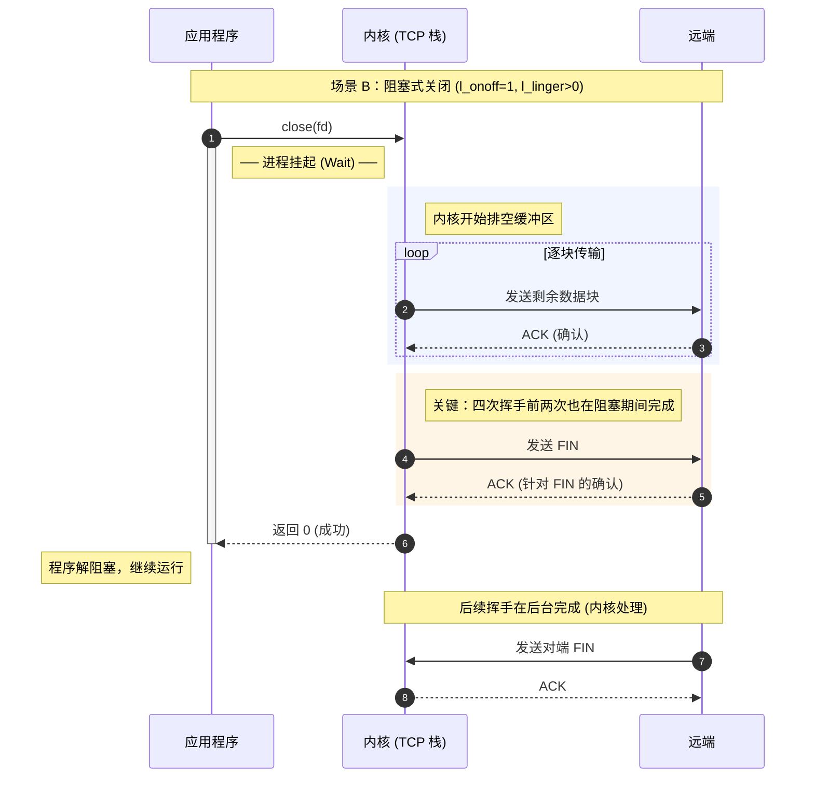

阻塞式关闭超时（网络拥塞/对端无响应）：

```mermaid
sequenceDiagram
    autonumber
    participant App as 应用程序
    participant Kernel as 内核 (TCP 栈)
    participant Peer as 远端 (网络慢/死机)

    Note over App, Peer: 场景 B：超时流程 (l_onoff=1, l_linger>0)

    App->>Kernel: close(fd)
    
    activate App
    Note right of App: ── 阻塞 (计时中...) ──
    
    Kernel->>Peer: 发送剩余数据块
    Note right of Kernel: ⏳ 持续重传，ACK 迟迟不来...
    
    Note over Kernel: 耗尽 l_linger 指定的时间!

    rect rgb(255, 230, 230)
        Note right of Kernel: 超时动作：
        Kernel->>Peer: 发送 RST (强制重置连接)
        Note right of Kernel: 丢弃缓冲区所有未发数据
    end

    Kernel-->>App: 返回 -1 (errno = EWOULDBLOCK)
    deactivate App

    Note left of App: 程序获得控制权，连接已销毁
    Note right of Peer: 对端收到 RST，连接报错断开


```

### 7.1.3 场景 C：强制快速关闭 (`l_onoff = 非0`, `l_linger = 0`)

- **行为**：调用 `close()` 立即返回。
- **过程**：内核会**直接丢弃**发送缓冲区里的所有数据，并向对方发送一个 **`RST`（重置）包**。

> 1. 这种方式会**跳过 TCP 四次挥手**。
> 2. 连接立即销毁，**不会进入 `TIME_WAIT` 状态**。
> 3. 对方会收到一个 "Connection reset by peer" 的错误。

强制 RST 关闭：

```mermaid
sequenceDiagram
    participant App as 应用程序
    participant Kernel as 内核 (TCP 栈)
    participant Peer as 远端

    Note over App, Peer: 强制关闭 (l_onoff=1, l_linger=0)

    App->>Kernel: close(fd)
    Kernel-->>App: 立即返回 0
    Note left of App: 程序继续执行

    rect rgb(255, 235, 235)
        Note right of Kernel: 关键动作：
        Note right of Kernel: 1. 丢弃发送缓冲区所有数据
        Note right of Kernel: 2. 不进行四次挥手
        Kernel->>Peer: 发送 RST (Reset)
    end

    Note right of Peer: recv() 立即返回 -1
    Note right of Peer: errno = ECONNRESET
    Note over Kernel, Peer: 连接立即销毁 (无 TIME_WAIT)
```

## 7.2 代码实例

假如你想在服务端传输数据，想在关闭时给它 5 秒钟的“挣扎时间”来确保数据发完：

```cpp
struct linger so_linger;
so_linger.l_onoff = 1;    // 开启
so_linger.l_linger = 5;   // 5秒超时

if (setsockopt(sockfd, SOL_SOCKET, SO_LINGER, &so_linger, sizeof(so_linger)) < 0) {
    perror("setsockopt SO_LINGER failed");
}

// 此时调用 close 会阻塞，直到数据发完或 5 秒超时
::close(sockfd);
```

> [!success] 总结与建议
> - **避坑指南**：除非有极特殊的业务需求（比如你需要极致避免 `TIME_WAIT`），否则**不建议**轻易开启 `SO_LINGER`。
> - **与 `SO_REUSEADDR` 的区别**：
> 	- `SO_REUSEADDR` 是允许你重新绑定处于 `TIME_WAIT` 的端口。
> 	- `SO_LINGER` (当延时为0时) 是通过发送 `RST` 直接暴力杀掉连接，从根源上**消灭** `TIME_WAIT`。

---

# 8. SO_KEEPALIVE

**`SO_KEEPALIVE`** 是 TCP 协议栈提供的一种**心跳检测机制**。简单来说，它的作用是：当一个 TCP 连接在长时间没有数据往来时，内核会自动向对方发送一个“探测包”，以此来确认这个连接是否还“活着”。

> [!question] 为什么需要 SO_KEEPALIVE？
> 假设有这么一个场景：你的客户端和服务端已经建立了连接，但由于某种原因（比如客户端突然拔掉网线、断电，或者中间路由器重启、防火墙丢弃了闲置连接），连接实际上连接已经断开了。
> - **问题**：由于 TCP 是有状态的，如果没有数据收发，服务端是**感知不到**对方已经“失联”的。
> - **后果**：服务端会一直维护着这个 Socket 资源，导致“僵尸连接”积压，白白浪费内存。  

## 8.1 工作原理

开启 SO_KEEPALIVE 选项后，TCP 协议栈会启动一个定时器。如果连接在一段时间内**完全处于空闲状态**（无数据读写），内核会自动执行以下步骤：

1. **等待闲置期**：等待 `tcp_keepalive_time`（默认 2 小时）。
2. **发送探测包**：然后发送一个不含数据的 ACK 包。
3. **等待响应**：
    - **收到响应**：说明连接正常，定时器重置。
    - **没收到响应**：每隔 `tcp_keepalive_intvl` 秒重发一次，直到重发 `tcp_keepalive_probes` 次后仍无果。
4. **关闭连接**：内核判定对方已死，将 Socket 状态设为错误，并强制关闭连接。此时你调用 `recv` 会收到一个错误。

```mermaid
sequenceDiagram
    autonumber
    participant App as 应用程序
    participant Kernel as 内核 (Keepalive 定时器)
    participant Peer as 远端 (可能已断网/宕机)

    Note over Kernel: 连接进入空闲状态 (Idle)
    
    Note over Kernel: 1. 等待 tcp_keepalive_time<br/>(默认 2 小时)

    rect rgb(240, 248, 255)
        Note right of Kernel: 2. 发送探测包 (Keepalive Probe)
        Kernel->>Peer: TCP Keep-Alive (ACK)
        
        alt 收到响应
            Peer-->>Kernel: TCP Keep-Alive ACK
            Note over Kernel: 连接正常，重置定时器
        else 没收到响应
            Note right of Kernel: 3. 进入重试周期
            loop tcp_keepalive_probes 次数
                Note over Kernel: 等待 tcp_keepalive_intvl 秒
                Kernel->>Peer: 重发探测包 (ACK)
            end
        end
    end

    rect rgb(255, 230, 230)
        Note over Kernel: 4. 判定连接已死 (Timeout)
        Kernel->>Peer: 发送 RST (尝试清理)
        Note over Kernel: 销毁连接，标记 Socket 错误
    end

    App->>Kernel: 调用 recv() / send()
    Kernel-->>App: 返回 -1 (errno = ETIMEDOUT / ECONNRESET)
```

## 8.2 开启方式

通过 `setsockopt` 函数进行设置：

```cpp
int keepalive = 1; // 1 表示开启
if (setsockopt(sockfd, SOL_SOCKET, SO_KEEPALIVE, &keepalive, sizeof(keepalive)) < 0) {
    perror("setsockopt SO_KEEPALIVE failed");
}
```

## 8.3 缺点与局限性

虽然系统自带，但 `SO_KEEPALIVE` 在高性能开发中常被“嫌弃”：

- **默认时间太长**：Linux 默认的闲置等待时间是 **7200 秒（2 小时）**。对于即时通讯或分布式系统，等 2 小时才发现断网太慢了。虽然可以修改内核参数，但这会影响系统内所有的连接。
- **无法感知应用层死锁**：它只能证明**网络栈**是通的。如果对方进程卡死了（死锁），但内核还能正常回 ACK，`SO_KEEPALIVE` 会认为连接依然正常。
- **中间设备干扰**：某些不规范的防火墙可能会拦截这种心跳探测包。

因此，在实际生产中，通常会选择自己写心跳，即**应用层心跳** (Application Level Heartbeat)，而不是完全依赖 `SO_KEEPALIVE`。

由应用程序自己发送心跳包来检测连接是否正常，大致的方法是：**服务器**在一个 Timer 事件中**定时**向客户端发送一个短小精悍的数据包，然后**启动一个低级别的线程**，在该线程中不断检测客户端的回应， 如果在一定时间内没有收到客户端的回应，即认为客户端已经掉线；同样，如果客户端在一定时间内没有收到服务器的心跳包，则认为连接不可用。

|**特性**|**SO_KEEPALIVE**|**应用层心跳**|
|---|---|---|
|**层级**|传输层（内核处理）|应用层（你的代码处理）|
|**性能**|极高（不经过用户态）|略低（需要进程处理）|
|**灵活性**|较低（受全局内核参数限制）|极高（随你定义）|
|**可靠性**|仅保证网络通畅|保证进程和业务都正常|

---

# 9. SO_REUSEADDR

## 9.1 工作原理

SO_REUSEADDR 的核心作用是：**允许服务器在端口处于 `TIME_WAIT` 状态时，依然能够立即重新绑定（bind）该端口并启动**。

> [!question] 为什么需要 SO_REUSEADDR？
> 假设你正在调试你的 C++ 服务器程序：
> 1. 你启动了服务器，监听 **8080** 端口。
> 2. 你发现代码有个 Bug，于是按 `Ctrl + C` 停掉了程序。
> 3. 你修改完代码，立即重新运行。
> 4. **报错**：`bind error: Address already in use`。
> **原因**：虽然你的程序退出了，但 TCP 协议为了保证可靠性，会让该端口进入 **`TIME_WAIT`** 状态（通常持续 1-4 分钟）。在此期间，内核默认不允许任何进程再次占用这个端口。

当你设置了 `SO_REUSEADDR`，你是在告诉内核：“如果这个端口被占用了，但处于 `TIME_WAIT` 状态，请允许我‘强行’接管它。”

这样，你的服务器就可以**瞬间重启**，而不需要等待漫长的几分钟。

## 9.2 开启方式

**必须在调用 `bind()` 之前设置**。流程如下：

```cpp
int sockfd = socket(AF_INET, SOCK_STREAM, 0);

int opt = 1; // 1 表示开启
if (setsockopt(sockfd, SOL_SOCKET, SO_REUSEADDR, &opt, sizeof(opt)) < 0) {
    perror("setsockopt failed");
}

// 接下来再进行 bind
bind(sockfd, (struct sockaddr *)&addr, sizeof(addr));
```

## 9.3 其他作用

除了处理 `TIME_WAIT`，它在以下场景也很有用：
- **多网卡绑定**：允许同一个端口绑定到不同的 IP 地址上。例如，一个进程绑定 `192.168.1.10:8080`，另一个进程绑定 `10.0.0.5:8080`。
- **UDP 组播**：在进行 UDP 组播开发时，多个进程可以绑定同一个端口来接收相同的数据包。

> [!question] 它会产生安全问题吗？
> - **不会抢夺活跃连接**：如果一个端口正处于 `ESTABLISHED`（已建立连接）的活跃状态，`SO_REUSEADDR` 是**无法**强行解绑对方的。它只能接管那些“已经半死不活”（处于等待关闭状态）的端口。  
> - **数据隔离**：内核会确保旧连接残留的数据包不会被错误地发送给新的连接。

---

# 10. I/O 多路复用（引言）

**IO 多路复用**是一种让单个线程/进程同时监听多个 IO 事件（如网络连接、文件描述符）的机制，只有当某个 IO 真正就绪时才去处理它，避免了阻塞等待。

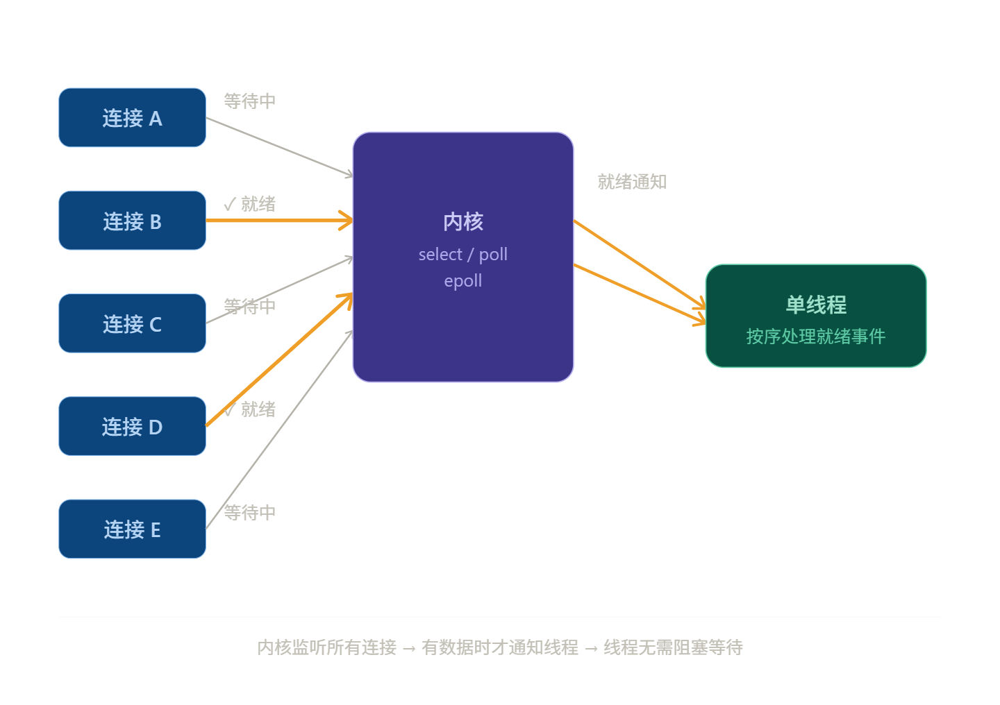

## 10.1 核心思想

> [!question] 为什么需要 I/O 多路复用？
> 在没有这项技术之前，我们要处理并发连接通常有两种低效方案：
> - **方案 A：多线程/多进程**
>     每来一个客人（连接），就雇一个服务员（线程）。
>     - **缺点**：线程多了，CPU 切换开销极大，内存也会爆掉。
>  
> - **方案 B：非阻塞忙轮询**
>    一个线程不断循环问所有 Socket：“有数据了吗？”“有数据了吗？”
>    - **缺点**：空转循环极度浪费 CPU 资源。

可以看出，在传统模型下，每个连接需要一个线程阻塞等待数据，1000 个连接就需要 1000 个线程，代价极高。

IO 多路复用让**一个线程**同时“监视”**多个文件描述符**（socket、管道等）。当其中有连接就绪（有数据可读/可写）时，内核会通知程序，程序再去处理，而不是傻等。

> [!note] 与多线程的区别
> - **多线程**：一个线程负责一个连接，线程阻塞时 CPU 切换。
> - **IO 多路复用**：一个线程管所有连接，只在有事件时才工作，**避免了无意义的阻塞和线程切换开销**。
> 简单来说，它的核心思想是：**“不再让程序被动地等数据，而是让内核在数据准备好时主动通知程序。”**

## 10.2 三种实现方式

1. select
	- **机制**：用户态维护一个 `fd_set`（通常是位图结构），每次调用时将其**拷贝**到内核态，由内核进行线性轮询，并找到就绪的 fd。
	- **缺点**：
	    1. **数量限制**：受限于内核宏 `FD_SETSIZE`，默认通常为 1024。
	    2. **效率瓶颈**：**双重遍历**。首先内核需要遍历所有 fd 检查状态；其次，函数返回后，用户态只知道有就绪事件，仍需通过 $O(n)$ 的循环来确认具体的就绪 Socket。
	    3. **内存开销**：每次调用都要重复传递整个 `fd_set` 集合，在大量连接下，内核态与用户态之间的内存拷贝开销巨大。

2. poll
	- **机制**：逻辑与 `select` 类似，但改用动态数组/链表结构的 `pollfd`。
	- **优点**：突破了 1024 的硬限制，能够监控更多连接。
	- **缺点**：虽然解决了数量限制，但**线性遍历**的问题依然存在。随着监控的 fd 数量增加，内核态检查状态的时间复杂度仍为 $O(n)$，性能随规模线性下降。

3. epoll (Linux 专属，性能最优)
	- **机制**：采用**事件驱动**（Event-driven）模型。在内核中维护一个**红黑树**（用于高效增删改监控的 fd）和一个**就绪链表**。
	- **优点**：
	    1. **回调机制**：内核维护一个**双向链表**（即就绪链表），fd 就绪时，内核会通过中断/回调机制将其直接放入“就绪链表”，避免了无效的轮询。
	    2. **精准返回**：调用 `epoll_wait` 时，内核仅返回已就绪的 fd 列表。用户态无需遍历，直接处理结果，时间复杂度趋近于 $O(1)$。
	    3. **内存优化**：利用 `mmap`（在某些实现中）或内核空间的高效管理，减少了用户态与内核态之间频繁的数据拷贝。
	    4. **触发模式**：支持 **边缘触发 (Edge Triggered)** 和 **水平触发 (Level Triggered)**，为高性能应用提供了更灵活的状态控制。

> [!note] epoll 时间复杂度的说明
> - **管理阶段**：当你使用 `epoll_ctl` 去 **添加、删除或修改** 一个被监控的 Socket 时，内核是在**红黑树**（Red-Black Tree）中进行操作。
> 	- **操作内容**：查找该 fd 是否已存在，并维护树的平衡。
> 	- **复杂度**：$O(\log n)$。
>
>> 但这通常不是性能瓶颈，因为你不会在每一轮循环中都频繁地增删百万个连接。
>
> - **检索阶段**：指的具体是 `epoll_wait` 这个系统调用。
> 	- **就绪链表（Ready List）**：当某个 Socket 有数据到达时，内核的异步中断处理程序会触发一个**回调函数**。这个回调函数会直接把该 Socket 的引用挂载到一个**双向链表**（即就绪链表）中。
> 	- **结果提取**：当用户调用 `epoll_wait` 时，内核**不需要**去翻阅红黑树，也**不需要**轮询所有 Socket。它只需要检查这个“就绪链表”是否为空。
> 	    - 如果链表里有 5 个 Socket 好了，内核就把这 5 个直接拷贝给用户。
> 	    - 无论你总共监控了 100 个还是 100 万个连接，这个“从链表中取走已就绪元素”的操作，与监控的总数 $n$ **完全无关**。
>
>> 因此，对于 `epoll_wait` 来说，它的复杂度取决于**当前活跃（就绪）的连接数 $k$**，而不是总连接数 $n$。在描述其相对于 $n$ 的性能优势时，我们说它是 $O(1)$（或更准确地说是 $O(k)$）。

对比表：

|**特性**|**select**|**poll**|**epoll**|
|---|---|---|---|
|**底层数据结构**|位图 (Bitmap)|链表/数组 (pollfd)|红黑树 + 就绪链表|
|**最大连接数**|有限制 (1024)|无上限|无上限|
|**搜索就绪 fd**|$O(n)$ (全量遍历)|$O(n)$ (全量遍历)|$O(1)$ (仅查就绪链表)|
|**内核拷贝**|每次调用都要拷贝全量|每次调用都要拷贝全量|仅在注册 fd 时拷贝一次|
|**性能受连接数影响**|影响极大|影响较大|影响微乎其微|
