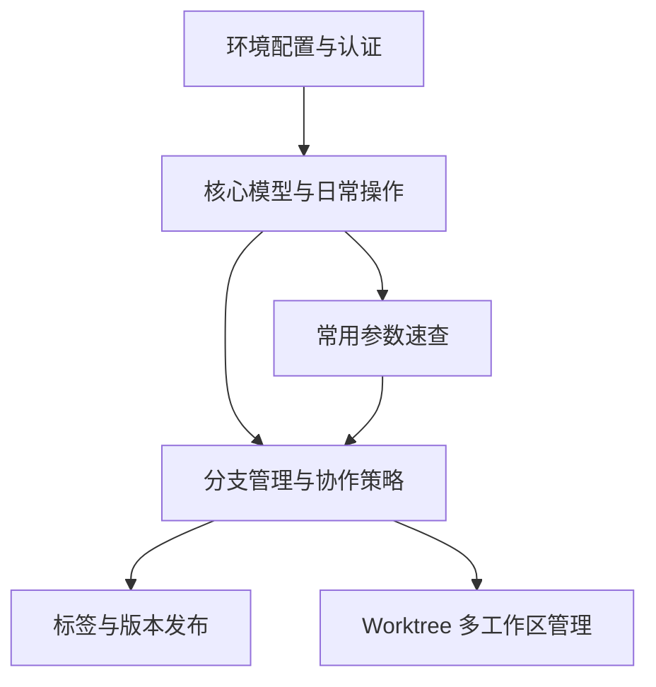

# 1. 学习顺序

本目录按“先会用，再理解协作，再掌握版本发布与多任务开发”的顺序组织。建议按编号阅读，不要直接从分支或 worktree 开始。

| 顺序 | 笔记 | 学习目标 |
|---|---|---|
| 00 | [[00_Git_学习路线]] | 建立目录地图与复习路径 |
| 01 | [[01_Git_环境配置与认证]] | 完成身份配置、SSH/PAT 认证、远程 URL 管理 |
| 02 | [[02_Git_核心模型与日常操作]] | 掌握工作区、暂存区、提交、同步、撤销、查询 |
| 03 | [[03_Git_常用参数速查]] | 按命令理解高频参数，避免参数混淆 |
| 04 | [[04_Git_分支管理与协作策略]] | 理解分支、合并、rebase、冲突处理和团队模型 |
| 05 | [[05_Git_标签与版本发布]] | 使用 tag 标记发布版本，形成发布流程 |
| 06 | [[06_Git_Worktree_多工作区管理]] | 用 worktree 同时处理多个分支任务 |

> [!tip]
> 学习 Git 时先抓住一条主线：**工作区 → 暂存区 → 本地仓库 → 远程仓库**。大多数命令只是让变更在这些区域之间移动。

# 2. 知识依赖

# 3. 各笔记定位

## 3.1 环境类笔记

[[01_Git_环境配置与认证]] 只回答“怎么让 Git 能连接远程仓库、怎么确认身份、怎么切换 HTTPS/SSH”。

适合在以下场景复习：

- 新电脑第一次配置 Git
- GitHub 推送认证失败
- 需要从 HTTPS 切换到 SSH
- 多项目需要不同提交身份

## 3.2 基础操作类笔记

[[02_Git_核心模型与日常操作]] 是最核心的一篇，覆盖日常开发 80% 的操作：

- `git add`
- `git commit`
- `git stash`
- `git diff`
- `git log`
- `git fetch`
- `git pull`
- `git push`
- `git reset`
- `git restore`
- `git revert`
- `.gitignore`
- `.gitattributes`

## 3.3 速查类笔记

[[03_Git_常用参数速查]] 不适合从头背诵，适合遇到参数时回查。

> [!warning]
> Git 参数不能脱离命令记忆。例如 `-u` 在 `git push -u`、`git add -u`、`git stash -u` 中含义完全不同。

## 3.4 协作类笔记

[[04_Git_分支管理与协作策略]] 负责理解团队协作中的分支生命周期、合并策略、rebase 风险和常见分支模型。

推荐在开始参与团队项目或设计仓库协作规范前阅读。

## 3.5 发布与多任务笔记

[[05_Git_标签与版本发布]] 关注“如何把某个提交标记为版本”。

[[06_Git_Worktree_多工作区管理]] 关注“如何同时维护多个分支，而不频繁 stash 或切换工作区”。

# 4. 实战练习路线

## 4.1 单人项目练习

1. 初始化仓库并配置身份。
2. 创建 `.gitignore`。
3. 修改文件并使用 `git add -p` 分块暂存。
4. 提交 2 到 3 个原子 commit。
5. 用 `git log --oneline --graph --all` 查看历史。
6. 创建 `feature/demo` 分支并完成一次合并。
7. 打一个 `v0.1.0` 标签。

## 4.2 协作项目练习

1. 从远程仓库 clone 项目。
2. 基于最新 `main` 创建功能分支。
3. 首次推送时使用 `git push -u origin <branch>`。
4. 开发期间定期 `git fetch`。
5. 合并前用 `git diff main..feature` 审查差异。
6. 通过 PR/MR 合并。
7. 合并后删除本地和远程分支。

# 5. 复习检查清单

| 问题 | 对应笔记 |
|---|---|
| 我知道工作区、暂存区、本地仓库分别是什么吗 | [[02_Git_核心模型与日常操作]] |
| 我能解释 `git fetch` 和 `git pull` 的区别吗 | [[02_Git_核心模型与日常操作]] |
| 我知道什么时候用 `reset`，什么时候用 `revert` 吗 | [[02_Git_核心模型与日常操作]] |
| 我能解释 `git push -u` 中 upstream 的作用吗 | [[03_Git_常用参数速查]] |
| 我知道 rebase 为什么不能随便用于公共分支吗 | [[04_Git_分支管理与协作策略]] |
| 我能区分轻量标签和附注标签吗 | [[05_Git_标签与版本发布]] |
| 我知道 worktree 适合解决什么问题吗 | [[06_Git_Worktree_多工作区管理]] |

# 6. 总结

> [!summary]
> 本目录的最佳阅读路径是：**环境配置 → 核心模型 → 参数速查 → 分支协作 → 标签发布 → 多工作区管理**。先理解变更在不同区域之间如何流动，再学习分支和协作策略，会比直接背命令稳定得多。
