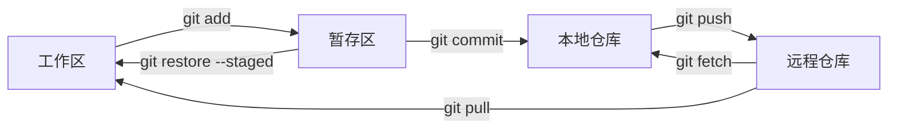
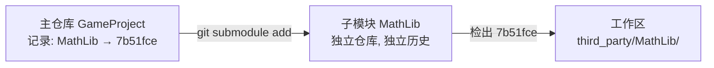

# 1. 核心模型

Git 的大多数命令都围绕四个区域移动变更：

| 区域 | 英文 | 作用 | 典型命令 |
|---|---|---|---|
| 工作区 | Working Directory | 当前磁盘文件 | `git diff` / `git restore` |
| 暂存区 | Staging Area / Index | 组织下一次提交 | `git add` / `git restore --staged` |
| 本地仓库 | Local Repository | 保存 commit 历史 | `git commit` / `git log` |
| 远程仓库 | Remote Repository | 团队共享历史 | `git fetch` / `git pull` / `git push` |



> [!summary]
> Git 日常开发的主线是：**编辑文件 → 暂存变更 → 提交快照 → 同步远程**。

---

# 2. 仓库创建与远程关联

## 2.1 创建仓库

1. **克隆已有项目**

```bash
git clone <url>
```

会把下面这些都克隆下来：

- 所有 Commit
- 所有 Tree（目录结构）
- 所有 Blob（文件内容）
- 所有 Tag
- 所有 Branch 的历史

2. **克隆大型项目最新版本**

```bash
git clone <url> --depth=N
```

只下载默认分支（通常是 `main` 或 `master`），且该分支只下载最新的 **N 个 commit**。可以通过参数 `--branch <分支名>` 来浅克隆指定分支；也可以通过参数 `--no-single-branch` 来克隆所有分支。

3. **克隆含子模块项目**

```bash
git clone <url> --recursive
```

如果仓库中引用了其他 Git 仓库作为子模块，`git clone --recursive` 会在克隆主仓库后，自动把这些子模块也一起克隆下来。

4. **初始化本地项目**

```bash
git init .
```

执行该操作后，会在当前目录创建 `.git`。

## 2.2 远程仓库管理

```bash
# 添加远程仓库
git remote add origin git@github.com:user/repo.git

# 查看远程仓库
git remote -v

# 修改远程 URL
git remote set-url origin git@github.com:user/repo.git

# 删除远程配置
git remote remove origin

# 查看远程详情
git remote show origin
```

认证与远程 URL 的配置细节见 [[01_Git_环境配置与认证]]。

## 2.3 子模块（Submodule）管理

### 2.3.1 子模块的核心概念

**Git Submodule** 用于在一个 Git 仓库中嵌入并固定引用另一个独立的 Git 仓库。主仓库不会复制子模块的完整历史与文件内容，而是通过两条元信息维护这份依赖关系：

1. **`.gitmodules` 文件**：记录每个子模块的相对路径与远程 URL，是主仓库中受版本控制的普通文件。
2. **gitlink（子模块指针）**：主仓库的 tree 对象中对应子模块目录的条目，存储的是子模块仓库的 ==某个 commit SHA-1==，而非分支名或标签。

```ini
# .gitmodules 示例
[submodule "third_party/fmt"]
    path = third_party/fmt
    url = https://github.com/xxx/fmt.git
```

> [!warning]
> 主仓库记录的是子模块的 **固定 commit**，而非分支。子模块仓库内部的分支切换不会自动影响主仓库引用的版本，必须通过显式提交主仓库变更才能更新指针。



**与其他依赖管理方式的对比**：

| 方式 | 版本可控 | 更新便捷 | 修改可回流 | 适用场景 |
|---|---|---|---|---|
| 直接拷贝源码 | ❌ | ❌ | ❌ | 一次性使用、不再更新 |
| 包管理器（npm/maven/vcpkg） | ✅ | ✅ | ❌（一般） | 生态成熟的语言 |
| Git Submodule | ✅ | ✅ | ✅ | 跨语言、需改源码、需精确锁定版本 |

### 2.3.2 添加子模块

```bash
# 在主仓库中添加子模块
git submodule add <submodule_url> <目标路径>

# 示例
git submodule add https://github.com/fmtlib/fmt.git third_party/fmt
```

执行后 Git 会：

1. 克隆子模块仓库到指定路径；
2. 在 `.gitmodules` 中写入配置；
3. 在暂存区创建一条 gitlink 条目。

随后需要在主仓库提交这次变更：

```bash
git add .gitmodules third_party/fmt
git commit -m "build: 引入 fmt 作为子模块"
```

### 2.3.3 克隆含子模块的仓库

**普通克隆只会下载主仓库**，子模块目录会保持为空或仅含一个 gitlink，不会自动拉取子模块内容：

```bash
git clone https://github.com/me/GameProject.git
# third_party/fmt/ 为空目录
```

因此首次构建时常出现 `fatal error: fmt/format.h: No such file or directory` 这类错误。

**正确的克隆方式有两种，效果等价**：

```bash
# 方式一：克隆时递归初始化所有子模块
git clone --recursive https://github.com/me/GameProject.git

# 方式二：先克隆，再手动初始化
git clone https://github.com/me/GameProject.git
cd GameProject
git submodule update --init --recursive
```

`git submodule update --init --recursive` 实际是两步的组合：

- `init`：根据 `.gitmodules` 把子模块配置写入 `.git/config`，声明「我要使用这些子模块」；
- `update`：按主仓库记录的 commit 检出子模块内容到工作区。

| 命令 | 主仓库 | 子模块 | 嵌套子模块 |
|---|---|---|---|
| `git clone <url>` | ✅ | ❌ 目录为空 | ❌ |
| `git clone <url> --recursive` | ✅ | ✅ | ✅ |
| `git submodule update --init` | 不影响 | ✅ | ❌ |
| `git submodule update --init --recursive` | 不影响 | ✅ | ✅ |

**`--recursive` 的含义**：子模块本身可能还引用了更深一层的子模块（嵌套依赖），`--recursive` 会逐层向下展开并检出，直到所有层级都完成初始化。

```text
GameProject
    └── Engine (子模块)
            └── Physics (子模块)
                    └── MathKernel (子模块)
```

不使用 `--recursive` 时只会下载 `Engine`，更深层的 `Physics`、`MathKernel` 仍为空。

> [!tip]
> 项目依赖子模块时，优先使用 `git clone --recursive <url>`，避免后续手动初始化。

### 2.3.4 查看子模块状态

```bash
# 列出所有子模块及其当前指向的 commit
git submodule status

# 输出示例：
# +7b51fce... third_party/fmt (v10.0.0)
#  a3c9d12... third_party/spdlog (v1.12.0-2-ga3c9d12)
```

状态前缀含义：

| 前缀 | 含义 |
|---|---|
| （空格） | 子模块恰好检出于主仓库记录的 commit |
| `+` | 子模块当前 commit 与主仓库记录不一致 |
| `-` | 子模块未初始化 |
| `U` | 子模块存在合并冲突 |

### 2.3.5 更新子模块

子模块的"更新"包含两种完全不同的语义，必须区分：

| 场景 | 命令 | 作用 |
|---|---|---|
| 主仓库切换分支 / 拉取远程后，让子模块跟随主仓库记录的 commit | `git submodule update --init --recursive` | 同步到主仓库指针 |
| 想拉取子模块上游的最新提交 | `git submodule update --remote` | 把子模块推进到上游分支的最新 commit |

**情况一：跟随主仓库更新**

切换分支或 `git pull` 后，主仓库的工作区文件会更新，但子模块目录仍停留在旧 commit，需要显式同步：

```bash
git pull
git submodule update --init --recursive
```

> [!warning]
> `git pull` 不会自动调整子模块指针。忘记执行 `git submodule update` 会导致子模块版本与主仓库不一致，编译行为可能与 CI 不符。

**情况二：升级子模块到上游新版本**

```bash
# 拉取所有子模块的上游默认分支最新提交，并写入子模块工作区
git submodule update --remote

# 仅更新指定子模块
git submodule update --remote third_party/fmt

# 拉取后直接合并到当前检出的子模块分支
git submodule update --remote --merge
```

`--remote` 只更新子模块工作区，**不会修改主仓库记录的指针**。要让主仓库正式采用新版本，需要在主仓库中提交这次指针变更：

```bash
git add third_party/fmt
git commit -m "build: 升级 fmt 至上游最新提交"
```

### 2.3.6 修改子模块代码

子模块是独立仓库，修改流程与普通仓库一致——**先在子模块内提交，再在主仓库提交指针变更**：

```bash
cd third_party/fmt
# 修改文件
git add .
git commit -m "fix: 修补 fmt 的格式化边界问题"
git push                          # 推送到 fmt 仓库

cd ../..
git add third_party/fmt           # 主仓库记录新的子模块 commit
git commit -m "build: 同步 fmt 修复"
git push                          # 推送主仓库
```

> [!warning]
> 修改子模块代码后，必须同时推送子仓库变更和主仓库指针变更。只推送主仓库会让协作者拉到不存在的子模块 commit，导致 `git submodule update` 报 `fatal: reference is not a tree`。

**Detached HEAD 陷阱**

`git submodule update` 默认会以 detached HEAD 状态检出子模块（即直接检出主仓库记录的 commit，而非任何分支）。此时子模块内的提交不在任何分支上，容易被误清理。

```bash
cd third_party/fmt
git checkout -b local-fix         # 先创建分支再提交
# 修改并提交
```

或配置子模块始终跟踪上游分支：

```bash
# 在主仓库 .gitmodules 中设置子模块跟踪的分支
git config -f .gitmodules submodule."third_party/fmt".branch main
git submodule update --remote
```

### 2.3.7 删除子模块

Git 没有提供 `git submodule remove` 这样的便捷命令，删除需要手动执行多个步骤：

```bash
# 1. 取消暂存子模块配置（写入 .git/config）
git submodule deinit -f third_party/fmt

# 2. 从主仓库删除 gitlink 与工作目录
git rm -f third_party/fmt

# 3. 删除 .git/modules 下的子模块元数据
rm -rf .git/modules/third_party/fmt

# 4. 提交
git commit -m "build: 移除 fmt 子模块"
```

> [!warning]
> 如果遗漏第 3 步（删除 `.git/modules/...`），再次以同名路径添加子模块时会复用旧的元数据，导致路径或 URL 配置异常。

### 2.3.8 常见陷阱与最佳实践

> [!warning]
> **高频陷阱**
> - 克隆主仓库后忘记 `git submodule update --init --recursive`，子模块目录为空。
> - 主仓库切换分支后忘记同步子模块，编译行为与远程不一致。
> - 子模块在 detached HEAD 状态下直接提交，提交游离、易丢失。
> - 修改子模块后只推送主仓库指针，未推送子模块仓库本身，协作者拉取失败。
> - 删除子模块时遗漏 `.git/modules/` 清理，导致后续添加异常。

> [!tip]
> **记忆技巧**：把 Git Submodule 理解为「主仓库的 tree 中嵌入了指向另一个仓库 commit 的指针」。所有困惑（为什么不自动更新、为什么记录的是 commit 不是分支、为什么要 init + update）都源于这个模型。

> [!summary]
> 子模块的核心是 **「主仓库记录子模块的固定 commit」**。三个最常用命令：
> ```bash
> git submodule add <url> <path>              # 添加
> git clone --recursive <url>                 # 克隆
> git submodule update --init --recursive     # 同步
> ```

---

# 3. 查看状态与暂存变更

## 3.1 查看仓库状态

```bash
# 完整状态
git status

# 简洁状态
git status -s
```

`git status -s` 输出为两列：左列表示暂存区，右列表示工作区。

| 标识 | 含义 |
|---|---|
| `??` | 未跟踪文件 |
| `A ` | 新文件已暂存 |
| ` M` | 修改未暂存 |
| `M ` | 修改已暂存 |
| `MM` | 暂存后又修改 |
| ` D` | 删除未暂存 |
| `D ` | 删除已暂存 |

## 3.2 添加到暂存区

> [!note]
> 当文件第一次被加入暂存区（Index）的时候，就会处于 **Tracked**（被跟踪）状态。

```bash
# 添加当前目录及子目录的所有变更
git add .

# 添加整个仓库所有变更
git add -A

# 添加指定文件或目录
git add path/to/file
git add src/

# 交互式分块暂存
git add -p
```

> [!tip]
> `git add -p` 适合组织原子提交：同一个文件里可以只暂存部分 hunk，把修复、重构、调试代码拆开提交。

## 3.3 添加策略

| 命令 | 覆盖范围 | 适用场景 |
|---|---|---|
| `git add .` | 当前目录下新增、修改、删除 | 在仓库根目录时最常用 |
| `git add -A` | 整个仓库新增、修改、删除 | 从子目录执行时更明确 |
| `git add -u` | 只包含已跟踪文件的修改和删除 | 不想加入新文件 |
| `git add -p` | 手动选择部分变更 | 精准组织 commit |

---

# 4. 提交与临时保存

## 4.1 提交变更

```bash
# 提交暂存区内容
git commit -m "feat: add login page"

# 自动暂存所有 tracked 文件并提交
git commit -am "fix: correct typo"

# 修改最近一次提交信息
git commit --amend -m "新的提交说明"

# 补文件到最近一次提交，保留原提交信息
git add <forgotten_file>
git commit --amend --no-edit
```

> [!warning]
> `git commit -a` 只会处理已跟踪文件，不会自动加入从未 `git add` 过的新文件。

## 4.2 Commit 与 Stash 的区别

| 维度 | `git commit` | `git stash` |
|---|---|---|
| 目的 | 永久保存一个版本 | 临时保存未完成工作 |
| 是否进入历史 | 是，出现在 `git log` | 否，出现在 `git stash list` |
| 是否适合共享 | 推送后可共享 | 仅本地可见 |
| 常见场景 | 功能完成、修复完成 | 临时切分支、拉取前清理工作区 |

## 4.3 Stash 操作

```bash
# 临时保存 tracked 文件变更
git stash

# 添加说明
git stash push -m "WIP: 重构进行中"

# 包含未跟踪文件
git stash push -u -m "WIP: 含新文件"

# 查看 stash 列表
git stash list

# 恢复最近 stash 并删除记录
git stash pop

# 恢复但保留 stash 记录
git stash apply

# 恢复指定 stash
git stash apply stash@{1}

# 删除指定 stash
git stash drop stash@{0}
```

| 命令 | 覆盖范围 |
|---|---|
| `git stash` | tracked 文件变更 |
| `git stash -u` | tracked + untracked |
| `git stash -a` | tracked + untracked + ignored |

> [!warning]
> 默认 `git stash` 不保存未跟踪文件。切换分支前如果有新文件，优先使用 `git stash -u`。

如果在切换分支时，遇到这种报错：

```text
error: The following untracked working tree files would be overwritten by checkout:
    include/core/Defs.h
Aborting
```

意味着当前分支存在未跟踪文件，目标分支中也有同名文件。Git 为防止覆盖数据，拒绝切换。

推荐处理：

```bash
git stash push -u -m "WIP: 保存未跟踪文件"
git switch main
```

若确认可以丢弃，再手动删除文件。

> 分支的概念见：[分支管理](04_Git_分支管理与协作策略.md)

---

# 5. 查看差异与历史

## 5.1 查看差异

```bash
# 工作区 vs 暂存区
git diff

# 暂存区 vs HEAD
git diff --staged
git diff --cached

# 两个提交之间
git diff <commit1> <commit2>

# 两个分支之间
git diff main..feature/login

# 只看文件统计
git diff --stat

# 查看某个提交的完整变更
git show <commit>
```

| 命令 | 比较范围 | 典型用途 |
|---|---|---|
| `git diff` | 工作区 vs 暂存区 | 检查尚未暂存的修改 |
| `git diff --staged` | 暂存区 vs HEAD | 提交前最终审查 |
| `git diff main..feature` | 分支差异 | 合并前审查 |
| `git show <commit>` | 单个提交 | 查看某次提交改了什么 |

> [!note] **`..` 的含义**
> 
> `A..B` 的意思是：**“在 B 中有，但在 A 中没有的提交”**，即 B 相对于 A 的差异。
> 
> ```bash
> git diff main..origin/main
> # 意思是：origin/main 比 main 多了什么？
> # 也就是：远端比本地多了哪些改动
> ```

Git 里还有三个点的写法，两者含义不同：

**`..`（两个点）— 线性差异**

```
main:        A --> B --> C
origin/main: A --> B --> C --> D --> E

git diff main..origin/main
→ 只看 D 和 E 的改动（origin/main 比 main 多的部分）
```

**`...`（三个点）— 分叉后的差异**

```
共同祖先:    A --> B
main:              B --> C --> D    ← 你本地的提交
origin/main:       B --> E --> F    ← 远端的提交

git diff main...origin/main
→ 从分叉点 B 开始，看两边各自的改动（对称差异）
```

## 5.2 查看历史

```bash
# 完整历史
git log

# 单行历史
git log --oneline

# 图形化历史
git log --oneline --graph --all

# 最近 5 条
git log -5

# 每次提交的文件统计
git log --stat

# 某个文件的详细历史
git log -p <file>

# 按提交信息搜索
git log --grep="关键词"

# 按作者搜索
git log --author="作者名"
```

推荐配置别名：

```bash
git config --global alias.lg "log --oneline --graph --all"
```

之后使用：

```bash
git lg
```

> [!note]
> 
> 在 `git log` 里的 `..` 和 `...` 与 `git diff` 中的一样：
> 
> ```bash
> # 列出 origin/main 有、但 main 没有的提交（即远端新增的提交）
> git log main..origin/main
> 
> # 反过来：列出本地有、但远端没有的提交（即你本地新增的提交）
> git log origin/main..main
> ```

## 5.3 使用 Reflog 恢复误操作

`git reflog` 记录 HEAD 移动轨迹，可用于找回误删、误 reset 前的位置。

```bash
git reflog
git reset --hard HEAD@{1}
```

> [!warning]
> reflog 默认不会永久保存。发现误操作后越早恢复，成功率越高。

---

# 6. 远程同步

## 6.1 推送

```bash
# 推送当前分支到远程
git push origin <branch_name>

# 首次推送并建立 upstream
git push -u origin <branch_name>

# 后续已有 upstream 时
git push
```

`upstream` 机制详见 [[03_Git_常用参数速查]]。

## 6.2 Fetch 与 Pull

| 命令 | 行为 | 是否修改工作区 | 安全性 |
|---|---|---|---|
| `git fetch` | 只从远端下载最新数据到本地，但**不修改你当前的工作区** | 否 | 高 |
| `git pull` | `fetch` + `merge` 或 `rebase` | 是 | 中 |

### 6.2.1 方式一：更稳妥的同步流程

```bash
git fetch origin          # 第一步
git diff main..origin/main  # 第二步
git merge origin/main     # 第三步
```

**第一步：`git fetch origin`**

只从远端下载最新数据到本地，但**不修改你的工作区**。 远端的更新会存到 `origin/main`，你的 `main` 分支完全不动。

```
远端:  A --> B --> C --> D
本地:  A --> B
               ↑
           fetch 后本地知道了 C、D 的存在
           但你的 main 还停在 B
```

**第二步：`git diff main..origin/main`**

在合并之前，**先看看远端比本地多了哪些改动**，做到心里有数再决定是否合并。

```bash
git diff main..origin/main        # 看文件改动内容
git log main..origin/main         # 看多了哪些提交
```

**第三步：`git merge origin/main`**

确认没问题后，再把远端的变更合并进来。

```
合并后:  A --> B --> C --> D --> M（merge commit）
                              ↑
                          你本地的新提交（如果有的话）
```

### 6.2.2 方式二：快速拉取

```bash
git pull origin main
```

这是**第一种方式的合并版**，等价于：

```bash
git fetch origin
git merge origin/main
```

直接下载并合并，中间没有检查环节。适合你**信任远端改动**、或者本地没有新提交的情况。

### 6.2.3 方式三：rebase 拉取

```bash
git pull --rebase
```

等价于：

```bash
git fetch origin
git rebase origin/main
```

和方式二的区别在于最后一步是 `rebase` 而不是 `merge`，效果差异如下：

**`merge` 的结果**：

```
A --> B --> C --> D --> M   ← 会产生一个额外的 merge commit
               ↗
          你本地的提交 X
```

**`rebase` 的结果**：

```
A --> B --> C --> D --> X'  ← 历史是线性的，没有 merge commit
```

`rebase` 会把你本地的提交“**接**”到远端最新提交的后面，历史更整洁。

> [!tip] Pull 默认使用 Rebase
> 
> 如果希望减少无意义的 merge commit，可配置：
> 
> ```bash
> git config --global pull.rebase true
> ```

> [!warning]
> `pull --rebase` 会重放本地未推送提交。公共分支协作时，需要理解 rebase 风险，见 [[04_Git_分支管理与协作策略]]。

---

# 7. 撤销与恢复

## 7.1 取消暂存

```bash
# Git 2.23+ 推荐
git restore --staged <file>

# 旧版等效
git reset HEAD <file>
```

取消暂存只影响暂存区，不会删除工作区修改。

## 7.2 丢弃工作区修改

```bash
git restore <file>
git restore .
```

> [!warning]
> `git restore <file>` 会丢弃未暂存的工作区修改，执行前先确认不需要这些内容。

## 7.3 撤销最近一次提交

```bash
# 撤销提交，变更留在暂存区
git reset --soft HEAD~1

# 撤销提交，变更留在工作区
git reset --mixed HEAD~1

# 撤销提交并丢弃代码
git reset --hard HEAD~1
```

| 参数 | HEAD | 暂存区 | 工作区 | 风险 |
|---|---|---|---|---|
| `--soft` | 移动 | 保留 | 保留 | 低 |
| `--mixed` | 移动 | 重置 | 保留 | 低 |
| `--hard` | 移动 | 重置 | 丢弃 | 高 |

## 7.4 撤销已推送提交

已推送到公共分支的提交优先使用 `revert`：

```bash
git revert <commit>
```

该操作不是“删除”那个提交，而是**新增一个反向提交**来抵消它的效果：

```
原始历史:  A --> B --> C
                       ↑
                   这个提交有问题，想撤销

revert 后: A --> B --> C --> C'
                              ↑
                          新增的反向提交（抵消 C 的改动）
```

| 场景 | 推荐命令 | 原因 |
|---|---|---|
| 撤销未推送的本地提交 | `git reset` | 只影响自己 |
| 撤销已推送的公共提交 | `git revert` | 不破坏协作历史 |

> [!summary]
> ==已推送到公共分支的提交，不要用 `reset` 改写历史，优先用 `revert`。==

假设你和同事都在用 `main` 分支：

```
远端 main:   A --> B --> C
你的本地:    A --> B --> C
同事的本地:  A --> B --> C
```

你用 `reset` 撤销了 C，然后 `force push`：

```
远端 main:   A --> B        ← 历史被改写，C 消失了
你的本地:    A --> B
同事的本地:  A --> B --> C  ← 同事本地还有 C！
```

同事再 `git pull` 时就会产生冲突和混乱，因为他的历史和远端对不上了。

`revert` 就能解决这个问题：

```
远端 main:   A --> B --> C --> C'
你的本地:    A --> B --> C --> C'
同事的本地:  A --> B --> C
                              ↓ 同事 git pull
同事的本地:  A --> B --> C --> C'  ← 正常同步，没有冲突
```

历史没有被改写，同事只是正常拉取了一个新提交，一切正常。

---

# 8. 文件过滤与仓库规范

## 8.1 `.gitignore`

`.gitignore` 用于忽略未跟踪文件，避免把构建产物、缓存、密钥、日志提交进仓库。

```gitignore
# 编译产物
build/
dist/
*.o
*.exe

# 依赖目录
node_modules/
vendor/

# IDE 配置
.vscode/
.idea/

# 系统文件
.DS_Store
Thumbs.db

# 环境变量
.env
.env.local

# 日志
*.log
```

常用语法：

| 语法 | 含义 | 示例 |
|---|---|---|
| `#` | 注释 | `# logs` |
| `*` | 匹配任意字符 | `*.log` |
| `?` | 匹配单个字符 | `debug?.log` |
| `**` | 匹配任意层级 | `**/temp` |
| `/` 开头 | 从仓库根目录匹配 | `/build` |
| `/` 结尾 | 只匹配目录 | `dist/` |
| `!` | 取消忽略 | `!important.log` |

> [!warning]
> `.gitignore` 只对未跟踪文件生效。已经被 Git 跟踪的文件，需要先执行 `git rm --cached <file>`。

## 8.2 `.gitattributes`

`.gitattributes` 常用于统一换行符和声明二进制文件：

```gitattributes
* text=auto
*.sh text eol=lf
*.bat text eol=crlf
*.png binary
*.jpg binary
```

> [!tip]
> 跨平台项目建议配置 `* text=auto`，减少 Windows 和 Linux/macOS 换行符差异带来的无意义 diff。

---

# 9. 总结

> [!summary]
> Git 日常操作的核心不是背命令，而是判断变更在哪个区域：工作区、暂存区、本地仓库还是远程仓库。先用 `status` 定位状态，再选择 `add`、`commit`、`restore`、`reset`、`fetch`、`pull` 或 `push`，操作会清晰很多。
