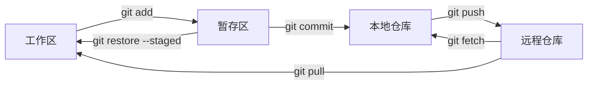

# 1. 核心心智模型

Git 的大多数命令都围绕四个区域移动变更：

| 区域 | 英文 | 作用 | 典型命令 |
|---|---|---|---|
| 工作区 | Working Directory | 当前磁盘文件 | `git diff` / `git restore` |
| 暂存区 | Staging Area / Index | 组织下一次提交 | `git add` / `git restore --staged` |
| 本地仓库 | Local Repository | 保存 commit 历史 | `git commit` / `git log` |
| 远程仓库 | Remote Repository | 团队共享历史 | `git fetch` / `git pull` / `git push` |



> [!summary]
> Git 日常开发的主线是：**编辑文件 → 暂存变更 → 提交快照 → 同步远程**。

# 2. 仓库创建与远程关联

## 2.1 创建仓库

| 场景 | 命令 | 说明 |
|---|---|---|
| 克隆已有项目 | `git clone <url>` | 下载代码和完整 Git 历史 |
| 克隆大型项目最新版本 | `git clone <url> --depth=1` | 只下载最近历史，节省体积 |
| 克隆含子模块项目 | `git clone <url> --recursive` | 同时初始化子模块 |
| 初始化本地项目 | `git init .` | 在当前目录创建 `.git` |

## 2.2 远程仓库管理

```bash
# 添加远程仓库
git remote add origin git@github.com:user/repo.git

# 查看远程仓库
git remote -v

# 修改远程 URL
git remote set-url origin git@github.com:user/repo.git

# 删除远程配置
git remote remove origin

# 查看远程详情
git remote show origin
```

认证与远程 URL 的配置细节见 [[01_Git_环境配置与认证]]。

## 2.3 子模块管理

```bash
# 添加子模块
git submodule add git@github.com:user/lib.git path/to/submodule

# 克隆后初始化子模块
git submodule update --init --recursive

# 拉取所有子模块最新内容
git submodule foreach git pull
```

> [!tip]
> 如果项目依赖子模块，优先使用 `git clone --recursive <url>`，减少后续手动初始化步骤。

# 3. 查看状态与暂存变更

## 3.1 查看仓库状态

```bash
# 完整状态
git status

# 简洁状态
git status -s
```

`git status -s` 输出为两列：左列表示暂存区，右列表示工作区。

| 标识 | 含义 |
|---|---|
| `??` | 未跟踪文件 |
| `A ` | 新文件已暂存 |
| ` M` | 修改未暂存 |
| `M ` | 修改已暂存 |
| `MM` | 暂存后又修改 |
| ` D` | 删除未暂存 |
| `D ` | 删除已暂存 |

## 3.2 添加到暂存区

```bash
# 添加当前目录及子目录的所有变更
git add .

# 添加整个仓库所有变更
git add -A

# 添加指定文件或目录
git add path/to/file
git add src/

# 交互式分块暂存
git add -p
```

> [!tip]
> `git add -p` 适合组织原子提交：同一个文件里可以只暂存部分 hunk，把修复、重构、调试代码拆开提交。

## 3.3 添加策略

| 命令 | 覆盖范围 | 适用场景 |
|---|---|---|
| `git add .` | 当前目录下新增、修改、删除 | 在仓库根目录时最常用 |
| `git add -A` | 整个仓库新增、修改、删除 | 从子目录执行时更明确 |
| `git add -u` | 只包含已跟踪文件的修改和删除 | 不想加入新文件 |
| `git add -p` | 手动选择部分变更 | 精准组织 commit |

# 4. 提交与临时保存

## 4.1 提交变更

```bash
# 提交暂存区内容
git commit -m "feat: add login page"

# 自动暂存所有 tracked 文件并提交
git commit -am "fix: correct typo"

# 修改最近一次提交信息
git commit --amend -m "新的提交说明"

# 补文件到最近一次提交，保留原提交信息
git add <forgotten_file>
git commit --amend --no-edit
```

> [!warning]
> `git commit -a` 只会处理已跟踪文件，不会自动加入从未 `git add` 过的新文件。

## 4.2 Commit 与 Stash 的区别

| 维度 | `git commit` | `git stash` |
|---|---|---|
| 目的 | 永久保存一个版本 | 临时保存未完成工作 |
| 是否进入历史 | 是，出现在 `git log` | 否，出现在 `git stash list` |
| 是否适合共享 | 推送后可共享 | 仅本地可见 |
| 常见场景 | 功能完成、修复完成 | 临时切分支、拉取前清理工作区 |

## 4.3 Stash 操作

```bash
# 临时保存 tracked 文件变更
git stash

# 添加说明
git stash push -m "WIP: 重构进行中"

# 包含未跟踪文件
git stash push -u -m "WIP: 含新文件"

# 查看 stash 列表
git stash list

# 恢复最近 stash 并删除记录
git stash pop

# 恢复但保留 stash 记录
git stash apply

# 恢复指定 stash
git stash apply stash@{1}

# 删除指定 stash
git stash drop stash@{0}
```

| 命令 | 覆盖范围 |
|---|---|
| `git stash` | tracked 文件变更 |
| `git stash -u` | tracked + untracked |
| `git stash -a` | tracked + untracked + ignored |

> [!warning]
> 默认 `git stash` 不保存未跟踪文件。切换分支前如果有新文件，优先使用 `git stash -u`。

# 5. 查看差异与历史

## 5.1 查看差异

```bash
# 工作区 vs 暂存区
git diff

# 暂存区 vs HEAD
git diff --staged
git diff --cached

# 两个提交之间
git diff <commit1> <commit2>

# 两个分支之间
git diff main..feature/login

# 只看文件统计
git diff --stat

# 查看某个提交的完整变更
git show <commit>
```

| 命令 | 比较范围 | 典型用途 |
|---|---|---|
| `git diff` | 工作区 vs 暂存区 | 检查尚未暂存的修改 |
| `git diff --staged` | 暂存区 vs HEAD | 提交前最终审查 |
| `git diff main..feature` | 分支差异 | 合并前审查 |
| `git show <commit>` | 单个提交 | 查看某次提交改了什么 |

## 5.2 查看历史

```bash
# 完整历史
git log

# 单行历史
git log --oneline

# 图形化历史
git log --oneline --graph --all

# 最近 5 条
git log -5

# 每次提交的文件统计
git log --stat

# 某个文件的详细历史
git log -p <file>

# 按提交信息搜索
git log --grep="关键词"

# 按作者搜索
git log --author="作者名"
```

推荐配置别名：

```bash
git config --global alias.lg "log --oneline --graph --all"
```

之后使用：

```bash
git lg
```

## 5.3 使用 Reflog 恢复误操作

`git reflog` 记录 HEAD 移动轨迹，可用于找回误删、误 reset 前的位置。

```bash
git reflog
git reset --hard HEAD@{1}
```

> [!warning]
> reflog 默认不会永久保存。发现误操作后越早恢复，成功率越高。

# 6. 远程同步

## 6.1 推送

```bash
# 推送当前分支到远程
git push origin <branch_name>

# 首次推送并建立 upstream
git push -u origin <branch_name>

# 后续已有 upstream 时
git push
```

`upstream` 机制详见 [[03_Git_常用参数速查]]。

## 6.2 Fetch 与 Pull

| 命令 | 行为 | 是否修改工作区 | 安全性 |
|---|---|---|---|
| `git fetch` | 下载远程引用 | 否 | 高 |
| `git pull` | `fetch` + `merge` 或 `rebase` | 是 | 中 |

```bash
# 更稳妥的同步流程
git fetch origin
git diff main..origin/main
git merge origin/main

# 快速拉取
git pull origin main

# 使用 rebase 拉取
git pull --rebase
```

> [!tip]
> 不确定远程发生了什么时，先 `git fetch`，再用 `git diff` 或 `git log` 审查。

## 6.3 Pull 默认使用 Rebase

如果希望减少无意义的 merge commit，可配置：

```bash
git config --global pull.rebase true
```

> [!warning]
> `pull --rebase` 会重放本地未推送提交。公共分支协作时，需要理解 rebase 风险，见 [[04_Git_分支管理与协作策略]]。

# 7. 撤销与恢复

## 7.1 取消暂存

```bash
# Git 2.23+ 推荐
git restore --staged <file>

# 旧版等效
git reset HEAD <file>
```

取消暂存只影响暂存区，不会删除工作区修改。

## 7.2 丢弃工作区修改

```bash
git restore <file>
git restore .
```

> [!warning]
> `git restore <file>` 会丢弃未暂存的工作区修改，执行前先确认不需要这些内容。

## 7.3 撤销最近一次提交

```bash
# 撤销提交，变更留在暂存区
git reset --soft HEAD~1

# 撤销提交，变更留在工作区
git reset --mixed HEAD~1

# 撤销提交并丢弃代码
git reset --hard HEAD~1
```

| 参数 | HEAD | 暂存区 | 工作区 | 风险 |
|---|---|---|---|---|
| `--soft` | 移动 | 保留 | 保留 | 低 |
| `--mixed` | 移动 | 重置 | 保留 | 低 |
| `--hard` | 移动 | 重置 | 丢弃 | 高 |

## 7.4 撤销已推送提交

已推送到公共分支的提交优先使用 `revert`：

```bash
git revert <commit>
```

`revert` 会生成一个反向提交，不重写历史。

| 场景 | 推荐命令 | 原因 |
|---|---|---|
| 撤销未推送的本地提交 | `git reset` | 只影响自己 |
| 撤销已推送的公共提交 | `git revert` | 不破坏协作历史 |

> [!summary]
> ==已推送到公共分支的提交，不要用 `reset` 改写历史，优先用 `revert`。==

# 8. 文件过滤与仓库规范

## 8.1 `.gitignore`

`.gitignore` 用于忽略未跟踪文件，避免把构建产物、缓存、密钥、日志提交进仓库。

```gitignore
# 编译产物
build/
dist/
*.o
*.exe

# 依赖目录
node_modules/
vendor/

# IDE 配置
.vscode/
.idea/

# 系统文件
.DS_Store
Thumbs.db

# 环境变量
.env
.env.local

# 日志
*.log
```

常用语法：

| 语法 | 含义 | 示例 |
|---|---|---|
| `#` | 注释 | `# logs` |
| `*` | 匹配任意字符 | `*.log` |
| `?` | 匹配单个字符 | `debug?.log` |
| `**` | 匹配任意层级 | `**/temp` |
| `/` 开头 | 从仓库根目录匹配 | `/build` |
| `/` 结尾 | 只匹配目录 | `dist/` |
| `!` | 取消忽略 | `!important.log` |

> [!warning]
> `.gitignore` 只对未跟踪文件生效。已经被 Git 跟踪的文件，需要先执行 `git rm --cached <file>`。

## 8.2 `.gitattributes`

`.gitattributes` 常用于统一换行符和声明二进制文件：

```gitattributes
* text=auto
*.sh text eol=lf
*.bat text eol=crlf
*.png binary
*.jpg binary
```

> [!tip]
> 跨平台项目建议配置 `* text=auto`，减少 Windows 和 Linux/macOS 换行符差异带来的无意义 diff。

# 9. 典型问题排查

## 9.1 切换分支时未跟踪文件冲突

报错示例：

```text
error: The following untracked working tree files would be overwritten by checkout:
    include/core/Defs.h
Aborting
```

原因：当前分支存在未跟踪文件，目标分支中也有同名文件。Git 为防止覆盖数据，拒绝切换。

推荐处理：

```bash
git stash push -u -m "WIP: 保存未跟踪文件"
git switch main
```

若确认可以丢弃，再手动删除文件。

## 9.2 临时查看历史提交

只看提交内容：

```bash
git show 9309c5e
```

临时切换到某个提交：

```bash
git checkout 9309c5e
```

这会进入 Detached HEAD 状态。

> [!warning]
> Detached HEAD 状态下不要直接提交。如果要基于历史提交继续开发，应先创建分支：`git switch -c <new_branch> 9309c5e`。

# 10. 日常工作流

## 10.1 开始新功能

```bash
git switch main
git pull --rebase
git switch -c feature/xxx
```

## 10.2 提交前审查

```bash
git status -s
git diff
git add -p
git diff --staged
git commit -m "feat: xxx"
```

## 10.3 推送分支

```bash
git push -u origin feature/xxx
```

## 10.4 临时切换任务

```bash
git stash push -u -m "WIP: xxx"
git switch main
git switch -c fix/urgent-bug
```

## 10.5 合并前检查

```bash
git fetch origin
git log --oneline --graph --all
git diff main..feature/xxx
```

# 11. 总结

> [!summary]
> Git 日常操作的核心不是背命令，而是判断变更在哪个区域：工作区、暂存区、本地仓库还是远程仓库。先用 `status` 定位状态，再选择 `add`、`commit`、`restore`、`reset`、`fetch`、`pull` 或 `push`，操作会清晰很多。
