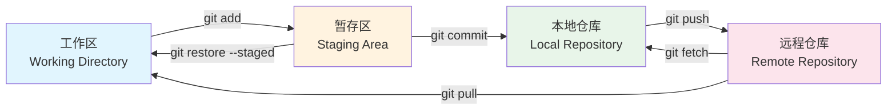
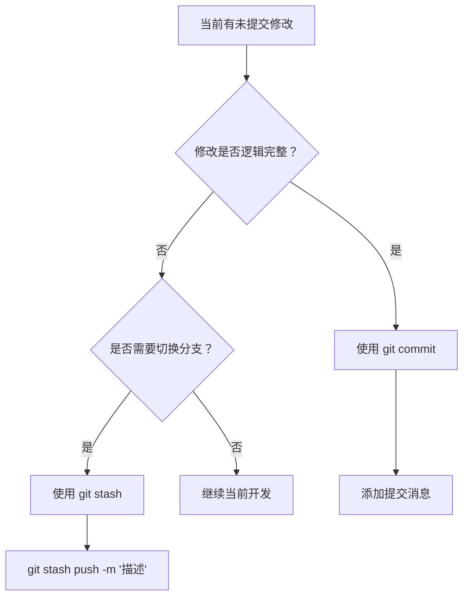
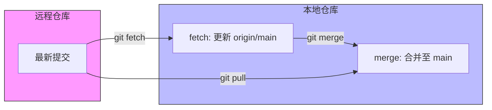
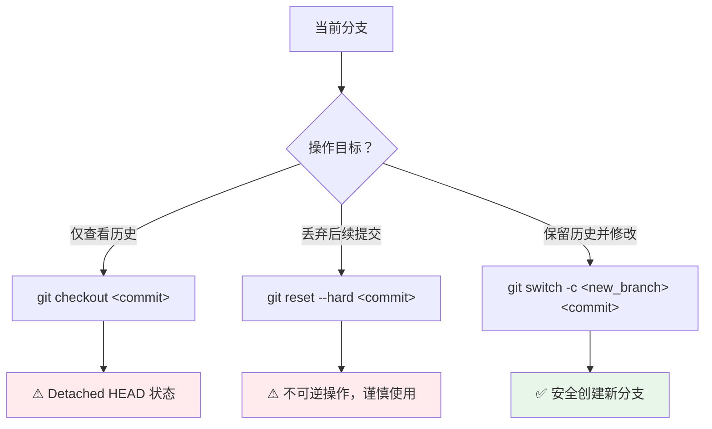

> [!abstract] 
> 本篇笔记系统梳理 Git 版本控制系统的核心操作流程，涵盖仓库初始化、工作区管理、远程同步及分支策略。通过结构化呈现与最佳实践指引，帮助建立高效、安全的版本控制习惯。

# 1. 仓库初始化与远程配置

仓库配置是版本控制的起点，涉及本地环境搭建与远程仓库关联。

## 1.1 仓库创建方式

根据项目来源选择对应的初始化策略。

| 操作类型 | 命令示例 | 适用场景 | 说明 |
| :--- | :--- | :--- | :--- |
| **克隆远程仓库** | `git clone <url>` | 参与现有项目 | 下载完整仓库及 `.git` 历史信息 |
| **浅层克隆** | `git clone <url> --depth=1` | 仅需最新代码 | 减少下载体积，不包含完整历史 |
| **递归克隆** | `git clone <url> --recursive` | 项目含子模块 | 同步克隆主仓库及所有子模块 |
| **本地初始化** | `git init .` | 新建本地项目 | 将当前目录初始化为独立仓库 |

> [!tip] 协议选择建议
> - **HTTPS**：`https://github.com/user/repo.git`，通用性强，推送时需输入凭证或配置 Token
> - **SSH**：`git@github.com:user/repo.git`，配置公钥后免密验证，推荐用于高频操作

## 1.2 远程仓库管理

管理本地仓库与远程服务器的关联关系。

```bash
# 添加远程端（通常命名为 origin）
git remote add origin git@github.com:user/repo.git

# 查看已配置的远程端（含 URL）
git remote -v

# 修改远程 URL 地址
git remote set-url origin git@github.com:user/repo.git

# 移除远程端配置
git remote remove origin

# 获取远程端详情（含分支追踪信息）
git remote show origin
```

> [!note] 多远程端配置
> 若代码需同步至多个平台（如 GitHub + Gitee），可配置多个远程端并分别命名：
> ```bash
> git remote add github git@github.com:user/repo.git
> git remote add gitee  git@gitee.com:user/repo.git
> ```

## 1.3 用户身份配置

配置提交者信息以确保提交记录的可追溯性。

```bash
# 全局配置（适用于所有仓库）
git config --global user.name "Your Name"
git config --global user.email "your.email@example.com"

# 局部配置（仅当前仓库生效，优先级高于全局）
git config user.name "Project Name"
git config user.email "project@example.com"

# 查看配置值
git config user.name
git config --global --list
```

> [!warning] 作用域区分
> `--global` 选项表示全局配置，影响所有仓库；省略该选项则仅对当前仓库生效。在多项目或团队协作场景中，建议在项目级别单独配置身份，以避免提交记录混淆。

## 1.4 子模块管理

处理包含子模块的复合项目结构。

```
+----------+     +--------------------------------+     +--------------------------------+     +---------------------------------+
| 主仓库   | --> | 添加子模块                     | --> | 初始化子模块                   | --> | 同步子模块内容                  |
|          |     | git submodule add              |     | git submodule init             |     | git submodule update            |
+----------+     +--------------------------------+     +--------------------------------+     +---------------------------------+
```

```bash
# 添加子模块至指定路径
git submodule add git@github.com:user/lib.git path/to/submodule

# 克隆含子模块的仓库后，分步初始化
git submodule init
git submodule update

# 一步完成初始化与同步（推荐，等价于上面两条命令）
git submodule update --init --recursive

# 拉取所有子模块最新内容
git submodule foreach git pull

# 同步子模块至指定分支
git submodule foreach 'git checkout main && git pull'
```

> [!tip] 克隆时直接初始化子模块
> 在克隆命令中添加 `--recursive` 参数，可在克隆主仓库的同时自动完成所有子模块的初始化与同步，省去后续手动操作：
> ```bash
> git clone --recursive git@github.com:user/repo.git
> ```

---

# 2. 工作区与暂存区管理

## 2.1 三层结构模型

Git 将文件状态划分为三个独立区域，理解这一模型是掌握所有 Git 操作的基础：

- **工作区（Working Directory）**：磁盘上的实际文件，即直接编辑代码的地方；未经 `git add` 的修改仅存在于此
- **暂存区（Staging Area / Index）**：提交前的中间缓冲层，用于精确组织本次提交的内容；执行 `git add` 后变更进入此区域
- **本地仓库（Local Repository）**：`.git` 目录中以快照形式永久存储的提交历史；执行 `git commit` 后变更固化至此



> [!note] 反向操作说明
> - `git restore --staged <file>`：将文件从暂存区移回工作区（取消暂存），旧版等效命令为 `git reset HEAD <file>`
> - `git restore <file>`：丢弃工作区的修改，从暂存区恢复文件内容（不可逆）
> - `git fetch`：仅将远程提交下载至本地仓库，不自动合并；`git pull` 则是 `fetch` + `merge` 的组合

## 2.2 添加变更至暂存区

将工作区修改纳入版本控制流程。

```bash
# 添加所有变更（新增/修改/删除）
git add .

# 添加指定路径变更
git add path/to/file
git add src/

# 交互式添加（逐块审查，选择性暂存）
git add -p

# 查看完整暂存状态
git status

# 查看简洁状态（两列格式：左列=暂存区，右列=工作区）
git status -s
```

`git status -s` 输出格式为 `XY`，**左列（X）** 表示暂存区状态，**右列（Y）** 表示工作区状态：

| 标识 | 含义 | 说明 |
| :--- | :--- | :--- |
| `??` | 未跟踪文件 | 新文件从未执行过 `git add`，不在版本控制中 |
| `A ` | 已暂存新增 | 新文件已 `git add`，暂存区等待提交，工作区无变更 |
| ` M` | 已修改未暂存 | 工作区有修改，但尚未执行 `git add` |
| `M ` | 已暂存修改 | 修改已 `git add` 至暂存区，等待提交 |
| `MM` | 暂存后又修改 | 上次 `git add` 后工作区又产生了新变更，存在两层差异 |
| ` D` | 已删除未暂存 | 工作区文件已删除，但删除操作尚未 `git add` |
| `D ` | 已暂存删除 | 删除操作已 `git add` 至暂存区，等待提交 |

> [!tip] 精准暂存技巧
> 使用 `git add -p` 可逐块审查变更，仅暂存需要的部分，实现原子化提交，避免将调试代码与功能代码混入同一次提交。

## 2.3 提交与暂存的策略选择

`commit` 用于永久记录，`stash` 用于临时保存，二者适用场景不同。

### 2.3.1 核心差异对比

| 维度 | `git commit` | `git stash` |
| :--- | :--- | :--- |
| **设计目的** | 永久保存开发里程碑 | 临时隐藏工作区变更 |
| **历史记录** | 出现在 `git log` 中 | 仅存于 `git stash list` |
| **协作可见性** | 推送后团队可见 | 仅限本地，无法共享 |
| **分支关联** | 绑定当前分支 | 可跨分支恢复 |
| **工作区状态** | 提交后恢复干净 | 暂存后恢复干净 |

### 2.3.2 使用场景决策



### 2.3.3 操作示例

```bash
# 提交变更
git commit -m "feat: 添加用户登录验证逻辑"

# 暂存当前工作（Git 自动生成简略备注）
git stash

# 暂存并手动添加描述（推荐方式）
git stash push -m "WIP: 重构进行中"

# 暂存时同时包含未跟踪的新文件
git stash push -u -m "WIP: 含新文件的进度"

# 暂存时包含所有文件（含 .gitignore 中的文件）
git stash push -a -m "WIP: 完整备份"

# 查看暂存列表
git stash list
# 输出示例: stash@{0}: On main: WIP: 重构进行中

# 恢复最近暂存（恢复后删除该 stash 记录）
git stash pop

# 恢复暂存（保留 stash 记录）
git stash apply

# 恢复指定暂存
git stash apply stash@{1}

# 删除指定暂存记录
git stash drop stash@{0}

# 清空所有 stash 记录
git stash clear
```

`git stash` 参数的覆盖范围对比：

| 命令 | 覆盖范围 |
| :--- | :--- |
| `git stash`（默认） | 仅已追踪文件的变更（Tracked） |
| `git stash -u`（推荐） | Tracked + 未跟踪的新文件（Untracked） |
| `git stash -a` | Tracked + Untracked + `.gitignore` 中忽略的文件 |

> [!warning] 冲突处理
> `git stash pop` 可能引发合并冲突。若发生冲突，Git 会保留 stash 记录，需手动解决冲突后执行 `git add .` 与 `git commit` 完成恢复，再手动 `git stash drop` 清除记录。

新文件不会被 stash，例如：

```text
new file: test.cpp
```

执行 `git stash` 后，`test.cpp` 还在，因为它是 `untracked` 的。

所以开发里更推荐使用：

```bash
git stash -u

# 等价于：
git stash --include-untracked
```

这样的话，新文件、重命名文件、未 add 文件都会保存。

## 2.4 实战：更改 commit

```bash
󰄛 ❯ git commit -m "优化 1"
[optimize 2d3e926] 优化 1
 21 files changed, 77 insertions(+), 78 deletions(-)
```

> [!question] 假设这里不小心点错提交了。想撤销这个 commit 应该怎么做？

Git 提供了几种不同的方式来撤销 commit，具体取决于你想把那些**已经写好的代码**怎么办。根据当前的情况，最常用的两种方法如下：

#### 方案一：撤销 commit，但保留代码（最推荐）

如果你只是发现 commit 信息写错了，或者想再多改一点东西后再一起提交，请使用：

```bash
git reset --soft HEAD~1
```

- **效果**：撤销最近的一次 commit，但你修改的那 21 个文件的代码**依然存在**。
- **状态**：这些文件会自动回到“待提交”（Staged）状态。你只需要继续修改，然后重新 `git commit` 即可。

> [!tip] 核心概念：什么是 `HEAD~1`？
> - `HEAD` 指向你当前分支的最新提交。
> - `~1` 表示“向上数一个”。所以 `HEAD~1` 就代表你刚才误操作之前的那个版本。

#### 方案二：彻底撤销，连代码也不要了（慎用！）

如果你觉得刚才写的代码全是垃圾，想直接回到提交前的干净状态：

```bash
git reset --hard HEAD~1
```

> [!warning] 注意
> 这会**永久删除**你那 21 个文件里的所有改动。执行前请务必确认你不需要这些代码了。

#### 方案三：如果只是想改一下 commit 消息

如果你代码没问题，只是觉得 `"优化 1"` 这个名字起得太随意了，想改个名字：

```bash
git commit --amend -m "这里写新的更详细的提交说明"
```

> [!warning] 特别提醒
> 如果你在发现错误之前已经执行了 `git push`，那么在你本地 `reset` 之后，必须使用**强制推送**才能同步远程仓库：
>
> ```bash
> git push origin <你的分支名> --force
> ```

---

# 3. 远程同步机制

管理本地与远程仓库的状态一致性。

## 3.1 推送操作规范

将本地提交同步至远程仓库。

```bash
# 推送当前分支至远程
git push origin <branch_name>

# 首次推送并建立追踪关系（后续可直接 git push）
git push -u origin <branch_name>

# 推送所有本地标签至远程
git push --tags

# 强制推送（慎用，见下方警告）
git push --force-with-lease  # 比 --force 更安全
```

> [!danger] 强制推送风险
> `--force` 会无条件覆盖远程历史，可能丢失他人提交。`--force-with-lease` 是更安全的替代方案：它会在远程已有新提交时拒绝推送，强制你先同步再推。

## 3.2 拉取与获取的差异

理解 `pull` 与 `fetch` 的本质差异。

| 命令 | 行为 | 安全性 | 适用场景 |
| :--- | :--- | :--- | :--- |
| `git fetch` | 下载远程变更至本地引用，不自动合并 | ✅ 高 | 先审查远程变更，再决定合并策略 |
| `git pull` | `fetch` + `merge`，自动合并至当前分支 | ⚠️ 中 | 快速同步，确信无冲突时 |



```bash
# 安全同步流程（推荐）
git fetch origin
git diff main origin/main    # 审查与远程的差异
git merge origin/main        # 确认无误后再合并

# 快速同步（已知无冲突）
git pull origin main

# 为当前分支设置上游追踪
git branch --set-upstream-to=origin/main
```

> [!note] 拉取前检查
> 执行 `git pull` 前确保工作区干净（`git status` 无未提交变更），否则请先 `git stash` 临时保存，避免触发不必要的合并冲突。

---

# 4. 分支管理策略

分支是并行开发的核心工具，支持功能隔离与历史回溯。

## 4.1 分支创建与切换

现代 Git（2.23+）推荐使用 `git switch` 替代 `git checkout` 进行分支操作，语义更清晰。

| 操作目的 | 传统命令 | 现代命令（推荐） |
| :--- | :--- | :--- |
| 创建分支 | `git branch <n>` | `git branch <n>` |
| 切换分支 | `git checkout <n>` | `git switch <n>` |
| 创建并切换 | `git checkout -b <n>` | `git switch -c <n>` |
| 基于 Commit 创建 | `git checkout -b <n> <commit>` | `git switch -c <n> <commit>` |

```bash
# 查看所有分支（* 标记当前分支，远程分支以 remotes/ 前缀显示）
git branch -a

# 查看分支与远程的追踪关系
git branch -vv

# 切换前检查工作区状态
git status
# 若有未提交变更：先 commit 或 stash，再切换

# 查看远程仓库的综合信息
git remote show origin

# 清理失效的远程分支
git fetch --prune
```

> [!tip] 分支命名规范
> 统一的前缀可被 Git GUI 工具（如 Sourcetree、VS Code）自动归类为文件夹，保持项目整洁：
> - `feature/login`：新功能开发
> - `fix/issue-101`：Bug 修复
> - `docs/api-update`：文档更新
> - `release/v1.2.0`：版本发布

## 4.2 基于历史提交的分支操作

处理历史版本回溯与分支衍生。



三种回溯方案对比：

| 方案 | 命令 | 影响范围 | 适用场景 | 风险提示 |
| :--- | :--- | :--- | :--- | :--- |
| **查看模式** | `git checkout <commit>` | 仅切换视图 | 临时审查历史代码 | 处于分离头指针状态，提交易丢失 |
| **回滚模式** | `git reset --hard <commit>` | 丢弃后续提交 | 彻底放弃近期修改 | 不可逆操作，需提前备份 |
| **衍生模式** | `git switch -c <new> <commit>` | 创建新分支 | 基于历史点开发新功能 | ✅ 最安全，推荐首选 |

```bash
# 示例：基于特定 commit 创建修复分支
git switch -c fix/ghost-logic 9309c5e

# 查看所有分支的提交拓扑
git log --oneline --graph --all
```

> [!warning] 分离头指针风险
> 在 `Detached HEAD` 状态下提交的变更不属于任何分支，切换分支后极易丢失。若需在历史提交上修改代码，务必先通过 `git switch -c <branch>` 创建新分支再操作。

## 4.3 分支删除管理

清理已完成或废弃的分支，保持仓库整洁。

```bash
# 删除本地分支（仅限已合并的分支）
git branch -d <branch_name>

# 强制删除本地分支（未合并时使用）
git branch -D <branch_name>

# 删除远程分支
git push origin --delete <branch_name>

# 清理本地中已不存在于远程的追踪引用
git fetch --prune
```

> [!note] 删除限制
> 1. 无法删除当前所在分支，需先 `git switch` 至其他分支
> 2. 删除远程分支前，确认团队成员已知晓并同步

## 4.4 分支合并策略

整合不同分支的开发成果：

```bash
# 快进合并（无分叉时，历史保持线性）
git switch main
git merge feature/login

# 非快进合并（强制生成合并提交，保留分支历史）
git merge --no-ff feature/login -m "merge: 集成登录功能"

# 变基合并（将当前分支的提交移植到 main 顶端）
git rebase main
```

| 合并方式 | 特点 | 适用场景 |
| :--- | :--- | :--- |
| **快进合并** | 历史线性，无合并提交 | 功能分支未与主分支产生分叉 |
| **普通合并** | 保留合并提交，历史结构清晰 | 团队协作，需明确追踪功能集成节点 |
| **变基合并** | 历史线性整洁，但会重写提交哈希 | 个人分支整理，推送前清理提交历史 |

> [!tip] 合并冲突处理步骤
> 1. 使用 `git status` 定位冲突文件
> 2. 手动编辑，解决文件中的 `<<<<<<<` / `=======` / `>>>>>>>` 标记
> 3. 执行 `git add <file>` 标记该文件冲突已解决
> 4. 完成合并提交：`git commit`；若为 rebase 则执行 `git rebase --continue`

---

## 4.5 实战：综合开发场景演示

假设你正在为一个独立游戏开发"背包系统"，同时突然发现了一个"药剂回血无效"的 Bug。以下是完整的操作流：

#### 场景 1：开发新功能（背包系统）

你需要从 `main` 分支切出一个特性分支。

1. **确保处于最新主分支**：

```bash
git switch main
git pull origin main
```

2. **创建并切换到特性分支**：

```bash
git switch -c feature/inventory
```

3. **开发并提交**：

```bash
git add .
git commit -m "feat: 增加背包基础框架与物品格子"
```

#### 场景 2：紧急修复 Bug（药剂无效）

此时发现药剂不能回血，编号为 Issue #101，需要暂时放下背包开发。

1. **保存当前进度**：

```bash
git stash push -m "WIP: 背包 UI 还没画完"
```

2. **切换回主分支并创建修复分支**：

```bash
git switch main
git switch -c fix/issue-101
```

3. **修复代码并提交**：

```bash
# 修改了 Potion.cpp
git add Potion.cpp
git commit -m "fix: 修复药剂恢复数值偏移问题"
```

4. **合并回主线并删除修复分支**：

```bash
git switch main
git merge fix/issue-101
git branch -d fix/issue-101
```

#### 场景 3：回到新功能开发

1. **切回特性分支**：

```bash
git switch feature/inventory
```

2. **找回之前的进度**：

```bash
git stash pop
```

3. **继续开发...**

#### 场景 4：发布版本

当所有功能开发完毕，准备打包发布 `v1.2.0`。

1. **创建发布分支**：

```bash
git switch main
git switch -c release/v1.2.0
```

2. **最后微调（如修改版本号文件）**：

```bash
git commit -am "chore: 更新版本号至 1.2.0"
```

> `-am` 是 `-a -m` 的组合：`-a` 会自动将**所有已追踪文件**的变更加入暂存区，再执行提交。注意：它不会自动添加从未 `git add` 过的新文件。

3. **合并并打标签**：

```bash
git switch main
git merge release/v1.2.0
git tag -a v1.2.0 -m "Release version 1.2.0"
```

> [!tip] 进阶建议
> - **及时清理**：功能分支合并到 `main` 后，建议立即删除本地分支（`git branch -d xxx`），防止 `git branch` 列表过于冗长。
> - **推送标签**：打完标签后记得执行 `git push --tags` 将标签同步至远程仓库。

---

## 4.6 实战：合并分支

```bash
󰄛 ❯ git branch -av                      
  main                e8a9314 5th commit
* refactor            73076c2 6th commit: 重构项目
  remotes/origin/main e8a9314 5th commit
```

> [!tip] 这是我当前的项目分支，我想把 `refactor` 分支合并到 `main` 分支，应该怎么做？

#### 第一步：回到目标分支

在 Git 中，合并的逻辑是：“切换到你想合入的分支（目标），然后把别的分支拉过来。”

```bash
git checkout main

# 或者使用新命令
git switch main
```

#### 第二步：执行合并命令

确保你现在已经在 `main` 分支上（你可以通过 `git branch` 看到 `*` 在 `main` 前面），然后执行：

```bash
git merge refactor
```

#### 第三步：处理合并结果

执行完 `merge` 后，通常会出现以下两种情况之一：

1. **Fast-forward（快进式合并）**：
    如果 `main` 自从你切出 `refactor` 后没有新的提交，Git 会直接把 `main` 的指针指向 `refactor` 的位置。这是最理想的情况。

2. **Merge Conflict（合并冲突）**：
    如果 `main` 和 `refactor` 修改了同一个文件的同一行，Git 会停下来让你手动解决冲突。
    - 你需要打开报错的文件，手动选择保留哪段代码。
    - 修改完后执行 `git add <文件名>` 和 `git commit` 完成合并。

#### 第四步：推送结果到远程

合并完成后，你的本地 `main` 已经包含了重构的代码，但 GitHub 上还没有。记得推送到远程：

```bash
git push origin main
```

#### 第五步：清理（可选）

如果你觉得 `refactor` 分支的任务已经彻底完成，不再需要它了，可以将其删除：

```bash
git branch -d refactor

# 如果远程有 refactor 分支
git push origin --delete refactor
git fetch --prune
```

> [!note] 💡 进阶：`--no-ff`
> 有些开发者喜欢在合并时加上 `--no-ff` 参数：
> 
> ```bash
> git merge --no-ff refactor
> ```
> 默认的合并（Fast-forward）不会产生新的提交记录。而 `--no-ff` 会强制生成一个新的“Merge commit”。这样做的好处是，你在 `git log` 历史图中能清晰地看到：“哦，这里曾经有一个分支存在过，后来合进来了”，这对回溯项目历史很有帮助。

#### 补充：强制合并

如果你想让 `main` 分支完全放弃它现有的新提交，转而变得和 `refactor` 一模一样，这种操作不叫“合并”（Merge），而叫“重置”（Reset）。

> 合并会自动保留双方的改动，而重置则是**强行覆盖**。

```bash
# 切换到 main 分支
git switch main

# 强行将 main 重置到 refactor 的位置
git reset --hard refactor

# 强制推送到远程仓库
git push origin main --force
```

执行 `git reset --hard` 后，`main` 原有的 `5th commit` （`refactor` 从 `main` 的 `5th commit` 处开始）之后的所有改动都会在 `main` 分支的历史中消失（物理文件也会被替换为 `refactor` 的样子）。

> [!warning] ⚠️ 安全检查：万一后悔了怎么办？

在执行 `reset --hard` 之前，如果你担心 `main` 分支上那些被丢弃的提交以后还有用，可以先给它存个档：

```bash
# 在重置前，给现在的 main 起个别名存起来
git branch old-main-backup main
```

这样即使你重置了 `main`，你依然可以随时通过 `old-main-backup` 分支找回那些被丢弃的代码。

---

## 4.7 实战：重设分支

这是当前的分支状态：

```bash
󰄛 ❯ git branch -av             
* main                          e094454 [ahead 1] 18th commit
  modern-project                ad72ff7 tmp commit
  remotes/origin/HEAD           -> origin/main
  remotes/origin/main           cc3880a 17th commit
  remotes/origin/modern-project ad72ff7 tmp commit
```

> [!tip] 接下来我们想把 `main` 分支重命名为 `cpp-test` 分支，然后把 `modern-project` 重命名为 `main` 分支，并且设置新的 `main` 分支为主分支，还需要同步修改远程仓库的，应该怎么做？

这是一个典型的“主线大翻新”操作。因为涉及重命名当前分支和修改远程默认分支，我们需要分步进行，以确保不会丢失代码。

以下是完整的操作流程：

1. **第一步**：本地分支重命名

```bash
# 将当前的 main 重命名为 cpp-test
git branch -m main cpp-test

# 将 modern-project 重命名为 main
git branch -m modern-project main
```

2. **第二步**：推送新分支到远程

由于远程仓库（GitHub）现在还认旧的名字，我们需要把新名字推上去。

```bash
# 推送新的 main（原来的 modern-project）并强制关联
git push origin main --force

# 推送 cpp-test（原来的 main）
git push origin cpp-test
```

3. **第三步**：修改远程默认分支（关键！）

**这一步必须在 GitHub 网页端操作**，因为 `main` 通常是受保护的默认分支，直接删除旧的远程引用会报错。

> 1. 打开你的 GitHub 项目页面。
> 2. 点击 **Settings** (选项卡) -> **Branches** (左侧栏)。
> 3. 在 **Default branch** 部分，点击右侧的切换按钮（双箭头图标）。
> 4. 确保选中的是新的 `main`（如果已经是了就不用动）。
> 5. **更新追踪关系**：在本地执行以下命令，让本地 `main` 重新对准远程：
>
> ```bash
> git push -u origin main
> ```

4. **第四步**：清理远程旧分支

现在远程仓库里应该还留着一个叫 `origin/modern-project` 的分支，由于它已经变身成了 `main`，我们可以把它删掉：

```bash
git push origin --delete modern-project
```

最后执行一次修剪，让本地的远程列表干净如新：

```bash
git fetch --prune
```

当执行完上面**四步**操作后，分支结构就变成了这样：

```bash
󰄛 ❯ git branch -av     
* cpp-test                e094454 [ahead 1, behind 3] 18th commit
  main                    ad72ff7 tmp commit
  remotes/origin/HEAD     -> origin/main
  remotes/origin/cpp-test e094454 18th commit
  remotes/origin/main     ad72ff7 tmp commit
```

现在的分支结构看起来已经非常接近目标了，但有一处细节需要修复：**`cpp-test` 分支的状态提示 `[ahead 1, behind 3]`**。

这说明你的本地 `cpp-test` 还在尝试追踪远程的 `origin/main`（也就是那个 ` remotes/origin/main -> ad72ff7`），所以它觉得你“领先了 1 个提交，落后了 3 个提交”。我们需要把它的“追踪目标”修正为远程的 `origin/cpp-test`。

1. 修正 `cpp-test` 的追踪关系

执行以下命令，告诉 Git 本地的 `cpp-test` 以后只和远程的 `origin/cpp-test` 说话：

```
git branch -u origin/cpp-test cpp-test
```

> 注：`-u` 是 `--set-upstream-to` 的缩写。

2. 修正 `main` 的追踪关系

同样地，确保本地的新 `main`（原 `modern-project`）指向远程的 `origin/main`：

```bash
git branch -u origin/main main
```

3. 最终状态检查

现在再次运行 `git branch -av`，你应该看到：

- **`* cpp-test`**: 后面的中括号应该是 `[up to date]`（或者是 `[ahead 1]`，取决于你是否已经推送到远程的 cpp-test）。
- **`main`**: 应该显示为 `[up to date]`。

> [!tip] 💡 为什么会出现 `[ahead 1, behind 3]`？
> 这是因为 Git 的“重命名”操作 (`-m`) 只改了名字，没有自动帮你改“家地址”（Upstream）。
> - 它记得原来的 `main` 是追踪 `origin/main` 的。
> - 你把它改名成 `cpp-test` 后，它依然在死板地对比 `origin/main`（也就是现在的 `ad72ff7`）。
> - 因为 `e094454` 和 `ad72ff7` 已经完全是两条路了，所以它算出了复杂的领先和落后数值。

---

# 5. 最佳实践与风险控制

遵循标准化流程可降低版本控制风险，提升协作效率。

## 5.1 高频操作速查表

| 操作目标 | 推荐命令 | 注意事项 |
| :--- | :--- | :--- |
| 开始新功能 | `git switch -c feature/xxx` | 基于最新 main 分支创建 |
| 临时切换任务 | `git stash push -m "WIP: xxx"` | 添加描述便于后续恢复 |
| 同步远程更新 | `git fetch && git diff main origin/main` | 先审查再合并 |
| 提交代码 | `git add -p && git commit -m "type: message"` | 原子化提交，规范消息 |
| 推送分支 | `git push -u origin feature/xxx` | 首次推送建立追踪 |
| 清理分支 | `git branch -d xxx && git push origin --delete xxx` | 确认已合并后再删除 |

## 5.2 风险操作防护

| 危险命令 | 潜在后果 | 安全替代方案 |
| :--- | :--- | :--- |
| `git reset --hard` | 不可逆地丢弃未提交变更 | 操作前先 `git stash` 备份 |
| `git push --force` | 覆盖远程历史，可能丢失他人提交 | 使用 `--force-with-lease` |
| `git clean -fd` | 永久删除所有未跟踪文件 | 先 `git status` 确认范围 |
| 直接改写历史提交 | 破坏团队协作历史 | 创建新分支后再变基或使用 `git revert` |

## 5.3 提交消息规范

采用约定式提交（Conventional Commits）规范提升历史可读性。

```
<type>(<scope>): <subject>

<body>

<footer>
```

| 类型 | 含义 | 示例 |
| :--- | :--- | :--- |
| `feat` | 新功能 | `feat(auth): 添加双因素认证` |
| `fix` | Bug 修复 | `fix(ui): 修复按钮点击区域偏移` |
| `docs` | 文档更新 | `docs: 补充 API 使用说明` |
| `refactor` | 代码重构 | `refactor: 提取用户验证逻辑` |
| `chore` | 构建/工具变更 | `chore: 更新依赖版本` |

> [!tip] 复习要点
> 1. `commit` 是永久存档，`stash` 是临时存档，二者不可混用
> 2. `pull` = `fetch` + `merge`，重要更新优先用 `fetch` 审查后再合并
> 3. 修改历史代码前必先创建新分支，避免陷入分离头指针状态
> 4. 删除分支前确认已合并，且先切换至其他分支
> 5. 强制推送使用 `--force-with-lease` 替代 `--force`

## 5.4 常见问题排查

```bash
# 查看所有操作历史（误操作后的救命命令）
git reflog

# 撤销最近一次提交，变更回到暂存区（保留修改）
git reset --soft HEAD~1

# 撤销最近一次提交，变更回到工作区（默认行为）
git reset --mixed HEAD~1

# 取消暂存，将文件移出暂存区（保留工作区修改）
git restore --staged <file>    # Git 2.23+ 推荐
git reset HEAD <file>          # 旧版等效命令

# 丢弃工作区修改，恢复至暂存区中的版本（不可逆）
git restore <file>             # Git 2.23+ 推荐
git checkout -- <file>         # 旧版等效命令

# 安全撤销已推送的提交（生成反向提交，不重写历史）
git revert <commit>

# 查看所有分支的提交拓扑关系
git log --graph --oneline --all
```

> [!note] `git reset` 与 `git revert` 的选择
> - `git reset`：重写历史，移动 HEAD 指针，适用于**尚未推送**的本地提交
> - `git revert`：生成一个新的"撤销提交"来抵消目标提交的变更，适用于**已推送**的提交，对协作历史无破坏性，是团队环境下的首选

> [!note] 协作礼仪
> 1. 推送前确保本地测试通过
> 2. 避免在主分支直接提交，使用功能分支开发
> 3. 提交合并请求（PR/MR）前同步最新主分支代码
> 4. 提交消息需清晰描述变更内容与影响范围

---

# 6. 典型场景问题排查

## 6.1 切换分支时的未跟踪文件冲突

### 6.1.1 问题描述

执行 `git stash` 后尝试切换分支，出现如下报错：

```bash
$ git stash
Saved working directory and index state WIP on fix-ghost-logic: 9309c5e 4th commit

$ git switch main
error: The following untracked working tree files would be overwritten by checkout:
        include/core/Defs.h
        lib/core/ObjectScreen.cpp
Please move or remove them before you switch branches.
Aborting
```

**原因分析**：当前分支下存在从未执行过 `git add` 的新文件（`Defs.h` 和 `ObjectScreen.cpp`），属于未跟踪状态。切换至目标分支时，Git 发现目标分支已有同名文件，为防止覆盖数据，拒绝切换并报错。

默认的 `git stash` **只保存已跟踪文件的变更**，这两个新文件不在其保护范围内，因此仍残留在工作区中。

### 6.1.2 解决方案

#### 方案一：重新暂存时包含未跟踪文件（推荐）

1. **恢复刚才的暂存**（上次 stash 未包含新文件，需先还原再重做）：

```bash
git stash pop
```

2. **使用 `-u` 参数重新暂存**（包含未跟踪文件）：

```bash
git stash push -u -m "WIP: 含新文件的进度"
```

3. **现在可以正常切换分支**：

```bash
git switch main
```

#### 方案二：手动删除冲突文件

若确认这两个文件在目标分支中已存在且当前版本可以丢弃，可直接删除后切换：

```bash
rm include/core/Defs.h lib/core/ObjectScreen.cpp
git switch main
```

> [!warning] 方案二风险提示
> 手动删除会永久丢失这两个文件在当前分支的内容。除非确认可以抛弃，否则请使用方案一。

> [!info] `git stash` 参数覆盖范围
> | 命令 | 覆盖范围 |
> | :--- | :--- |
> | `git stash`（默认） | 仅已追踪文件（Tracked） |
> | `git stash -u` | Tracked + 未跟踪新文件（Untracked） |
> | `git stash -a` | Tracked + Untracked + `.gitignore` 中忽略的文件 |

## 6.2 临时查看历史提交

### 6.2.1 切换至历史提交查看代码

若需临时切换到某个历史提交（如 `9309c5e`）查看代码，可直接使用 `git checkout` 指向该提交哈希：

```bash
git checkout 9309c5e
```

执行后，工作区所有文件将还原至该提交时刻的状态，可正常查看、编译和运行。

> [!warning] Detached HEAD（分离头指针）状态
> 执行上述命令后，Git 会提示进入 **Detached HEAD** 状态——此时不在任何分支上，而是直接指向一个提交节点。**在此状态下请勿提交新内容**，否则切换分支后这些提交将丢失。若需在此基础上修改代码，必须先创建新分支：
> ```bash
> git switch -c <new_branch_name>
> ```

### 6.2.2 返回当前分支

查看完毕后，直接切回原分支即可：

```bash
git switch main
# 若之前有 stash 记录，记得恢复
git stash pop
```

### 6.2.3 不切换分支直接查看差异（推荐）

若只需查看某个提交的改动内容，无需切换分支，以下命令更轻量且安全：

```bash
# 查看指定提交的所有变更详情（含 diff）
git show 9309c5e

# 对比当前分支与指定提交之间的所有差异
git diff 9309c5e main
```

> [!tip] 优先使用 `git show` / `git diff`
> 相比进入 Detached HEAD 状态，`git show` 与 `git diff` 不会改变工作区状态，适合"只看不改"的场景，是更安全的首选方式。
