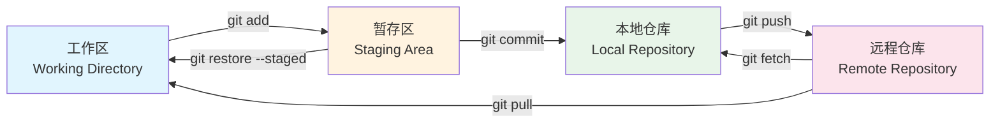
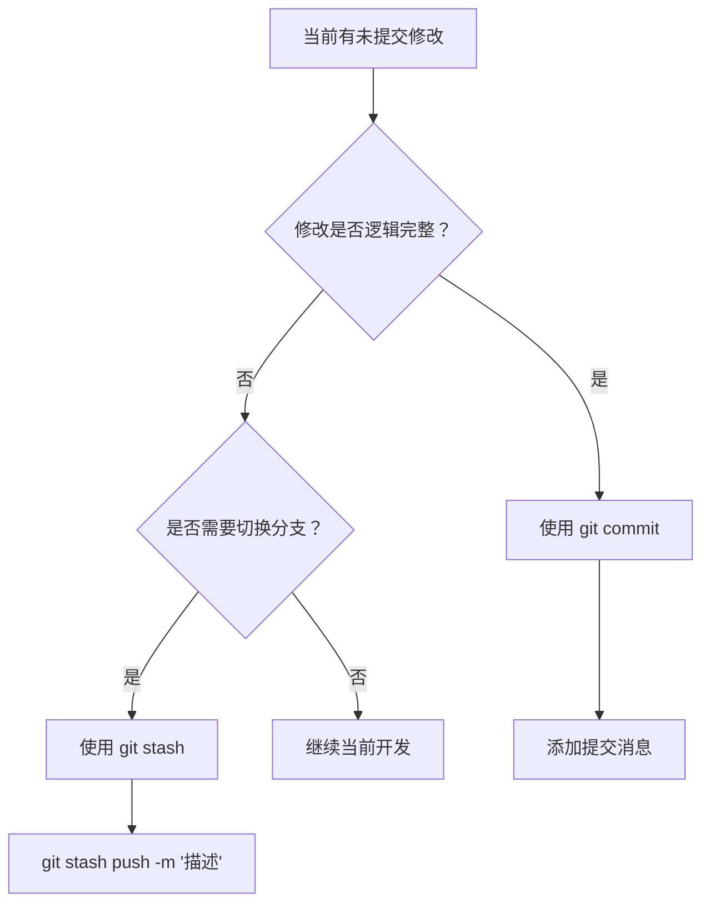
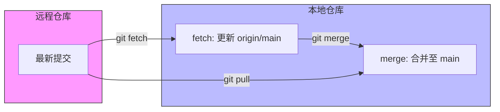

# 1. 仓库初始化与远程配置

仓库配置是版本控制的起点，涉及本地环境搭建与远程仓库关联。

## 1.1 仓库创建方式

根据项目来源选择对应的初始化策略。

| 操作类型 | 命令示例 | 适用场景 | 说明 |
| :--- | :--- | :--- | :--- |
| **克隆远程仓库** | `git clone <url>` | 参与现有项目 | 下载完整仓库及 `.git` 历史信息 |
| **浅层克隆** | `git clone <url> --depth=1` | 仅需最新代码 | 减少下载体积，不包含完整历史 |
| **递归克隆** | `git clone <url> --recursive` | 项目含子模块 | 同步克隆主仓库及所有子模块 |
| **本地初始化** | `git init .` | 新建本地项目 | 将当前目录初始化为独立仓库 |

> [!tip] 协议选择建议
> - **HTTPS**：`https://github.com/user/repo.git`，通用性强，推送时需输入凭证或配置 Token
> - **SSH**：`git@github.com:user/repo.git`，配置公钥后免密验证，推荐用于高频操作

## 1.2 远程仓库管理

管理本地仓库与远程服务器的关联关系。

```bash
# 添加远程端（通常命名为 origin）
git remote add origin git@github.com:user/repo.git

# 查看已配置的远程端（含 URL）
git remote -v

# 修改远程 URL 地址
git remote set-url origin git@github.com:user/repo.git

# 移除远程端配置
git remote remove origin

# 获取远程端详情（含分支追踪信息）
git remote show origin
```

> [!info] 多远程端配置
> 若代码需同步至多个平台（如 GitHub + Gitee），可配置多个远程端并分别命名：
> ```bash
> git remote add github git@github.com:user/repo.git
> git remote add gitee  git@gitee.com:user/repo.git
> ```

## 1.3 用户身份配置

配置提交者信息以确保提交记录的可追溯性。

```bash
# 全局配置（适用于所有仓库）
git config --global user.name "Your Name"
git config --global user.email "your.email@example.com"

# 局部配置（仅当前仓库生效，优先级高于全局）
git config user.name "Project Name"
git config user.email "project@example.com"

# 查看配置值
git config user.name
git config --global --list
```

> [!warning] 作用域区分
> `--global` 选项表示全局配置，影响所有仓库；省略该选项则仅对当前仓库生效。在多项目或团队协作场景中，建议在项目级别单独配置身份，以避免提交记录混淆。

## 1.4 子模块管理

处理包含子模块的复合项目结构。

```bash
# 添加子模块至指定路径
git submodule add git@github.com:user/lib.git path/to/submodule

# 克隆含子模块的仓库后，分步初始化
git submodule init
git submodule update

# 一步完成初始化与同步（推荐，等价于上面两条命令）
git submodule update --init --recursive

# 拉取所有子模块最新内容
git submodule foreach git pull

# 同步子模块至指定分支
git submodule foreach 'git checkout main && git pull'
```

> [!tip] 克隆时直接初始化子模块
> 在克隆命令中添加 `--recursive` 参数，可在克隆主仓库的同时自动完成所有子模块的初始化与同步：
> ```bash
> git clone --recursive git@github.com:user/repo.git
> ```

---

# 2. 工作区与暂存区管理

## 2.1 三层结构模型

Git 将文件状态划分为三个独立区域，理解这一模型是掌握所有 Git 操作的基础：

- **工作区（Working Directory）**：磁盘上的实际文件，即直接编辑代码的地方；未经 `git add` 的修改仅存在于此
- **暂存区（Staging Area / Index）**：提交前的中间缓冲层，用于精确组织本次提交的内容；执行 `git add` 后变更进入此区域
- **本地仓库（Local Repository）**：`.git` 目录中以快照形式永久存储的提交历史；执行 `git commit` 后变更固化至此



> [!tip] 反向操作速查
> - `git restore --staged <file>`：将文件从暂存区移回工作区（取消暂存），旧版等效命令为 `git reset HEAD <file>`
> - `git restore <file>`：丢弃工作区的修改，从暂存区恢复文件内容（不可逆）
> - `git fetch`：仅将远程提交下载至本地仓库，不自动合并；`git pull` 则是 `fetch` + `merge` 的组合

## 2.2 添加变更至暂存区

将工作区修改纳入版本控制流程。

```bash
# 添加所有变更（新增/修改/删除）
git add .

# 添加指定路径变更
git add path/to/file
git add src/

# 交互式添加（逐块审查，选择性暂存）
git add -p

# 查看完整暂存状态
git status

# 查看简洁状态（两列格式：左列=暂存区，右列=工作区）
git status -s
```

`git status -s` 输出格式为 `XY`，**左列（X）** 表示暂存区状态，**右列（Y）** 表示工作区状态：

| 标识 | 含义 | 说明 |
| :--- | :--- | :--- |
| `??` | 未跟踪文件 | 新文件从未执行过 `git add`，不在版本控制中 |
| `A ` | 已暂存新增 | 新文件已 `git add`，暂存区等待提交，工作区无变更 |
| ` M` | 已修改未暂存 | 工作区有修改，但尚未执行 `git add` |
| `M ` | 已暂存修改 | 修改已 `git add` 至暂存区，等待提交 |
| `MM` | 暂存后又修改 | 上次 `git add` 后工作区又产生了新变更，存在两层差异 |
| ` D` | 已删除未暂存 | 工作区文件已删除，但删除操作尚未 `git add` |
| `D ` | 已暂存删除 | 删除操作已 `git add` 至暂存区，等待提交 |

> [!tip] 精准暂存技巧
> 使用 `git add -p` 可逐块审查变更，仅暂存需要的部分，实现原子化提交，避免将调试代码与功能代码混入同一次提交。

## 2.3 提交与暂存的策略选择

`commit` 用于永久记录，`stash` 用于临时保存，二者适用场景不同。

### 2.3.1 核心差异对比

| 维度 | `git commit` | `git stash` |
| :--- | :--- | :--- |
| **设计目的** | 永久保存开发里程碑 | 临时隐藏工作区变更 |
| **历史记录** | 出现在 `git log` 中 | 仅存于 `git stash list` |
| **协作可见性** | 推送后团队可见 | 仅限本地，无法共享 |
| **分支关联** | 绑定当前分支 | 可跨分支恢复 |
| **工作区状态** | 提交后恢复干净 | 暂存后恢复干净 |

### 2.3.2 使用场景决策



### 2.3.3 Stash 操作详解

```bash
# 暂存当前工作（Git 自动生成简略备注）
git stash

# 暂存并手动添加描述（推荐方式）
git stash push -m "WIP: 重构进行中"

# 暂存时同时包含未跟踪的新文件
git stash push -u -m "WIP: 含新文件的进度"

# 暂存时包含所有文件（含 .gitignore 中的文件）
git stash push -a -m "WIP: 完整备份"

# 查看暂存列表
git stash list
# 输出示例: stash@{0}: On main: WIP: 重构进行中

# 恢复最近暂存（恢复后删除该 stash 记录）
git stash pop

# 恢复暂存（保留 stash 记录）
git stash apply

# 恢复指定暂存
git stash apply stash@{1}

# 删除指定暂存记录
git stash drop stash@{0}

# 清空所有 stash 记录
git stash clear
```

Stash 参数覆盖范围对比：

| 命令 | 覆盖范围 |
| :--- | :--- |
| `git stash`（默认） | 仅已追踪文件的变更（Tracked） |
| `git stash -u`（推荐） | Tracked + 未跟踪的新文件（Untracked） |
| `git stash -a` | Tracked + Untracked + `.gitignore` 中忽略的文件 |

> [!warning] Stash 冲突处理
> `git stash pop` 可能引发合并冲突。若发生冲突，Git 会保留 stash 记录，需手动解决冲突后执行 `git add .` 与 `git commit` 完成恢复，再手动 `git stash drop` 清除记录。
>
> 默认 `git stash` **不会保存未跟踪的新文件**。开发中推荐使用 `git stash -u`，确保新文件、重命名文件、未 add 文件都被保存。

## 2.4 撤销与回退操作

### 2.4.1 撤销提交（保留代码）

```bash
# 撤销最近一次提交，变更回到暂存区（保留修改）
git reset --soft HEAD~1

# 撤销最近一次提交，变更回到工作区（默认行为）
git reset --mixed HEAD~1
```

`git reset --mixed` 是 `git reset` 的默认行为（不加任何选项）。

> [!tip] 什么是 `HEAD~1`？
> `HEAD` 指向当前分支的最新提交，`~1` 表示“向上数一个”，即上一个版本。`HEAD~2` 则是往上两个版本，以此类推。如果知道具体的 hash 值，也可以用这种方式：
> 
> ```bash
> git reset <hash 值>
> ```
> 
> 回到 `<hash 值>` 处。`--soft` 和 `--mixed` 的区别就是：前者自动帮你执行了 `git add .`，但是后者没有。

### 2.4.2 撤销提交（丢弃代码）

```bash
# 彻底撤销，连代码也不要了（慎用！）
git reset --hard HEAD~1
```

> [!warning] `--hard` 不可逆
> 这会**永久删除**所有改动。执行前请务必确认不需要这些代码，或先 `git stash` 备份。

### 2.4.3 修改最近一次提交

```bash
# 仅修改提交信息
git commit --amend -m "新的提交说明"

# 追加文件到最近一次提交（漏提交时使用）
git add <forgotten_file>
git commit --amend --no-edit
```

> [!warning] Amend 后的推送
> `--amend` 会重写提交哈希。如果已推送到远程，必须使用强制推送：
> ```bash
> git push origin <branch_name> --force-with-lease
> ```

### 2.4.4 撤销已推送的提交

```bash
# 安全撤销已推送的提交（生成反向提交，不重写历史）
git revert <commit>
```

> [!summary] reset 与 revert 的选择
>
> | 场景 | 推荐命令 | 原因 |
> | :--- | :--- | :--- |
> | 撤销**未推送**的本地提交 | `git reset` | 重写本地历史，无协作影响 |
> | 撤销**已推送**的提交 | `git revert` | 生成反向提交，不破坏协作历史 |
>
> ==团队环境下，已推送的提交必须用 `git revert`==

对于独立开发项目，要撤销已推送的提交，可以用本地“撤销后”的状态，强行覆盖远程的状态：

```bash
git push origin <branch name> --force

# 或者使用更安全的强推命令（推荐）
git push origin <branch name> --force-with-lease
```

### 2.4.5 恢复工作区与暂存区

```bash
# 取消暂存，将文件移出暂存区（保留工作区修改）
git restore --staged <file>    # Git 2.23+ 推荐
git reset HEAD <file>          # 旧版等效命令

# 丢弃工作区修改，恢复至暂存区中的版本（不可逆）
git restore <file>             # Git 2.23+ 推荐
git checkout -- <file>         # 旧版等效命令
```

---

# 3. 变更查看与历史查询

## 3.1 git diff — 查看差异

`git diff` 是审查变更的核心工具，不同参数对应不同比较范围：

```bash
# 工作区 vs 暂存区（查看尚未暂存的修改）
git diff

# 暂存区 vs 本地仓库（查看已暂存但未提交的修改）
git diff --staged
git diff --cached              # 同上，旧版写法

# 两个提交之间的差异
git diff <commit1> <commit2>

# 两个分支之间的差异
git diff main feature/login

# 仅查看哪些文件有变更（不显示具体内容）
git diff --stat

# 查看指定提交的变更详情
git show <commit>
```

`git diff` 比较范围速查：

| 命令 | 比较范围 | 典型用途 |
| :--- | :--- | :--- |
| `git diff` | 工作区 vs 暂存区 | 检查尚未暂存的修改 |
| `git diff --staged` | 暂存区 vs 本地仓库 | 提交前最终审查 |
| `git diff <c1> <c2>` | 两个提交之间 | 对比历史版本差异 |
| `git diff main..feature` | 两个分支之间 | 合并前审查分支差异 |
| `git show <commit>` | 某次提交的完整 diff | 查看指定提交改了什么 |

## 3.2 git log — 查看历史

```bash
# 查看完整提交历史
git log

# 简洁模式（一行一条提交）
git log --oneline

# 图形化显示分支拓扑
git log --oneline --graph

# 显示所有分支的提交拓扑
git log --oneline --graph --all

# 显示最近 N 条提交
git log -5

# 显示每次提交的文件变更统计
git log --stat

# 查看指定文件的修改历史
git log -p <file>

# 搜索提交信息中包含关键字的提交
git log --grep="关键词"

# 查看指定作者的提交
git log --author="作者名"

# 查看指定时间范围的提交
git log --since="2024-01-01" --until="2024-12-31"
```

> [!tip] 推荐的 log 别名配置
> ```bash
> # 设置简洁美观的 log 别名
> git config --global alias.lg "log --oneline --graph --all"
> # 之后直接使用
> git lg
> ```

## 3.3 git reflog — 操作日志

`git reflog` 记录所有 HEAD 的移动轨迹，是误操作后的"救命命令"。

```bash
# 查看所有操作历史
git reflog

# 输出示例：
# e094454 HEAD@{0}: reset: moving to HEAD~1
# 2d3e926 HEAD@{1}: commit: 优化 1
# e094454 HEAD@{2}: checkout: moving from main to optimize

# 根据 reflog 恢复到任意历史状态
git reset --hard HEAD@{1}
```

> [!warning] reflog 有效期
> reflog 记录默认保留 **90 天**，过期后无法恢复。误操作后应尽快使用 reflog 恢复。

---

# 4. 远程同步机制

管理本地与远程仓库的状态一致性。

## 4.1 推送操作规范

将本地提交同步至远程仓库。

```bash
# 推送当前分支至远程
git push origin <branch_name>

# 首次推送并建立追踪关系（后续可直接 git push）
git push -u origin <branch_name>

# 推送所有本地标签至远程
git push --tags

# 强制推送（慎用，见下方警告）
git push --force-with-lease  # 比 --force 更安全
```

> [!warning] 强制推送风险
> `--force` 会无条件覆盖远程历史，可能丢失他人提交。`--force-with-lease` 是更安全的替代方案：它会在远程已有新提交时拒绝推送，强制你先同步再推。

## 4.2 拉取与获取的差异

理解 `pull` 与 `fetch` 的本质差异。

| 命令 | 行为 | 安全性 | 适用场景 |
| :--- | :--- | :--- | :--- |
| `git fetch` | 下载远程变更至本地引用，不自动合并 | ✅ 高 | 先审查远程变更，再决定合并策略 |
| `git pull` | `fetch` + `merge`，自动合并至当前分支 | ⚠️ 中 | 快速同步，确信无冲突时 |



```bash
# 安全同步流程（推荐）
git fetch origin
git diff main origin/main    # 审查与远程的差异
git merge origin/main        # 确认无误后再合并

# 快速同步（已知无冲突）
git pull origin main

# 为当前分支设置上游追踪
git branch --set-upstream-to=origin/main
```

> [!tip] 拉取前检查
> 执行 `git pull` 前确保工作区干净（`git status` 无未提交变更），否则请先 `git stash` 临时保存，避免触发不必要的合并冲突。

## 4.3 标签管理

标签（Tag）用于标记重要的版本节点，如发布版本。

```bash
# 创建轻量标签（仅指向某个提交的引用）
git tag v1.0.0

# 创建附注标签（推荐，包含标签信息）
git tag -a v1.0.0 -m "Release version 1.0.0"

# 对历史提交打标签
git tag -a v0.9.0 <commit> -m "Release version 0.9.0"

# 查看所有标签
git tag

# 查看标签详细信息
git show v1.0.0

# 推送单个标签至远程
git push origin v1.0.0

# 推送所有本地标签至远程
git push --tags

# 删除本地标签
git tag -d v1.0.0

# 删除远程标签
git push origin --delete v1.0.0
```

轻量标签与附注标签对比：

| 维度 | 轻量标签 | 附注标签 |
| :--- | :--- | :--- |
| **本质** | 指向提交的引用 | 独立的 Git 对象 |
| **包含信息** | 仅提交哈希 | 标签名、作者、日期、消息 |
| **可验证性** | 不可签名 | 可 GPG 签名验证 |
| **推荐场景** | 临时标记 | 正式版本发布 |

> [!tip] 语义化版本号
> 遵循 SemVer 规范：`vMAJOR.MINOR.PATCH`
> - **MAJOR**：不兼容的 API 变更
> - **MINOR**：向后兼容的功能新增
> - **PATCH**：向后兼容的 Bug 修复

---

# 5. .gitignore 与文件过滤

## 5.1 .gitignore 配置

`.gitignore` 文件指定 Git 应忽略的文件，避免将构建产物、临时文件等纳入版本控制。

```gitignore
# 编译产物
*.o
*.exe
build/
dist/

# 依赖目录
node_modules/
vendor/

# IDE 配置
.vscode/
.idea/
*.swp

# 系统文件
.DS_Store
Thumbs.db

# 环境配置（含敏感信息）
.env
.env.local

# 日志文件
*.log
```

### 5.1.1 语法规则

| 语法 | 含义 | 示例 |
| :--- | :--- | :--- |
| `#` | 注释 | `# 这是注释` |
| `*` | 匹配任意字符 | `*.log` 匹配所有 .log 文件 |
| `?` | 匹配单个字符 | `debug?.log` 匹配 debug0.log |
| `**` | 匹配任意层级目录 | `**/temp` 匹配任意层级的 temp |
| `/` 开头 | 仅匹配仓库根目录 | `/build` 仅忽略根目录的 build |
| `/` 结尾 | 仅匹配目录 | `doc/` 忽略 doc 目录，不忽略 doc 文件 |
| `!` | 取消忽略（例外） | `!important.log` 不忽略该文件 |

> [!warning] .gitignore 的限制
> `.gitignore` 只能忽略**未跟踪**的文件。如果文件已被 `git add` 跟踪，添加忽略规则不会生效。需先取消跟踪：
> ```bash
> git rm --cached <file>    # 从版本控制中移除，但保留本地文件
> git commit -m "chore: 移除误提交的文件"
> ```

## 5.2 .gitattributes 配置

`.gitattributes` 用于定义文件的属性，常见用途是统一换行符和合并策略。

```gitattributes
# 统一换行符：文本文件自动转换
* text=auto

# 指定文件类型的换行符
*.sh text eol=lf
*.bat text eol=crlf

# 二进制文件标记（避免 Git 尝试合并）
*.png binary
*.jpg binary

# 自定义合并策略
package-lock.json merge=ours
```

> [!tip] 跨平台协作必配
> Windows 使用 CRLF 换行，Linux/macOS 使用 LF 换行。在 `.gitattributes` 中配置 `* text=auto` 可让 Git 自动处理换行符转换，避免因换行符差异产生无意义的 diff。

---

# 6. 典型场景问题排查

## 6.1 切换分支时的未跟踪文件冲突

### 6.1.1 问题描述

执行 `git stash` 后尝试切换分支，出现如下报错：

```bash
$ git stash
Saved working directory and index state WIP on fix-ghost-logic: 9309c5e 4th commit

$ git switch main
error: The following untracked working tree files would be overwritten by checkout:
        include/core/Defs.h
        lib/core/ObjectScreen.cpp
Please move or remove them before you switch branches.
Aborting
```

**原因分析**：当前分支下存在从未执行过 `git add` 的新文件（`Defs.h` 和 `ObjectScreen.cpp`），属于未跟踪状态。切换至目标分支时，Git 发现目标分支已有同名文件，为防止覆盖数据，拒绝切换并报错。

默认的 `git stash` **只保存已跟踪文件的变更**，这两个新文件不在其保护范围内，因此仍残留在工作区中。

### 6.1.2 解决方案

#### 方案一：重新暂存时包含未跟踪文件（推荐）

1. **恢复刚才的暂存**（上次 stash 未包含新文件，需先还原再重做）：

```bash
git stash pop
```

2. **使用 `-u` 参数重新暂存**（包含未跟踪文件）：

```bash
git stash push -u -m "WIP: 含新文件的进度"
```

3. **现在可以正常切换分支**：

```bash
git switch main
```

#### 方案二：手动删除冲突文件

若确认这两个文件在目标分支中已存在且当前版本可以丢弃，可直接删除后切换：

```bash
rm include/core/Defs.h lib/core/ObjectScreen.cpp
git switch main
```

> [!warning] 方案二风险提示
> 手动删除会永久丢失这两个文件在当前分支的内容。除非确认可以抛弃，否则请使用方案一。

## 6.2 临时查看历史提交

### 6.2.1 切换至历史提交查看代码

若需临时切换到某个历史提交（如 `9309c5e`）查看代码：

```bash
git checkout 9309c5e
```

执行后，工作区所有文件将还原至该提交时刻的状态，可正常查看、编译和运行。

> [!warning] Detached HEAD（分离头指针）状态
> 执行上述命令后进入 **Detached HEAD** 状态——此时不在任何分支上，而是直接指向一个提交节点。**在此状态下请勿提交新内容**，否则切换分支后这些提交将丢失。若需在此基础上修改代码，必须先创建新分支：
> ```bash
> git switch -c <new_branch_name>
> ```

### 6.2.2 返回当前分支

查看完毕后，直接切回原分支即可：

```bash
git switch main
# 若之前有 stash 记录，记得恢复
git stash pop
```

### 6.2.3 不切换分支直接查看差异（推荐）

若只需查看某个提交的改动内容，无需切换分支，以下命令更轻量且安全：

```bash
# 查看指定提交的所有变更详情（含 diff）
git show 9309c5e

# 对比当前分支与指定提交之间的所有差异
git diff 9309c5e main
```

> [!tip] 优先使用 `git show` / `git diff`
> 相比进入 Detached HEAD 状态，`git show` 与 `git diff` 不会改变工作区状态，适合"只看不改"的场景，是更安全的首选方式。

---

# 7. 最佳实践与风险控制

遵循标准化流程可降低版本控制风险，提升协作效率。

## 7.1 高频操作速查表

| 操作目标 | 推荐命令 | 注意事项 |
| :--- | :--- | :--- |
| 开始新功能 | `git switch -c feature/xxx` | 基于最新 main 分支创建 |
| 临时切换任务 | `git stash push -m "WIP: xxx"` | 添加描述便于后续恢复 |
| 同步远程更新 | `git fetch && git diff main origin/main` | 先审查再合并 |
| 提交代码 | `git add -p && git commit -m "type: message"` | 原子化提交，规范消息 |
| 推送分支 | `git push -u origin feature/xxx` | 首次推送建立追踪 |
| 清理分支 | `git branch -d xxx && git push origin --delete xxx` | 确认已合并后再删除 |

## 7.2 风险操作防护

| 危险命令 | 潜在后果 | 安全替代方案 |
| :--- | :--- | :--- |
| `git reset --hard` | 不可逆地丢弃未提交变更 | 操作前先 `git stash` 备份 |
| `git push --force` | 覆盖远程历史，可能丢失他人提交 | 使用 `--force-with-lease` |
| `git clean -fd` | 永久删除所有未跟踪文件 | 先 `git status` 确认范围 |
| 直接改写历史提交 | 破坏团队协作历史 | 创建新分支后再变基或使用 `git revert` |

## 7.3 提交消息规范

采用约定式提交（Conventional Commits）规范提升历史可读性。

```
<type>(<scope>): <subject>

<body>

<footer>
```

| 类型 | 含义 | 示例 |
| :--- | :--- | :--- |
| `feat` | 新功能 | `feat(auth): 添加双因素认证` |
| `fix` | Bug 修复 | `fix(ui): 修复按钮点击区域偏移` |
| `docs` | 文档更新 | `docs: 补充 API 使用说明` |
| `refactor` | 代码重构 | `refactor: 提取用户验证逻辑` |
| `chore` | 构建/工具变更 | `chore: 更新依赖版本` |
| `style` | 代码格式调整 | `style: 统一缩进风格` |
| `test` | 测试相关 | `test: 添加登录模块单元测试` |
| `perf` | 性能优化 | `perf: 优化列表渲染性能` |

## 7.4 协作礼仪

1. 推送前确保本地测试通过
2. 避免在主分支直接提交，使用功能分支开发
3. 提交合并请求（PR/MR）前同步最新主分支代码
4. 提交消息需清晰描述变更内容与影响范围
5. 合并后及时删除已完成的特性分支

---

# 8. 总结

> [!summary] 核心要点
>
> - **三层模型**：工作区 → 暂存区 → 本地仓库，`add` / `commit` / `push` 逐层推进
> - **commit vs stash**：commit 是永久存档，stash 是临时存档，二者不可混用
> - **pull vs fetch**：`pull` = `fetch` + `merge`，重要更新优先用 `fetch` 审查后再合并
> - **reset vs revert**：未推送用 `reset`（重写本地历史），已推送用 `revert`（生成反向提交）
> - **diff 分层**：`git diff`（工作区 vs 暂存区）、`git diff --staged`（暂存区 vs 仓库）、`git diff <c1> <c2>`（提交间）
> - **黄金法则**：==已推送到远程的提交，绝不使用 `reset` 或 `rebase`，必须用 `revert`==
