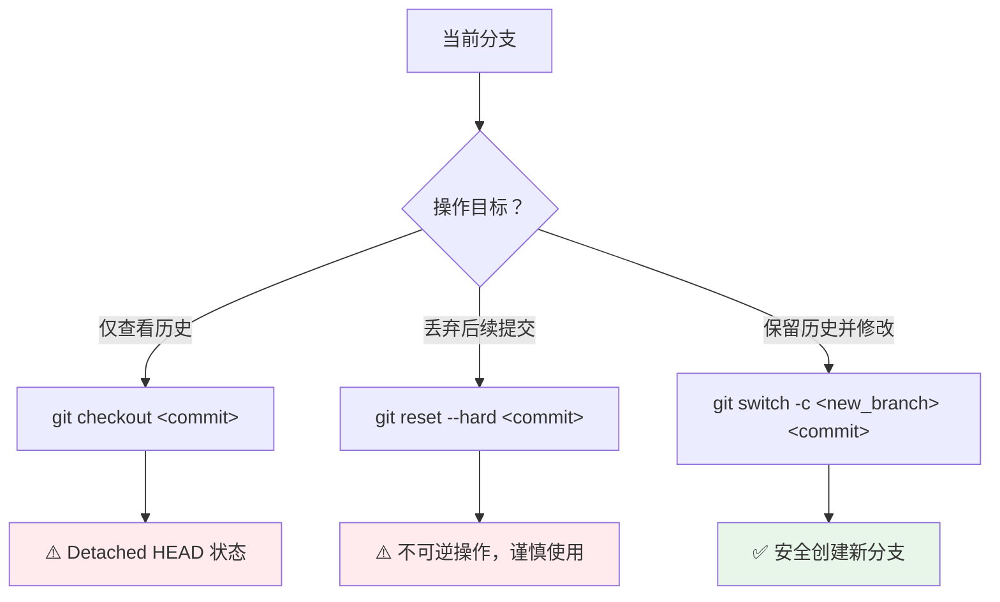

> [!abstract] 分支是并行开发的核心工具，支持功能隔离与历史回溯。

---

# 1. 分支创建与切换

现代 Git（2.23+）推荐使用 `git switch` 替代 `git checkout` 进行分支操作，语义更清晰。

| 操作目的 | 传统命令 | 现代命令（推荐） |
| :--- | :--- | :--- |
| 创建分支 | `git branch <n>` | `git branch <n>` |
| 切换分支 | `git checkout <n>` | `git switch <n>` |
| 创建并切换 | `git checkout -b <n>` | `git switch -c <n>` |
| 基于 Commit 创建 | `git checkout -b <n> <commit>` | `git switch -c <n> <commit>` |

```bash
# 查看所有分支（* 标记当前分支，远程分支以 remotes/ 前缀显示）
git branch -a

# 查看分支与远程的追踪关系
git branch -vv

# 切换前检查工作区状态
git status
# 若有未提交变更：先 commit 或 stash，再切换

# 查看远程仓库的综合信息
git remote show origin

# 清理失效的远程分支
git fetch --prune
```

> [!tip] 分支命名规范
> 统一的前缀可被 Git GUI 工具（如 Sourcetree、VS Code）自动归类为文件夹，保持项目整洁：
> - `feature/login`：新功能开发
> - `fix/issue-101`：Bug 修复
> - `docs/api-update`：文档更新
> - `release/v1.2.0`：版本发布

---

# 2. 基于历史提交的分支操作

处理历史版本回溯与分支衍生。



三种回溯方案对比：

| 方案 | 命令 | 影响范围 | 适用场景 | 风险提示 |
| :--- | :--- | :--- | :--- | :--- |
| **查看模式** | `git checkout <commit>` | 仅切换视图 | 临时审查历史代码 | 处于分离头指针状态，提交易丢失 |
| **回滚模式** | `git reset --hard <commit>` | 丢弃后续提交 | 彻底放弃近期修改 | 不可逆操作，需提前备份 |
| **衍生模式** | `git switch -c <new> <commit>` | 创建新分支 | 基于历史点开发新功能 | ✅ 最安全，推荐首选 |

```bash
# 示例：基于特定 commit 创建修复分支
git switch -c fix/ghost-logic 9309c5e

# 查看所有分支的提交拓扑
git log --oneline --graph --all
```

> [!warning] 分离头指针风险
> 在 `Detached HEAD` 状态下提交的变更不属于任何分支，切换分支后极易丢失。若需在历史提交上修改代码，务必先通过 `git switch -c <branch>` 创建新分支再操作。

---

# 3. 分支删除管理

清理已完成或废弃的分支，保持仓库整洁。

```bash
# 删除本地分支（仅限已合并的分支）
git branch -d <branch_name>

# 强制删除本地分支（未合并时使用）
git branch -D <branch_name>

# 删除远程分支
git push origin --delete <branch_name>

# 清理本地中已不存在于远程的追踪引用
git fetch --prune
```

> [!note] 删除限制
> 1. 无法删除当前所在分支，需先 `git switch` 至其他分支
> 2. 删除远程分支前，确认团队成员已知晓并同步

---

# 4. 分支合并策略

整合不同分支的开发成果：

```bash
# 快进合并（无分叉时，历史保持线性）
git switch main
git merge feature/login

# 非快进合并（强制生成合并提交，保留分支历史）
git merge --no-ff feature/login -m "merge: 集成登录功能"

# 变基合并（将当前分支的提交移植到 main 顶端）
git rebase main
```

| 合并方式 | 特点 | 适用场景 |
| :--- | :--- | :--- |
| **快进合并** | 历史线性，无合并提交 | 功能分支未与主分支产生分叉 |
| **普通合并** | 保留合并提交，历史结构清晰 | 团队协作，需明确追踪功能集成节点 |
| **变基合并** | 历史线性整洁，但会重写提交哈希 | 个人分支整理，推送前清理提交历史 |

> [!tip] 合并冲突处理步骤
> 1. 使用 `git status` 定位冲突文件
> 2. 手动编辑，解决文件中的 `<<<<<<<` / `=======` / `>>>>>>>` 标记
> 3. 执行 `git add <file>` 标记该文件冲突已解决
> 4. 完成合并提交：`git commit`；若为 rebase 则执行 `git rebase --continue`

---

# 5. 实战案例

## 5.1 实战：综合开发场景演示

假设你正在为一个独立游戏开发"背包系统"，同时突然发现了一个"药剂回血无效"的 Bug。以下是完整的操作流：

#### 场景 1：开发新功能（背包系统）

你需要从 `main` 分支切出一个特性分支。

1. **确保处于最新主分支**：

```bash
git switch main
git pull origin main
```

2. **创建并切换到特性分支**：

```bash
git switch -c feature/inventory
```

3. **开发并提交**：

```bash
git add .
git commit -m "feat: 增加背包基础框架与物品格子"
```

#### 场景 2：紧急修复 Bug（药剂无效）

此时发现药剂不能回血，编号为 Issue #101，需要暂时放下背包开发。

1. **保存当前进度**：

```bash
git stash push -m "WIP: 背包 UI 还没画完"
```

2. **切换回主分支并创建修复分支**：

```bash
git switch main
git switch -c fix/issue-101
```

3. **修复代码并提交**：

```bash
# 修改了 Potion.cpp
git add Potion.cpp
git commit -m "fix: 修复药剂恢复数值偏移问题"
```

4. **合并回主线并删除修复分支**：

```bash
git switch main
git merge fix/issue-101
git branch -d fix/issue-101
```

#### 场景 3：回到新功能开发

1. **切回特性分支**：

```bash
git switch feature/inventory
```

2. **找回之前的进度**：

```bash
git stash pop
```

3. **继续开发...**

#### 场景 4：发布版本

当所有功能开发完毕，准备打包发布 `v1.2.0`。

1. **创建发布分支**：

```bash
git switch main
git switch -c release/v1.2.0
```

2. **最后微调（如修改版本号文件）**：

```bash
git commit -am "chore: 更新版本号至 1.2.0"
```

> `-am` 是 `-a -m` 的组合：`-a` 会自动将**所有已追踪文件**的变更加入暂存区，再执行提交。注意：它不会自动添加从未 `git add` 过的新文件。

3. **合并并打标签**：

```bash
git switch main
git merge release/v1.2.0
git tag -a v1.2.0 -m "Release version 1.2.0"
```

> [!tip] 进阶建议
> - **及时清理**：功能分支合并到 `main` 后，建议立即删除本地分支（`git branch -d xxx`），防止 `git branch` 列表过于冗长。
> - **推送标签**：打完标签后记得执行 `git push --tags` 将标签同步至远程仓库。

---

## 5.2 实战：合并分支

```bash
󰄛 ❯ git branch -av                      
  main                e8a9314 5th commit
* refactor            73076c2 6th commit: 重构项目
  remotes/origin/main e8a9314 5th commit
```

> [!tip] 这是我当前的项目分支，我想把 `refactor` 分支合并到 `main` 分支，应该怎么做？

#### 第一步：回到目标分支

在 Git 中，合并的逻辑是：“切换到你想合入的分支（目标），然后把别的分支拉过来。”

```bash
git checkout main

# 或者使用新命令
git switch main
```

#### 第二步：执行合并命令

确保你现在已经在 `main` 分支上（你可以通过 `git branch` 看到 `*` 在 `main` 前面），然后执行：

```bash
git merge refactor
```

#### 第三步：处理合并结果

执行完 `merge` 后，通常会出现以下两种情况之一：

1. **Fast-forward（快进式合并）**：
    如果 `main` 自从你切出 `refactor` 后没有新的提交，Git 会直接把 `main` 的指针指向 `refactor` 的位置。这是最理想的情况。

2. **Merge Conflict（合并冲突）**：
    如果 `main` 和 `refactor` 修改了同一个文件的同一行，Git 会停下来让你手动解决冲突。
    - 你需要打开报错的文件，手动选择保留哪段代码。
    - 修改完后执行 `git add <文件名>` 和 `git commit` 完成合并。

#### 第四步：推送结果到远程

合并完成后，你的本地 `main` 已经包含了重构的代码，但 GitHub 上还没有。记得推送到远程：

```bash
git push origin main
```

#### 第五步：清理（可选）

如果你觉得 `refactor` 分支的任务已经彻底完成，不再需要它了，可以将其删除：

```bash
git branch -d refactor

# 如果远程有 refactor 分支
git push origin --delete refactor
git fetch --prune
```

> [!note] 💡 进阶：`--no-ff`
> 有些开发者喜欢在合并时加上 `--no-ff` 参数：
> 
> ```bash
> git merge --no-ff refactor
> ```
> 默认的合并（Fast-forward）不会产生新的提交记录。而 `--no-ff` 会强制生成一个新的“Merge commit”。这样做的好处是，你在 `git log` 历史图中能清晰地看到：“哦，这里曾经有一个分支存在过，后来合进来了”，这对回溯项目历史很有帮助。

#### 补充：强制合并

如果你想让 `main` 分支完全放弃它现有的新提交，转而变得和 `refactor` 一模一样，这种操作不叫“合并”（Merge），而叫“重置”（Reset）。

> 合并会自动保留双方的改动，而重置则是**强行覆盖**。

```bash
# 切换到 main 分支
git switch main

# 强行将 main 重置到 refactor 的位置
git reset --hard refactor

# 强制推送到远程仓库
git push origin main --force
```

执行 `git reset --hard` 后，`main` 原有的 `5th commit` （`refactor` 从 `main` 的 `5th commit` 处开始）之后的所有改动都会在 `main` 分支的历史中消失（物理文件也会被替换为 `refactor` 的样子）。

> [!warning] ⚠️ 安全检查：万一后悔了怎么办？

在执行 `reset --hard` 之前，如果你担心 `main` 分支上那些被丢弃的提交以后还有用，可以先给它存个档：

```bash
# 在重置前，给现在的 main 起个别名存起来
git branch old-main-backup main
```

这样即使你重置了 `main`，你依然可以随时通过 `old-main-backup` 分支找回那些被丢弃的代码。

---

## 5.3 实战：重设分支

这是当前的分支状态：

```bash
󰄛 ❯ git branch -av             
* main                          e094454 [ahead 1] 18th commit
  modern-project                ad72ff7 tmp commit
  remotes/origin/HEAD           -> origin/main
  remotes/origin/main           cc3880a 17th commit
  remotes/origin/modern-project ad72ff7 tmp commit
```

> [!question] 接下来我们想把 `main` 分支重命名为 `cpp-test` 分支，然后把 `modern-project` 重命名为 `main` 分支，并且设置新的 `main` 分支为主分支，还需要同步修改远程仓库的，应该怎么做？

这是一个典型的“主线大翻新”操作。因为涉及重命名当前分支和修改远程默认分支，我们需要分步进行，以确保不会丢失代码。

以下是完整的操作流程：

#### 第一步：本地分支重命名

```bash
# 将当前的 main 重命名为 cpp-test
git branch -m main cpp-test

# 将 modern-project 重命名为 main
git branch -m modern-project main
```

#### 第二步：推送新分支到远程

由于远程仓库（GitHub）现在还认旧的名字，我们需要把新名字推上去。

```bash
# 推送新的 main（原来的 modern-project）并强制关联
git push origin main --force

# 推送 cpp-test（原来的 main）
git push origin cpp-test
```

#### 第三步：修改远程默认分支（关键！）

**这一步必须在 GitHub 网页端操作**，因为 `main` 通常是受保护的默认分支，直接删除旧的远程引用会报错。

> 1. 打开你的 GitHub 项目页面。
> 2. 点击 **Settings** (选项卡) -> **Branches** (左侧栏)。
> 3. 在 **Default branch** 部分，点击右侧的切换按钮（双箭头图标）。
> 4. 确保选中的是新的 `main`（如果已经是了就不用动）。
> 5. **更新追踪关系**：在本地执行以下命令，让本地 `main` 重新对准远程：
>
> ```bash
> git push -u origin main
> ```

#### 第四步：清理远程旧分支

现在远程仓库里应该还留着一个叫 `origin/modern-project` 的分支，由于它已经变身成了 `main`，我们可以把它删掉：

```bash
git push origin --delete modern-project
```

最后执行一次修剪，让本地的远程列表干净如新：

```bash
git fetch --prune
```

#### 第五步：最后的完善

当执行完上面**四步**操作后，分支结构就变成了这样：

```bash
󰄛 ❯ git branch -av     
* cpp-test                e094454 [ahead 1, behind 3] 18th commit
  main                    ad72ff7 tmp commit
  remotes/origin/HEAD     -> origin/main
  remotes/origin/cpp-test e094454 18th commit
  remotes/origin/main     ad72ff7 tmp commit
```

现在的分支结构看起来已经非常接近目标了，但有一处细节需要修复：**`cpp-test` 分支的状态提示 `[ahead 1, behind 3]`**。

这说明你的本地 `cpp-test` 还在尝试追踪远程的 `origin/main`（也就是那个 ` remotes/origin/main -> ad72ff7`），所以它觉得你“领先了 1 个提交，落后了 3 个提交”。我们需要把它的“追踪目标”修正为远程的 `origin/cpp-test`。

1. 修正 `cpp-test` 的追踪关系

执行以下命令，告诉 Git 本地的 `cpp-test` 以后只和远程的 `origin/cpp-test` 说话：

```
git branch -u origin/cpp-test cpp-test
```

> 注：`-u` 是 `--set-upstream-to` 的缩写。

2. 修正 `main` 的追踪关系

同样地，确保本地的新 `main`（原 `modern-project`）指向远程的 `origin/main`：

```bash
git branch -u origin/main main
```

3. 最终状态检查

现在再次运行 `git branch -av`，你应该看到：

- **`* cpp-test`**: 后面的中括号应该是 `[up to date]`（或者是 `[ahead 1]`，取决于你是否已经推送到远程的 cpp-test）。
- **`main`**: 应该显示为 `[up to date]`。

> [!question] 💡 为什么会出现 `[ahead 1, behind 3]`？
> 这是因为 Git 的“重命名”操作 (`-m`) 只改了名字，没有自动帮你改“家地址”（Upstream）。
> - 它记得原来的 `main` 是追踪 `origin/main` 的。
> - 你把它改名成 `cpp-test` 后，它依然在死板地对比 `origin/main`（也就是现在的 `ad72ff7`）。
> - 因为 `e094454` 和 `ad72ff7` 已经完全是两条路了，所以它算出了复杂的领先和落后数值。
