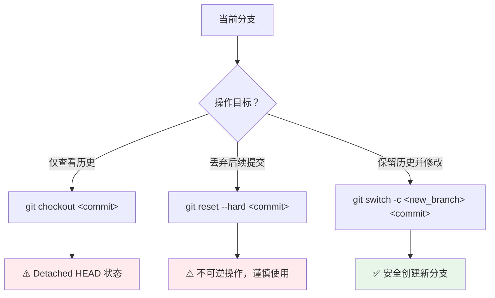
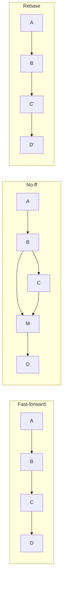
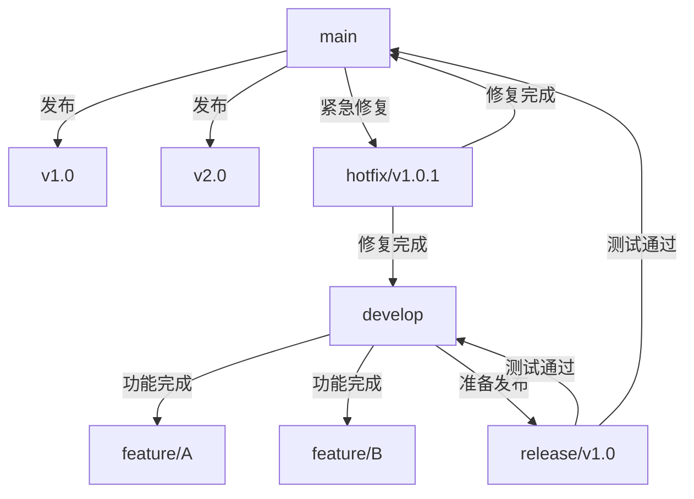
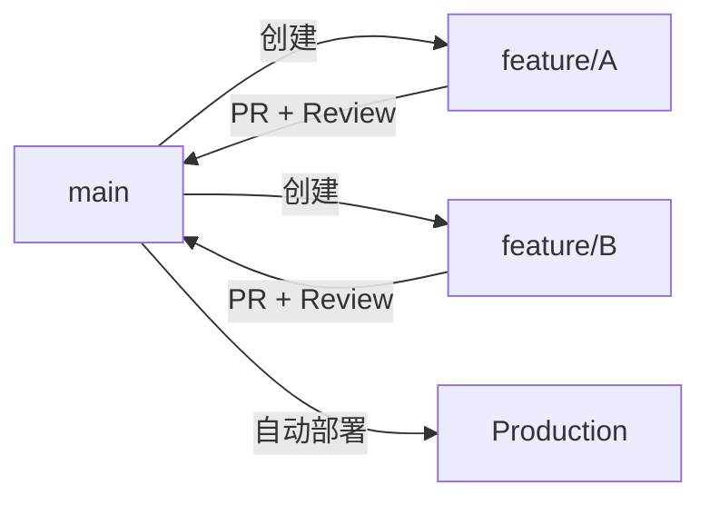
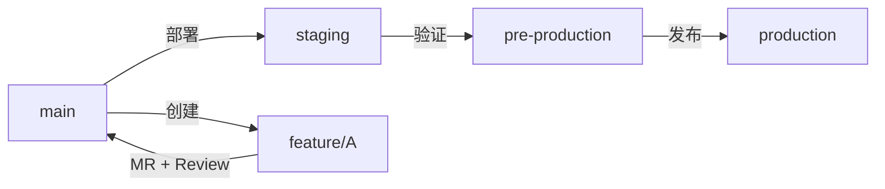
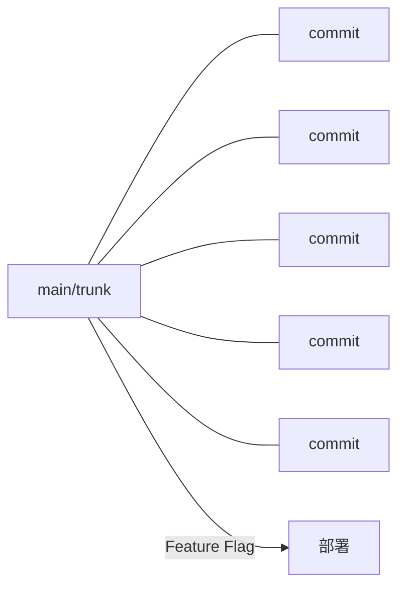
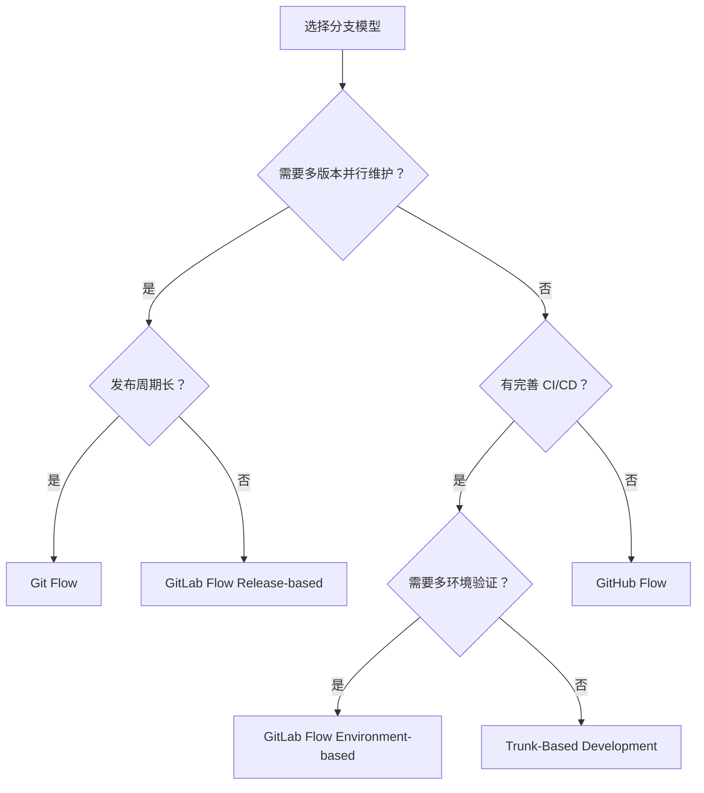

> [!abstract] 分支是并行开发的核心工具，支持功能隔离与历史回溯。选择合适的分支管理模型，是团队协作效率的关键。

---

# 1. 分支基础操作

## 1.1 分支创建与切换

现代 Git（2.23+）推荐使用 `git switch` 替代 `git checkout` 进行分支操作，语义更清晰。

| 操作目的 | 传统命令 | 现代命令（推荐） |
| :--- | :--- | :--- |
| 创建分支 | `git branch <name>` | `git branch <name>` |
| 切换分支 | `git checkout <name>` | `git switch <name>` |
| 创建并切换 | `git checkout -b <name>` | `git switch -c <name>` |
| 基于 Commit 创建 | `git checkout -b <name> <commit>` | `git switch -c <name> <commit>` |

```bash
# 查看所有分支（* 标记当前分支，远程分支以 remotes/ 前缀显示）
git branch -a

# 查看分支与远程的追踪关系
git branch -vv

# 切换前检查工作区状态
git status
# 若有未提交变更：先 commit 或 stash，再切换

# 查看远程仓库的综合信息
git remote show origin

# 清理失效的远程分支
git fetch --prune
```

> [!tip] 分支命名规范
> 统一的前缀可被 Git GUI 工具（如 Sourcetree、VS Code）自动归类为文件夹，保持项目整洁：
> - `feature/login`：新功能开发
> - `fix/issue-101`：Bug 修复
> - `docs/api-update`：文档更新
> - `release/v1.2.0`：版本发布
> - `hotfix/crash-on-start`：紧急线上修复
> - `refactor/db-layer`：代码重构

## 1.2 基于历史提交的分支操作

处理历史版本回溯与分支衍生。



三种回溯方案对比：

| 方案 | 命令 | 影响范围 | 适用场景 | 风险提示 |
| :--- | :--- | :--- | :--- | :--- |
| **查看模式** | `git checkout <commit>` | 仅切换视图 | 临时审查历史代码 | 处于分离头指针状态，提交易丢失 |
| **回滚模式** | `git reset --hard <commit>` | 丢弃后续提交 | 彻底放弃近期修改 | 不可逆操作，需提前备份 |
| **衍生模式** | `git switch -c <new> <commit>` | 创建新分支 | 基于历史点开发新功能 | ✅ 最安全，推荐首选 |

```bash
# 示例：基于特定 commit 创建修复分支
git switch -c fix/ghost-logic 9309c5e

# 查看所有分支的提交拓扑
git log --oneline --graph --all
```

> [!warning] 分离头指针风险
> 在 `Detached HEAD` 状态下提交的变更不属于任何分支，切换分支后极易丢失。若需在历史提交上修改代码，务必先通过 `git switch -c <branch>` 创建新分支再操作。

## 1.3 分支删除管理

清理已完成或废弃的分支，保持仓库整洁。

```bash
# 删除本地分支（仅限已合并的分支）
git branch -d <branch_name>

# 强制删除本地分支（未合并时使用）
git branch -D <branch_name>

# 删除远程分支
git push origin --delete <branch_name>

# 清理本地中已不存在于远程的追踪引用
git fetch --prune
```

> [!warning] 删除限制
> 1. 无法删除当前所在分支，需先 `git switch` 至其他分支
> 2. 删除远程分支前，确认团队成员已知晓并同步
> 3. 使用 `-D` 强制删除会丢失未合并的提交，执行前可用 `git branch --no-merged` 检查

---

# 2. 分支合并策略

## 2.1 合并方式对比

整合不同分支的开发成果，三种核心方式：

```bash
# 快进合并（无分叉时，历史保持线性）
git switch main
git merge feature/login

# 非快进合并（强制生成合并提交，保留分支历史）
git merge --no-ff feature/login -m "merge: message"

# 变基合并（将当前分支的提交移植到目标分支顶端）
git rebase main
```

| 合并方式 | 历史形态 | 是否产生合并提交 | 是否重写哈希 | 适用场景 |
| :--- | :--- | :--- | :--- | :--- |
| **Fast-forward** | 线性 | 否 | 否 | 功能分支未与主分支产生分叉 |
| **--no-ff** | 保留分支结构 | 是 | 否 | 团队协作，需明确追踪功能集成节点 |
| **Rebase** | 线性整洁 | 否 | 是 | 个人分支整理，推送前清理提交历史 |



> [!tip] 如何选择合并方式
> - **团队公共分支**（main/develop）：始终使用 `--no-ff`，保留完整分支拓扑
> - **个人特性分支**：使用 rebase 保持历史整洁，但**仅在未推送前**执行
> - **已推送的分支**：禁止 rebase，否则会破坏协作者的历史

## 2.2 变基（Rebase）详解

Rebase 将当前分支的提交"移植"到目标分支的顶端，使历史保持线性。

```bash
# 基本变基
git switch feature/login
git rebase main

# 交互式变基（可编辑、合并、重排提交）
git rebase -i HEAD~3

# 变基过程中遇到冲突
git rebase --continue   # 解决冲突后继续
git rebase --abort      # 放弃变基，回到变基前状态
git rebase --skip       # 跳过当前提交
```

交互式变基的常用操作：

| 命令 | 缩写 | 作用 |
| :--- | :--- | :--- |
| `pick` | `p` | 保留该提交 |
| `reword` | `r` | 保留提交，但修改提交信息 |
| `squash` | `s` | 将该提交合并到前一个提交 |
| `fixup` | `f` | 同 squash，但丢弃该提交的提交信息 |
| `drop` | `d` | 丢弃该提交 |

> [!warning] Rebase 黄金法则
> ==永远不要对已推送到远程的公共分支执行 rebase==。Rebase 会重写提交哈希，导致协作者的历史与你的历史产生分叉，引发合并混乱。

## 2.3 合并冲突处理

```bash
# 1. 定位冲突文件
git status

# 2. 手动编辑，解决冲突标记
# <<<<<<< HEAD（当前分支内容）
# =======
# >>>>>>> feature/xxx（ incoming 分支内容）

# 3. 标记冲突已解决
git add <file>

# 4. 完成合并
git commit                    # merge 方式
git rebase --continue         # rebase 方式
```

> [!tip] 减少冲突的实践
> - 频繁从主分支拉取更新：`git fetch` + `git rebase origin/main`
> - 拆分小功能，缩短分支生命周期
> - 避免多人修改同一文件的同一区域
> - 使用 `.gitattributes` 配置合并策略

---

# 3. 分支管理模型

选择合适的分支模型，是团队协作效率的关键。不同模型适用于不同规模和发布节奏的团队。

## 3.1 Git Flow

**Git Flow** 是最经典的分支模型，由 Vincent Driessen 于 2010 年提出，适用于有计划发布周期的项目。



**五种核心分支**：

| 分支类型 | 命名约定 | 来源 | 合并目标 | 生命周期 |
| :--- | :--- | :--- | :--- | :--- |
| **main** | `main` | — | — | 永久 |
| **develop** | `develop` | `main` | — | 永久 |
| **feature** | `feature/*` | `develop` | `develop` | 临时 |
| **release** | `release/*` | `develop` | `main` + `develop` | 临时 |
| **hotfix** | `hotfix/*` | `main` | `main` + `develop` | 临时 |

**工作流程**：

1. 从 `develop` 创建 `feature` 分支开发新功能
2. 功能完成后，通过 `--no-ff` 合并回 `develop`
3. 准备发布时，从 `develop` 创建 `release` 分支，仅做 Bug 修复和版本号更新
4. `release` 测试通过后，合并到 `main`（打标签）和 `develop`
5. 线上紧急问题，从 `main` 创建 `hotfix` 分支，修复后合并回 `main`（打标签）和 `develop`

> [!summary] Git Flow 适用场景
> - 有明确版本号的产品（桌面应用、库、SDK）
> - 发布周期较长（数周至数月）
> - 需要同时维护多个线上版本

## 3.2 GitHub Flow

**GitHub Flow** 是 Git Flow 的简化版，以持续部署为核心，适用于 Web 应用和 SaaS 产品。



**核心规则**：

1. `main` 分支始终可部署
2. 所有开发在 `feature` 分支上进行
3. 通过 **Pull Request** 发起合并请求
4. PR 经过 Code Review 和自动化测试后合并
5. 合并后立即部署到生产环境

| 特点 | 说明 |
| :--- | :--- |
| 分支数量 | 极少，仅 `main` + `feature` |
| 合并方式 | 必须通过 PR |
| 部署节奏 | 持续部署 |
| 回滚策略 | revert 合并提交或重新部署旧版本 |

> [!summary] GitHub Flow 适用场景
> - Web 应用、SaaS 产品（可随时部署）
> - 团队推崇持续集成/持续部署
> - 不需要同时维护多个版本

## 3.3 GitLab Flow

**GitLab Flow** 介于 Git Flow 和 GitHub Flow 之间，引入了**环境分支**概念，解决"持续部署"与"多环境"的矛盾。



**两种变体**：

| 变体 | 核心思路 | 适用场景 |
| :--- | :--- | :--- |
| **Environment-based** | `main` → `staging` → `production`，逐级部署 | 需要多环境验证的项目 |
| **Release-based** | 合并到 `main` 后再创建 `release/*` 分支维护 | 需要同时维护多个版本的项目 |

> [!summary] GitLab Flow 适用场景
> - 需要预发布环境验证的 Web 项目
> - 需要多环境（开发/测试/预发/生产）流程的团队
> - 介于 Git Flow 的复杂和 GitHub Flow 的简单之间

## 3.4 Trunk-Based Development

**主干开发**（Trunk-Based Development）是最极简的分支模型，所有开发者直接在 `main`（trunk）上提交，或使用极短生命周期的特性分支（不超过一天）。



**核心实践**：

| 实践 | 说明 |
| :--- | :--- |
| **小批量提交** | 每次提交尽量小，频繁集成 |
| **Feature Flag** | 用功能开关控制未完成功能的可见性，而非用分支隔离 |
| **自动化测试** | 完善的 CI 流水线，确保主干始终可用 |
| **短生命周期分支** | 若使用分支，生命周期不超过 1 天 |

> [!tip] Feature Flag 示例
> ```python
> if feature_flags.is_enabled("new_checkout"):
>     return new_checkout_flow()
> else:
>     return legacy_checkout_flow()
> ```

> [!summary] Trunk-Based Development 适用场景
> - 高成熟度的工程团队（完善的 CI/CD 和自动化测试）
> - 需要极快交付节奏的项目
> - Google、Facebook 等超大规模团队的实践基础

## 3.5 模型对比与选型

| 维度 | Git Flow | GitHub Flow | GitLab Flow | Trunk-Based |
| :--- | :--- | :--- | :--- | :--- |
| **复杂度** | 高 | 低 | 中 | 低 |
| **分支数量** | 多（5 种） | 少（2 种） | 中（3-4 种） | 极少（1-2 种） |
| **发布方式** | 计划发布 | 持续部署 | 环境推进 | 持续部署 |
| **多版本维护** | 支持 | 不支持 | 支持 | 不支持 |
| **CI/CD 要求** | 低 | 中 | 中 | 极高 |
| **团队规模** | 中大型 | 中小型 | 中型 | 高成熟度团队 |
| **典型项目** | 桌面应用、SDK | Web 应用 | SaaS、微服务 | 超大规模项目 |



> [!tip] 选型建议
> - **初创团队 / 个人项目**：从 GitHub Flow 开始，简单高效
> - **中型团队 / Web 产品**：GitLab Flow，兼顾灵活与规范
> - **传统软件 / 有版本维护需求**：Git Flow
> - **工程成熟度极高的团队**：Trunk-Based Development

---

# 4. 实战案例

## 4.1 综合开发场景演示

假设你正在为一个独立游戏开发"背包系统"，同时突然发现了一个"药剂回血无效"的 Bug。以下是完整的操作流：

### 4.1.1 场景 1：开发新功能（背包系统）

从 `main` 分支切出一个特性分支。

1. **确保处于最新主分支**：

```bash
git switch main
git pull origin main
```

2. **创建并切换到特性分支**：

```bash
git switch -c feature/inventory
```

3. **开发并提交**：

```bash
git add .
git commit -m "feat: 增加背包基础框架与物品格子"
```

### 4.1.2 场景 2：紧急修复 Bug（药剂无效）

发现药剂不能回血，编号为 Issue #101，需要暂时放下背包开发。

1. **保存当前进度**：

```bash
git stash push -m "WIP: 背包 UI 还没画完"
```

2. **切换回主分支并创建修复分支**：

```bash
git switch main
git switch -c fix/issue-101
```

3. **修复代码并提交**：

```bash
# 修改了 Potion.cpp
git add Potion.cpp
git commit -m "fix: 修复药剂恢复数值偏移问题"
```

4. **合并回主线并删除修复分支**：

```bash
git switch main
git merge fix/issue-101
git branch -d fix/issue-101
```

### 4.1.3 场景 3：回到新功能开发

1. **切回特性分支**：

```bash
git switch feature/inventory
```

2. **找回之前的进度**：

```bash
git stash pop
```

3. **继续开发...**

### 4.1.4 场景 4：发布版本

所有功能开发完毕，准备打包发布 `v1.2.0`。

1. **创建发布分支**：

```bash
git switch main
git switch -c release/v1.2.0
```

2. **最后微调（如修改版本号文件）**：

```bash
git commit -am "chore: 更新版本号至 1.2.0"
```

> `-am` 是 `-a -m` 的组合：`-a` 会自动将**所有已追踪文件**的变更加入暂存区，再执行提交。注意：它不会自动添加从未 `git add` 过的新文件。

3. **合并并打标签**：

```bash
git switch main
git merge release/v1.2.0
git tag -a v1.2.0 -m "Release version 1.2.0"
```

> [!tip] 进阶建议
> - **及时清理**：功能分支合并到 `main` 后，建议立即删除本地分支（`git branch -d xxx`），防止 `git branch` 列表过于冗长
> - **推送标签**：打完标签后记得执行 `git push --tags` 将标签同步至远程仓库

## 4.2 实战：合并分支

```bash
❯ git branch -av
  main                e8a9314 5th commit
* refactor            73076c2 6th commit: 重构项目
  remotes/origin/main e8a9314 5th commit
```

> [!question] 如何把 `refactor` 分支合并到 `main` 分支？

### 4.2.1 回到目标分支

在 Git 中，合并的逻辑是："切换到你想合入的分支（目标），然后把别的分支拉过来。"

```bash
git switch main
```

### 4.2.2 执行合并命令

确保当前已在 `main` 分支上（`git branch` 看到 `*` 在 `main` 前面），然后执行：

```bash
git merge refactor
```

### 4.2.3 处理合并结果

1. **Fast-forward（快进式合并）**：`main` 自从切出 `refactor` 后没有新提交，Git 直接把 `main` 指针指向 `refactor` 的位置
2. **Merge Conflict（合并冲突）**：两个分支修改了同一文件的同一行，需手动解决冲突

### 4.2.4 推送结果到远程

```bash
git push origin main
```

### 4.2.5 清理（可选）

```bash
git branch -d refactor

# 如果远程有 refactor 分支
git push origin --delete refactor
git fetch --prune
```

> [!info] 进阶：`--no-ff`
> 默认的 Fast-forward 合并不会产生新的提交记录。而 `--no-ff` 会强制生成一个新的 "Merge commit"，在 `git log` 历史图中能清晰看到分支的存在与合并，对回溯项目历史很有帮助。

### 4.2.6 补充：强制重置

如果想让 `main` 分支完全放弃现有提交，变得和 `refactor` 一模一样，这不是"合并"而是"重置"。

> [!warning] 合并 vs 重置
> 合并会自动保留双方的改动，而重置是**强行覆盖**。

```bash
# 切换到 main 分支
git switch main

# 强行将 main 重置到 refactor 的位置
git reset --hard refactor

# 强制推送到远程仓库
git push origin main --force
```

> [!warning] 安全检查：重置前备份
> 执行 `reset --hard` 前，建议先备份：
> ```bash
> git branch old-main-backup main
> ```
> 这样即使重置了 `main`，仍可通过 `old-main-backup` 找回被丢弃的代码。

## 4.3 实战：重设分支

```bash
❯ git branch -av
* main                          e094454 [ahead 1] 18th commit
  modern-project                ad72ff7 tmp commit
  remotes/origin/HEAD           -> origin/main
  remotes/origin/main           cc3880a 17th commit
  remotes/origin/modern-project ad72ff7 tmp commit
```

> [!question] 要求：将 `main` 重命名为 `cpp-test`，将 `modern-project` 重命名为 `main`，并同步远程仓库。

### 4.3.1 本地分支重命名

```bash
git branch -m main cpp-test
git branch -m modern-project main
```

### 4.3.2 推送新分支到远程

```bash
git push origin main --force
git push origin cpp-test
```

### 4.3.3 修改远程默认分支

**此步必须在 GitHub 网页端操作**（`main` 通常是受保护的默认分支）：

1. 打开 GitHub 项目页面 → **Settings** → **Branches**
2. 在 **Default branch** 部分切换为新的 `main`
3. 更新本地追踪关系：

```bash
git push -u origin main
```

### 4.3.4 清理远程旧分支

```bash
git push origin --delete modern-project
git fetch --prune
```

### 4.3.5 修正追踪关系

重命名操作只改了名字，不会自动更新追踪关系（Upstream），需要手动修正：

```bash
# 修正 cpp-test 的追踪目标
git branch -u origin/cpp-test cpp-test

# 修正 main 的追踪目标
git branch -u origin/main main
```

> [!tip] 为什么会出现 `[ahead 1, behind 3]`？
> `git branch -m` 只改名字，不改"家地址"（Upstream）。重命名后 `cpp-test` 仍追踪 `origin/main`，导致对比结果混乱。修正追踪关系后即可恢复 `[up to date]`。

---

# 5. 最佳实践与易错点

## 5.1 最佳实践

| 实践 | 说明 |
| :--- | :--- |
| **分支生命周期尽量短** | 功能分支存活时间越长，合并冲突概率越高 |
| **频繁同步主分支** | 定期 `git fetch` + `git rebase origin/main`，减少最终合并冲突 |
| **提交前运行测试** | 确保每次提交不会破坏构建 |
| **使用 PR/MR 流程** | Code Review 是质量保障的关键环节 |
| **保护主分支** | 在 GitHub/GitLab 中设置分支保护规则，禁止直接推送 |
| **及时删除已合并分支** | 避免分支列表膨胀，减少认知负担 |
| **有意义的提交信息** | 遵循 Conventional Commits 规范（`feat:` / `fix:` / `chore:` 等） |

## 5.2 常见易错点

> [!warning] 易错点汇总
>
> 1. **在错误分支上开发**：开发前未确认当前分支 → 用 `git stash` 暂存，切换后 `git stash pop`
> 2. **忘记拉取远程更新**：直接合并导致冲突 → 合并前先 `git pull --rebase`
> 3. **对公共分支执行 rebase**：破坏协作者历史 → 公共分支只用 `merge --no-ff`
> 4. **强制推送到 main**：覆盖他人提交 → 设置分支保护规则
> 5. **忽略 `.gitignore`**：将构建产物提交 → 提交前检查 `git status`
> 6. **合并后忘记推送**：本地已合并但远程未更新 → 养成合并后立即 `git push` 的习惯
> 7. **重命名分支后未修正追踪**：导致 `ahead/behind` 显示异常 → 执行 `git branch -u`

---

# 6. 总结

> [!summary] 核心要点
>
> - **分支操作**：优先使用 `git switch` / `git switch -c`，语义清晰
> - **合并策略**：公共分支用 `--no-ff`，个人分支可用 rebase（仅限未推送前）
> - **分支模型选型**：根据团队规模、发布节奏、CI/CD 成熟度选择
>   - 简单项目 → GitHub Flow
>   - 多环境需求 → GitLab Flow
>   - 版本维护需求 → Git Flow
>   - 高成熟度团队 → Trunk-Based Development
> - **黄金法则**：==永远不要对已推送的公共分支执行 rebase==
