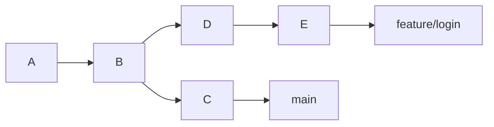
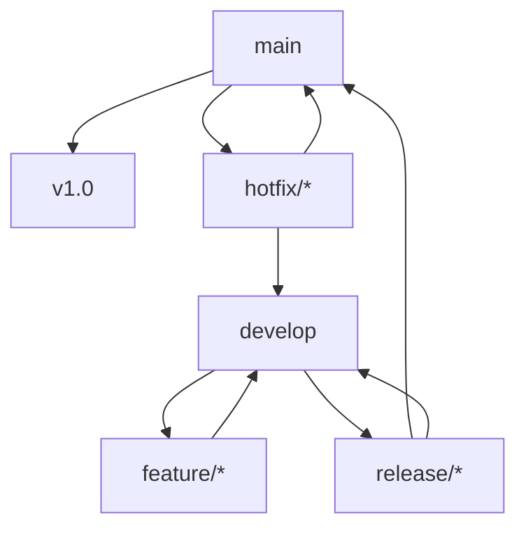
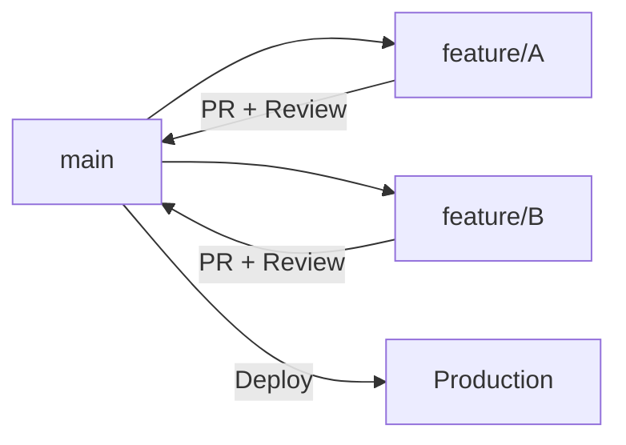

# 1. 分支的核心概念

Git 分支本质上是指向某个 commit 的可移动指针。创建分支并不会复制整个项目，只是创建一个新的引用。



> [!summary]
> 分支用于隔离不同开发线：新功能、Bug 修复、发布准备、实验代码都可以放在独立分支中完成。

---

# 2. 分支基础操作

## 2.1 查看分支

1. 列出**所有分支**，包括本地和远端

```bash
git branch -a
```

输出示例：

```
* main                        ← * 表示当前所在分支
  feature/login
  remotes/origin/main         ← 远端分支
  remotes/origin/feature/login
```

相关参数：

```bash
git branch        # 只看本地分支
git branch -r     # 只看远端分支
git branch -a     # 全看（本地 + 远端）
```

2. 列出本地分支，并显示**每个分支跟踪的远端分支**，以及领先/落后情况。

```bash
git branch -vv
```

输出示例：

```
* main          a3f2c1d [origin/main: ahead 2, behind 1] fix login bug
  feature/login 9309c5e [origin/feature/login] add login page
  local-only    b1e4d2a 没有跟踪远端
```

- `ahead 2` → 你本地比远端多 2 个提交（需要 push）
- `behind 1` → 远端比你本地多 1 个提交（需要 pull）
- 没有 `[origin/...]` → 该分支没有关联远端，只存在本地

## 2.2 创建与切换

现代 Git 推荐使用 `git switch` 处理分支切换，语义比 `checkout` 更清晰。

| 操作 | 传统命令 | 推荐命令 |
|---|---|---|
| 创建新分支 | `git branch <name>` | `git branch <name>` |
| 切换分支 | `git checkout <name>` | `git switch <name>` |
| **创建并切换**到新分支 | `git checkout -b <name>` | `git switch -c <name>` |
| 基于提交创建 | `git checkout -b <name> <commit>` | `git switch -c <name> <commit>` |

### 2.2.1 示例

1. `git switch main`

切换到 `main` 分支，等价于旧命令 `git checkout main`。

`switch` 是 Git 2.23 引入的新命令，职责更单一：

```bash
git switch main          # 只用来切换分支
git checkout main        # 旧写法，但 checkout 能做的事太多了，语义不够准确
```

2. `git switch -c feature/login`

`-c` 是 `--create`，表示**基于当前 HEAD 创建并切换到名为 `feature/login` 的新分支**，等价于：

```bash
git branch feature/login   # 先创建
git switch feature/login   # 再切换
```

新分支基于**当前所在的提交**创建。

3. `git switch -c fix/bug-101 9309c5e`

和上面类似，但多了一个 `9309c5e`，表示**基于指定的 commit 创建并切换到名为 `fix/bug-101` 的新分支**，而不是当前 HEAD。

```
历史: A --> B --> C(main/HEAD)
                ↑
           9309c5e

执行后:
      A --> B --> C(main)
            ↑
        fix/bug-101(HEAD)   ← 新分支从 B 开始
```

## 2.3 分支命名规则

Git 分支命名并没有强制的语法限制，但在团队协作中，混乱的分支命名会导致“分支地狱”，难以查找、难以清理、容易引发冲突。

业界经过多年实践，沉淀出了几套主流且高效的 Git 分支命名规则。通常，一个规范的分支名由**前缀（类型）** + **分隔符** + **简短描述** + **可选的编号**组成。

以下是详细的分支命名规则指南：

```text
<前缀>/<可选的层级或作用域>-<简短描述>-<可选的Issue编号>
```
* **分隔符**：强烈建议统一使用 **短横线 `-`** 作为单词分隔符（不要用下划线 `_` 或空格，因为很多 CLI 工具对空格和下划线支持不佳，比如按 `Tab` 补全会很麻烦）。

### 2.3.1 主干分支命名

这两个分支是整个仓库的基石，必须保持绝对简洁：
- *主分支**：`main` （GitHub 现已默认从 `master` 改为 `main`，更符合包容性语言规范）。
- *开发分支**：`develop` 或 `dev`（如果采用 Git Flow 工作流）。

### 2.3.2 常规分支前缀规范

根据不同的工作流，前缀会有所不同：

#### 1. 功能开发

用于开发新功能。

- `feature/user-login`
- `feature/shopping-cart-v2`
- `feature/issue-1234-reset-password` （关联任务编号）

#### 2. 缺陷修复

用于修复线上或测试环境的 Bug。

- `bugfix/header-alignment`
- `bugfix/fix-404-error`
- *注：有些团队也习惯用 `fix/` 作为前缀。*

#### 3. 紧急修复

从线上分支（如 `main` 或 `tag`）直接拉出来的紧急修复分支，修完后通常要同时合并回 `main` 和 `develop`。

- `hotfix/database-crash`
- `hotfix/security-patch-20231024`

#### 4. 发布准备

用于版本发布前的打包、提测、修复小 Bug，禁止在此分支开发新功能。

- `release/v1.2.0`
- `release/2023-q4`

#### 5. 实验性/丢弃性分支

用于尝试新方案、测试某个想法。**这类分支随时可能被删除，命名要体现出“临时”的属性。**

- `experiment/new-ui-framework`
- `try/refactor-auth-module`
- `wip/draft-api` (WIP = Work In Progress)

#### 6. 文档与杂项

- `docs/update-readme`
- `chore/update-dependencies` （杂务：升级依赖、修改配置文件等不改变业务逻辑的提交）
- `refactor/simplify-utils` （重构：不改变功能，只优化代码结构）

> [!warning] 命名的“铁律”
> 
> 1. **禁止使用中文或中文拼音**：会导致跨平台（特别是 Windows 和 Linux 混用时）出现不可预知的乱码问题。
>    - ❌ `feature/用户登录` 或 `feature/yonghudenglu`
> 2. **禁止使用特殊符号**：如 `~`, `^`, `:`, `?`, `*`, `空格` 等，Git 底层对某些字符有特殊解析。
> 3. **不能以 `-` 开头**：以减号开头会被 Git 命令行解析为命令参数，导致报错。
> 4. **名称不要太长**：尽量控制在 3-5 个单词以内。分支名会在 `git log --oneline --graph` 中频繁显示，太长会破坏图表的对齐和可读性。
>    - ❌ `feature/fix-the-very-long-header-alignment-issue-on-mobile-devices`
>    - ✅ `bugfix/mobile-header-align`
> 5. **避免使用无意义的名称**：
>     - ❌ `update`, `test`, `fix`, `my-branch`
>     - ✅ `feature/add-export-csv`, `bugfix/login-timeout`

### 2.3.3 加入“作用域/模块”

如果你的项目比较庞大，包含多个模块（如前端、后端、不同的微服务），强烈建议在描述前加上**模块名（作用域）**：

- `feature/user-module/sms-login`
- `bugfix/payment-gateway/timeout-error`
- `refactor/api/v2-endpoints`

这样做的好处是：当你输入 `git checkout feature/user-module/` 然后按 `Tab` 键时，终端会自动列出该模块下所有的功能分支，查找极其方便。

> [!tip]
> 统一前缀能让 Git GUI、GitHub、GitLab 更好地折叠和归类分支。

## 2.4 临时查看历史提交

只看提交内容：

```bash
git show 9309c5e
```

使用 `checkout`（**签出**）临时切换到某个提交：

```bash
git checkout 9309c5e
```

这会进入 Detached HEAD 状态。

### 2.4.1 Detached HEAD 状态

先理解正常状态。正常情况下，HEAD 是指向**当前分支**的，分支再指向某个 commit：

```
HEAD --> main --> [commit C]
```

你提交新代码时，`main` 和 `HEAD` 会一起向前移动。

但是，当你 `git checkout 9309c5e` 时，HEAD **直接指向了某个 commit**，不再通过分支：

```
正常状态:           HEAD --> main --> [C]

Detached HEAD:      main --> [C]
                HEAD --> [9309c5e]  ← HEAD 脱离了分支，直接指向提交
```

“Detached”就是“**脱离（分支）**”的意思，HEAD 悬空了。

这个状态会存在一些问题问题，因为在 Detached HEAD 状态下你**可以正常查看和修改代码，也可以提交**，但：

```
[9309c5e] --> [新提交X] --> [新提交Y]
                                ↑
                   HEAD 在这里，但没有任何分支指向它
```

一旦你切换回别的分支：

```bash
git checkout main
```

`新提交X` 和 `新提交Y` 就没有任何指针指向它们了，变成悬空对象，**最终会被 Git 垃圾回收清理掉**。

> [!note] 安全使用 checkout 的方法
> 
> **场景一：只是想查看旧代码（不做修改）**
> 
> 直接 checkout 过去看完，再切回来即可，没有任何问题。
> 
> ```bash
> git checkout 9309c5e   # 进入 detached HEAD
> # 查看代码...
> git checkout main      # 切回来，安全
> ```
> 
> **场景二：想基于旧提交做修改**
> 
> 立即创建一个新分支来“接住”HEAD：
> 
> ```bash
> git checkout 9309c5e
> git checkout -b my-experiment   # 创建分支，HEAD 重新有了归属
> # 现在可以安全提交了
> ```
> 
> 或者一步到位：
> 
> ```bash
> git checkout -b my-experiment 9309c5e
> ```
>
> `git checkout -b <新分支名> <commit hash>` 也可以替换成现代化的 `git switch -c <新分支名> <commit hash>`。

## 2.5 删除分支

1. **删除已合并本地分支**

```bash
git branch -d feature/login
```

删除**已合并**的本地分支。如果该分支还没有合并到当前分支，Git 会拒绝并报错，防止误删：

```bash
error: The branch 'feature/login' is not fully merged.
```

2. **强制删除本地分支**

```
git branch -D <branch_name>
```

等价于 `--delete --force`，**不管有没有合并，直接删除**。用于你确定不需要这个分支时。

3. **删除远程分支**

```bash
# 
git push origin --delete <branch_name>
```

上面两条只删本地，这条是**删除远端仓库上的分支**。

> [!warning]
> **注意**：本地和远端是独立的，删本地不会自动删远端，反之亦然，需要分别操作。

4. **清理本地失效远程引用**

```bash
git fetch --prune
```

当远端分支被别人删除后，你本地可能还会残留 `remotes/origin/xxx` 这样的引用记录，`--prune` 会把这些**已失效的远端追踪引用清理掉**。

也可以设置为每次 fetch 自动清理：

```bash
git config --global fetch.prune true
```

示例：

```
清理前：remotes/origin/main
        remotes/origin/feature/login  ← 远端已删，但本地还有记录
        remotes/origin/fix/bug-101

清理后：remotes/origin/main
        remotes/origin/fix/bug-101    ← 失效引用被移除
```

5. **删除前检查**

列出**已经合并到当前分支**的所有本地分支，这些分支可以安全删除：

```bash
git branch --merged
```

输出示例：

```
  feature/login    ← 已合并，可以安全 -d 删除
  fix/bug-101      ← 已合并，可以安全 -d 删除
* main             ← 当前分支，别删
```

列出**还没有合并到当前分支**的分支，删除这些分支用 `-d` 会报错，需要 `-D` 强制删除：

```bash
git branch --no-merged
```

输出示例：

```
feature/payment ← 未合并，-d 会拒绝，-D 才能删
```

---

# 3. 合并策略

> [!abstract]
> 合并本质上是把“两条开发线的工作”整合到一起，但整合的**方式**不同，产生的历史形态也不同。

## 3.1 三种合并方式

| 方式 | 命令 | 历史形态 | 是否重写提交 | 适用场景 |
|---|---|---|---|---|
| Fast-forward | `git merge feature` | 线性 | 否 | 主分支无新提交 |
| No-ff merge | `git merge --no-ff feature` | 保留分支节点 | 否 | 团队协作、保留功能边界 |
| Rebase | `git rebase main` | 线性 | 是 | 个人分支整理 |

下面以合并 feature/login 分支到 main 分支为例：

```bash
# 1. 合并之前先切换回 main
git switch main

# 2. 执行合并
git merge feature/login
```

## 3.2 Fast-forward（快进合并）

**触发条件**：main 分支在 feature 分支创建后**没有任何新提交**，两者是纯线性关系。

```text
合并前：
main:    A---B
              ↖ feature 从这里分出去
feature:        C---D
              
此时 main 和 feature 之间没有“分叉”，
main 只是落后于 feature，Git 直接移动指针即可。

合并后：
main:    A---B---C---D
                      ↑
                  main 指针直接移动到 D
```

feature 分支的提交**直接成为 main 的一部分**，没有产生任何新的提交，历史完全线性。缺点是事后看历史，完全看不出 C、D 是在一个独立的 feature 分支上开发的。

## 3.3 No-ff Merge（非快进合并）

即使满足 fast-forward 条件，也**强制生成一个 merge commit**。

合并前：

```
main:    A---B
feature:     C---D
```

执行：

```bash
git merge --no-ff feature/login -m "merge: feature/login"
```

合并后：

```
main:    A---B-----------M   ← M 是新生成的 merge commit
              ↖         ↗
feature:       C---D
```

M 这个 merge commit 清楚地记录了：

- 这里有一条 feature 分支被合入
- 合入的时间节点
- 合入的提交信息

事后用 `git log --graph` 能清晰看到分支的完整生命周期。

## 3.4 Rebase（变基）

Rebase 的思路完全不同，它不是“把两条线合并”，而是**把你的提交“搬家”到目标分支的最新位置之后**。

rebase 前：

```
main:          A---B---E---F   ← main 有了新提交 E、F
feature:       A---B---C---D   ← feature 从 B 分出去
```

在 feature 分支上 rebase：

```bash
git switch feature/login
git rebase main
```

> `git rebase main` 的意思是：**以 main 为新的基点，把当前分支（feature/login）的提交接在 main 分支的后面。**

rebase 后：

```
main:          A---B---E---F
                            ↖
feature:                    C'---D'   ← feature 指针在这里
```

此时 main 还停在 F，需要：

```bash
git switch main
git merge feature/login     ← 因为是线性关系，触发 fast-forward
```

最终：

```
main:          A---B---E---F---C'---D'   ← main 指针移动到 D'
```

注意 C 变成了 C'，D 变成了 D'，**commit hash 变了**，这是全新的提交，只是内容和原来一样。原来的 C、D 被丢弃。结果是 feature 分支看起来像是“从 F 之后才开始开发的”，历史完全线性，非常整洁。

> [!danger] Rebase 的危险性
>
> 因为 rebase 会重写 commit hash，所以：
> 
> ```
> 你 rebase 前推送过：  origin/feature: A---B---C---D
> 你 rebase 后本地：    feature:        A---B---E---F---C'---D'
> ```
> 
> 此时 push 会被拒绝，必须使用` push --force`。同事如果也在这个分支上工作，他的历史就和你的对不上了，pull 时会产生混乱的冲突。所以规则很简单：**只对自己本地的、还没推送的提交 rebase；已推送到公共分支的提交，永远不要 rebase。**

---

# 4. 冲突处理

## 4.1 冲突产生原因

两个分支各自修改了**同一个文件的同一行或同一区域**，合并时 Git 不知道该保留谁的，就会暂停并让你手动决定。

main 分支：

```js
function login() {
	return "admin"       ← main 把这里设置的是 "admin"
}

```

feature/login 分支：

```js
function login() {
	return "user"        ← feature 把这里改成了 "user"
}
```

Git 表示：我不知道该留哪个，你来决定！→ 产生冲突

## 4.2 解决流程

**第一步：`git status` 查看哪些文件冲突了**

```bash
git status
# 输出：
# Unmerged paths:
#   both modified: src/login.js   ← 这个文件有冲突
```

**第二步：打开冲突文件，处理冲突标记**

Git 会在冲突文件里插入标记，把两边的内容都保留下来让你选择：

```
<<<<<<< HEAD
return "admin"          ← 当前分支（main）的内容
=======
return "user"           ← 合入分支（feature/login）的内容
>>>>>>> feature/login
```

你需要手动编辑，删掉标记符号，留下最终想要的内容，比如：

```javascript
// 选其中一边：
return "admin"

// 或者两边都要：
return userRole === "admin" ? "admin" : "user"

// 总之改成你想要的样子，把 <<<<、====、>>>> 这些标记全部删掉
```

**第三步：`git add <file>` 标记已解决**

```bash
git add src/login.js    # 告诉 Git：这个文件的冲突我处理好了
```

**第四步：完成操作**

这里根据你是在做 merge 还是 rebase，命令不同：

```bash
git commit              # merge 场景：生成一个 merge commit

git rebase --continue   # rebase 场景：继续处理下一个提交
```

> [!question]
> 为什么 rebase 用 `--continue` 而不是 `commit`？

因为 rebase 是逐个提交地“搬家”，一个提交冲突解决后，可能下一个提交还有冲突，需要继续处理，直到所有提交都搬完。

```
rebase 过程：
搬 C' → 冲突 → 解决 → git rebase --continue
搬 D' → 冲突 → 解决 → git rebase --continue
搬完了 → rebase 完成
```

中途想放弃也可以：

```bash
git merge --abort    # 放弃 merge，回到合并前状态
git rebase --abort   # 放弃 rebase，回到 rebase 前状态
```

## 4.3 减少冲突的实践

**缩短分支生命周期**

分支存在越久，和主线偏离越多，冲突越多。功能做完就合入，不要让分支长期游离。

**拆分小功能**

一个大功能拆成多个小 PR，每次改动范围小，冲突的概率自然降低。

**频繁同步主分支**

```bash
# 在 feature 分支上定期执行，把 main 的最新进展同步过来
git rebase main
# 或者
git merge main
```

早发现冲突比积累很多后一次性处理要容易得多。

**使用 `.gitattributes`**

对某些特殊文件配置合并策略，比如自动生成的文件、二进制文件等，告诉 Git 遇到冲突时直接用某一边，不要让人工介入：

```bash
# .gitattributes 示例
package-lock.json merge=ours    # 冲突时始终用本地的
*.png binary                    # 图片按二进制处理，不做文本合并
```

**提交前运行测试**

冲突解决后代码可能"看起来没问题"，但逻辑上已经出错了（比如两边都改了同一个函数的不同部分，合并后逻辑矛盾）。跑一遍测试能及时发现这类问题。

---

# 5. 分支管理模型

## 5.1 Git Flow

Git Flow 适用于有明确版本周期、需要多版本维护的项目。



| 分支 | 来源 | 合并目标 | 生命周期 |
|---|---|---|---|
| `main` | 无 | 无 | 永久 |
| `develop` | `main` | 无 | 永久 |
| `feature/*` | `develop` | `develop` | 临时 |
| `release/*` | `develop` | `main` + `develop` | 临时 |
| `hotfix/*` | `main` | `main` + `develop` | 临时 |

适合：

- 桌面应用
- SDK / 库
- 有计划发布周期的产品
- 需要维护多个线上版本的项目

## 5.2 GitHub Flow

GitHub Flow 更轻量，以 `main` + feature 分支 + PR 为核心。



核心规则：

1. `main` 始终可部署。
2. 所有开发从 `main` 切出短生命周期分支。
3. 通过 PR 合并。
4. 自动化测试通过后部署。

适合 Web 应用、SaaS、个人项目和中小团队。

## 5.3 GitLab Flow

GitLab Flow 在 GitHub Flow 基础上加入环境或发布分支。

| 变体 | 流程 | 适用场景 |
|---|---|---|
| Environment-based | `main` → `staging` → `production` | 多环境验证 |
| Release-based | `main` → `release/*` | 多版本维护 |

适合有预发环境、灰度环境或多版本维护需求的团队。

## 5.4 Trunk-Based Development

主干开发强调所有人频繁集成到主干，分支生命周期极短。

| 实践 | 说明 |
|---|---|
| 小批量提交 | 每次提交尽量小 |
| Feature Flag | 未完成能力用开关隐藏 |
| 强 CI | 主干必须随时可发布 |
| 短分支 | 分支通常不超过 1 天 |

适合工程成熟度高、自动化测试完备、交付节奏快的团队。

## 5.5 模型选型

| 条件 | 推荐模型 |
|---|---|
| 个人项目或小团队 | GitHub Flow |
| Web 产品且需要多环境 | GitLab Flow |
| 有计划发布和版本维护 | Git Flow |
| CI/CD 成熟且追求快速集成 | Trunk-Based Development |

---

# 6. 实战场景

## 6.1 新功能开发

```bash
git switch main
git pull --rebase
git switch -c feature/inventory

# 开发完成后
git add -p
git commit -m "feat: add inventory layout"
git push -u origin feature/inventory
```

## 6.2 紧急修复打断当前开发

```bash
# 保存当前进度
git stash push -u -m "WIP: inventory ui"

# 切换并修复
git switch main
git pull --rebase
git switch -c fix/issue-101

# 修复完成
git add -p
git commit -m "fix: correct potion healing value"
git push -u origin fix/issue-101
```

回到原任务：

```bash
git switch feature/inventory
git stash pop
```

更适合长期并行任务的方式见 [[06_Git_Worktree_多工作区管理]]。

## 6.3 合并分支到主线

```bash
git switch main
git pull --rebase
git merge --no-ff feature/inventory
git push origin main
git branch -d feature/inventory
git push origin --delete feature/inventory
```

## 6.4 分支重命名并修正远程追踪

```bash
# 本地重命名
git branch -m old-name new-name

# 推送新分支并建立 upstream
git push -u origin new-name

# 删除远程旧分支
git push origin --delete old-name

# 清理本地远程引用
git fetch --prune
```

如果 `git branch -vv` 显示 ahead/behind 异常，重新设置 upstream：

```bash
git branch -u origin/new-name new-name
```

---

# 7. 最佳实践与易错点

## 7.1 最佳实践

| 实践 | 说明 |
|---|---|
| 开发前确认当前分支 | `git branch --show-current` |
| 基于最新主分支创建分支 | 降低合并冲突 |
| 保持分支短生命周期 | 尽早集成 |
| 用 PR/MR 合并 | 引入评审和 CI |
| 保护主分支 | 禁止直接推送和强推 |
| 合并后清理分支 | 降低分支列表噪音 |

---

## 7.2 易错点

> [!warning]
> 常见错误：
>
> - 在错误分支上开发：先 `git stash`，切换正确分支后再 `stash pop`。
> - 对公共分支 rebase：会破坏协作者历史。
> - 强制推送到 `main`：可能覆盖团队提交。
> - 合并后忘记推送：本地历史和远程历史不一致。
> - 重命名分支后忘记修正 upstream：`ahead/behind` 显示异常。

---

# 8. 总结

> [!summary]
> 分支管理的关键是控制变更隔离和集成节奏。个人分支可以用 rebase 整理历史；公共分支应优先使用 merge 或 PR 流程保护协作历史。模型选择不必追求复杂，能稳定支撑团队发布节奏才是重点。
