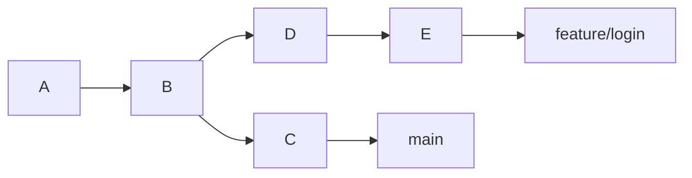
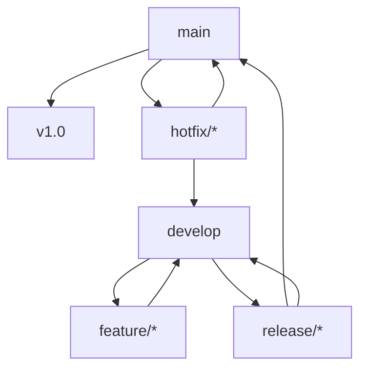
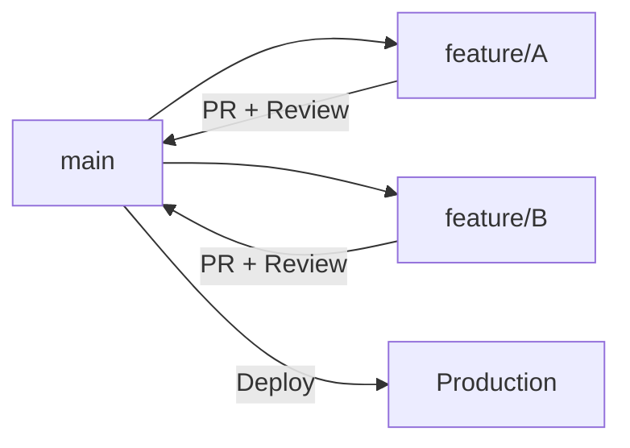

# 1. 分支的核心概念

Git 分支本质上是指向某个 commit 的可移动指针。创建分支并不会复制整个项目，只是创建一个新的引用。



> [!summary]
> 分支用于隔离不同开发线：新功能、Bug 修复、发布准备、实验代码都可以放在独立分支中完成。

# 2. 分支基础操作

## 2.1 创建与切换

现代 Git 推荐使用 `git switch` 处理分支切换，语义比 `checkout` 更清晰。

| 操作 | 传统命令 | 推荐命令 |
|---|---|---|
| 查看分支 | `git branch` | `git branch` |
| 创建分支 | `git branch <name>` | `git branch <name>` |
| 切换分支 | `git checkout <name>` | `git switch <name>` |
| 创建并切换 | `git checkout -b <name>` | `git switch -c <name>` |
| 基于提交创建 | `git checkout -b <name> <commit>` | `git switch -c <name> <commit>` |

```bash
git branch -a
git branch -vv
git switch main
git switch -c feature/login
git switch -c fix/bug-101 9309c5e
```

## 2.2 分支命名

| 前缀 | 用途 | 示例 |
|---|---|---|
| `feature/` | 新功能 | `feature/login` |
| `fix/` | Bug 修复 | `fix/issue-101` |
| `docs/` | 文档 | `docs/api-update` |
| `refactor/` | 重构 | `refactor/db-layer` |
| `release/` | 发布准备 | `release/v1.2.0` |
| `hotfix/` | 紧急线上修复 | `hotfix/crash-on-start` |

> [!tip]
> 统一前缀能让 Git GUI、GitHub、GitLab 更好地折叠和归类分支。

## 2.3 基于历史提交操作

| 目标 | 命令 | 风险 |
|---|---|---|
| 临时查看历史 | `git checkout <commit>` | 进入 Detached HEAD |
| 基于历史继续开发 | `git switch -c <new> <commit>` | 安全 |
| 丢弃后续提交 | `git reset --hard <commit>` | 高风险 |

```bash
git switch -c fix/ghost-logic 9309c5e
```

> [!warning]
> 在 Detached HEAD 状态下直接提交，提交不属于任何分支。若要修改历史版本，先创建新分支。

## 2.4 删除分支

```bash
# 删除已合并本地分支
git branch -d <branch_name>

# 强制删除本地分支
git branch -D <branch_name>

# 删除远程分支
git push origin --delete <branch_name>

# 清理本地失效远程引用
git fetch --prune
```

删除前检查：

```bash
git branch --merged
git branch --no-merged
```

# 3. 合并策略

## 3.1 三种合并方式

| 方式 | 命令 | 历史形态 | 是否重写提交 | 适用场景 |
|---|---|---|---|---|
| Fast-forward | `git merge feature` | 线性 | 否 | 主分支无新提交 |
| No-ff merge | `git merge --no-ff feature` | 保留分支节点 | 否 | 团队协作、保留功能边界 |
| Rebase | `git rebase main` | 线性 | 是 | 个人分支整理 |

```bash
# 合并 feature/login 到 main
git switch main
git merge feature/login
```

## 3.2 Fast-forward

当目标分支没有新的独立提交时，Git 只需移动分支指针。

```text
main:    A---B
feature:     C---D

merge 后:
main:    A---B---C---D
```

优点是历史简洁，缺点是看不出功能分支曾经存在。

## 3.3 No-ff Merge

`--no-ff` 强制生成 merge commit。

```bash
git merge --no-ff feature/login -m "merge: feature/login"
```

适合团队项目，因为能清楚保留“某个功能整体合入”的节点。

## 3.4 Rebase

Rebase 会把当前分支的提交复制到目标分支最新提交之后。

```bash
git switch feature/login
git rebase main
```

交互式整理提交：

```bash
git rebase -i HEAD~3
```

> [!warning]
> ==永远不要对已推送到公共分支的提交随意 rebase。== Rebase 会重写 commit hash，导致协作者的历史与你的历史分叉。

# 4. 冲突处理

## 4.1 冲突产生原因

合并或 rebase 时，如果两个分支修改了同一文件的同一区域，Git 无法自动判断保留哪一边，就会产生冲突。

## 4.2 解决流程

```bash
# 1. 查看冲突文件
git status

# 2. 编辑文件，处理冲突标记
# <<<<<<< HEAD
# 当前分支内容
# =======
# 合入分支内容
# >>>>>>> feature/login

# 3. 标记已解决
git add <file>

# 4. 完成操作
git commit            # merge 场景
git rebase --continue # rebase 场景
```

## 4.3 减少冲突

| 实践 | 作用 |
|---|---|
| 缩短分支生命周期 | 减少长期偏离主线 |
| 拆分小功能 | 降低多人修改同一区域的概率 |
| 频繁同步主分支 | 早发现冲突 |
| 使用 `.gitattributes` | 为特殊文件配置合并策略 |
| 提交前运行测试 | 避免把冲突解决成逻辑错误 |

# 5. 分支管理模型

## 5.1 Git Flow

Git Flow 适用于有明确版本周期、需要多版本维护的项目。



| 分支 | 来源 | 合并目标 | 生命周期 |
|---|---|---|---|
| `main` | 无 | 无 | 永久 |
| `develop` | `main` | 无 | 永久 |
| `feature/*` | `develop` | `develop` | 临时 |
| `release/*` | `develop` | `main` + `develop` | 临时 |
| `hotfix/*` | `main` | `main` + `develop` | 临时 |

适合：

- 桌面应用
- SDK / 库
- 有计划发布周期的产品
- 需要维护多个线上版本的项目

## 5.2 GitHub Flow

GitHub Flow 更轻量，以 `main` + feature 分支 + PR 为核心。



核心规则：

1. `main` 始终可部署。
2. 所有开发从 `main` 切出短生命周期分支。
3. 通过 PR 合并。
4. 自动化测试通过后部署。

适合 Web 应用、SaaS、个人项目和中小团队。

## 5.3 GitLab Flow

GitLab Flow 在 GitHub Flow 基础上加入环境或发布分支。

| 变体 | 流程 | 适用场景 |
|---|---|---|
| Environment-based | `main` → `staging` → `production` | 多环境验证 |
| Release-based | `main` → `release/*` | 多版本维护 |

适合有预发环境、灰度环境或多版本维护需求的团队。

## 5.4 Trunk-Based Development

主干开发强调所有人频繁集成到主干，分支生命周期极短。

| 实践 | 说明 |
|---|---|
| 小批量提交 | 每次提交尽量小 |
| Feature Flag | 未完成能力用开关隐藏 |
| 强 CI | 主干必须随时可发布 |
| 短分支 | 分支通常不超过 1 天 |

适合工程成熟度高、自动化测试完备、交付节奏快的团队。

## 5.5 模型选型

| 条件 | 推荐模型 |
|---|---|
| 个人项目或小团队 | GitHub Flow |
| Web 产品且需要多环境 | GitLab Flow |
| 有计划发布和版本维护 | Git Flow |
| CI/CD 成熟且追求快速集成 | Trunk-Based Development |

# 6. 实战场景

## 6.1 新功能开发

```bash
git switch main
git pull --rebase
git switch -c feature/inventory

# 开发完成后
git add -p
git commit -m "feat: add inventory layout"
git push -u origin feature/inventory
```

## 6.2 紧急修复打断当前开发

```bash
# 保存当前进度
git stash push -u -m "WIP: inventory ui"

# 切换并修复
git switch main
git pull --rebase
git switch -c fix/issue-101

# 修复完成
git add -p
git commit -m "fix: correct potion healing value"
git push -u origin fix/issue-101
```

回到原任务：

```bash
git switch feature/inventory
git stash pop
```

更适合长期并行任务的方式见 [[06_Git_Worktree_多工作区管理]]。

## 6.3 合并分支到主线

```bash
git switch main
git pull --rebase
git merge --no-ff feature/inventory
git push origin main
git branch -d feature/inventory
git push origin --delete feature/inventory
```

## 6.4 分支重命名并修正远程追踪

```bash
# 本地重命名
git branch -m old-name new-name

# 推送新分支并建立 upstream
git push -u origin new-name

# 删除远程旧分支
git push origin --delete old-name

# 清理本地远程引用
git fetch --prune
```

如果 `git branch -vv` 显示 ahead/behind 异常，重新设置 upstream：

```bash
git branch -u origin/new-name new-name
```

# 7. 最佳实践与易错点

## 7.1 最佳实践

| 实践 | 说明 |
|---|---|
| 开发前确认当前分支 | `git branch --show-current` |
| 基于最新主分支创建分支 | 降低合并冲突 |
| 保持分支短生命周期 | 尽早集成 |
| 用 PR/MR 合并 | 引入评审和 CI |
| 保护主分支 | 禁止直接推送和强推 |
| 合并后清理分支 | 降低分支列表噪音 |

## 7.2 易错点

> [!warning]
> 常见错误：
>
> - 在错误分支上开发：先 `git stash`，切换正确分支后再 `stash pop`。
> - 对公共分支 rebase：会破坏协作者历史。
> - 强制推送到 `main`：可能覆盖团队提交。
> - 合并后忘记推送：本地历史和远程历史不一致。
> - 重命名分支后忘记修正 upstream：`ahead/behind` 显示异常。

# 8. 总结

> [!summary]
> 分支管理的关键是控制变更隔离和集成节奏。个人分支可以用 rebase 整理历史；公共分支应优先使用 merge 或 PR 流程保护协作历史。模型选择不必追求复杂，能稳定支撑团队发布节奏才是重点。
