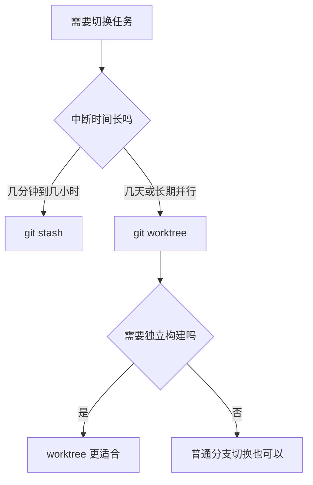

# 1. Worktree 的作用

`git worktree` 允许一个仓库同时拥有多个工作区，每个工作区可以检出不同分支。

```text
repo/.git
  |
  +-- repo-main/       main
  +-- repo-feature/    feature/login
  +-- repo-hotfix/     hotfix/urgent
```

它解决的问题是：**不想频繁 stash 或切换分支，但又需要并行处理多个任务**。

> [!summary]
> Worktree 适合长期并行任务；stash 适合短时间临时切换。

# 2. Worktree 与普通分支切换

| 方式 | 工作区数量 | 适用场景 | 风险 |
|---|---|---|---|
| `git switch` | 1 个 | 顺序处理任务 | 切换前需清理工作区 |
| `git stash` | 1 个 | 临时中断任务 | stash 多了容易混乱 |
| `git worktree` | 多个 | 长期并行开发、紧急修复、版本维护 | 目录增多，需要管理 |

适合使用 worktree 的场景：

- 正在开发功能，突然需要处理 hotfix
- 需要同时维护多个 release 分支
- 需要对比两个分支的构建结果
- 大型项目切换分支成本高
- 不希望频繁 stash 未完成工作

# 3. 基础命令

## 3.1 查看 Worktree

```bash
git worktree list
```

示例：

```text
D:/Dev/project       abc1234 [main]
D:/Dev/project-fix   def5678 [fix/urgent]
```

## 3.2 创建 Worktree 并检出已有分支

```bash
git worktree add ../project-fix fix/urgent
```

含义：

- `../project-fix`：新工作区目录
- `fix/urgent`：要检出的分支

## 3.3 创建 Worktree 并新建分支

```bash
git worktree add -b feature/login ../project-login main
```

含义：

1. 从 `main` 创建 `feature/login`。
2. 将它检出到 `../project-login`。

## 3.4 删除 Worktree

```bash
git worktree remove ../project-fix
```

若工作区有未提交修改，Git 会拒绝删除。确认不需要后才使用强制删除：

```bash
git worktree remove --force ../project-fix
```

> [!warning]
> `--force` 可能丢弃该 worktree 中未保存的工作。执行前先进入目录运行 `git status`。

## 3.5 清理失效记录

如果手动删除了 worktree 目录，Git 可能残留记录：

```bash
git worktree prune
```

# 4. 重要限制

## 4.1 同一个分支不能被多个 Worktree 同时检出

如果 `main` 已在主目录检出，再执行：

```bash
git worktree add ../project-main main
```

Git 会报错，因为同一分支不能在两个工作区同时编辑。

解决方式：

```bash
git worktree add -b experiment/main-copy ../project-main-copy main
```

## 4.2 每个 Worktree 有独立工作区

每个 worktree 拥有独立的：

- 当前分支
- 工作区修改
- 暂存区
- 未跟踪文件

但它们共享同一个 Git 对象数据库，因此不会复制完整历史，空间成本比完整 clone 小。

## 4.3 依赖和构建产物可能需要重新安装

虽然 Git 历史共享，但工作区文件是独立目录。不同项目可能需要重新安装依赖：

```bash
npm install
cmake -S . -B build
```

> [!tip]
> 对大型项目，worktree 目录可以放在同一父目录下，便于共享 IDE 配置、缓存策略和终端路径习惯。

# 5. 推荐目录布局

## 5.1 同级目录布局

```text
D:/Dev/
  project/              main
  project-feature-login/ feature/login
  project-hotfix-101/    hotfix/issue-101
```

创建示例：

```bash
cd D:/Dev/project
git worktree add -b feature/login ../project-feature-login main
git worktree add -b hotfix/issue-101 ../project-hotfix-101 main
```

## 5.2 集中目录布局

```text
D:/Dev/project/
  .git
D:/Dev/project-worktrees/
  feature-login/
  hotfix-101/
```

创建示例：

```bash
git worktree add -b feature/login ../project-worktrees/feature-login main
git worktree add -b hotfix/issue-101 ../project-worktrees/hotfix-101 main
```

> [!tip]
> 推荐使用“同级目录布局”，路径短、IDE 打开方便，也不容易把 worktree 误认为主仓库内部文件。

# 6. 多任务工作流

## 6.1 正在开发功能时处理紧急修复

当前在 `feature/inventory` 开发，突然需要修复线上 Bug。

```bash
# 在主仓库目录中创建 hotfix worktree
git worktree add -b hotfix/issue-101 ../project-hotfix-101 main

# 进入新工作区
cd ../project-hotfix-101

# 修复并提交
git add -p
git commit -m "fix: correct potion healing value"
git push -u origin hotfix/issue-101
```

优势：

- 原来的 `feature/inventory` 工作区不需要 stash。
- hotfix 有独立目录和独立分支。
- 修复完成后可直接删除 worktree。

## 6.2 同时维护多个发布分支

```bash
git worktree add ../project-release-1.2 release/v1.2
git worktree add ../project-release-1.3 release/v1.3
```

适合对不同版本分别构建、测试、修复。

## 6.3 对比分支构建结果

```bash
git worktree add ../project-main main
git worktree add ../project-optimize optimize/render
```

两个目录可以分别运行构建和测试，避免频繁切换分支导致构建缓存混乱。

# 7. 删除与清理流程

## 7.1 合并后删除 Worktree

```bash
# 回到主仓库
cd ../project

# 合并分支
git switch main
git merge --no-ff hotfix/issue-101
git push origin main

# 删除 worktree
git worktree remove ../project-hotfix-101

# 删除本地分支
git branch -d hotfix/issue-101

# 删除远程分支
git push origin --delete hotfix/issue-101
```

## 7.2 检查残留

```bash
git worktree list
git worktree prune
```

# 8. Worktree 与 Stash 的选择



| 场景 | 推荐 |
|---|---|
| 拉取前临时清空工作区 | `git stash` |
| 切换出去修一个小问题 | `git stash` |
| hotfix 与功能开发并行几天 | `git worktree` |
| 多版本维护 | `git worktree` |
| 两个分支都要跑构建 | `git worktree` |

# 9. 常见问题

## 9.1 Worktree 中无法切换到某分支

原因通常是该分支已经在另一个 worktree 中检出。

查看：

```bash
git worktree list
```

解决：

- 切换到另一个未被占用的分支。
- 删除不再需要的 worktree。
- 从目标分支创建新分支。

## 9.2 删除目录后仍显示 Worktree

如果手动删除了目录，运行：

```bash
git worktree prune
```

## 9.3 IDE 打开多个 Worktree 后配置混乱

建议：

- 每个 worktree 使用独立终端。
- IDE 工作区名称包含分支名。
- 不同 worktree 的构建输出写入各自目录。
- 避免把绝对路径写入项目配置。

# 10. 总结

> [!summary]
> `git worktree` 是多任务开发工具，适合 hotfix、长期功能分支、多版本维护和构建对比。短期切换用 stash，长期并行用 worktree；使用后记得 `git worktree list` 检查并清理不再需要的工作区。
