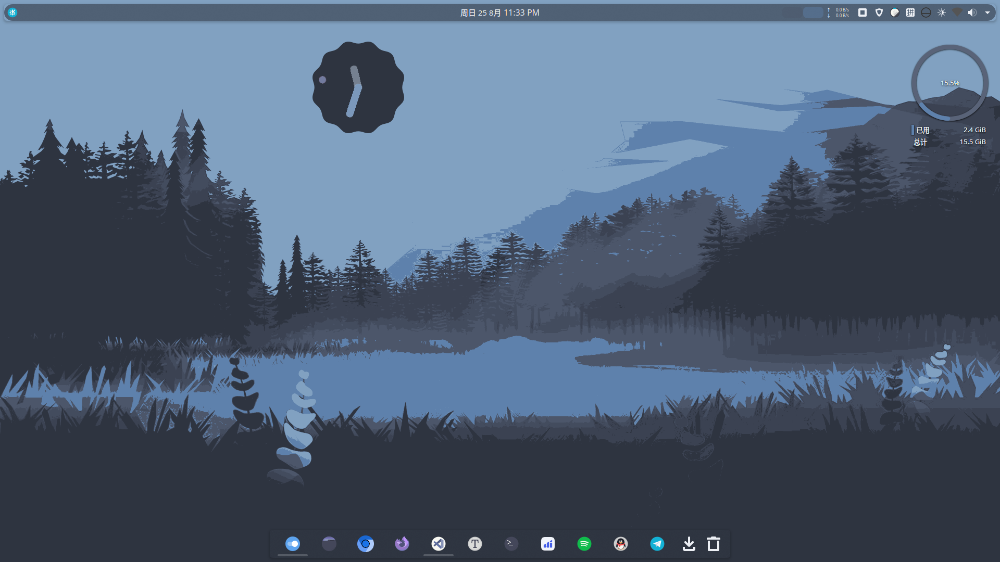
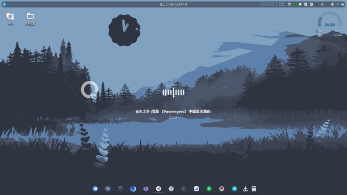

# 1. 安装教程

前提是确保显卡驱动已经安装好，并且执行了 `pacman -Syu` 进行系统更新。

## 1.1 安装显示服务

安装 X11 会话服务：

```bash
sudo pacman -S xorg-server
```

安装 Wayland 会话（推荐）：

```bash
sudo pacman -S wayland xorg-xwayland
```

> [!tip] Wayland vs X11
> KDE Plasma 6 默认优先使用 Wayland 会话，推荐使用 Wayland。`xorg-xwayland` 提供 X11 应用的兼容层，Wayland 会话下仍可运行 X11 应用。如果仅使用 X11，可以不安装 Wayland 相关包。

## 1.2 安装 Plasma 桌面

最小化安装 Plasma 桌面：

```bash
sudo pacman -S plasma-desktop
```

安装必要的组件：

```bash
sudo pacman -S sddm dolphin konsole
```

- `sddm`：KDE 推荐的显示管理器，提供图形化登录界面。无论使用 X11 还是 Wayland 会话，都建议安装。
- `dolphin`：KDE 文件管理器。
- `konsole`：KDE 终端模拟器。

> [!note] 补充组件
> 以下组件可根据需要安装：
> - `plasma-nm`：网络管理组件（通常已作为依赖安装）。
> - `plasma-pa`：音量控制组件。
> - `kde-gtk-config`：GTK 应用主题同步，使 GTK 应用风格与 KDE 一致。
> - `kscreen`：屏幕管理。
> - `powerdevil`：电源管理。

启用 SDDM 登录管理器：

```bash
sudo systemctl enable --now sddm.service
```

> [!info] SDDM 主题配置
> 如何更改 SDDM 主题，请查看 Arch Wiki：[SDDM](https://wiki.archlinuxcn.org/wiki/SDDM)。详见本文 [[#4.3 Login SDDM]] 章节。

## 1.3 安装音频服务

```bash
sudo pacman -S pipewire wireplumber pipewire-pulse pipewire-alsa
```

- `pipewire`：现代音视频服务。
- `wireplumber`：PipeWire 的会话管理器，智能管理音频路由。
- `pipewire-pulse`：为 PulseAudio 提供兼容。
- `pipewire-alsa`：为 ALSA 提供兼容。

对 JACK 应用有要求的话，可以再安装 `pipewire-jack`。

安装 KDE 音频控件：

```bash
sudo pacman -S plasma-pa
```

启用音频服务：

```bash
systemctl --user enable --now pipewire pipewire-pulse wireplumber
```

> [!note] wireplumber
> `wireplumber` 是 PipeWire 推荐的会话管理器，替代了旧的 `pipewire-media-session`。务必安装，否则音频设备可能无法正常工作。

## 1.4 清理孤立包

安装完成后，运行以下命令检查并删除不再需要的孤立包：

```bash
sudo pacman -Qtdq | sudo pacman -Rns -
```

> [!warning] 谨慎操作
> 该命令会删除所有不再被任何包依赖的孤立包。在执行前，建议先运行 `sudo pacman -Qtdq` 查看列表，确认没有误删需要的包。

还有需要的在这基础上补充就行了，这里只提供桌面环境必要的安装。可以参考 Arch Wiki：[KDE](https://wiki.archlinuxcn.org/wiki/KDE)

---

# 2. 针对 X11 的补充

如果只用 X11，又不想安装 SDDM，可以通过下面的方式启动 X11 会话窗口。默认是先进入的 TTY。

创建 `~/.xinitrc` 文件：

```bash
touch ~/.xinitrc
```

添加下面内容（直接执行该命令）：

```bash
echo "exec startplasma-x11" > ~/.xinitrc
```

然后启动 Plasma：

```bash
startx
```

> [!warning] Wayland 不支持 startx
> `startx` 仅适用于 X11 会话。Wayland 会话需要通过显示管理器（如 SDDM）启动，不支持通过 `startx` 启动。~~可以添加 `exec startplasma-wayland` 来使得启动的会话窗口是 Wayland~~（此方式已不推荐）。

---

# 3. 卸载多余的图标和鼠标

使用下面的指令可以列出已安装的图标主题：

```bash
pacman -Q | grep icon
```

比如输出是：

```bash
breeze-icons 5.24.5-1
papirus-icon-theme 20211029-1
hicolor-icon-theme 0.17-2
```

使用下面的指令可以列出已安装的鼠标主题：

```bash
pacman -Q | grep cursor
```

比如输出：

```bash
breeze-cursor-theme 5.24.5-1
xcursor-breeze 1.0.3-1
adwaita-icon-theme 3.38.0-1
```

卸载不需要的图标或鼠标主题：

```bash
sudo pacman -Rns <包名>
```

> [!caution] 注意依赖关系
> 卸载前请确认该主题不被其他包依赖。`breeze-icons` 和 `breeze-cursor-theme` 是 KDE 的默认主题，卸载可能导致界面显示异常，建议保留。

---

# 4. 美化

> [!important] Plasma 6 兼容性
> 下载的主题和组件的版本需要是 **Plasma 6** 的，作者一般会说明。Plasma 5 的主题和组件不兼容 Plasma 6。

## 4.1 全局主题

建议去 [KDE Store](https://store.kde.org/) 下载主题，然后把下载的 **全局主题** 解压后，放到 `~/.local/share/plasma/look-and-feel` 目录下。

壁纸和全局主题推荐 `Utterly Nord`，图标推荐 `Dracula Circle`。

参考图：


> [!tip] 应用全局主题
> 安装主题后，打开 **系统设置** → **外观** → **全局主题**，选择新安装的主题并点击 **应用** 即可。

## 4.2 组件

- [musicWaves](https://store.kde.org/p/2186442)
- [thot CPU Plasma 6](https://www.pling.com/p/2148472/)

解压后，把文件夹移动到 `~/.local/share/plasma/plasmoids/` 目录下。

参考图：


> [!tip] 添加桌面组件
> 右键桌面 → **添加部件**，在部件列表中搜索已安装的组件，拖拽到桌面或面板上即可。

## 4.3 Login SDDM

建议先在 KDE Store 下载好 SDDM 主题，然后解压到存放登录界面的目录下。

推荐主题：[Nordic sddm Plasma 6](https://www.pling.com/p/2144235/)

把解压后的文件夹移到 `/usr/share/sddm/themes/` 目录下：

```bash
sudo cp -r <解压后的主题文件夹> /usr/share/sddm/themes/
```

然后配置 SDDM 使用新主题。编辑 `/etc/sddm.conf`（如果不存在则创建）：

```ini
[Theme]
Current=Nordic
```

> [!note] 也可以通过系统设置配置
> 打开 **系统设置** → **外观** → **登录界面（SDDM）**，可以直接选择已安装的主题并预览。这种方式会自动修改 `/etc/sddm.conf`。

---

# 5. 推荐应用

以下为 KDE 桌面下的推荐应用：

| 类别 | 应用 | 说明 |
|------|------|------|
| 终端 | `konsole` | KDE 终端模拟器 |
| 文件管理 | `dolphin` | KDE 文件管理器 |
| 文本编辑 | `kate` | KDE 高级文本编辑器 |
| 图片查看 | `gwenview` | KDE 图片查看器 |
| 视频播放 | `haruna` | 基于 mpv 的视频播放器 |
| PDF 阅读 | `okular` | KDE 文档查看器 |
| 压缩解压 | `ark` | KDE 压缩解压缩工具 |
| 计算器 | `kcalc` | KDE 计算器 |
| 系统监控 | `ksystemlog` / `plasma-systemmonitor` | 系统日志与资源监控 |

> [!tip] Flatpak 安装
> 推荐使用 Flatpak 安装用户级应用，避免系统包依赖冲突。详见 [[Flatpak_教程]]。

---

# 6. 常见问题

## 6.1 Wayland 下输入法不工作

如果在 Wayland 会话下输入法无法正常工作，请确保安装了 `fcitx5` 或 `ibus` 的 Wayland 支持，并正确设置了环境变量。详见 [[EndeavourOS_安装教程#4.1 中文输入法配置]]。

## 6.2 GTK 应用外观不一致

KDE 下 GTK 应用可能看起来与 KDE 原生应用风格不同。安装 `kde-gtk-config` 并在 **系统设置** → **外观** → **配置 GNOME/GTK 应用样式** 中同步主题。

## 6.3 屏幕分辨率/缩放问题

KDE Plasma 6 在 Wayland 下支持分数缩放（如 125%、150%）。在 **系统设置** → **显示与监视器** 中设置。X11 下仅支持整数缩放，可配合 `xrandr` 实现分数缩放。
