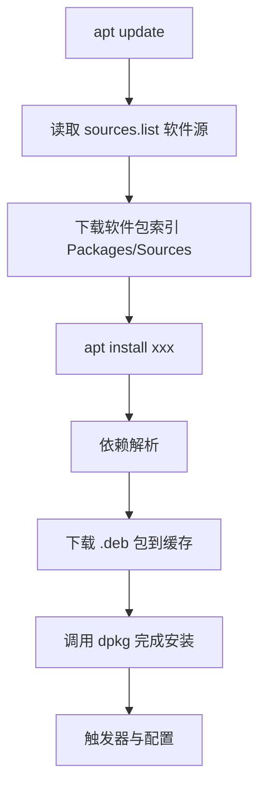
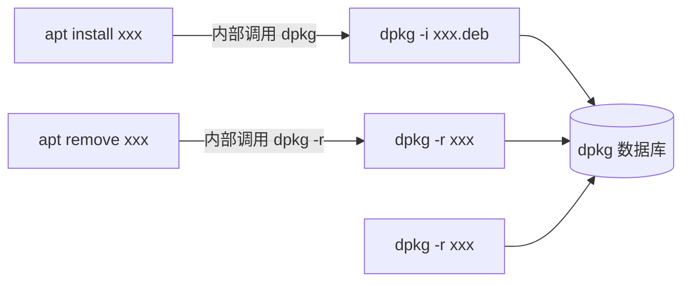

# 1. Debian Server 安装目标

## 1.1 适用场景

本文记录的是在 **VMware 虚拟机中安装 Debian Server** 的完整思路，目标是得到一个无桌面环境、资源占用低、适合长期学习和开发实验的 Linux 系统。

适合的学习与开发场景包括：

- Linux 基础命令与系统管理
- Shell 脚本与服务管理
- C/C++ 编译、调试与网络编程
- Git、SSH、远程开发环境
- Docker、服务部署与服务器运维实验

## 1.2 最终系统形态

推荐安装完成后的系统形态如下：

| 项目 | 建议状态 | 说明 |
|---|---|---|
| 桌面环境 | 不安装 | 保持服务器环境简洁，减少资源占用 |
| SSH Server | 安装 | 方便远程登录、VS Code Remote SSH、文件传输 |
| 标准系统工具 | 安装 | 保留 Debian 基础命令和常用管理工具 |
| 开发工具链 | 安装后手动配置 | 避免安装阶段引入过多无关软件 |
| 软件源 | 使用官方源或可靠镜像源 | 保证安全更新和依赖稳定 |

> [!summary]
> Debian Server 的核心思路是：**系统安装阶段尽量小，初始化阶段按需补齐工具链**。这样既接近真实服务器环境，也便于学习 Linux 的软件包、权限、网络和服务管理机制。

---

# 2. Debian 安装镜像选择

## 2.1 镜像仓库

> [!note]
> 点击直达：[Debian amd64 最新版镜像仓库](https://cdimage.debian.org/debian-cd/current/amd64/)
> 点击直达：[Debian 历史版本镜像仓库](https://cdimage.debian.org/mirror/cdimage/archive/)

如图所示：

![[imgs/Debian_教程/01.png]]

这些目录分别存放不同类型的安装介质、校验文件和日志。对于普通用户来说，**真正需要关心的只有 `iso-cd/` 和 `iso-dvd/`**，其他大部分目录都是为了特殊用途或镜像维护准备的。

Debian 官方常见安装介质主要有以下几类：

| 镜像类型 | 特点 | 适合场景 |
|---|---|---|---|
| `netinst`（在 `iso-cd` 目录下） | 体积小，只包含安装器和少量基础组件，安装时联网下载软件包 | 网络稳定、希望安装最新软件包 |
| `DVD-1`（在 `iso-dvd` 目录下）| 体积较大，包含较多基础软件包，可降低安装阶段对网络的依赖 | 网络不稳定、希望**离线**或半离线安装 |
| `Live ISO` | 可直接启动图形桌面环境，通常包含 GNOME、KDE、XFCE 等桌面 | 体验桌面系统、救援、**临时使用** |

> [!note] Live ISO 的定位
>
>Live ISO 文件名通常类似：
>
> ```text
> debian-live-13.x.x-amd64-gnome.iso
> debian-live-13.x.x-amd64-kde.iso
> debian-live-13.x.x-amd64-xfce.iso
> ```
>
> 这类镜像可以直接进入一个可用的图形桌面系统，适合体验 Debian 桌面环境或**临时救援系统**。它并不是服务器最优先的安装介质，因为它的默认内容更偏向桌面使用，容易让初学者在安装时混入不需要的桌面组件。

---

# 3. VMware 虚拟机配置

## 3.1 推荐硬件配置

用于 Linux 学习、C/C++ 开发、Docker 实验的虚拟机可以按下表配置：

| 配置项 | 推荐值 | 说明 |
|---|---:|---|
| CPU | 2 到 4 核 | 编译、Docker 和多服务实验建议 4 核 |
| 内存 | 4 GB | 最低可用 2 GB，但开发环境会偏紧 |
| 磁盘 | 40 到 60 GB | 建议使用单文件或自动扩展虚拟磁盘 |
| 网络 | NAT | 便于共享宿主机网络，也能被宿主机 SSH 访问 |
| 固件 | UEFI | 更贴近现代系统默认启动方式 |
| ISO | `netinst` 或 `DVD-1` | 根据网络条件选择 |

## 3.2 网络模式建议

VMware 常见网络模式对比如下：

| 网络模式 | 特点 | 建议 |
|---|---|---|
| NAT | 虚拟机通过宿主机访问外网，配置简单 | 初学和开发实验优先选择 |
| Bridged | 虚拟机直接接入局域网，像一台独立主机 | 需要局域网其他设备访问时使用 |
| Host-only | 仅宿主机与虚拟机互通，默认不能访问外网 | 隔离实验环境时使用 |

> [!tip]
> 如果目标是通过宿主机连接 Debian 虚拟机，NAT 模式通常已经足够。后续只需要在 Debian 中安装 SSH Server，并确认虚拟机 IP 地址即可。

---

# 4. Debian 安装过程关键选项

## 4.1 安装器选择

启动安装镜像后，常见入口如下：

![[imgs/Debian_教程/02.png]]

服务器安装推荐选择 **Install**（TUI 模式），原因是文本安装器更轻量，流程清晰，也更接近服务器环境的传统安装方式。**Graphical install**（GUI 模式）只是图形化安装界面，并不等于一定会安装桌面环境；真正决定是否安装桌面的是后续的 **Software Selection**。

## 4.2 分区

一般我只设置两个挂载点，分别是 `/boot/efi`（用于**引导分区**，大小设置为 512MB）和 `/`（用于**根分区**，除引导分区的剩余所有空间）这两个目录，至于 Swap 分区，可以通过后续在系统中设置 Swap file 来实现。

引导分区配置：

![[imgs/Debian_教程/03.png]]

界面中的几个选项含义如下：

1. **名称（Name）**：这是分区的标签（Label）。例如你可以给它起名：EFI、ESP 或 BOOT 等。这个名字主要是给人看的，对系统启动影响不大。

2. **用于：EFI 系统分区（Use as: EFI System Partition）**：表示这个分区将被格式化为 EFI System Partition（ESP），用于存放 UEFI 启动文件。里面会保存类似：`/EFI/debian/grubx64.efi`这样的启动文件。对于现代电脑和 VMware 的 UEFI 模式，必须有这个分区。

3. **可启动标志：关（Bootable flag: Off）**：在 传统 BIOS + MBR 分区表中，需要设置“可启动（bootable）”标志，BIOS 会从带这个标志的分区启动。但现在一般是 UEFI 启动 + GPT 分区表，这种情况下“可启动标志”基本没有意义。因为 UEFI 固件会直接识别 EFI System， Partition。所以保持“关（Off）”即可，不要改成“开”。

4. **删除此分区（Delete the partition）**：表示删除当前这个 EFI 分区，一般只有分区划错了才会用。

5. **分区设定结束（Done setting up the partition）**：表示当前这个 EFI 分区已经配置完成。选择它后，会返回上一级分区界面。

## 4.3 Software Selection

安装过程中的 **Software Selection** 是决定系统形态的关键步骤。

![[imgs/Debian_教程/04.png]]

如果目标是无桌面 Debian Server，应取消选择和 GUI 桌面相关的：

```text
Debian desktop environment
GNOME
KDE Plasma
XFCE
LXQt
Cinnamon
MATE
```

建议仅保留：

```text
SSH server
standard system utilities
```

这样安装完成后得到的是：无 GUI、无桌面环境、有基础系统工具、可通过 SSH 远程管理、更接近生产服务器和云服务器环境。

> [!note] Choose a Debian Blend for installation
>
> **Debian Blend（Debian 定制发行方向）**。它会安装针对某一领域的大量软件包。例如：
>
> * Debian Edu（教育）
> * Debian Science（科研）
> * Debian Med（医疗）
> * Debian GIS（地理信息）
> * Debian Multimedia（多媒体）
>
> 一般个人用户和开发者**不需要**管这个。

---

# 5. 软件仓库配置

> [!tip]
> 见：[MirrorZ Help Debian 软件源](https://help.mirror.nju.edu.cn/debian/)。

## 5.1 Components 含义

Debian 软件源中的 `Components` 决定启用哪些软件仓库组件：

| 组件 | 含义 | 说明 |
|---|---|---|
| `main` | 完全符合 Debian 自由软件准则的软件 | 默认核心仓库，应始终启用 |
| `contrib` | 软件本身自由，但依赖非自由组件 | 按需启用 |
| `non-free` | 不完全符合 Debian 自由软件准则的软件 | 固件、驱动或部分工具可能需要 |
| `non-free-firmware` | 非自由固件 | 新版本 Debian 将固件单独拆分，常用于硬件支持 |

学习和虚拟机开发环境中，通常可以启用：

```text
main contrib non-free non-free-firmware
```

这样可以减少安装驱动、固件或常用工具时的包缺失问题。

## 5.2 Debian 软件仓库说明

1. **常见仓库分类**

| 仓库 | 是否官方 | 主要作用 | 使用建议 |
|---|---|---|---|
| Debian Repository | 官方 | 主软件仓库，提供绝大多数系统软件 | 必须启用 |
| Debian Security | 官方 | 安全更新 | 必须启用 |
| Debian Backports | 官方 | 将较新版本软件回移植到稳定版 | 按需启用 |
| Debian ELTS | 扩展长期支持 | 为已结束常规支持的旧版本提供安全维护 | 企业旧系统按需 |
| Deb Multimedia | 第三方 | 多媒体编解码器和相关软件 | 音视频场景谨慎使用 |
| Debian CN | 第三方社区 | 中文软件、输入法、字体等 | 一般不必启用 |

Debian Repository 是系统最主要的软件来源，提供：GCC、Git、Python、CMake 等相关组件中的部分包；Debian Security 提供安全补丁，其更新速度更快。

> [!warning]
> 服务器环境必须保留安全更新源。禁用安全源会增加已知漏洞长期存在的风险。

## 5.3 DVD 光盘源问题

使用 DVD 镜像安装 Debian 后，APT 可能自动保留 DVD 光盘源。后续执行安装或更新命令时，可能出现：

```text
Media change: please insert the disc labeled ...
```

或：

```text
Err: cdrom://...
```

原因是系统的软件源配置中仍然存在类似条目：

```text
deb cdrom:[Debian GNU/Linux ...]
```

APT 认为 DVD 仍然是一个可用的软件源，因此会尝试从虚拟光驱读取软件包。

搜索所有 APT 配置中的光盘源：

```bash
grep -R "cdrom" /etc/apt/
```

如果在 `/etc/apt/sources.list` 或 `/etc/apt/sources.list.d/` 中发现 `cdrom` 条目，应删除或注释掉对应内容。

处理完成后重新更新索引：

```bash
sudo apt update
```

> [!warning]
> 切换到网络镜像源后，应移除 DVD 光盘源。否则 APT 可能在安装软件时反复要求插入安装光盘。

---

# 6. sudo 权限配置

最小化安装后，一般是没有 `sudo` 命令的，因此需要先切换到 root 用户来安装 sudo 命令。

切换到 root 用户：

```bash
su -
```

安装：

```bash
sudo apt install sudo
```

将普通用户加入 `sudo` 组，比如这里我设置的用户名为 `sky`：

```bash
usermod -aG sudo sky
```

确认用户组：

```bash
groups sky
```

退出当前登录会话后重新登录，再检查当前用户组：

```bash
groups
```

应包含 `sudo`。

> [!warning]
> `usermod -aG sudo sky` 中的 `-aG` 不要写错。`-a` 表示追加用户组，`-G` 表示设置附加组。如果漏掉 `-a`，可能覆盖用户原有附加组。

---

# 7. 开发环境搭建

Debian Server 最小化安装默认不会提供完整开发环境。以下命令没有输出通常是正常现象：

```bash
which gcc
which g++
which make
which cmake
```

这说明对应工具尚未安装，而不是系统安装失败。

## 7.1 安装工具链

初始化开发环境可以安装：

```bash
sudo apt update

sudo apt install -y \
    build-essential \
    cmake \
    gdb \
    git \
    vim \
    curl \
    wget \
    tree \
    htop \
    unzip \
    zip \
    python3 \
    python3-pip \
    python-is-python3 \
    pkg-config
```

常用软件包说明：

| 软件包 | 作用 |
|---|---|
| `build-essential` | 安装 GCC、G++、Make、libc 开发头文件等基础编译工具 |
| `cmake` | C/C++ 项目常用构建系统 |
| `gdb` | C/C++ 调试器 |
| `git` | 版本控制工具 |
| `vim` | 终端编辑器 |
| `curl` / `wget` | 网络下载与接口测试工具 |
| `tree` | 目录结构查看工具 |
| `htop` | 交互式进程查看工具 |
| `python3` | Python 3 解释器 |
| `python3-pip` | Python 包管理工具 |
| `python-is-python3` | 让 `python` 命令指向 `python3` |
| `pkg-config` | 查询编译和链接参数，常用于 C/C++ 依赖管理 |

## 7.2 Python 命令说明

Debian 默认以 Python 3 为主，系统中通常有：

```bash
python3
```

但不一定有：

```bash
python
```

如果希望 `python` 命令直接执行 Python 3，可以安装：

```bash
sudo apt install python-is-python3
```

> [!warning]
> 不建议手动用软链接随意覆盖系统 Python 路径。优先使用发行版提供的 `python-is-python3`，这样更符合 Debian 的包管理约定。

---

# 8. Debian 包管理体系

## 8.1 分层结构

Debian 并不是只有 `apt` 一个工具，而是采用**分层**的软件包管理体系。理解这一分层是后续掌握每条命令职责的前提。

```text
+---------------------------------------------------+
|  用户层：apt / apt-get / apt-cache / apt-mark / aptitude
+---------------------------------------------------+
|            APT 软件包管理系统（依赖解析、源管理）
+---------------------------------------------------+
|                   dpkg（本地包操作）
+---------------------------------------------------+
|                 .deb 软件包文件格式
+---------------------------------------------------+
```

各层职责划分：

| 层级 | 名称 | 职责 | 是否联网 |
|---|---|---|---|
| 文件层 | `.deb` | Debian 软件包文件格式，包含二进制、配置、元信息 | — |
| 底层工具 | `dpkg` | 本地安装、卸载、查询 `.deb` 包 | 否 |
| 管理系统 | APT | 软件源管理、索引下载、依赖解析、调用 `dpkg` | 是 |
| 前端命令 | `apt` / `apt-get` / `apt-cache` / `apt-mark` / `aptitude` | 面向用户或脚本的命令入口 | 是 |

> [!summary]
> ==APT 不是 dpkg 的替代品，而是 dpkg 的上层依赖管理系统==。所有 APT 命令最终都会调用 `dpkg` 完成实际的安装与卸载。

## 8.2 dpkg

`dpkg` 是 **Debian Package** 的缩写，是整个 Debian 包管理体系的最底层工具，直接操作本地 `.deb` 文件，不联网、不解析依赖。

### 8.2.1 安装与卸载

```bash
# 安装一个本地 .deb 包
sudo dpkg -i code_1.106.2_amd64.deb

# 一次性安装多个包
sudo dpkg -i pkg1.deb pkg2.deb pkg3.deb

# 卸载软件包（保留配置文件）
sudo dpkg -r git

# 卸载软件包（同时删除配置文件）
sudo dpkg -P git
```

| 选项 | 作用 |
|---|---|
| `-i` | install，安装指定 `.deb` 包 |
| `-r` | remove，卸载软件包但保留配置 |
| `-P` | purge，卸载软件包并清除配置 |
| `-L` | 列出软件包安装的所有文件路径 |
| `-l` | 列出系统中所有已安装的软件包 |
| `-S` | 反向查询某个文件属于哪个软件包 |
| `-s` | 显示软件包的详细状态信息 |

### 8.2.2 查询已安装软件包

```bash
# 列出系统中所有已安装的软件包
dpkg -l

# 在已安装列表中过滤查找某个包
dpkg -l | grep gcc

# 查看某个包是否安装
dpkg -l | grep -E "^ii  nginx"
```

输出字段含义：

```text
Desired=Unknown/Install/Remove/Purge/Hold
| Status=Not/Inst/Conf-files/Unpacked/halF-conf/Half-inst/trig-aWait/Trig-pend
|/ Err?=(none)/Reinst-required (Status,Err: uppercase=bad)
||/ Name           Version      Architecture Description
+++-==============-============-============-===================
ii  gcc            4:14.2.0-1   amd64        GNU C compiler
```

- 第一列 `ii` 表示 **期望状态 = install，实际状态 = installed**。
- 第二列 `rc` 表示已卸载但配置文件残留（removed but config-files remain）。

### 8.2.3 查询文件归属

```bash
# 查询 nginx 包安装了哪些文件
dpkg -L nginx

# 反向查询 /usr/bin/git 属于哪个软件包
dpkg -S /usr/bin/git

# 查询某个软件包的详细状态
dpkg -s gcc
```

### 8.2.4 依赖缺失与修复

`dpkg` 不会主动从网络下载依赖，因此直接安装含有外部依赖的 `.deb` 包时经常报错：

```text
dpkg: dependency problems prevent configuration of code:
 code depends on libsecret-1-0; however:
  Package libsecret-1-0 is not installed.
```

此时应交由 APT 修复：

```bash
# 让 APT 自动下载并安装缺失依赖
sudo apt -f install
```

> [!warning]
> `dpkg -i` 安装失败后，包可能处于 **unpacked but not configured** 的中间状态。必须执行 `sudo apt -f install` 或 `sudo dpkg --configure -a` 才能完成配置或回滚。

### 8.2.5 dpkg 的特点

- 可以直接安装本地 `.deb` 包，**不需要网络**。
- 可以查询系统已安装软件包及文件归属。
- ==不会主动解析和下载依赖==，缺失依赖需手动或交由 APT 修复。
- 适合离线环境、批量分发、精确查询场景。

## 8.3 APT

APT（**Advanced Package Tool**）是建立在 `dpkg` 之上的高级包管理系统，负责完整的软件包生命周期管理。

### 8.3.1 APT 工作流程

APT 在执行一次安装时的完整流程如下：



### 8.3.2 APT 的核心职责

| 职责 | 说明 |
|---|---|
| 读取软件源 | 解析 `/etc/apt/sources.list` 与 `/etc/apt/sources.list.d/*.list` |
| 下载索引 | 同步远程仓库的软件包清单 |
| 依赖解析 | 自动计算需要安装、升级或移除的依赖链 |
| 下载包 | 将 `.deb` 下载到 `/var/cache/apt/archives/` |
| 调用 dpkg | 交由 `dpkg` 完成实际安装与配置 |

### 8.3.3 使用 APT 安装本地 .deb

现代 Debian 推荐使用 APT 而非 `dpkg -i` 直接安装本地 `.deb` 包：

```bash
# 推荐写法：APT 会自动解析并下载依赖
sudo apt install ./code_1.106.2_amd64.deb
```

> [!warning]
> `./` ==绝不能省略==。若直接写 `sudo apt install code_1.106.2_amd64.deb`，APT 会把整串当作软件包名去仓库中查找，而非当作本地文件处理。

> [!tip]
> 可将 `apt install ./xxx.deb` 理解为：==先 dpkg 解析包结构 → APT 拉取依赖 → dpkg 完成安装==，相比 `dpkg -i` 加 `apt -f install` 的两步操作，它一次性完成。

### 8.3.4 dpkg 与 APT 的互通性

> [!question]
> 通过 `dpkg -i` 安装的软件包，可以用 `apt` 卸载吗？

**结论**：==可以==。无论软件包是通过 `dpkg -i` 还是 `apt install` 安装的，最终都会登记到同一个 dpkg 数据库中，APT 在卸载时读取的就是这个数据库。

#### 原理：dpkg 数据库是唯一真相源

Debian 系统中所有已安装的软件包信息都记录在 `/var/lib/dpkg/status` 文件中，这个文件被称为 **dpkg 数据库**。所有包管理工具都围绕它工作：



关键事实：

- `apt install` 内部本身就是调用 `dpkg -i` 完成安装。
- `apt remove` 内部调用的是 `dpkg -r`。
- 三者（dpkg、apt、apt-get）共享同一个 dpkg 数据库。
- ==包的安装来源对卸载流程完全透明==。

#### 完整示例：以 VS Code 安装与卸载为例

假设从官网下载了 VS Code 的 `.deb` 安装包，先用 dpkg 安装：

```bash
# 1. 使用 dpkg 直接安装
sudo dpkg -i code_1.106.2_amd64.deb
```

如果安装时缺少依赖，可能报错：

```text
dpkg: dependency problems prevent configuration of code:
 code depends on libsecret-1-0; however:
  Package libsecret-1-0 is not installed.
```

修复依赖后，包已被登记到 dpkg 数据库：

```bash
sudo apt -f install
```

此时通过 dpkg 数据库查询，能看到 `code` 包的安装状态：

```bash
dpkg -l | grep code
# 输出：ii  code  1.106.2  amd64  Visual Studio Code
```

此时**任意一种方式**都能成功卸载该包：

```bash
# 方式 1：用 apt 卸载（保留配置文件）
sudo apt remove code

# 方式 2：用 apt 卸载（同时清除配置文件）
sudo apt purge code

# 方式 3：用 dpkg 卸载（保留配置文件）
sudo dpkg -r code

# 方式 4：用 dpkg 卸载（同时清除配置文件）
sudo dpkg -P code

# 方式 5：用 apt-get 卸载（适合脚本场景）
sudo apt-get remove code
```

五种命令最终都调用 `dpkg -r` 或 `dpkg -P`，效果完全一致。

#### 一个小差异：自动/手动安装标记

虽然卸载没有差异，但 `apt autoremove` 的行为会因安装方式不同而有所区别：

| 安装方式 | 默认标记 | `apt autoremove` 是否清理 |
|---|---|---|
| `dpkg -i xxx.deb` | manual（手动） | 否 |
| `apt install xxx` | manual（手动） | 否 |
| `apt install ./xxx.deb` | manual（手动） | 否 |
| 作为其他包的依赖被自动拉取 | auto（自动） | 是（若无依赖关系） |

也就是说，==主包无论通过哪种方式安装，默认都是「手动」标记==，`apt autoremove` 不会误删。

如果想让某个包变成可被 `autoremove` 清理的依赖，可以手动标记：

```bash
# 将 code 标记为自动安装（成为 autoremove 候选）
sudo apt-mark auto code

# 反向操作：标记为手动安装（保护它不被 autoremove 清理）
sudo apt-mark manual code

# 查看当前所有手动安装的包
apt-mark showmanual

# 查看当前所有自动安装的包
apt-mark showauto
```

> [!tip]
> 可将 dpkg 数据库理解为「系统已安装包的唯一真相源」：==无论谁装的，都进同一个库==，所以 apt、apt-get、dpkg 三者在卸载上是完全互通的。

> [!warning]
> 注意区分「卸载」与「autoremove」：
> - **卸载**（`remove` / `purge`）：对任何已登记的包都有效，与安装方式无关。
> - **autoremove**：只清理被标记为 `auto` 且不再被任何包依赖的孤立包，与安装方式直接相关。

## 8.4 apt 与 apt-get

`apt` 与 `apt-get` 都是 APT 系统的前端命令，但定位不同。

### 8.4.1 命令对比

| 操作 | `apt`（推荐交互） | `apt-get`（推荐脚本） |
|---|---|---|
| 更新索引 | `apt update` | `apt-get update` |
| 安装软件 | `apt install git` | `apt-get install git` |
| 卸载软件 | `apt remove git` | `apt-get remove git` |
| 升级所有 | `apt upgrade` | `apt-get upgrade` |
| 整系统升级 | `apt full-upgrade` | `apt-get dist-upgrade` |
| 搜索软件 | `apt search nginx` | `apt-cache search nginx` |
| 查看详情 | `apt show cmake` | `apt-cache show cmake` |
| 清理缓存 | `apt clean` | `apt-get clean` |
| 自动清理 | `apt autoremove` | `apt-get autoremove` |

### 8.4.2 apt：交互友好型前端

`apt` 是 Debian 8 起引入的统一前端，输出更友好、带进度条与颜色，适合人工操作：

```bash
# 更新软件源索引
sudo apt update

# 安装软件包
sudo apt install git

# 安装指定版本
sudo apt install cmake=3.25.1-1

# 安装时不重新安装已存在包
sudo apt install --no-install-recommends nginx

# 搜索软件包
apt search nginx

# 查看软件包详情（版本、依赖、大小、维护者）
apt show cmake

# 升级所有可升级软件（保留依赖关系）
sudo apt upgrade

# 整系统升级（允许卸载旧依赖以解决冲突）
sudo apt full-upgrade

# 卸载软件包（保留配置）
sudo apt remove git

# 卸载软件包并清除配置
sudo apt purge git

# 自动清理不再被需要的孤立依赖
sudo apt autoremove

# 清理下载缓存
sudo apt clean
```

### 8.4.3 apt-get：脚本稳定型前端

`apt-get` 历史更久、输出格式稳定，==选项不会因版本变更而改变==，因此是脚本、Dockerfile、CI 的首选：

```bash
# Dockerfile 中常见的最小化安装写法
sudo apt-get update && \
    sudo apt-get install -y --no-install-recommends \
        git \
        curl \
        vim && \
    rm -rf /var/lib/apt/lists/*
```

常用选项：

| 选项 | 含义 |
|---|---|
| `-y` | 所有交互式询问自动回答 yes |
| `--no-install-recommends` | 不安装推荐包，最小化安装 |
| `--fix-broken` | 安装前尝试修复损坏的依赖 |
| `--allow-downgrades` | 允许降级安装 |
| `--reinstall` | 重新安装已安装的包 |
| `-q` | 静默模式，适合日志记录 |

> [!warning]
> `apt` 在脚本中使用时会出现警告：`WARNING: apt does not have a stable CLI interface`。脚本与 Dockerfile 中应使用 `apt-get` 与 `apt-cache` 替代。

### 8.4.4 选择建议

| 场景 | 推荐 |
|---|---|
| 日常终端手动操作 | `apt` |
| Shell 脚本 | `apt-get` + `apt-cache` |
| Dockerfile / CI | `apt-get` |
| 需要进度条与彩色输出 | `apt` |

## 8.5 apt-cache 与 apt-mark

`apt-cache` 与 `apt-mark` 都是 APT 的辅助前端，分别负责**查询**与**状态管理**。

### 8.5.1 apt-cache：包信息查询

`apt-cache` 用于在不安装的情况下查询软件包信息。

```bash
# 搜索包含关键字的软件包
apt-cache search nginx

# 查看软件包的详细信息（版本、大小、依赖、维护者）
apt-cache show cmake

# 查看软件包的依赖关系
apt-cache depends cmake

# 反向依赖：查看哪些包依赖于 git
apt-cache rdepends git

# 查看软件包的安装策略（候选版本、可用版本）
apt-cache policy git
```

`apt-cache policy` 输出示例：

```text
git:
  Installed: 1:2.39.2-1.1
  Candidate: 1:2.39.2-1.1
  Version table:
 *** 1:2.39.2-1.1 500
        500 http://deb.debian.org/debian bookworm/main amd64 Packages
        100 /var/lib/dpkg/status
```

- `Installed`：当前已安装版本。
- `Candidate`：APT 选定的安装候选版本。
- `***` 标记：当前优先选中的版本。

### 8.5.2 apt-mark：包状态管理

`apt-mark` 用于标记软件包的状态，最常见用途是**版本锁定**与**自动/手动安装标记**。

```bash
# 锁定 gcc 版本，防止 upgrade 时被升级
sudo apt-mark hold gcc

# 取消版本锁定
sudo apt-mark unhold gcc

# 查看所有被锁定的软件包
apt-mark showhold

# 将一个包标记为「手动安装」（避免 autoremove 清理）
sudo apt-mark manual curl

# 将一个包标记为「自动安装」（成为可被 autoremove 的候选）
sudo apt-mark auto libfoo-dev

# 查看所有手动安装的软件包
apt-mark showmanual
```

> [!tip]
> 当某个依赖被自动安装后，又希望它长期保留在系统中，可以用 `apt-mark manual <pkg>` 将其转为手动安装，避免 `apt autoremove` 误删。

> [!warning]
> 版本锁定仅阻止 `apt upgrade` 自动升级，==不能阻止显式的 `apt install pkg=newver`==。锁定系统基础包（如 `glibc`、`systemd`）可能导致后续升级链断裂，普通学习环境不建议随意锁定。

## 8.6 aptitude

`aptitude` 是 APT 的另一个前端，提供**全屏文本界面（TUI）**和更激进的依赖求解算法。

### 8.6.1 aptitude 的特点

| 特点 | 说明 |
|---|---|
| TUI 界面 | 提供 `ncurses` 全屏交互界面，可浏览、选择、安装包 |
| 依赖求解 | 在冲突场景下尝试更多组合方案，比 `apt` 更激进 |
| 自动推荐 | 自动建议安装 Recommends 包 |
| 历史包袱 | 早期是 Debian 安装器默认前端，现已不是必需 |

### 8.6.2 命令行用法

`aptitude` 既支持 TUI，也支持与 `apt` 类似的命令行用法：

```bash
# 进入 TUI 全屏界面
sudo aptitude

# 命令行安装
sudo aptitude install git

# 命令行搜索
aptitude search nginx

# 查看包详情
aptitude show cmake

# 升级系统
sudo aptitude safe-upgrade

# 完整升级（允许卸载冲突包）
sudo aptitude full-upgrade
```

### 8.6.3 何时使用 aptitude

> [!tip]
> 现代 Debian 日常使用**不必安装 aptitude**。它的主要价值在于：
> - 复杂依赖冲突时提供多种解决方案
> - 喜欢文本界面浏览软件包的用户
> - 旧版 Debian 文档与教程的兼容

安装 aptitude：

```bash
sudo apt install aptitude
```

## 8.7 常见易错点

> [!warning]
> 以下是使用 Debian 包管理工具时的常见错误：

1. **直接使用 `dpkg -i` 安装外部依赖包**
   - 现象：报 `dependency problems` 错误，包处于未配置状态。
   - 修复：`sudo apt -f install` 或改用 `sudo apt install ./xxx.deb`。

2. **`apt install xxx.deb` 漏写 `./`**
   - 现象：APT 把文件名当作软件包名去仓库查询，报 `Unable to locate package`。
   - 修复：必须写 `apt install ./xxx.deb`。

3. **脚本中使用 `apt` 命令**
   - 现象：输出 `WARNING: apt does not have a stable CLI interface`。
   - 修复：脚本与 Dockerfile 中改用 `apt-get` 与 `apt-cache`。

4. **混淆 `apt remove` 与 `apt purge`**
   - `remove`：仅删除二进制，保留 `/etc` 下的配置文件。
   - `purge`：连配置文件一起删除，适合彻底清理。

5. **忽略 `apt autoremove`**
   - 卸载软件后残留的孤立依赖会持续占用磁盘。
   - 建议：卸载主软件后执行 `sudo apt autoremove` 清理。

6. **`apt upgrade` 与 `apt full-upgrade` 误用**
   - `upgrade`：保留依赖关系，不卸载任何包。
   - `full-upgrade`：允许卸载旧依赖以解决冲突，更适合大版本升级。

7. **`apt-mark hold` 后误以为永远不变**
   - 锁定仅阻止自动升级，显式指定版本仍可安装。
   - 维护脚本应同时检查 `apt-mark showhold` 输出。

## 8.8 工具选型总结

> [!summary]
> Debian 包管理工具的选型决策：

| 场景 | 推荐工具 | 推荐命令 |
|---|---|---|
| 日常安装、卸载、升级 | APT 前端 | `apt install` / `apt remove` |
| 脚本、Dockerfile、CI | APT 前端 | `apt-get install -y` |
| 查询软件包信息 | APT 查询前端 | `apt show` / `apt-cache policy` |
| 查询文件归属、本地状态 | dpkg | `dpkg -S` / `dpkg -L` / `dpkg -l` |
| 离线安装 `.deb` | APT 前端 | `apt install ./xxx.deb` |
| 版本锁定、状态标记 | apt-mark | `apt-mark hold` / `showhold` |
| 复杂依赖冲突求解 | aptitude | `aptitude install` |
