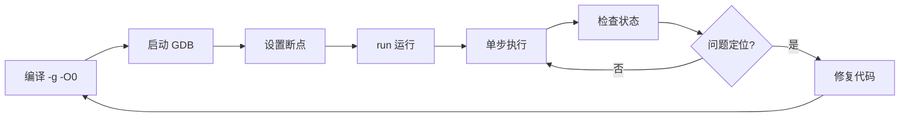
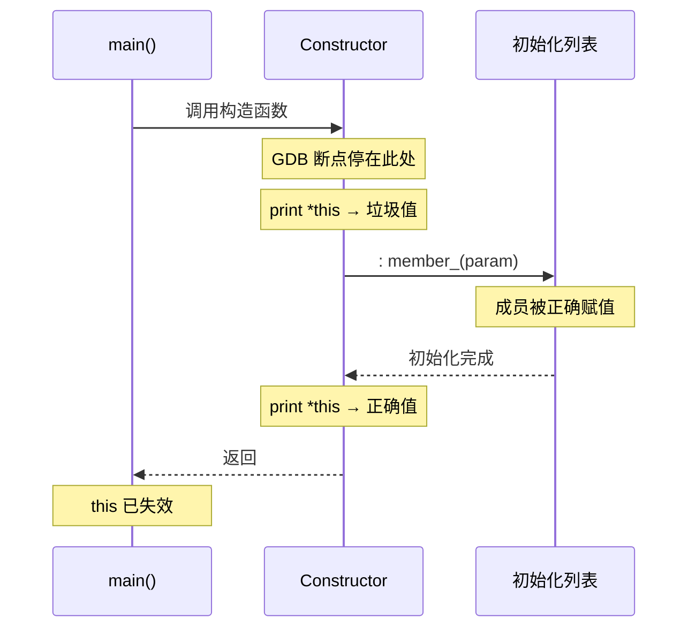
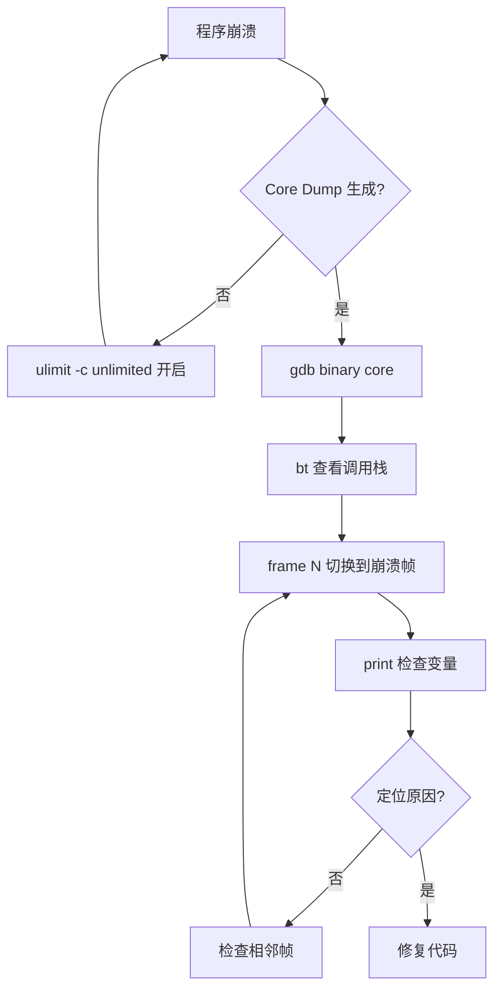

# 1. 背景与环境

> [!question] 为什么需要 GDB
> C++ 程序的运行时错误（段错误、逻辑错误、内存泄漏）无法仅靠代码审查定位。**GDB** 允许在运行时暂停程序、检查变量状态、回溯调用栈，是定位运行时问题的核心工具。

## 1.1 环境准备

| 项目 | 命令 |
|------|------|
| Debian/Ubuntu | `sudo apt install gdb` |
| Fedora/RHEL | `sudo dnf install gdb` |
| Arch | `sudo pacman -S gdb` |
| 验证安装 | `gdb --version` |

## 1.2 编译配置

> [!warning] 调试前提
> 编译时必须携带 ==`-g`== 和 ==`-O0`==，否则 GDB 无法读取符号信息，提示 `No debugging symbols found`。

**Makefile 方式：**

```bash
g++ -g -O0 -o app main.cpp
```

**CMake 方式：**

```bash
cmake .. -DCMAKE_BUILD_TYPE=Debug
cmake --build .
```

---

# 2. 核心概念

## 2.1 调试流程总览



## 2.2 关键概念辨析

| 概念 | 说明 | 易混淆点 |
|------|------|----------|
| **`this` 指针** | 仅在成员函数内部有效 | 离开成员函数后立即失效，`print *this` 报错属正常 |
| **`_vptr`** | 虚函数表指针，指向类的 vtable | 构造未完成时值为非法地址（如 `0x2`） |
| **`info locals`** | 显示函数体 `{}` 内声明的局部变量 | 构造函数体为空时输出 `No locals.` 是正常的 |
| **`info args`** | 显示函数参数（含隐藏的 `this`） | 与 `info locals` 互补，不包含局部变量 |
| **初始化列表时序** | GDB 断在构造函数行时，初始化列表尚未执行 | 此时打印对象看到垃圾值是预期行为 |

## 2.3 构造函数执行时序



> [!tip] 记忆技巧
> 可将构造函数断点时刻理解为"刚进门但还没换鞋"——人已进入房间（断点命中），但初始化动作（换鞋）尚未发生，此时检查状态自然是不完整的。

---

# 3. 完整调试实战示例

本节以一个**图书馆管理系统**为例，涵盖继承、多态、动态内存、多线程等常见 C++ 场景，演示完整的 GDB 调试流程。

## 3.1 示例源码

项目结构：

```
library/
├── CMakeLists.txt
├── include/
│   ├── book.h
│   └── library.h
└── src/
    ├── book.cpp
    ├── library.cpp
    └── main.cpp
```

**`include/book.h`**

```cpp
#pragma once
#include <string>
#include <vector>

// 抽象基类：出版物
class Publication {
public:
    Publication(const std::string& title, int year);
    virtual ~Publication() = default;

    virtual double overdueFine(int days) const = 0;   // 纯虚：超期罚款
    virtual std::string type() const = 0;

    const std::string& title() const { return title_; }
    int year() const { return year_; }

protected:
    std::string title_;
    int         year_;
};

// 普通图书
class Book : public Publication {
public:
    Book(const std::string& title, int year,
         const std::string& author, int pages);

    double overdueFine(int days) const override;
    std::string type() const override { return "Book"; }

    const std::string& author() const { return author_; }
    int pages() const { return pages_; }

private:
    std::string author_;
    int         pages_;
};

// 期刊（按卷号/期号管理，罚款率更高）
class Journal : public Publication {
public:
    Journal(const std::string& title, int year, int volume, int issue);

    double overdueFine(int days) const override;
    std::string type() const override { return "Journal"; }

    int volume() const { return volume_; }
    int issue()  const { return issue_; }

private:
    int volume_;
    int issue_;
};
```

**`include/library.h`**

```cpp
#pragma once
#include "book.h"
#include <memory>
#include <vector>
#include <string>
#include <unordered_map>

struct BorrowRecord {
    std::string memberId;
    std::string publicationTitle;
    int         borrowDays;    // 已借天数
};

class Library {
public:
    Library(const std::string& name);
    ~Library();

    // 添加馆藏
    void addPublication(std::unique_ptr<Publication> pub);

    // 借阅：返回 true 表示成功
    bool borrow(const std::string& memberId,
                const std::string& title,
                int plannedDays);

    // 归还并计算罚款（超期 overdueDays 天）
    double returnBook(const std::string& memberId,
                      const std::string& title,
                      int overdueDays);

    // 打印所有馆藏信息
    void listAll() const;

    // 打印借阅记录
    void listBorrows() const;

    // 统计：按类型分组，返回 {type -> count}
    std::unordered_map<std::string, int> statsByType() const;

private:
    std::string name_;
    std::vector<std::unique_ptr<Publication>> collection_;
    std::vector<BorrowRecord>                 borrows_;
};
```

**`src/book.cpp`**

```cpp
#include "book.h"
#include <stdexcept>

// ---------- Publication ----------
Publication::Publication(const std::string& title, int year)
    : title_(title), year_(year)
{
    if (year < 1000 || year > 2100)
        throw std::invalid_argument("Invalid year: " + std::to_string(year));
}

// ---------- Book ----------
Book::Book(const std::string& title, int year,
           const std::string& author, int pages)
    : Publication(title, year), author_(author), pages_(pages)
{
    if (pages <= 0)
        throw std::invalid_argument("Pages must be positive");
}

double Book::overdueFine(int days) const {
    // 普通图书：0.5 元/天，超过 30 天封顶 50 元
    double fine = days * 0.5;
    return fine > 50.0 ? 50.0 : fine;
}

// ---------- Journal ----------
Journal::Journal(const std::string& title, int year, int volume, int issue)
    : Publication(title, year), volume_(volume), issue_(issue)
{}

double Journal::overdueFine(int days) const {
    // 期刊稀缺，1.5 元/天，无封顶
    return days * 1.5;
}
```

**`src/library.cpp`**

```cpp
#include "library.h"
#include <iostream>
#include <algorithm>
#include <stdexcept>

Library::Library(const std::string& name) : name_(name) {}

Library::~Library() {
    // unique_ptr 自动释放，无需手动 delete
}

void Library::addPublication(std::unique_ptr<Publication> pub) {
    collection_.push_back(std::move(pub));
}

bool Library::borrow(const std::string& memberId,
                     const std::string& title,
                     int plannedDays) {
    // 查找馆藏
    auto it = std::find_if(collection_.begin(), collection_.end(),
        [&title](const std::unique_ptr<Publication>& p) {
            return p->title() == title;
        });

    if (it == collection_.end()) {
        std::cerr << "[borrow] Not found: " << title << "\n";
        return false;
    }

    borrows_.push_back({memberId, title, plannedDays});
    return true;
}

double Library::returnBook(const std::string& memberId,
                           const std::string& title,
                           int overdueDays) {
    // 找到借阅记录
    auto it = std::find_if(borrows_.begin(), borrows_.end(),
        [&](const BorrowRecord& r) {
            return r.memberId == memberId && r.publicationTitle == title;
        });

    if (it == borrows_.end())
        throw std::runtime_error("Borrow record not found");

    // 找到对应出版物，计算罚款
    auto pub = std::find_if(collection_.begin(), collection_.end(),
        [&title](const std::unique_ptr<Publication>& p) {
            return p->title() == title;
        });

    double fine = 0.0;
    if (overdueDays > 0 && pub != collection_.end()) {
        fine = (*pub)->overdueFine(overdueDays);   // 多态调用
    }

    borrows_.erase(it);
    return fine;
}

void Library::listAll() const {
    std::cout << "=== " << name_ << " 馆藏 ===\n";
    for (const auto& p : collection_) {
        std::cout << "[" << p->type() << "] "
                  << p->title() << " (" << p->year() << ")\n";

        if (auto* b = dynamic_cast<const Book*>(p.get())) {
            std::cout << "    作者: " << b->author()
                      << "  页数: " << b->pages() << "\n";
        } else if (auto* j = dynamic_cast<const Journal*>(p.get())) {
            std::cout << "    Vol." << j->volume()
                      << " No." << j->issue() << "\n";
        }
    }
}

void Library::listBorrows() const {
    std::cout << "=== 借阅记录 ===\n";
    for (const auto& r : borrows_) {
        std::cout << "会员 " << r.memberId
                  << " 借阅《" << r.publicationTitle
                  << "》计划 " << r.borrowDays << " 天\n";
    }
}

std::unordered_map<std::string, int> Library::statsByType() const {
    std::unordered_map<std::string, int> result;
    for (const auto& p : collection_)
        result[p->type()]++;
    return result;
}
```

**`src/main.cpp`**

```cpp
#include "library.h"
#include <iostream>
#include <memory>

// 故意引入一个 bug：将 overdueDays 传成了负数
// 用于演示 GDB 条件断点 + watch 调试
static double calculatePenalty(Library& lib,
                               const std::string& member,
                               const std::string& title,
                               int returnedLate) {
    // bug: 应该用 returnedLate，但写成了 returnedLate - 30（可能为负）
    int overdue = returnedLate - 30;
    return lib.returnBook(member, title, overdue);
}

int main() {
    Library lib("城市中心图书馆");

    // 添加馆藏
    lib.addPublication(std::make_unique<Book>(
        "C++ Primer", 2012, "Stanley Lippman", 976));
    lib.addPublication(std::make_unique<Book>(
        "深入理解计算机系统", 2016, "Randal Bryant", 783));
    lib.addPublication(std::make_unique<Journal>(
        "ACM Communications", 2024, 67, 3));
    lib.addPublication(std::make_unique<Journal>(
        "Nature", 2024, 628, 8010));

    lib.listAll();

    // 借阅
    lib.borrow("M001", "C++ Primer", 30);
    lib.borrow("M002", "深入理解计算机系统", 14);
    lib.borrow("M003", "ACM Communications", 7);

    lib.listBorrows();

    // 归还（M001 实际逾期 35 天，但代码有 bug）
    double fine = calculatePenalty(lib, "M001", "C++ Primer", 35);
    std::cout << "M001 罚款: " << fine << " 元\n";

    // 统计
    auto stats = lib.statsByType();
    for (const auto& [type, cnt] : stats)
        std::cout << type << ": " << cnt << " 本\n";

    // 故意触发段错误：用空指针调用虚函数
    Publication* bad = nullptr;
    std::cout << bad->type() << "\n";   // SIGSEGV

    return 0;
}
```

**`CMakeLists.txt`**

```cmake
cmake_minimum_required(VERSION 3.16)
project(library CXX)

set(CMAKE_CXX_STANDARD 17)

add_executable(library_app
    src/main.cpp
    src/book.cpp
    src/library.cpp
)
target_include_directories(library_app PRIVATE include)
```

## 3.2 编译过程

```bash
# 在项目根目录下
mkdir -p build && cd build

# 配置为 Debug 模式（自动添加 -g -O0）
cmake .. -DCMAKE_BUILD_TYPE=Debug

# 构建
cmake --build .

# 验证符号信息是否存在
file library_app
# library_app: ELF 64-bit LSB pie executable, ... with debug_info, not stripped

# 手动确认 -g 是否生效（可选）
objdump -h library_app | grep debug
```

## 3.3 启动 GDB

```bash
# 方式一：直接加载可执行文件
gdb ./library_app

# 方式二：带参数启动（-- 分隔 GDB 参数和程序参数）
gdb --args ./library_app --config debug.ini

# 方式三：附加到正在运行的进程
gdb -p $(pidof library_app)

# 方式四：启动后立即执行初始化命令（适合脚本化）
gdb -ex "break main" -ex "run" ./library_app

# 启动后 GDB 提示符：
# (gdb)
```

> [!tip] `.gdbinit` 配置文件
> 在项目根目录创建 `.gdbinit` 可自动执行初始化命令：
> ```gdb
> set print pretty on       # 结构体/类分行显示
> set print object on       # 打印多态对象的真实类型
> set pagination off        # 关闭 --More-- 翻页
> set confirm off           # 关闭确认提示
> break main
> ```

## 3.4 调试流程：定位 `calculatePenalty` 中的 Bug

### Step 1：设置断点

```gdb
# 函数断点
(gdb) break main
Breakpoint 1 at 0x4012a3: file src/main.cpp, line 19.

# 对有 bug 的函数打断点
(gdb) break calculatePenalty
Breakpoint 2 at 0x401180: file src/main.cpp, line 13.

# 在 returnBook 的关键计算处打行号断点
(gdb) break library.cpp:52
Breakpoint 3 at 0x4015c0: file src/library.cpp, line 52.

# 条件断点：只在 overdueDays 为负时暂停（精准定位 bug）
(gdb) break library.cpp:52 if overdueDays < 0
Breakpoint 4 at 0x4015c0: file src/library.cpp, line 52.

# 查看所有断点
(gdb) info breakpoints
Num     Type           Disp Enb Address            What
1       breakpoint     keep y   0x00004012a3       in main() at src/main.cpp:19
2       breakpoint     keep y   0x00401180         in calculatePenalty(...) at src/main.cpp:13
3       breakpoint     keep y   0x00004015c0       in Library::returnBook(...) at src/library.cpp:52
4       breakpoint     keep y   0x00004015c0       in Library::returnBook(...) at src/library.cpp:52
	stop only if overdueDays < 0

# 暂时禁用普通断点 3，只保留条件断点 4
(gdb) disable 3
```

### Step 2：运行程序

```gdb
(gdb) run
Starting program: /home/user/library/build/library_app

Breakpoint 1, main () at src/main.cpp:19
19	    Library lib("城市中心图书馆");
```

### Step 3：跳过初始化，直奔 `calculatePenalty`

```gdb
# continue 运行到下一个断点
(gdb) continue
Continuing.
=== 城市中心图书馆 馆藏 ===
[Book] C++ Primer (2012)
    作者: Stanley Lippman  页数: 976
...（省略输出）...

Breakpoint 2, calculatePenalty (...) at src/main.cpp:13
13	    int overdue = returnedLate - 30;
```

### Step 4：单步执行，观察变量

```gdb
# 查看函数参数（含隐藏的 &lib）
(gdb) info args
lib = @0x7fffffffdc40: {name_ = "城市中心图书馆", ...}
member = "M001"
title = "C++ Primer"
returnedLate = 35

# 执行当前行（赋值语句），不进入函数
(gdb) next
14	    return lib.returnBook(member, title, overdue);

# 检查 overdue 的值 —— 这里暴露了 bug
(gdb) print overdue
$1 = 5

# 但 returnedLate 是 35，overdue 应该是 35，不是 5
# 说明 `returnedLate - 30` 这个逻辑是错的
```

> [!bug] Bug 复现
> `overdue = returnedLate - 30 = 35 - 30 = 5`，而逻辑上应该直接传 `returnedLate = 35`。
> 此处减去 30 导致罚款被低估（如果 returnedLate < 30 甚至会变成负数传入 returnBook）。

### Step 5：用 `watch` 监视变量变化

```gdb
# 重新运行，在 calculatePenalty 入口监视 overdue
(gdb) run
...
Breakpoint 2, calculatePenalty (...) at src/main.cpp:13
13	    int overdue = returnedLate - 30;

# 设置 watchpoint：overdue 一旦变化立即暂停
(gdb) watch overdue
Hardware watchpoint 5: overdue

(gdb) next
Hardware watchpoint 5: overdue
Old value = 0          # 初始化前的垃圾值（栈上未初始化）
New value = 5          # 赋值后
14	    return lib.returnBook(member, title, overdue);
```

### Step 6：进入 `returnBook`，检查多态调用

```gdb
# step 进入 returnBook 内部（而非 next 跳过）
(gdb) step
Library::returnBook (this=0x7fffffffdc40, memberId="M001",
    title="C++ Primer", overdueDays=5) at src/library.cpp:41

# 查看调用栈
(gdb) bt
#0  Library::returnBook (...) at src/library.cpp:41
#1  calculatePenalty (...) at src/main.cpp:14
#2  main () at src/main.cpp:36

# 切换到 frame 1 确认调用者的参数
(gdb) frame 1
#1  calculatePenalty (...) at src/main.cpp:14
14	    return lib.returnBook(member, title, overdue);
(gdb) print overdue
$2 = 5       # 确认传入的是 5，不是 35

# 切回 frame 0 继续
(gdb) frame 0
```

### Step 7：在多态调用处检查虚函数分派

```gdb
# 运行到 overdueFine 的多态调用处
(gdb) until 52
Library::returnBook (...) at src/library.cpp:52
52	        fine = (*pub)->overdueFine(overdueDays);

# 查看 *pub 的真实类型（需要 set print object on）
(gdb) set print object on
(gdb) print *(*pub)
$3 = (Book) {<Publication> = {_vptr.Publication = 0x404d80 <vtable for Book+16>,
    title_ = "C++ Primer", year_ = 2012},
    author_ = "Stanley Lippman", pages_ = 976}

# 直接调用成员函数验证返回值（不需要继续运行）
(gdb) print (*pub)->overdueFine(5)
$4 = 2.5      # 5天 * 0.5元 = 2.5元（正确，但 days 本应是 35）
(gdb) print (*pub)->overdueFine(35)
$5 = 17.5     # 35天 * 0.5元 = 17.5元（这才是正确的罚款）

# 确认虚函数表指向 Book::overdueFine（而非基类）
(gdb) info vtbl (*pub)
vtable for 'Publication' @ 0x404d80 (subobject @ 0x...):
[0]: 0x401a00 <Book::overdueFine(int) const>
[1]: 0x401a40 <Book::type() const>
```

### Step 8：`display` 实现自动打印

```gdb
# 每次暂停自动打印 overdueDays，省去反复 print
(gdb) display overdueDays
1: overdueDays = 5

# 继续执行时每次暂停都会显示
(gdb) finish
Run till exit from #0  Library::returnBook (...)
1: overdueDays = 5    # 自动打印
Value returned is $6 = 2.5

# 取消自动打印
(gdb) undisplay 1
```

## 3.5 调试流程：定位段错误（SIGSEGV）

### Step 1：直接运行，让程序崩溃

```gdb
(gdb) run
...
M001 罚款: 2.5 元
Book: 2 本
Journal: 2 本

Program received signal SIGSEGV, Segmentation fault.
0x00007ffff7b12345 in ?? ()
```

### Step 2：查看崩溃调用栈

```gdb
(gdb) bt
#0  0x00007ffff7b12345 in ?? ()
#1  0x0000000000401380 in main () at src/main.cpp:46
46	    std::cout << bad->type() << "\n";

(gdb) frame 1
#1  main () at src/main.cpp:46
46	    std::cout << bad->type() << "\n";
```

### Step 3：检查空指针

```gdb
# 打印 bad 指针的值
(gdb) print bad
$7 = (Publication *) 0x0    # 确认是空指针

# 尝试解引用（预期崩溃，用于确认）
(gdb) print bad->type()
Cannot access memory at address 0x0

# 查看崩溃帧的所有局部变量
(gdb) info locals
lib  = {name_ = "城市中心图书馆", ...}
fine = 2.5
bad  = 0x0
stats = {...}
```

### Step 4：分析崩溃原因

```gdb
# 查看崩溃时的寄存器（了解 CPU 状态）
(gdb) info registers rip rsp rbp
rip            0x7ffff7b12345      # 崩溃的指令地址
rsp            0x7fffffffdb50
rbp            0x7fffffffdc30

# 查看崩溃时尝试访问的内存地址
(gdb) x/4x 0x0
Cannot access memory at address 0x0
# 确认是 NULL 解引用
```

> [!summary] 崩溃原因
> `bad` 是 `nullptr`，通过空指针调用虚函数 `type()` 时，运行时尝试从 vtable（地址 `0x0`）读取函数指针，触发 SIGSEGV。

## 3.6 Core Dump 分析（事后调试）

### 启用 Core Dump

```bash
# 查看当前限制
ulimit -c

# 临时开启
ulimit -c unlimited

# 永久开启（写入 ~/.bashrc 或 /etc/security/limits.conf）
# /etc/security/limits.conf:
# *  soft  core  unlimited
```

### Core Dump 文件位置

```bash
# 查看 core 文件生成路径与格式
cat /proc/sys/kernel/core_pattern

# 常见输出示例：
# /var/core/core.%e.%p.%t    → 按程序名、PID、时间戳命名
# |/usr/lib/systemd/systemd-coredump → systemd 接管（需用 coredumpctl 查看）
```

> [!info] systemd 系统下的 Core Dump
> 如果 `core_pattern` 以 `|` 开头，说明 core dump 由 systemd-coredump 接管，不会在磁盘上生成文件。此时使用 `coredumpctl` 查看：
> ```bash
> coredumpctl list                    # 列出所有 core dump
> coredumpctl info ./library_app      # 查看最近一次的详细信息
> coredumpctl gdb ./library_app       # 直接用 GDB 打开
> ```

### 用 GDB 分析 Core Dump

```bash
# 让程序崩溃，生成 core 文件
./library_app
# Segmentation fault (core dumped)

# 加载 core 文件（不需要重新运行程序）
gdb ./library_app core
```

```gdb
# 直接查看崩溃调用栈
(gdb) bt
#0  0x00007ffff7b12345 in ?? ()
#1  0x0000000000401380 in main () at src/main.cpp:46

(gdb) frame 1
(gdb) print bad
$1 = (Publication *) 0x0

# 查看崩溃时的完整对象状态
(gdb) print lib
$2 = {name_ = "城市中心图书馆",
      collection_ = {<std::_Vector_base...> ...},
      borrows_ = {<std::_Vector_base...> ...}}
```

### Core Dump 分析流程



---

# 4. 信号与段错误调试

## 4.1 常见信号

| 信号 | 编号 | 触发原因 | GDB 行为 |
|------|------|----------|----------|
| `SIGSEGV` | 11 | 非法内存访问（空指针、越界） | 默认暂停程序 |
| `SIGABRT` | 6 | `abort()` 调用（assert 失败） | 默认暂停程序 |
| `SIGFPE` | 8 | 浮点异常（除零） | 默认暂停程序 |
| `SIGINT` | 2 | Ctrl+C | 默认暂停程序 |
| `SIGKILL` | 9 | 强制终止 | ==无法捕获==，程序直接退出 |

## 4.2 信号处理

```gdb
# 查看信号处理策略
(gdb) info signals

# 拦截特定信号（暂停程序）
(gdb) handle SIGSEGV stop print

# 忽略特定信号（不暂停，传递给程序）
(gdb) handle SIGPIPE nostop noprint pass

# 不传递给程序（GDB 独占）
(gdb) handle SIGUSR1 stop noprint
```

## 4.3 段错误调试套路

```gdb
# 1. 直接运行，让程序崩溃
(gdb) run
# Program received signal SIGSEGV, Segmentation fault.

# 2. 查看崩溃位置
(gdb) bt
(gdb) frame 0

# 3. 检查指针是否为空
(gdb) print ptr
(gdb) print *ptr        # 如果 ptr 是 0x0，这就是原因

# 4. 检查数组越界
(gdb) print index
(gdb) print array_size
```

---

# 5. 多线程调试

> [!info] 适用场景
> 程序中有多个线程时（`std::thread`、`pthread`），GDB 可以暂停所有线程并逐一检查。

```gdb
# 列出所有线程
(gdb) info threads
  Id   Target Id         Frame
* 1    Thread 0x... "library_app" main () at src/main.cpp:19
  2    Thread 0x... "worker"      pthread_cond_wait () from ...

# 切换到线程 2
(gdb) thread 2

# 查看线程 2 的调用栈
(gdb) bt

# 打印所有线程的调用栈（定位死锁非常有用）
(gdb) thread apply all bt

# 暂停所有线程（当某一线程命中断点时，其他线程默认也暂停）
(gdb) set scheduler-locking on   # 只允许当前线程运行（排除并发干扰）
(gdb) set scheduler-locking off  # 恢复多线程并发
```

---

# 6. 常用命令速查

## 6.1 断点与运行

| 命令 | 说明 |
|------|------|
| `break main` | 函数断点 |
| `break file.cpp:10` | 行号断点 |
| `break Class::method` | 成员函数断点 |
| `break file.cpp:10 if x > 0` | 条件断点 |
| `tbreak main` | 一次性断点（命中后自动删除） |
| `info breakpoints` | 查看断点列表 |
| `delete N` | 删除 N 号断点 |
| `disable N` | 禁用 N 号断点 |
| `enable N` | 启用 N 号断点 |
| `run` | 启动程序 |
| `run arg1 arg2` | 带参数启动 |
| `attach PID` | 附加到运行中的进程 |

## 6.2 执行控制

| 命令 | 缩写 | 说明 |
|------|------|------|
| `next` | `n` | 单步（不进入函数） |
| `step` | `s` | 单步（进入函数） |
| `continue` | `c` | 继续到下一断点 |
| `finish` | - | 执行完当前函数 |
| `until` | `u` | 运行到指定行 |
| `advance location` | - | 运行到指定位置 |
| `reverse-step` | - | 反向单步（需开启记录） |

## 6.3 数据查看

| 命令 | 说明 |
|------|------|
| `print expr` | 打印表达式 |
| `print *this` | 打印当前对象 |
| `print obj.method()` | 调用方法并打印返回值 |
| `info args` | 查看函数参数 |
| `info locals` | 查看局部变量 |
| `bt` | 查看调用栈 |
| `bt full` | 调用栈 + 局部变量 |
| `display expr` | 每次暂停自动打印 |
| `undisplay N` | 取消自动打印 |
| `watch var` | 变量变化时暂停 |
| `info vtbl obj` | 查看对象的虚函数表 |
| `x/10x ptr` | 查看内存（16进制，10个单元） |

## 6.4 进程与线程

| 命令 | 说明 |
|------|------|
| `info threads` | 列出所有线程 |
| `thread 2` | 切换到 2 号线程 |
| `thread apply all bt` | 所有线程的调用栈 |
| `set scheduler-locking on` | 只运行当前线程 |
| `info inferiors` | 列出所有进程（多进程调试） |
| `inferior 2` | 切换到 2 号进程 |

## 6.5 格式化输出

| 命令 | 说明 |
|------|------|
| `set print pretty on` | 结构体/类分行显示 |
| `set print object on` | 显示多态对象真实类型 |
| `set print array on` | 数组分行显示 |
| `set print elements N` | 限制打印数组/字符串长度 |
| `p/x var` | 以十六进制打印 |
| `p/d var` | 以十进制打印 |
| `p/s ptr` | 以字符串形式打印 |

---

# 7. 避坑指南

## 7.1 `this` 指针失效

> [!warning] 离开成员函数后 `this` 不可用
> 用 `next` 执行完成员函数回到 `main()` 后，`print *this` 会报 `No symbol "this" in current context`。
>
> **原因**：`this` 是成员函数的隐式参数，函数返回后即从栈帧中销毁。
>
> **解决**：改用 `print <对象名>` 直接按变量名访问。

## 7.2 函数调用 vs 函数指针

> [!warning] `print c.method` vs `print c.method()`
> - **不加括号** → 打印函数指针地址，无实际调试意义
> - **加括号** → 实际调用函数并返回结果，是调试利器
>
> **注意**：GDB 调用函数会实际执行，若函数有副作用（修改状态、写文件）需谨慎。

## 7.3 成员变量 vs 成员函数命名

> [!tip] 注意下划线后缀
> `print c.radius` 打印的是名为 `radius` 的成员**函数**（函数指针地址），`print c.radius_` 才是成员**变量**。带下划线后缀是 C++ 常见的命名惯例，用于区分同名成员函数与变量。

## 7.4 优化导致变量被优化掉

> [!warning] 编译优化会破坏调试体验
> 如果忘记 `-O0`，GDB 可能提示 `<optimized out>`，变量无法查看或行号跳转混乱。
>
> **解决**：确保编译时使用 ==`-O0`==，CMake 项目使用 `Debug` 构建类型。

## 7.5 权限问题导致无法附加进程

> [!tip] 附加进程调试时遇到权限不足
> ```bash
> # 临时允许非 root 用户调试任意进程
> echo 0 | sudo tee /proc/sys/kernel/yama/ptrace_scope
>
> # 永久修改（写入 sysctl 配置）
> # /etc/sysctl.d/10-ptrace.conf:
> # kernel.yama.ptrace_scope = 0
> ```
> Linux 默认的 `ptrace_scope=1` 限制非 root 用户只能附加到子进程，设为 `0` 可解除限制。

## 7.6 Core Dump 文件未生成

> [!tip] 排查步骤
> 1. `ulimit -c` 确认不为 0
> 2. `cat /proc/sys/kernel/core_pattern` 确认输出路径
> 3. 如果以 `|` 开头，使用 `coredumpctl` 查看
> 4. 检查磁盘空间是否充足
> 5. 检查程序是否以 `setrlimit` 自行禁用了 core dump

## 7.7 构造前后的输出对比

**构造前（断点刚命中，初始化列表未执行）：**

```
$3 = {<Publication> = {_vptr.Publication = 0x2}, title_ = "", year_ = 0}
```

**构造后（`next` 执行完毕）：**

```
$5 = {<Publication> = {_vptr.Publication = 0x404d80 <vtable for Book+16>},
      title_ = "C++ Primer", year_ = 2012}
```

| 字段 | 构造前 | 构造后 | 判断依据 |
|------|--------|--------|----------|
| `_vptr` | `0x2`（非法地址） | `0x404d80`（合法 vtable） | 是否指向合法内存 |
| `title_` | `""`（空） | `"C++ Primer"` | 是否等于传入参数 |
| `year_` | `0`（垃圾值） | `2012` | 是否等于传入参数 |

---

# 8. 总结

> [!summary] 核心要点
> 1. **编译配置**：必须 ==`-g -O0`==，CMake 用 `Debug` 构建类型
> 2. **断点策略**：优先用条件断点（`break file:line if expr`）和一次性断点（`tbreak`），避免频繁 continue
> 3. **构造时序**：断点命中时初始化列表尚未执行，看到垃圾值是正常的
> 4. **`this` 作用域**：仅在成员函数内有效，离开后按对象名访问
> 5. **多态验证**：`set print object on` + `info vtbl obj` 可确认虚函数分派是否正确
> 6. **函数调用**：`print obj.method()` 可直接在 GDB 内调用成员函数验证返回值
> 7. **watch 点**：用 `watch var` 监视变量变化，精准定位赋值位置，无需反复打断点
> 8. **display**：用 `display expr` 替代反复 `print`，每次暂停自动输出
> 9. **Core Dump**：`ulimit -c unlimited` 开启，`gdb binary core` 分析，`bt` 定位崩溃帧
> 10. **信号调试**：`handle SIGSEGV stop print` 控制信号行为，`SIGKILL` 无法捕获
> 11. **多线程**：`thread apply all bt` 一键输出所有线程栈，配合 `scheduler-locking` 隔离单线程调试
> 12. **进程附加**：`gdb -p PID` 附加运行中进程，注意 `ptrace_scope` 权限限制
