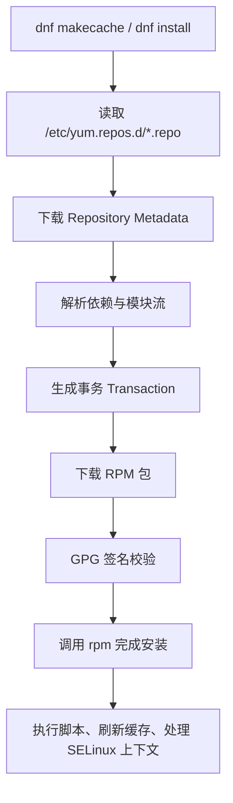
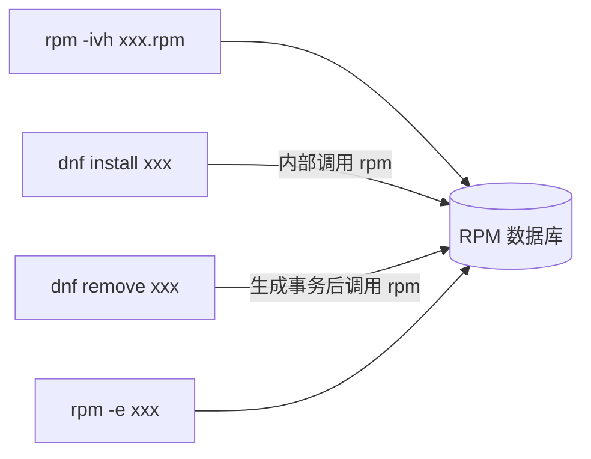

# 1. Rocky Linux Server 定位

## 1.1 Rocky Linux 的系统定位

**Rocky Linux** 是 RHEL（Red Hat Enterprise Linux）生态中的企业级 Linux 发行版，目标是提供与 RHEL 高度兼容、长期稳定、免费可用的服务器系统。

它的核心特点不是追求最新软件版本，而是强调：

- 企业级稳定性
- 长生命周期维护
- RHEL 生态兼容性
- 安全更新持续回移
- RPM / DNF / SELinux / systemd 等企业 Linux 工具链

适合作为以下学习与开发环境：

- Linux 服务器管理
- C/C++ 服务端开发
- Docker / Podman / 容器实验
- Git、SSH、远程开发
- 网络编程与服务部署
- RHEL 系运维体系学习

## 1.2 与 Debian 系的主要差异

Rocky Linux 属于 Red Hat 系，与 Debian 系在包管理、仓库组织和默认安全机制上有明显差异：

| 维度 | Rocky Linux / RHEL 系 | Debian 系 |
|---|---|---|
| 软件包格式 | RPM | DEB |
| 日常包管理工具 | `dnf` | `apt` |
| 底层包工具 | `rpm` | `dpkg` |
| 仓库组织 | BaseOS、AppStream、CRB、Extras 等 | main、contrib、non-free 等 |
| 默认文件系统 | 常见为 XFS | 常见为 ext4，也可使用 XFS |
| 安全机制 | SELinux 默认启用 | AppArmor 或其他方案更常见 |
| 防火墙管理 | firewalld | ufw、nftables、iptables 等 |

> [!summary]
> 学 Rocky Linux 的重点不是只学命令替换，而是理解 RHEL 系的工程习惯：**RPM 包体系、DNF 事务、模块化仓库、SELinux、firewalld、systemd 服务管理**。

## 1.3 最终系统形态

推荐安装完成后的系统形态如下：

| 项目 | 建议状态 | 说明 |
|---|---|---|
| 桌面环境 | 不安装 | 保持服务器环境简洁，减少资源占用 |
| SSH Server | 安装并启用 | 方便远程登录、VS Code Remote SSH、文件传输 |
| Base Environment | Minimal Install | 最接近云服务器和企业最小化服务器环境 |
| 开发工具链 | 安装后手动配置 | 通过 `dnf group install "Development Tools"` 按需补齐 |
| 软件源 | 优先官方仓库 | BaseOS、AppStream、Extras 是基础，CRB / EPEL 按需启用 |
| 安全机制 | SELinux 与 firewalld 保持启用 | 学习 RHEL 系运维时应理解安全机制，而不是直接关闭 |

> [!summary]
> Rocky Linux Server 的核心思路是：**安装阶段保持最小化，初始化阶段用 DNF 按需补齐工具链，同时保留 RHEL 系默认安全机制**。这样既贴近真实服务器环境，也便于学习 RPM、DNF、SELinux、firewalld 和 systemd。

# 2. 安装镜像选择

## 2.1 镜像仓库

> [!note]
> 点击直达：[Rocky Linux 官方下载页](https://rockylinux.org/download)
> 点击直达：[Rocky Linux 官方镜像列表](https://mirrors.rockylinux.org/)
> 点击直达：[南京大学 MirrorZ Rocky Linux 软件源](https://help.mirror.nju.edu.cn/rocky/)

Rocky Linux 官方下载页会提供多个版本、架构和镜像类型。对于 VMware 中的普通服务器安装，通常只需要关注 `x86_64` 架构下的安装 ISO。

常见文件名大致类似：

```text
Rocky-9.x-x86_64-minimal.iso
Rocky-9.x-x86_64-dvd.iso
Rocky-9.x-x86_64-boot.iso
```

选择时优先看两个条件：

- 是否需要离线安装更多软件包。
- 安装阶段的网络是否稳定。

## 2.2 常见镜像类型

Rocky Linux 提供多种镜像，目标场景不同：

| 镜像类型 | 主要用途 | 是否适合 VMware 服务器安装 |
|---|---|---|
| Minimal ISO | 最小化安装，适合无 GUI 服务器 | 推荐 |
| DVD ISO | 完整安装镜像，包含更多软件包，可离线安装更多组件 | 推荐 |
| Boot ISO | 网络安装镜像，安装时依赖网络仓库 | 网络稳定时可用 |
| Cloud Image | 云平台、OpenStack、KVM 等场景 | 不适合普通 VMware 手动安装 |
| Container / Docker Image | 容器基础镜像 | 不适合虚拟机安装 |
| Live Image | 桌面体验或临时系统 | 不推荐服务器安装 |
| WSL Image | Windows WSL 环境 | 不适合 VMware |

> [!warning]
> 初学阶段不要把 Cloud Image、Container Image、WSL Image 当作普通安装 ISO。它们面向的是云平台、容器或 WSL，不是 VMware 交互式安装。

## 2.3 Minimal ISO 与 DVD ISO

如果目标是在 VMware 中搭建无桌面的服务器学习环境，优先选择：

```text
Rocky-*-x86_64-minimal.iso
```

Minimal ISO 的特点：

- 安装阶段不需要下载大量软件包。
- 默认安装内容很少。
- 安装后很多开发工具和常用命令需要手动补齐。
- 最接近云服务器和企业最小化服务器环境。

如果网络不稳定，或者希望安装时有更多本地软件包可选，可以选择：

```text
Rocky-*-x86_64-dvd.iso
```

DVD ISO 体积更大，但离线能力更强。它不是“更臃肿”的同义词，最终系统是否简洁仍取决于安装时选择的软件环境。

## 2.4 Boot ISO 的使用条件

Boot ISO 只包含启动安装器所需的最小内容，安装过程中必须从网络仓库下载软件包。

适合：

- 网络稳定。
- 熟悉镜像源配置。
- 希望安装时直接拉取仓库中的最新软件包。

不适合：

- 初次安装 Rocky Linux。
- 网络代理、DNS、镜像源配置不确定。
- 希望离线或半离线完成安装。

> [!tip]
> 如果只是搭建一台长期学习用的 Rocky Linux Server，优先选择 **Minimal ISO**。如果网络不稳定，选择 **DVD ISO** 会更稳妥。

# 3. VMware 虚拟机配置

## 3.1 推荐硬件配置

用于 Linux 学习、C/C++ 开发和服务器实验的 VMware 虚拟机可按下表配置：

| 配置项 | 推荐值 | 说明 |
|---|---:|---|
| CPU | 2 到 4 核 | 编译、容器和多服务实验建议 4 核 |
| 内存 | 4 GB | 最低可用 2 GB，但开发环境会偏紧 |
| 磁盘 | 40 到 60 GB | 建议使用自动扩展虚拟磁盘 |
| 网络 | NAT | 初学最省心，便于访问外网和宿主机 SSH |
| 固件 | UEFI | 现代服务器推荐方式 |
| 分区表 | GPT | 与 UEFI 搭配使用 |
| ISO | Minimal 或 DVD | 根据网络和离线需求选择 |

## 3.2 网络模式建议

| 网络模式 | 特点 | 适合场景 |
|---|---|---|
| NAT | 虚拟机通过宿主机访问外网，配置简单 | 初学、开发、远程 SSH |
| Bridged | 虚拟机作为局域网中的独立主机 | 需要其他局域网设备访问虚拟机 |
| Host-only | 仅宿主机与虚拟机互通，默认不能访问外网 | 隔离实验环境 |

通常建议先使用 NAT。安装完成后，只要虚拟机有 IP 地址并开启 SSH，就可以从宿主机连接。

# 4. UEFI 与 GPT 安装方式

## 4.1 Legacy BIOS 启动流程

Legacy BIOS 的典型启动链路为：

```text
BIOS
 ↓
MBR
 ↓
GRUB
 ↓
Linux Kernel
```

BIOS + MBR 是传统方案，兼容性强，但不再是新系统的优先选择。

## 4.2 UEFI 启动流程

UEFI 的典型启动链路为：

```text
UEFI Firmware
      ↓
EFI System Partition
      ↓
grubx64.efi
      ↓
Linux Kernel
```

UEFI 通常搭配 GPT 分区表，并使用 EFI System Partition（ESP）保存启动文件。

安装完成后常见挂载点为：

```text
/boot/efi
```

该分区通常使用 FAT32 文件系统。

## 4.3 判断当前启动模式

在系统中执行：

```bash
[ -d /sys/firmware/efi ] && echo "UEFI" || echo "BIOS"
```

如果输出：

```text
UEFI
```

说明当前系统以 UEFI 方式启动。

也可以检查：

```bash
ls /sys/firmware/efi
```

如果目录存在并包含内容，也表示 UEFI 启动。

## 4.4 VMware 中固件类型无法修改

如果 VMware 的 Firmware Type（BIOS / UEFI）选项变灰，常见原因包括：

- 虚拟机已安装操作系统。
- 虚拟机处于 Suspend 状态，而不是完全关机。
- 虚拟机由现成模板或其他平台导入。

VMware 锁定固件类型是为了避免系统无法启动。例如：

```text
BIOS 模式安装系统
        ↓
强行切换为 UEFI
        ↓
原有 MBR / GRUB 启动链路失效
        ↓
系统可能无法启动
```

推荐做法是在创建虚拟机时就确定固件类型：

```text
New Virtual Machine
        ↓
Custom
        ↓
Firmware Type = UEFI
        ↓
安装 Rocky Linux
```

> [!warning]
> 不建议安装完成后再切换 BIOS / UEFI。启动方式、分区表、引导文件位置是成套设计的，后期强改容易导致系统无法启动。

# 5. 安装菜单与安装环境

## 5.1 启动菜单选项

Rocky Linux 安装镜像启动后常见选项包括：

```text
Install Rocky Linux
Test this media & install Rocky Linux
Troubleshooting
```

有些 Minimal ISO 会显示类似：

```text
Install Rocky Linux Minimal
```

普通 VMware 安装通常选择第一项即可。

## 5.2 Test this media & install

该选项会先校验安装介质是否损坏，再进入安装流程。

适合：

- 使用 U 盘安装。
- 下载过程可能中断。
- 怀疑 ISO 文件损坏。

如果是在 VMware 中直接挂载已校验过的 ISO，一般可以直接选择正常安装项。

## 5.3 FIPS Mode

FIPS 是 Federal Information Processing Standards，主要用于对密码算法和安全模块有合规要求的环境。

它适合：

- 政府
- 军工
- 金融
- 合规审计严格的企业环境

普通学习、开发和实验环境不需要启用 FIPS。

## 5.4 Troubleshooting

Troubleshooting 是故障排查入口，通常用于：

- Rescue Mode 救援系统
- 图形安装器异常
- 启动问题排查
- 内存测试或兼容模式

正常安装不需要进入该菜单。

## 5.5 Anaconda 安装器关键选项

Rocky Linux 使用 Anaconda 安装器。进入安装界面后，服务器安装最需要关注以下几项：

| 选项 | 建议 | 说明 |
|---|---|---|
| Installation Destination | 手动确认磁盘与分区 | 避免误装到错误磁盘 |
| Software Selection | Minimal Install | 决定最终是否为无桌面服务器 |
| Network & Host Name | 启用网卡并设置主机名 | 便于安装后直接使用网络和 SSH |
| Root Password | 可设置，也可禁用 root SSH 登录 | 学习环境可保留 root 密码，但日常优先用 sudo |
| User Creation | 创建普通用户并勾选管理员权限 | 让普通用户加入 `wheel` 组获得 sudo 权限 |
| Time & Date | 设置时区 | 建议选择 Asia/Shanghai 或实际所在时区 |

> [!warning]
> **Software Selection** 是决定系统形态的关键步骤。选择 `Server with GUI` 或 `Workstation` 会安装桌面环境；如果目标是无桌面服务器，应选择 `Minimal Install`。

## 5.6 Software Selection

Rocky Linux 安装器中的 **Software Selection** 通常包含两类内容：

```text
Base Environment
Add-ons for Selected Environment
```

服务器学习环境推荐：

```text
Base Environment: Minimal Install
Add-ons: 默认不勾选，安装后按需使用 DNF 安装
```

常见 Base Environment 含义如下：

| Base Environment | 含义 | 是否推荐 |
|---|---|---|
| Minimal Install | 最小化服务器系统 | 推荐 |
| Server | 安装更多服务器组件 | 可用，但不如 Minimal 简洁 |
| Server with GUI | 带图形界面的服务器 | 不推荐无桌面服务器 |
| Workstation | 桌面工作站环境 | 不推荐服务器学习环境 |
| Custom Operating System | 自定义基础环境 | 熟悉后再使用 |

> [!summary]
> Rocky Linux 安装阶段的关键不是“装得越多越好”，而是先得到一个干净的 Minimal 系统，再通过 DNF 明确安装自己需要的软件包和软件组。

# 6. 分区建议

## 6.1 学习环境推荐分区

VMware 学习环境推荐使用 UEFI + GPT，并保持分区简单：

| 挂载点 | 文件系统 | 建议大小 | 说明 |
|---|---|---:|---|
| `/boot/efi` | FAT32 | 600 MB 左右 | EFI System Partition |
| `/` | XFS | 剩余空间 | 根分区，保存系统和用户数据 |

这种方案足够支持大多数学习与开发实验。

## 6.2 是否需要单独划分 /boot、/home、swap

学习环境通常不必单独划分：

```text
/boot
/home
swap
```

原因：

- 虚拟机磁盘调整方便，复杂分区收益较低。
- 单独 `/home` 更适合长期桌面系统或多人服务器。
- 单独 swap 分区不是必须，现代系统可使用 swap 文件或 zram swap。
- 单独 `/boot` 多用于加密根分区、复杂 LVM 或企业规范场景。

> [!tip]
> 初学时优先把精力放在系统管理、包管理、服务管理和网络配置上。分区可以保持简单，等理解 LVM、XFS、RAID、加密和备份策略后再做复杂设计。

## 6.3 XFS 的定位

Rocky Linux / RHEL 系常见默认文件系统是 XFS。

XFS 的特点：

- 适合大文件和大容量文件系统。
- 元数据性能较好。
- 企业服务器使用广泛。
- 支持在线扩容。

需要注意：

- XFS 通常不支持像 ext4 那样直接在线缩小。
- 缩小 XFS 分区通常需要备份、重建文件系统、恢复数据。

# 7. Minimal 安装后的系统状态

## 7.1 Minimal 不是安装失败

Minimal 安装完成后，很多命令不存在是正常现象。例如：

```bash
which
tree
gcc
cmake
git
```

这些工具默认不一定安装，因为 Minimal 的目标是提供可启动、可登录、可管理的最小系统，而不是完整开发环境。

## 7.2 判断命令是否存在

如果 `which` 本身没有安装，执行：

```bash
which gcc
```

可能得到：

```text
which: command not found
```

这只能说明 `which` 命令不存在，不能说明 `gcc` 一定不存在。

更通用的检查方式是使用 shell 内建能力：

```bash
type -a gcc
```

如果输出类似：

```text
bash: type: gcc: not found
```

才表示当前环境找不到 `gcc`。

也可以查询软件包是否安装：

```bash
rpm -q gcc
```

## 7.3 初始化检查

首次登录后建议检查：

```bash
hostnamectl
ip addr
ping -c 4 rockylinux.org
dnf repolist
sudo dnf update
```

确认内容：

- 主机名是否正确。
- 网络是否获得 IP。
- DNS 是否可用。
- DNF 仓库是否启用。
- 当前用户是否有 sudo 权限。

## 7.4 sudo 权限配置

Rocky Linux 默认使用 `wheel` 组管理 sudo 权限。安装阶段如果在 **User Creation** 中勾选了管理员权限，普通用户通常已经被加入 `wheel` 组。

检查当前用户所属组：

```bash
groups
```

检查指定用户所属组，例如用户名为 `sky`：

```bash
groups sky
```

如果用户不在 `wheel` 组，可以切换到 root 后添加：

```bash
su -
usermod -aG wheel sky
```

退出当前登录会话后重新登录，再检查：

```bash
groups
sudo whoami
```

如果 `sudo whoami` 输出：

```text
root
```

说明 sudo 权限正常。

> [!warning]
> `usermod -aG wheel sky` 中的 `-aG` 不要写错。`-a` 表示追加用户组，`-G` 表示设置附加组。如果漏掉 `-a`，可能覆盖用户原有附加组。

# 8. RPM 与 DNF 包管理体系

## 8.1 分层结构

Rocky Linux 使用 RPM 包管理体系，日常使用 `dnf`，底层由 `rpm` 完成实际软件包操作。

```text
+---------------------------------------------+
|        用户层：dnf / yum / repoquery          |
+---------------------------------------------+
|       DNF 软件包管理系统（依赖解析、事务）      |
+---------------------------------------------+
|                  rpm（本地包操作）             |
+---------------------------------------------+
|                 .rpm 软件包文件格式            |
+---------------------------------------------+
```

各层职责划分：

| 层级 | 名称 | 职责 | 是否联网 |
|---|---|---|---|
| 文件层 | `.rpm` | Red Hat 系软件包文件格式，包含二进制、配置、脚本和元信息 | — |
| 底层工具 | `rpm` | 本地安装、卸载、查询、校验 RPM 包 | 否 |
| 管理系统 | DNF | 软件源管理、元数据下载、依赖解析、事务生成、调用 `rpm` | 是 |
| 前端命令 | `dnf` / `yum` / `repoquery` | 面向用户或脚本的命令入口 | 通常是 |

> [!summary]
> ==DNF 不是 rpm 的替代品，而是 rpm 的上层依赖管理系统==。所有 DNF 安装、卸载和升级操作最终都会进入 RPM 数据库。

## 8.2 rpm

`rpm` 是 **RPM Package Manager** 的缩写，是 Rocky Linux 包管理体系的底层工具，直接操作本地 RPM 数据库和 `.rpm` 文件。

### 8.2.1 查询已安装软件包

```bash
# 列出所有已安装软件包
rpm -qa

# 查看指定包是否安装
rpm -q bash

# 查看指定包详细信息
rpm -qi bash

# 查看指定包安装了哪些文件
rpm -ql bash

# 查询某个文件属于哪个包
rpm -qf /usr/bin/bash
```

常用查询选项：

| 选项 | 作用 |
|---|---|
| `-q` | query，查询指定软件包 |
| `-qa` | query all，列出所有已安装软件包 |
| `-qi` | 显示软件包详细信息 |
| `-ql` | 列出软件包安装的文件 |
| `-qf` | 查询某个文件归属的软件包 |
| `-V` | 校验已安装文件是否被修改 |
| `-e` | erase，卸载软件包 |

### 8.2.2 安装与卸载本地 RPM

`rpm` 可以直接安装本地 RPM 包：

```bash
# 安装本地 RPM 包
sudo rpm -ivh package.rpm

# 升级或安装本地 RPM 包
sudo rpm -Uvh package.rpm

# 卸载软件包
sudo rpm -e package-name
```

常见安装选项：

| 选项 | 作用 |
|---|---|
| `-i` | install，仅安装新包 |
| `-U` | upgrade，升级；未安装时也会安装 |
| `-F` | freshen，仅升级已安装的软件包 |
| `-v` | 显示详细信息 |
| `-h` | 显示安装进度条 |
| `-e` | 卸载软件包 |

### 8.2.3 依赖缺失与修复

`rpm` 不会自动从仓库下载依赖，因此直接安装外部 RPM 包时可能报错：

```text
error: Failed dependencies:
        libfoo.so.1()(64bit) is needed by package-name
```

这种情况下不要盲目使用 `--nodeps` 强行安装。更推荐交给 DNF 解析依赖：

```bash
sudo dnf install ./package.rpm
```

> [!warning]
> `rpm --nodeps` 会跳过依赖检查，可能造成软件能安装但无法运行，甚至破坏后续升级链。普通学习和开发环境应优先使用 `dnf install ./xxx.rpm`。

### 8.2.4 rpm 的特点

- 可以直接查询本地 RPM 数据库，速度快。
- 可以查询文件归属和软件包安装清单。
- 可以安装本地 `.rpm` 文件，但**不会自动下载依赖**。
- 适合离线排查、本地包校验、文件归属查询。

## 8.3 dnf

`dnf` 是 Rocky Linux 日常包管理首选工具。

### 8.3.1 DNF 工作流程

DNF 执行一次安装时的典型流程如下：



### 8.3.2 DNF 的核心职责

| 职责 | 说明 |
|---|---|
| 读取仓库配置 | 解析 `/etc/yum.repos.d/*.repo` |
| 下载元数据 | 获取软件包列表、依赖关系、模块流信息 |
| 依赖解析 | 自动计算安装、升级或移除的依赖链 |
| 事务管理 | 生成可查看、可部分回滚的 history 记录 |
| 下载和校验包 | 下载 RPM 包并进行 GPG 签名校验 |
| 调用 rpm | 交由 `rpm` 完成实际安装、卸载和数据库更新 |

### 8.3.3 常用命令

常用命令：

```bash
sudo dnf install git
sudo dnf remove git
sudo dnf update
dnf search nginx
dnf info git
```

DNF 的关键能力：

- 自动解析依赖。
- 生成可回滚的事务记录。
- 支持软件组和环境组。
- 支持 GPG 签名校验。
- 支持仓库优先级、插件和模块流。

### 8.3.4 使用 DNF 安装本地 RPM

现代 Rocky Linux 推荐使用 DNF 安装本地 RPM 包：

```bash
sudo dnf install ./package.rpm
```

相比 `rpm -ivh package.rpm`，这种方式的优势是：

- 自动从已启用仓库中寻找依赖。
- 安装过程进入 DNF history，便于后续查看和回滚。
- 保持与日常包管理方式一致。

> [!warning]
> `./` 不建议省略。写成 `dnf install package.rpm` 时，DNF 可能按包名或当前路径解析，容易造成理解混乱。使用 `./package.rpm` 可以明确告诉 DNF：这是本地文件。

### 8.3.5 rpm 与 DNF 的互通性

> [!question]
> 通过 `rpm -ivh` 安装的软件包，可以用 `dnf remove` 卸载吗？

**结论**：==可以==。无论软件包通过 `rpm` 还是 `dnf` 安装，最终都会登记到同一个 RPM 数据库中。

Rocky Linux 中已安装软件包信息由 RPM 数据库维护，DNF 只是上层管理工具：



关键事实：

- `dnf install` 最终会调用 RPM 相关机制完成安装。
- `dnf remove` 会根据 RPM 数据库判断软件包状态。
- `rpm -qa` 能看到所有已安装 RPM 包，不关心安装来源。
- ==包的安装来源对普通卸载流程基本透明==。

> [!tip]
> 可将 RPM 数据库理解为“系统已安装包的唯一真相源”：无论是 `rpm` 装的，还是 `dnf` 装的，都会进入同一个数据库。

## 8.4 yum

在 Rocky Linux 8/9/10 等新版本中，`yum` 通常作为兼容命令存在：

```text
yum
 ↓
dnf
```

旧教程、旧脚本、旧运维文档中经常出现 `yum`。新环境建议统一使用 `dnf`，这样更符合当前 RHEL 系工具链。

## 8.5 rpm、dnf 与 yum 选择建议

| 场景 | 推荐工具 | 示例命令 |
|---|---|---|
| 日常安装、卸载、升级 | `dnf` | `sudo dnf install git` |
| 安装本地 RPM 并解析依赖 | `dnf` | `sudo dnf install ./xxx.rpm` |
| 查询文件属于哪个包 | `rpm` / `dnf provides` | `rpm -qf /usr/bin/bash` |
| 查询已安装包文件列表 | `rpm` | `rpm -ql bash` |
| 查看仓库中谁提供某个命令 | `dnf provides` | `dnf provides '*/gcc'` |
| 兼容旧脚本 | `yum` | `sudo yum install git` |

> [!summary]
> 日常原则：**能用 DNF 完成安装和升级，就不要直接用 rpm 安装；需要本地查询和文件归属时，rpm 更直接**。

# 9. DNF 软件组与环境组

## 9.1 三层模型

DNF 中常见三个层次：

```text
Environment Group
        ↓
Package Group
        ↓
Package
```

含义如下：

| 层次 | 含义 | 示例 |
|---|---|---|
| Environment Group | 一整套系统角色或安装环境 | Minimal Install、Server、Workstation |
| Package Group | 某类功能相关的软件集合 | Development Tools、System Tools |
| Package | 具体软件包 | gcc、git、cmake、tree |

## 9.2 Environment Group

环境组表示系统整体定位，例如：

```text
Minimal Install
Server
Server with GUI
Workstation
Virtualization Host
```

安装阶段选择的环境组决定系统初始形态。

服务器学习环境通常选择：

```text
Minimal Install
```

## 9.3 Package Group

软件组表示一组功能相关的软件。例如：

```text
Development Tools
System Tools
Container Management
Network Servers
```

查看软件组：

```bash
dnf group list
```

查看软件组详情：

```bash
dnf group info "Development Tools"
```

安装开发工具组：

```bash
sudo dnf group install "Development Tools"
```

`Development Tools` 通常包含：

- gcc
- gcc-c++
- make
- gdb
- autoconf
- automake
- libtool
- patch
- rpm-build 相关工具

# 10. 开发环境初始化

## 10.1 更新系统

安装完成后先更新系统：

```bash
sudo dnf update
```

如果更新了内核，建议重启：

```bash
sudo reboot
```

重启后确认内核版本：

```bash
uname -r
```

## 10.2 安装开发工具组

C/C++ 基础开发环境：

```bash
sudo dnf group install "Development Tools"
```

该软件组会一次性安装常见编译、构建和调试工具，适合服务端开发、源码编译和实验环境。

## 10.3 安装常用工具

建议补齐以下工具：

```bash
sudo dnf install \
    git \
    cmake \
    vim-enhanced \
    tree \
    which \
    wget \
    curl \
    unzip \
    zip \
    tar \
    rsync \
    lsof \
    strace \
    tcpdump \
    net-tools \
    bind-utils
```

常用包说明：

| 软件包 | 作用 |
|---|---|
| `git` | 版本控制 |
| `cmake` | C/C++ 项目构建 |
| `vim-enhanced` | 增强版 Vim |
| `tree` | 树状查看目录结构 |
| `which` | 查找命令路径 |
| `curl` / `wget` | 网络请求与下载 |
| `rsync` | 文件同步 |
| `lsof` | 查看进程打开的文件和端口 |
| `strace` | 跟踪系统调用 |
| `tcpdump` | 抓包分析 |
| `net-tools` | 提供 `ifconfig`、`netstat` 等传统工具 |
| `bind-utils` | 提供 `dig`、`nslookup` 等 DNS 工具 |

## 10.4 安装 DNF 插件

建议安装：

```bash
sudo dnf install dnf-plugins-core
```

它提供常用扩展命令，例如：

- `dnf config-manager`
- `dnf repoquery`
- `dnf download`

# 11. DNF 常用命令

## 11.1 软件安装与删除

安装单个软件：

```bash
sudo dnf install git
```

安装多个软件：

```bash
sudo dnf install git cmake vim-enhanced
```

删除软件：

```bash
sudo dnf remove git
```

## 11.2 查询软件

搜索软件：

```bash
dnf search nginx
```

查看软件信息：

```bash
dnf info git
```

查询某个命令由哪个包提供：

```bash
dnf provides /usr/bin/gcc
```

如果不知道完整路径，也可以使用通配模式：

```bash
dnf provides '*/gcc'
```

## 11.3 系统更新

更新所有可更新软件包：

```bash
sudo dnf update
```

仅检查更新：

```bash
dnf check-update
```

## 11.4 软件组

查看软件组：

```bash
dnf group list
```

查看软件组详情：

```bash
dnf group info "Development Tools"
```

安装软件组：

```bash
sudo dnf group install "Development Tools"
```

## 11.5 仓库与缓存

查看启用仓库：

```bash
dnf repolist
```

查看全部仓库：

```bash
dnf repolist --all
```

查看仓库详细信息：

```bash
dnf repoinfo
```

清理缓存：

```bash
sudo dnf clean all
```

重新生成缓存：

```bash
sudo dnf makecache
```

## 11.6 历史事务

查看历史：

```bash
dnf history
```

查看某次事务详情：

```bash
dnf history info <ID>
```

撤销某次事务：

```bash
sudo dnf history undo <ID>
```

> [!warning]
> `dnf history undo` 并不总是能完美回滚。若仓库状态、软件版本或依赖关系已经变化，回滚可能失败或引入新的依赖调整。

## 11.7 版本锁定

如果需要临时防止某个软件包被升级，可以安装版本锁定插件：

```bash
sudo dnf install 'dnf-command(versionlock)'
```

锁定指定软件包：

```bash
sudo dnf versionlock add nginx
```

查看锁定列表：

```bash
dnf versionlock list
```

删除锁定：

```bash
sudo dnf versionlock delete nginx
```

清空所有锁定：

```bash
sudo dnf versionlock clear
```

> [!warning]
> 版本锁定适合临时规避兼容性问题，不应长期锁定系统基础包。锁定 `glibc`、`systemd`、`kernel` 等核心包可能导致安全更新无法正常应用。

## 11.8 自动清理

清理不再被需要的依赖：

```bash
sudo dnf autoremove
```

清理缓存：

```bash
sudo dnf clean all
```

查看 DNF 缓存目录：

```bash
du -sh /var/cache/dnf
```

> [!tip]
> `dnf autoremove` 会基于依赖关系判断孤立包。执行前应阅读将要删除的软件包列表，避免误删仍在手动使用的工具。

## 11.9 常见易错点

> [!warning]
> 以下是使用 Rocky Linux 包管理工具时的常见错误：

1. **直接用 `rpm -ivh` 安装外部包**
   - 现象：遇到 `Failed dependencies`，依赖需要手动处理。
   - 修复：优先使用 `sudo dnf install ./xxx.rpm`。

2. **遇到依赖错误就使用 `--nodeps`**
   - 现象：软件包被强行安装，但运行时报缺库或后续升级异常。
   - 修复：启用正确仓库，交给 DNF 解析依赖。

3. **CRB 未启用导致 devel 包找不到**
   - 现象：安装编译依赖时报 `No match for argument`。
   - 修复：安装 `dnf-plugins-core` 后启用 CRB。

4. **混淆 `dnf update` 与内核更新后的状态**
   - 现象：更新后 `uname -r` 仍显示旧内核。
   - 原因：新内核已安装，但系统尚未重启。
   - 修复：`sudo reboot` 后再检查。

5. **随意添加第三方仓库**
   - 现象：依赖来源混杂，升级时产生冲突。
   - 修复：优先官方仓库，EPEL 按需启用，避免来源不明仓库。

6. **看到版本旧就认为没有安全补丁**
   - 现象：误以为企业发行版长期不更新。
   - 原因：RHEL 系大量安全修复通过 Backport 回移。
   - 修复：结合 Rocky / Red Hat 安全公告判断，而不是只看上游版本号。

## 11.10 工具选型总结

> [!summary]
> Rocky Linux 包管理工具的选型决策：

| 场景 | 推荐工具 | 推荐命令 |
|---|---|---|
| 日常安装、卸载、升级 | DNF | `dnf install` / `dnf remove` |
| 安装本地 `.rpm` | DNF | `dnf install ./xxx.rpm` |
| 查询已安装包 | rpm | `rpm -qa` / `rpm -q pkg` |
| 查询文件归属 | rpm | `rpm -qf /path/to/file` |
| 查询仓库提供者 | DNF | `dnf provides '*/command'` |
| 查询事务历史 | DNF | `dnf history` |
| 版本锁定 | DNF 插件 | `dnf versionlock add pkg` |
| 兼容旧文档 | yum | `yum install pkg` |

# 12. Rocky Linux 软件源与仓库

## 12.1 仓库配置位置

DNF 仓库配置通常位于：

```text
/etc/yum.repos.d/
```

查看配置文件：

```bash
ls /etc/yum.repos.d/
```

查看仓库配置内容：

```bash
cat /etc/yum.repos.d/*.repo
```

查看仓库中使用的镜像字段：

```bash
grep -E "baseurl|mirrorlist|metalink" /etc/yum.repos.d/*.repo
```

查看实际生成缓存时访问的信息：

```bash
sudo dnf makecache -v
```

## 12.2 常见官方仓库

Rocky Linux 常见官方仓库包括：

| 仓库 | 作用 | 使用建议 |
|---|---|---|
| BaseOS | 操作系统基础组件 | 必须启用 |
| AppStream | 应用、语言运行时、模块化软件 | 必须启用 |
| Extras | 官方额外包 | 通常启用 |
| CRB | CodeReady Builder，开发库和构建依赖 | 开发环境按需启用 |
| HighAvailability | 高可用相关组件 | 特定场景启用 |
| ResilientStorage | 存储相关组件 | 特定场景启用 |

## 12.3 CRB 仓库

CRB 是 CodeReady Builder 的缩写，常用于提供开发库、构建依赖和部分软件的 `-devel` 包。

如果编译软件时遇到依赖缺失，或者安装 EPEL 中某些软件时依赖不完整，可能需要启用 CRB。

安装 DNF 插件后可以使用：

```bash
sudo dnf config-manager --set-enabled crb
```

确认状态：

```bash
dnf repolist
```

> [!warning]
> CRB 虽然是官方仓库，但不一定需要在所有服务器上启用。开发机、编译机可以启用；生产环境应按依赖需求审慎启用。

## 12.4 EPEL 仓库

EPEL（Extra Packages for Enterprise Linux）由 Fedora 项目维护，为 RHEL 兼容发行版提供额外软件包。

安装：

```bash
sudo dnf install epel-release
```

适合用于：

- 官方仓库没有的软件。
- 常用运维工具。
- 部分开发辅助工具。

注意事项：

- EPEL 不是 Rocky Linux 官方基础仓库。
- 添加后软件来源变多，排查依赖问题更复杂。
- 生产环境应明确哪些软件来自 EPEL。

查看某个包来自哪个仓库：

```bash
dnf info package-name
```

## 12.5 软件源策略

学习和开发环境推荐策略：

```text
默认启用：
BaseOS
AppStream
Extras

按需启用：
CRB
EPEL

谨慎启用：
来源不明的第三方仓库
会替换系统基础库的仓库
长期无人维护的个人仓库
```

> [!summary]
> Rocky Linux 的稳定性来自“保守的软件版本 + 持续安全补丁 + 清晰仓库边界”。仓库越复杂，依赖冲突和排查成本越高。

# 13. 内核与更新策略

## 13.1 企业发行版的内核策略

Rocky Linux 的内核版本可能看起来不新，但这并不代表缺少安全补丁。

RHEL 系常用策略是：

```text
稳定主版本内核
        ↓
长期维护
        ↓
安全补丁和关键修复回移
        ↓
保持 ABI 和驱动兼容性
```

这类策略称为 **Backport**。

## 13.2 Backport 的意义

Backport 指的是：不直接升级到最新上游版本，而是把新版本中的安全修复或关键修复移植到当前稳定版本。

优点：

- 减少大版本升级风险。
- 降低驱动和内核模块失效概率。
- 保持企业软件认证和兼容性。
- 让服务器长期稳定运行。

> [!warning]
> 不要仅凭 `uname -r` 看到的内核版本判断系统是否缺少安全补丁。企业发行版的安全修复经常已经回移到较旧的版本号中。

# 14. SELinux 与 firewalld 基础

## 14.1 SELinux 的定位

SELinux 是 Rocky Linux / RHEL 系中非常重要的强制访问控制机制。

它不是传统 Unix 权限的替代品，而是在用户、组、文件权限之外再增加一层安全策略控制。

查看 SELinux 状态：

```bash
getenforce
```

常见状态：

| 状态 | 含义 |
|---|---|
| Enforcing | 强制执行策略 |
| Permissive | 只记录违规，不阻止 |
| Disabled | 禁用 SELinux |

临时切换为 Permissive：

```bash
sudo setenforce 0
```

恢复 Enforcing：

```bash
sudo setenforce 1
```

> [!warning]
> 学习阶段可以临时用 Permissive 辅助排查，但不建议养成直接关闭 SELinux 的习惯。RHEL 系服务器运维应逐步学会根据日志修正上下文和策略。

## 14.2 firewalld 的定位

firewalld 是 RHEL 系常见防火墙管理服务，底层通常通过 nftables 或 iptables 规则实现。

查看状态：

```bash
systemctl status firewalld
```

查看当前区域：

```bash
firewall-cmd --get-active-zones
```

开放 SSH 服务：

```bash
sudo firewall-cmd --add-service=ssh --permanent
sudo firewall-cmd --reload
```

开放指定端口：

```bash
sudo firewall-cmd --add-port=8080/tcp --permanent
sudo firewall-cmd --reload
```

查看已开放服务和端口：

```bash
sudo firewall-cmd --list-all
```

# 15. DNF 性能与缓存优化

## 15.1 DNF 为什么比 Pacman 慢

DNF 比 Arch Linux 的 Pacman 慢，通常不是单纯的性能缺陷，而是设计目标不同。

Pacman 的典型特点：

```text
元数据简单
        ↓
依赖模型相对直接
        ↓
操作速度快
```

DNF 的典型流程：

```text
读取 Repository Metadata
        ↓
解析依赖和模块流
        ↓
生成事务
        ↓
执行 GPG 校验
        ↓
调用 RPM 安装
        ↓
处理脚本、SELinux 上下文和系统集成
```

DNF 更强调企业级可靠性、事务一致性和安全校验，因此交互速度可能更慢。

## 15.2 常见优化方式

编辑配置：

```bash
sudo vim /etc/dnf/dnf.conf
```

添加或调整：

```ini
max_parallel_downloads=10
fastestmirror=True
```

重新生成缓存：

```bash
sudo dnf makecache
```

说明：

- `max_parallel_downloads` 可以提高多包下载速度。
- `fastestmirror` 会尝试选择更快镜像，但在某些网络环境中首次探测会增加等待时间。
- 如果镜像选择异常，可以改用明确的国内镜像源或官方镜像配置。

# 16. 系统信息脚本执行缓慢排查

## 16.1 排查原则

如果系统信息脚本执行缓慢，应逐条定位耗时命令，而不是直接怀疑整个脚本。

逐条测试：

```bash
time hostname
time hostname -f
time df -hT
time ip -br addr
```

## 16.2 hostname -f 可能变慢的原因

`hostname -f` 会尝试获取 FQDN（Fully Qualified Domain Name，完全限定域名），可能触发：

```text
读取主机名
        ↓
查询 /etc/hosts
        ↓
进行 DNS 解析
        ↓
等待解析超时或返回
```

如果 DNS 或 `/etc/hosts` 配置异常，该命令可能明显变慢。

普通系统信息展示建议使用：

```bash
hostname
```

而不是：

```bash
hostname -f
```

## 16.3 /etc/hosts 检查

查看主机名：

```bash
hostname
```

查看 hosts 文件：

```bash
cat /etc/hosts
```

确保本机主机名可以被解析，例如：

```text
127.0.0.1   localhost
127.0.1.1   rocky-dev
```

> [!tip]
> 如果只是脚本中展示机器名，优先使用 `hostname`。只有确实需要完整域名时，再使用 `hostname -f`。

# 17. Locale 与英文输出

## 17.1 查看当前语言环境

DNF、systemd、日志和错误信息会根据当前 Locale 输出不同语言。

查看当前配置：

```bash
locale
```

查看系统级设置：

```bash
localectl status
```

## 17.2 临时使用英文输出

仅对单条命令使用英文：

```bash
LANG=C dnf group list
```

或：

```bash
LC_ALL=C dnf group list
```

这不会修改系统配置，只影响当前命令。

## 17.3 永久修改为英文

设置系统 Locale：

```bash
sudo localectl set-locale LANG=en_US.UTF-8
```

重新登录或重启后生效：

```bash
sudo reboot
```

开发和学习环境使用英文输出的好处：

- 报错信息更容易搜索。
- 与官方文档一致。
- 与多数英文技术资料一致。
- 便于复制错误信息到搜索引擎或 issue。

# 18. 初始化检查清单

## 18.1 系统基础检查

```bash
hostnamectl
uname -r
ip addr
ping -c 4 rockylinux.org
```

确认：

- 主机名是否正确。
- 内核是否正常。
- 网络是否可用。
- DNS 是否正常。

## 18.2 包管理检查

```bash
dnf repolist
sudo dnf update
dnf group list
```

确认：

- BaseOS、AppStream 等仓库是否启用。
- DNF 能否正常访问软件源。
- 软件组信息是否可读取。

## 18.3 开发环境检查

```bash
gcc --version
g++ --version
make --version
gdb --version
cmake --version
git --version
```

如果命令能正常输出版本，说明基础开发工具链已经可用。

## 18.4 安全与服务检查

```bash
getenforce
systemctl status firewalld
systemctl status sshd
```

确认：

- SELinux 当前状态。
- firewalld 是否运行。
- SSH 服务是否可用。

# 19. 常见问题速查

## 19.1 Minimal 安装后找不到 gcc、git、cmake

原因：

- Minimal 默认不安装开发工具。

处理：

```bash
sudo dnf group install "Development Tools"
sudo dnf install git cmake
```

## 19.2 which command not found

原因：

- `which` 自身没有安装。

处理：

```bash
sudo dnf install which
```

或改用：

```bash
type -a command-name
```

## 19.3 dnf 找不到某些 devel 包

原因：

- CRB 仓库可能未启用。

处理：

```bash
sudo dnf install dnf-plugins-core
sudo dnf config-manager --set-enabled crb
sudo dnf makecache
```

## 19.4 dnf 输出中文不便于搜索

临时使用英文：

```bash
LC_ALL=C dnf info git
```

永久设置英文：

```bash
sudo localectl set-locale LANG=en_US.UTF-8
```

## 19.5 hostname -f 很慢

原因：

- FQDN 解析可能触发 DNS 或 `/etc/hosts` 查询异常。

处理：

```bash
time hostname
time hostname -f
cat /etc/hosts
```

普通脚本中优先使用：

```bash
hostname
```

# 20. 核心总结

Rocky Linux Server 的推荐安装与初始化流程如下：

```text
选择 Minimal ISO 或 DVD ISO
        ↓
VMware 使用 UEFI + GPT
        ↓
安装 Minimal Install
        ↓
确认网络、sudo、SSHD、DNF 仓库
        ↓
更新系统并重启
        ↓
安装 Development Tools 和常用工具
        ↓
按需启用 CRB / EPEL
        ↓
理解 SELinux、firewalld、DNF 事务和 RPM 包体系
```

> [!summary]
> 最佳实践是：**保持最小化系统，使用 DNF 按需扩展能力，优先依赖官方仓库，理解 SELinux 与 firewalld，而不是遇到问题就关闭安全机制或随意添加第三方源**。
