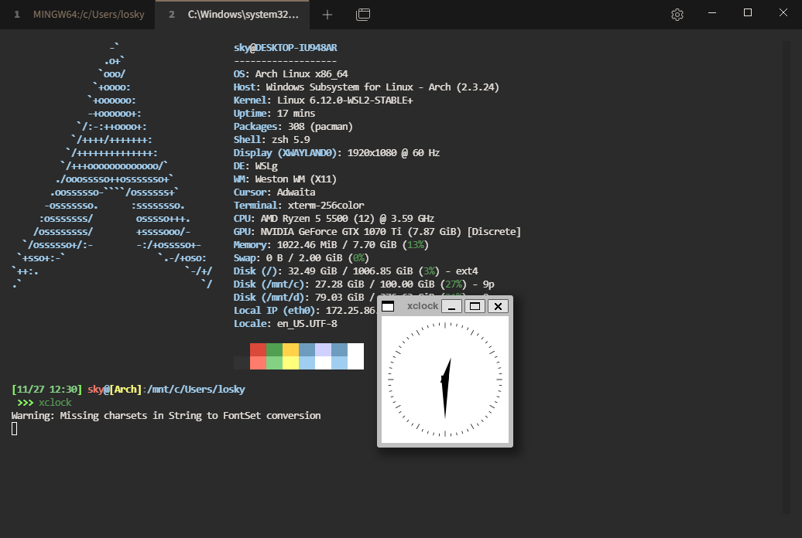
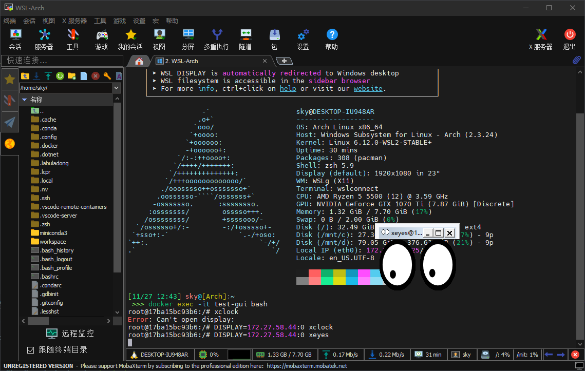
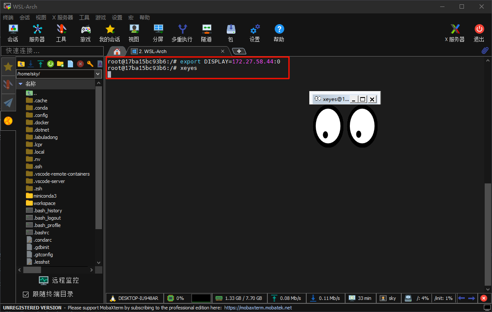
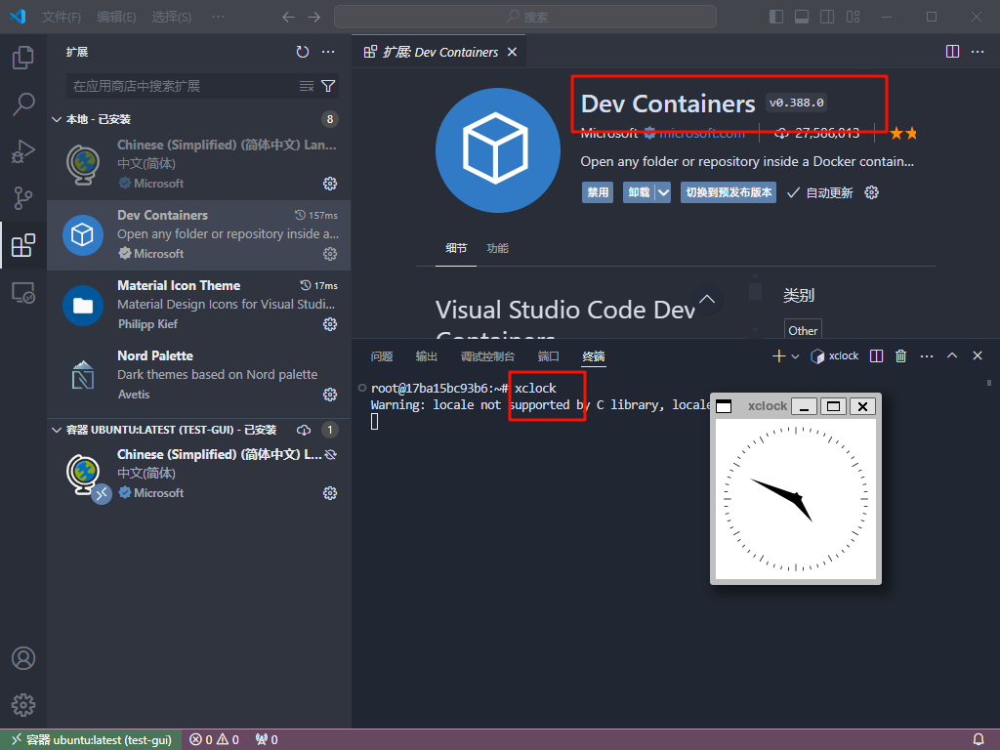
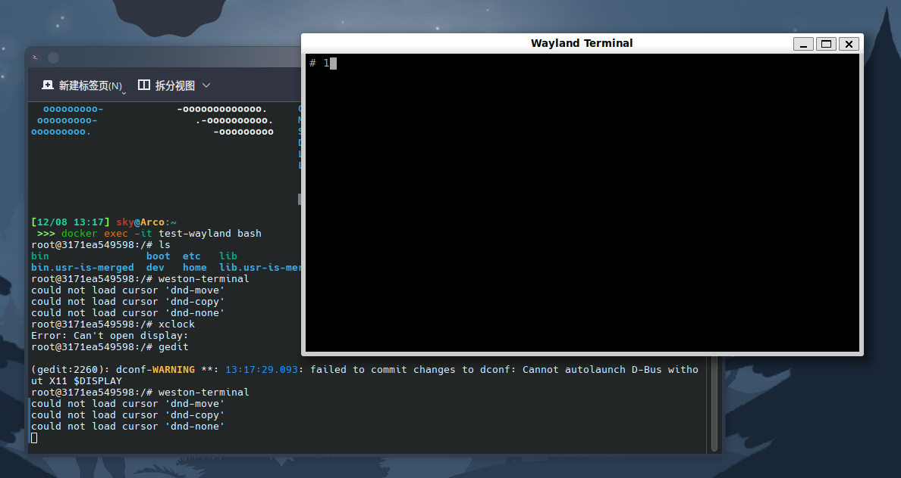

# 1. WSL2 执行 GUI 程序（X11）

需要在 Windows 上安装 MobaXterm，这里推荐安装中文版的（原版可以在官网下载）：[中文版 MobaXterm](https://github.com/RipplePiam/MobaXterm-Chinese-Simplified?tab=readme-ov-file)。这个软件自带 X11 Server。

> [!note] WSLg
> Windows 11 的 WSL2 已内置 WSLg（WSL Graphics），支持直接运行 GUI 程序而无需额外安装 X11 Server。如果你使用 Windows 11 且 WSL 版本较新，可以直接跳过 MobaXterm 的安装，WSL2 会自动处理 GUI 显示。MobaXterm 方案适用于 Windows 10 或需要更灵活 X11 转发的场景。

然后只需要在 WSL2（Linux 子系统发行版）中安装 x11-apps 即可。

对于 Ubuntu：

```bash
sudo apt install x11-apps -y
```

执行这条命令就能安装好配套的 x11-apps，比如 `xclock` 和 `xeyes`。

对于 Arch：

```bash
sudo pacman -S xorg-xclock xorg-xeyes
```

> [!tip] 最小化安装
> 如果只需要运行 GUI 程序而不需要完整的 X11 开发环境，安装 `xorg-xclock` 和 `xorg-xeyes` 即可，无需安装完整的 `xorg` 包组。

这样直接在终端、VSCode WSL2 中的终端或者 MobaXterm 中运行 `xclock` 或者 `xeyes` 就能显示 GUI 程序了。

```bash
xclock
```

如下图所示：


这样也能在 WSL2 中进行可视化开发，比如用 Python 的 matplotlib 绘图等。

如果运行不成功的话，可以执行下面的命令试试：

```bash
DISPLAY=<你的宿主机的IP>:0 xclock
```

比如：`DISPLAY=172.27.158.40:0 xclock`。

> [!tip] 获取宿主机 IP
> 在 WSL2 中可以通过以下命令获取 Windows 宿主机的 IP：
> ```bash
> cat /etc/resolv.conf | grep nameserver | awk '{print $2}'
> ```

---

# 2. Docker 容器中执行 GUI 程序（X11）

整体操作方式跟在 WSL2 中是一样的，这里以 Docker 的 Ubuntu 镜像为例子。

```bash
docker pull ubuntu
```

```bash
docker run -it --name=test-gui --env HTTP_PROXY=http://172.27.158.40:7890 --env HTTPS_PROXY=http://172.27.158.40:7890 ubuntu:latest
```

这里的 `--env HTTP_PROXY=http://172.27.158.40:7890 --env HTTPS_PROXY=http://172.27.158.40:7890` 是配置的代理服务，`172.27.158.40` 是宿主机的 IP 地址，是为了方便执行容器中一系列 `apt` 的命令。当然，也可以配置镜像源。

> [!warning] 代理地址格式
> 代理地址必须包含 `//`，即 `http://IP:PORT`，不能写成 `http:IP:PORT`。

如果要配置镜像源，记得安装 CA 证书：

```bash
apt-get install ca-certificates
```

进入容器后，先进行更新，执行：

```bash
apt-get update
```

然后下载：

```bash
apt-get install x11-apps
```

这里要运行 GUI 程序，只能在 MobaXterm 和 VSCode 中运行。

## 2.1 在 MobaXterm 中运行

```bash
DISPLAY=<你的宿主机的IP>:0 xclock
```

如下图所示：


如果觉得麻烦，可以把 `DISPLAY` 导入到环境变量中：

```bash
export DISPLAY=<你的宿主机的IP>:0
```

如下图所示：


> [!tip] 持久化 DISPLAY 变量
> 如果希望每次进入容器都自动设置 `DISPLAY`，可以在 Docker 运行时通过 `--env` 参数传递：
> ```bash
> docker run -it --name=test-gui --env DISPLAY=<宿主机IP>:0 ubuntu:latest
> ```

## 2.2 在 VSCode 中运行

需要通过 Dev Containers 扩展，进入到容器内部，然后直接执行命令即可：

```bash
xclock
```

如下图所示：


> [!warning] X11 权限问题
> 如果是在 Linux 系统下，在 VSCode 中运行可能会出现这样的错误：
> ```txt
> Authorization required, but no authorization protocol specified
> Error: Can't open display: :0
> ```
> 这意味着当前用户或容器中的环境没有被授权访问 X11 显示服务器（`DISPLAY=:0`）。这是一个典型的 X11 权限问题。
>
> 只需要在宿主机上运行以下命令，允许容器的用户访问显示服务：
> ```bash
> xhost +local:docker
> ```
>
> 如果希望更安全，只允许特定用户访问，可以指定用户（比如这里指定 root 用户）：
> ```bash
> xhost +SI:localuser:root
> ```
>
> > [!danger] 安全提醒
> > `xhost +` 会允许所有用户访问 X11 服务器，存在安全风险。使用完毕后建议恢复：`xhost -`

---

# 3. Docker 容器中执行 GUI 程序（Wayland）

运行容器时，挂载 Wayland 必需的 Socket 和环境变量：

```bash
docker run -it --name=test-wayland \
  -e WAYLAND_DISPLAY=$WAYLAND_DISPLAY \
  -e XDG_RUNTIME_DIR=$XDG_RUNTIME_DIR \
  -v $XDG_RUNTIME_DIR/$WAYLAND_DISPLAY:$XDG_RUNTIME_DIR/$WAYLAND_DISPLAY \
  --device=/dev/dri \
  ubuntu:latest
```

参数解释：
- `-e WAYLAND_DISPLAY=$WAYLAND_DISPLAY`：传递 Wayland 显示环境变量（通常为 `wayland-0`）。
- `-e XDG_RUNTIME_DIR=$XDG_RUNTIME_DIR`：传递 Wayland 的运行时目录。
- `-v $XDG_RUNTIME_DIR/$WAYLAND_DISPLAY:$XDG_RUNTIME_DIR/$WAYLAND_DISPLAY`：挂载 Wayland Socket 文件。
- `--device=/dev/dri`：允许容器访问 GPU。

> [!note] X11 兼容
> 如果容器中的应用仅支持 X11 而不支持 Wayland，可以在运行容器时额外挂载 X11 Socket 并设置 `DISPLAY` 环境变量，同时安装 `xwayland` 以提供兼容。

## 3.1 在容器中验证 Wayland 配置

进入容器后，验证环境是否正确：

1. 检查 `WAYLAND_DISPLAY`：

```bash
echo $WAYLAND_DISPLAY
```

应返回 `wayland-0` 或类似内容。

2. 检查 `XDG_RUNTIME_DIR`：

```bash
echo $XDG_RUNTIME_DIR
ls $XDG_RUNTIME_DIR
```

应包含 `wayland-0`。

## 3.2 运行 Weston-terminal（测试）

1. 安装 Weston 系列程序：

```bash
apt install -y weston
```

2. 运行 Weston-terminal 测试：

```bash
weston-terminal
```

如果配置正确，应该会打开一个终端窗口。如下图所示：


## 3.3 补充：切换 Wayland/X11 环境

如果你希望 `gedit` 和其他应用也通过 Wayland 运行，可以启动它们时强制启用 Wayland：

```bash
WAYLAND_DISPLAY=wayland-0 gedit
```

如果继续使用 X11，则无需修改。

> [!info] Wayland vs X11 选择
> - **Wayland**：更现代的显示协议，安全性更好，但部分旧应用可能不兼容。
> - **X11**：兼容性最广，几乎所有 GUI 应用都支持，但安全性相对较低。
> - 在 Docker 容器中，推荐优先尝试 Wayland 方案，遇到兼容性问题再回退到 X11。

---

# 4. 相关笔记

- [[WSL2_教程]] — WSL2 的安装与配置
- [[Docker_配置]] — Docker 在 Linux 下的配置
