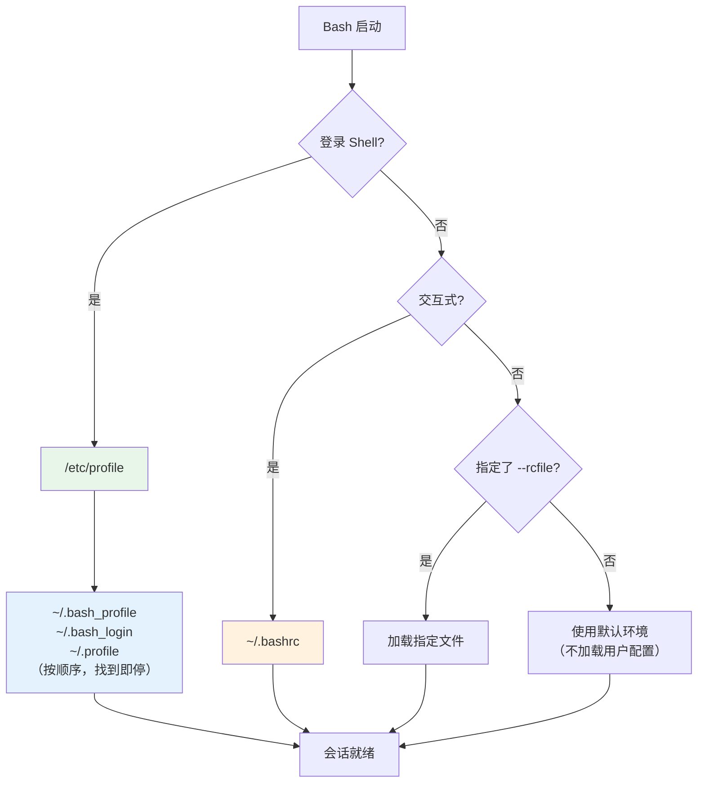

# 1. 核心概念

## 1.1 Bash 配置的本质

Bash 配置的核心目标是：**控制 Shell 会话的行为**。通过一系列配置文件和内置机制，实现环境变量设置、命令别名定义、函数封装、提示符定制等功能。

配置之所以复杂，是因为 Bash 在不同**启动模式**下会加载不同的配置文件。理解启动模式是理解配置加载的前提。

## 1.2 Shell 的四种启动模式

Bash 会话由两个维度交叉定义：

| 维度 | 类型 | 含义 | 典型场景 |
|---|---|---|---|
| 交互性 | **交互式** (Interactive) | 等待用户输入命令 | 终端模拟器、SSH 登录 |
| 交互性 | **非交互式** (Non-interactive) | 执行脚本，不等待输入 | `bash script.sh` |
| 登录 | **登录 Shell** (Login) | 用户身份验证后的 Shell | SSH 登录、`su - user`、TTY 登录 |
| 登录 | **非登录 Shell** (Non-login) | 无需验证即获得的 Shell | 图形终端打开新标签页、`bash` 直接执行 |

**判断当前 Shell 类型：**

```bash
# 判断是否为交互式 Shell
# 输出 "interactive" 则为交互式，否则为非交互式
[[ $- == *i* ]] && echo "interactive" || echo "non-interactive"

# 判断是否为登录 Shell
# 输出 "login" 则为登录 Shell
shopt -q login_shell && echo "login" || echo "non-login"
```

> [!tip] 记忆技巧
> 交互式关注"能不能打字"，登录式关注"有没有验过身份"。两者独立——SSH 登录是**交互式 + 登录**，图形终端新标签是**交互式 + 非登录**，`bash script.sh` 是**非交互式 + 非登录**。

---

# 2. 配置文件加载顺序

## 2.1 加载流程图



## 2.2 各配置文件职责

| 文件 | 作用域 | 触发条件 | 典型用途 |
|---|---|---|---|
| `/etc/profile` | 全局 | 登录 Shell | 系统级环境变量、PATH |
| `/etc/profile.d/*.sh` | 全局 | 被 `/etc/profile` 调用 | 按应用拆分的全局配置 |
| `/etc/bash.bashrc` | 全局 | 交互式非登录 Shell | 系统级别名、函数 |
| `~/.bash_profile` | 用户 | 登录 Shell（优先级最高） | 用户环境变量、启动 `~/.bashrc` |
| `~/.bash_login` | 用户 | 登录 Shell（次选） | 同上，较少使用 |
| `~/.profile` | 用户 | 登录 Shell（末选） | 兼容其他 Shell 的配置 |
| `~/.bashrc` | 用户 | 交互式非登录 Shell | 别名、函数、提示符定制 |
| `~/.bash_logout` | 用户 | 登录 Shell 退出时 | 清理临时文件、历史写入 |

> [!warning] 关键陷阱
> - `~/.bash_profile`、`~/.bash_login`、`~/.profile` 三者**只加载第一个找到的**，不会叠加。
> - 大多数发行版的 `~/.bash_profile` 末尾会 `source ~/.bashrc`，确保登录 Shell 也能获得 `~/.bashrc` 中的配置。**如果你的 `~/.bash_profile` 没有这样做，登录 Shell 下别名和函数将不生效。**

## 2.3 退出时的清理

登录 Shell 退出时加载 `~/.bash_logout`，典型配置：

```bash
# 清除屏幕内容，防止敏感信息残留
clear
```

---

# 3. 核心配置语法与变量

## 3.1 环境变量

### 3.1.1 定义与导出

```bash
# 局部变量：仅当前 Shell 可见
MY_VAR="hello"

# 导出为环境变量：子进程可继承
export MY_VAR="hello"

# 等价写法
MY_VAR="hello"
export MY_VAR
```

> [!warning] 注意
> 不加 `export` 的变量**不会传递给子进程**。在 `~/.bashrc` 中设置 PATH 时必须 `export`，否则子 Shell（如 `vim` 中 `:!cmd`）无法获取。

### 3.1.2 常用环境变量

| 变量 | 含义 | 示例值 |
|---|---|---|
| `PATH` | 命令搜索路径 | `/usr/local/bin:/usr/bin:/bin` |
| `HOME` | 用户主目录 | `/home/sky` |
| `USER` | 当前用户名 | `sky` |
| `SHELL` | 默认 Shell 路径 | `/bin/bash` |
| `PWD` | 当前工作目录 | `/home/sky/project` |
| `LANG` | 语言区域设置 | `en_US.UTF-8` |
| `HISTSIZE` | 内存中保留的历史条数 | `100000` |
| `HISTFILESIZE` | 磁盘历史文件最大条数 | `200000` |
| `HISTTIMEFORMAT` | 历史记录时间格式 | `"%F %T "` |

### 3.1.3 PATH 配置最佳实践

```bash
# 追加路径（推荐）：不影响系统已有路径
export PATH="$PATH:/opt/myapp/bin"

# 前置路径：优先使用自定义版本
export PATH="/usr/local/bin:$PATH"
```

> [!tip] 提示
> 将自定义路径放在 `$PATH` 之后（追加），避免意外覆盖系统命令；仅在明确需要覆盖时才前置。

## 3.2 别名（alias）

```bash
# 基本语法：alias 别名='实际命令'
alias ll='ls -alF'           # 详细列表
alias la='ls -A'             # 显示隐藏文件（不含 . 和 ..）
alias gs='git status'        # Git 快捷操作
alias rm='rm -i'             # 删除前确认

# 查看所有已定义别名
alias

# 查看特定别名定义
alias ll
# 输出：alias ll='ls -alF'

# 临时取消别名，使用原始命令
\rm file.txt
```

> [!warning] 注意
> - 别名**不支持参数替换**。如需参数，请使用函数（见 [[#3.3 函数]]）。
> - 在脚本中别名默认不展开，需 `shopt -s expand_aliases` 才能使用。

## 3.3 函数

```bash
# 基本语法
function_name() {
    # 函数体
    # $1, $2, ... 为位置参数
}

# 示例：快速创建目录并进入
mkcd() {
    mkdir -p "$1"    # -p 确保父目录存在
    cd "$1"          # 进入创建的目录
}

# 使用
mkcd ~/project/new_dir
```

### 3.3.1 别名 vs 函数选择原则

| 场景 | 推荐方式 | 原因 |
|---|---|---|
| 简单命令缩写 | `alias` | 语法简洁 |
| 需要参数处理 | 函数 | 别名无法接收参数 |
| 包含条件/循环逻辑 | 函数 | 别名仅做文本替换 |

## 3.4 Shell 选项（shopt）

```bash
# 查看所有选项状态
shopt

# 查看特定选项
shopt histappend
# 输出：histappend  on

# 开启选项
shopt -s histappend    # 历史追加而非覆盖

# 关闭选项
shopt -u histappend
```

**常用选项：**

| 选项 | 作用 | 推荐设置 |
|---|---|---|
| `histappend` | 退出时追加历史而非覆盖 | `on`（多终端共享历史必备） |
| `autocd` | 输入目录名直接 cd，无需 `cd` 前缀 | 按需 |
| `cdspell` | 自动修正 cd 拼写错误 | 按需 |
| `checkwinsize` | 命令执行后检查终端窗口大小 | `on`（默认） |

---

# 4. 实战场景与排错

## 4.1 历史记录增强：记录命令执行目录

### 4.1.1 问题背景

Bash 默认的 `history` 只记录命令本身，**不记录执行时的工作目录**：

```bash
$ history
1001  ls
1002  vim test.txt
```

无法得知 `vim test.txt` 是在哪个目录下执行的。

### 4.1.2 回溯已有历史的方法

| 方法 | 命令 | 能否获取目录 | 前提条件 |
|---|---|---|---|
| `history` + `HISTTIMEFORMAT` | `export HISTTIMEFORMAT="%F %T "` | 否 | 需提前配置 |
| `~/.bash_history` | `cat ~/.bash_history` | 否 | 默认仅存命令文本 |
| `auditd` 审计日志 | `ausearch -i -ua $(id -u)` | **是** | 系统需安装并启用 auditd |

> [!summary] 核心结论
> 若事前未配置目录记录且未启用 auditd，**事后无法从历史中恢复命令执行目录**。必须提前配置。

### 4.1.3 推荐配置：带目录的命令日志

在 `~/.bashrc` 末尾添加以下配置：

```bash
# --- 历史记录增强配置 ---

# 内存中保留的历史条数
export HISTSIZE=100000
# 磁盘历史文件最大条数
export HISTFILESIZE=200000
# 历史记录显示时间戳
export HISTTIMEFORMAT="%F %T "
# 忽略连续重复命令
export HISTCONTROL=ignoredups:erasedups
# 退出时追加历史（而非覆盖），多终端共享历史的关键
shopt -s histappend

# 去重状态：记录上次写入的条目（目录+命令），避免重复写入
LAST_LOGGED_ENTRY=""

# 命令日志函数：每次提示符显示前自动调用
log_command() {
    local cmd
    local entry

    # 从 history 获取最近一条命令，去除行号前缀
    cmd=$(history 1 | sed 's/^[ ]*[0-9]\+[ ]*//')

    # 将"当前目录+命令"组合为唯一标识，用于去重
    entry="$(pwd)|$cmd"

    # 如果与上次完全相同则跳过（同目录同命令不重复记录）
    if [[ "$entry" == "$LAST_LOGGED_ENTRY" ]]; then
        return
    fi

    LAST_LOGGED_ENTRY="$entry"

    # 追加写入日志文件，格式：时间 | 用户 | 目录 | 命令
    printf '%s | %s | %s | %s\n' \
        "$(date '+%F %T')" \
        "$USER" \
        "$(pwd)" \
        "$cmd" \
        >> "$HOME/.full_history"
}

# PROMPT_COMMAND：每次显示提示符前执行
# history -a 确保命令立即写入磁盘历史文件
PROMPT_COMMAND="history -a; log_command"
```

加载配置：

```bash
source ~/.bashrc
```

### 4.1.4 生效效果

正常使用 Shell 后，查看日志：

```bash
tail ~/.full_history
```

输出示例：

```text
2026-06-10 14:30:01 | sky | /home/sky | pwd
2026-06-10 14:30:05 | sky | /tmp | ls
2026-06-10 14:30:10 | sky | /home/sky/project | git status
```

实时监控：

```bash
tail -f ~/.full_history
```

### 4.1.5 去重逻辑说明

去重依据是 **目录+命令** 的组合，而非仅命令本身：

| 场景 | 是否记录 | 原因 |
|---|---|---|
| `/tmp` 下执行 `ls`，再在 `/home` 下执行 `ls` | 两次均记录 | 目录不同，属于不同上下文 |
| `/tmp` 下连续执行两次 `ls` | 仅记录一次 | 目录和命令完全相同 |
| 新终端中首次执行与上次终端相同的命令 | 会记录 | `LAST_LOGGED_ENTRY` 在新 Shell 中重新初始化 |

> [!warning] 注意
> `LAST_LOGGED_ENTRY` 是 Shell 变量，仅在当前 Shell 会话内有效。新开终端后该变量重置为空，因此不同终端间不共享去重状态——这是预期行为，不会导致日志丢失。

### 4.1.6 进阶方案：Bash 5.x 历史编号去重

Bash 5.x 可利用历史序号判断是否已记录，比字符串比较更可靠：

```bash
LAST_HIST_NUM=0

log_command() {
    local hist_num
    local cmd

    # 获取最近一条历史记录的编号
    hist_num=$(history 1 | awk '{print $1}')

    # 编号未变则说明无新命令，跳过
    if [[ "$hist_num" == "$LAST_HIST_NUM" ]]; then
        return
    fi

    LAST_HIST_NUM="$hist_num"

    cmd=$(history 1 | sed 's/^[ ]*[0-9]\+[ ]*//')

    printf '%s | %s | %s | %s\n' \
        "$(date '+%F %T')" \
        "$USER" \
        "$(pwd)" \
        "$cmd" \
        >> "$HOME/.full_history"
}

PROMPT_COMMAND="history -a; log_command"
```

### 4.1.7 扩展日志：记录更多信息

如需记录主机名、PID、TTY 等信息：

```bash
log_command() {
    local cmd
    cmd=$(history 1 | sed 's/^[ ]*[0-9]\+[ ]*//')

    # 格式：时间 | 用户 | 主机 | PID | TTY | 目录 | 命令
    printf '%s | user=%s | host=%s | pid=%s | tty=%s | cwd=%s | cmd=%s\n' \
        "$(date '+%F %T')" \
        "$USER" \
        "$(hostname)" \
        "$$" \
        "$(tty 2>/dev/null)" \
        "$(pwd)" \
        "$cmd" \
        >> "$HOME/.full_history"
}
```

输出示例：

```text
2026-06-10 15:30:01 | user=sky | host=server01 | pid=32418 | tty=/dev/pts/2 | cwd=/home/sky/project | cmd=git status
```

### 4.1.8 关于 `trap DEBUG` 方案

Bash 提供 `trap DEBUG` 机制可在命令执行前触发：

```bash
preexec_logger() {
    local cmd="$BASH_COMMAND"
    echo "$(date '+%F %T') | $(pwd) | $cmd" >> "$HOME/.full_history"
}
trap 'preexec_logger' DEBUG
```

> [!warning] 不推荐此方案
> `trap DEBUG` 会捕获**所有**命令执行，包括函数内部的 `printf`、`sed`、`history` 等子命令，产生大量噪音日志。`PROMPT_COMMAND` 方案仅在提示符显示前触发一次，更干净可靠。

## 4.2 提示符定制（PS1）

`PS1` 变量控制主提示符的显示内容：

```bash
# 默认提示符
echo $PS1
# 输出：[\u@\h \W]\$

# 自定义提示符：显示用户@主机 全路径 时间
export PS1='[\u@\h \w \t]\$ '
# 生效后显示：[sky@server01 /home/sky/project 14:30:01]$
```

**常用转义序列：**

| 转义 | 含义 | 示例输出 |
|---|---|---|
| `\u` | 用户名 | `sky` |
| `\h` | 主机名（短） | `server01` |
| `\H` | 主机名（全） | `server01.example.com` |
| `\w` | 当前目录（完整路径） | `/home/sky/project` |
| `\W` | 当前目录（仅目录名） | `project` |
| `\t` | 24 小时制时间 | `14:30:01` |
| `\d` | 日期 | `Sun Jun 15` |
| `\$` | root 显示 `#`，普通用户显示 `$` | `$` |

## 4.3 配置失效排查

| 现象 | 可能原因 | 排查方法 |
|---|---|---|
| 别名不生效 | 在登录 Shell 中，`~/.bash_profile` 未 source `~/.bashrc` | 检查 `~/.bash_profile` 是否包含 `source ~/.bashrc` |
| 环境变量子进程看不到 | 忘记 `export` | `export VAR=value` 替代 `VAR=value` |
| 修改 `~/.bashrc` 后未生效 | 未重新加载 | `source ~/.bashrc` 或新开终端 |
| 多终端历史丢失 | `histappend` 未开启或 `PROMPT_COMMAND` 未配置 | `shopt -s histappend` 并配置 `PROMPT_COMMAND='history -a'` |
| SSH 登录后提示符异常 | `~/.bash_profile` 覆盖了 PS1 | 检查 `~/.bash_profile` 中的 PS1 设置 |
| 脚本中别名不生效 | 非交互式 Shell 默认不展开别名 | 脚本开头加 `shopt -s expand_aliases` |

> [!tip] 通用排查流程
> 1. 确认当前 Shell 类型：`echo $-`（含 `i` 为交互式）、`shopt -q login_shell && echo login`
> 2. 确认配置文件是否被加载：在文件中加入 `echo "loaded ~/.bashrc"` 临时调试
> 3. 确认变量是否生效：`echo $VAR_NAME`
> 4. 确认加载顺序：在 `set -x` 模式下启动 Bash 观察执行过程

## 4.4 zsh 用户的差异

如果使用 zsh（`echo $SHELL` 输出 `/bin/zsh`），历史文件为 `~/.zsh_history`，默认格式：

```text
: 1749520000:0;git status
: 1749520010:0;vim main.cpp
```

同样只有时间戳，无目录信息。需额外配置：

```bash
# 在 ~/.zshrc 中添加
precmd() {
    print -sr -- "$(pwd) ::: $(history -1)"
}
```
