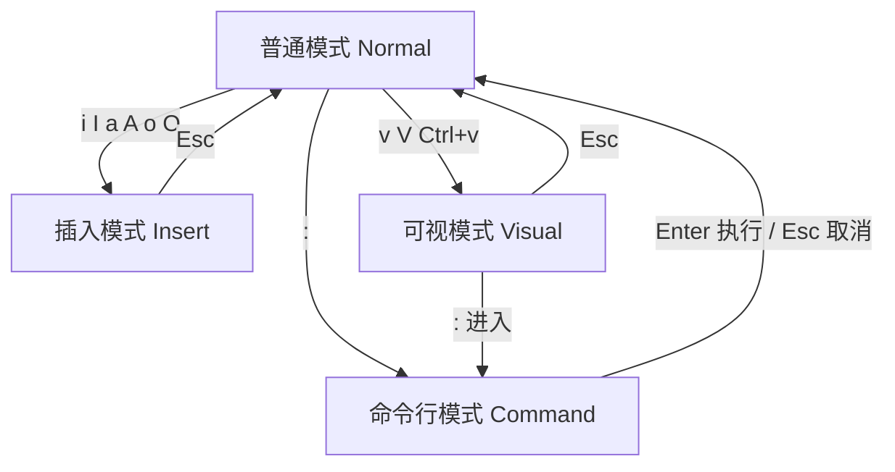
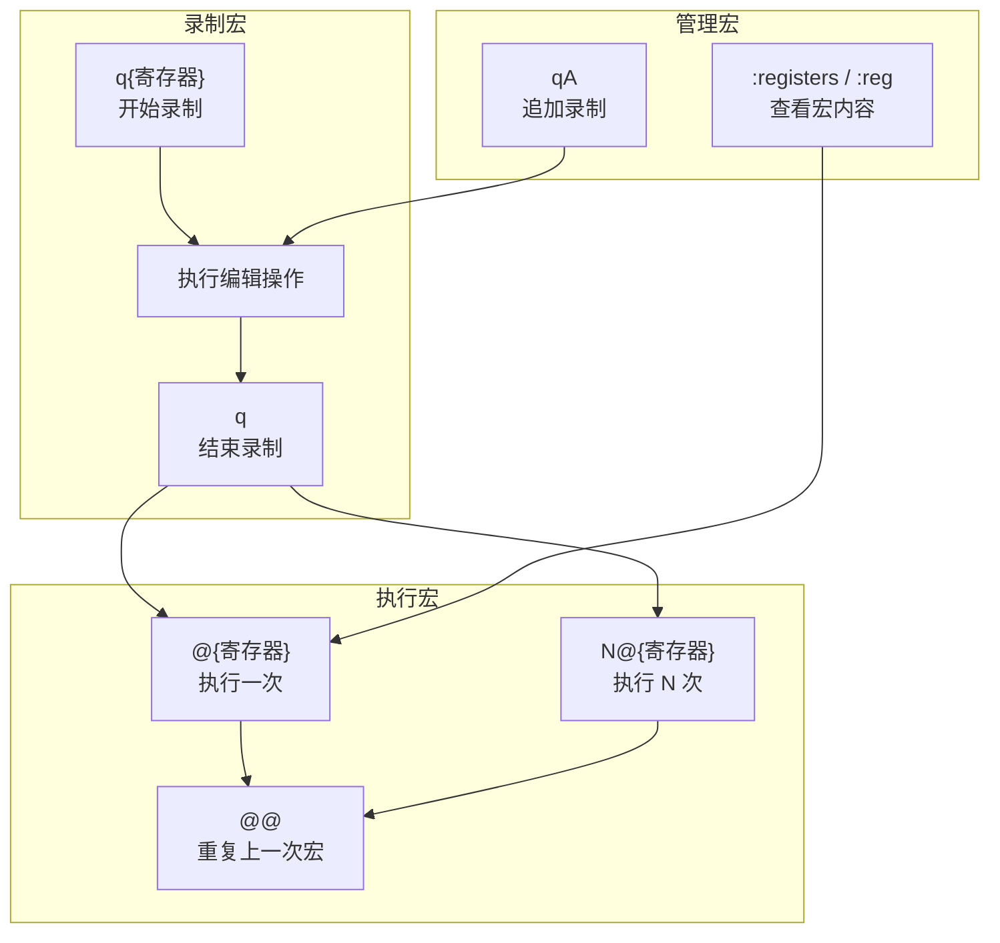
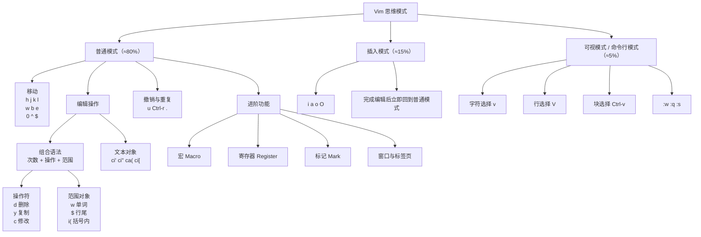

# 1. Vim 概述

## 1.1 什么是 Vim

Vim（Vi IMproved）是 Linux 系统上广泛使用的文本编辑器，几乎所有 Linux 发行版都预装了它。它是 Vi 的增强版本，由 Bram Moolenaar 于 1991 年发布。

## 1.2 为什么学习 Vim

| 场景 | 必要性 |
|---|---|
| 服务器运维（无 GUI） | ==必须==，SSH 登录后唯一可靠的编辑器 |
| 修改配置文件 | 几乎所有 Linux 教程默认使用 Vim |
| 应急恢复系统 | 单用户模式、救援模式下只有 Vi/Vim |
| 提升编辑效率 | 模态编辑 + 组合语法，熟练后远超鼠标操作 |

> [!info]
> 即使日常使用 VS Code / JetBrains，服务器环境中也绕不开 Vim。掌握基础操作是运维工程师的==硬性要求==。

## 1.3 核心设计理念

Vim 的核心设计理念是**模态编辑**——在不同模式下，相同的按键代表不同的操作。这使 Vim 在熟练后编辑效率极高，但也是初学者最大的门槛。

> [!summary]
> Vim 的本质：用模式切换替代组合键（如 Ctrl+...），将编辑操作拆分为**移动**和**动作**两个独立维度，通过组合实现高效编辑。

## 1.4 与其他编辑器对比

| 编辑器 | 模态 | 学习曲线 | 适用场景 | 远程支持 |
|---|---|---|---|---|
| **Vim** | 是 | 陡峭 | 服务器、配置文件 | 原生支持 |
| Nano | 否 | 平缓 | 简单编辑 | 原生支持 |
| Emacs | 可选 | 陡峭 | 编程、扩展性强 | 原生支持 |
| VS Code | 否 | 平缓 | 桌面编程 | 需 Remote 插件 |

> [!note]
> 可以通过 `vimtutor` 命令打开官方自带的 Vim 教程指南。

---

# 2. 模态编辑核心

## 2.1 四大模式



| 模式 | 进入方式 | 用途 | 时间占比 |
|---|---|---|---|
| **普通模式** | 启动 Vim / 按 `Esc` | 浏览、复制、删除、粘贴 | ~80% |
| **插入模式** | `i` `a` `o` 等 | 真正输入文字 | ~15% |
| **可视模式** | `v` `V` `Ctrl+v` | 选中文本块后批量操作 | ~4% |
| **命令行模式** | `:` | 保存、退出、替换、搜索 | ~1% |

> [!warning]
> **万能键 `Esc`**：无论处于什么模式，按 `Esc` 都会回到普通模式。卡住时连按两下 `Esc`。

## 2.2 模式思维

Vim 的操作逻辑不是"按住 Ctrl 再按某个键"，而是：

```text
切换模式 → 执行操作 → 回到普通模式
```

普通模式下的按键不是输入字符，而是**命令**。这是在 Vim 中高效编辑的认知基础。

---

# 3. 文件操作

## 3.1 启动与打开文件

| 命令 | 作用 |
|---|---|
| `vim file.txt` | 打开文件 |
| `vim +42 file.txt` | 打开并跳到第 42 行 |
| `vim +/keyword file.txt` | 打开并定位到第一个匹配 |
| `vim -R file.txt` | 只读模式打开 |
| `vimdiff a.txt b.txt` | 对比两个文件 |

## 3.2 保存与退出

在普通模式下输入 `:` 进入命令行模式后：

| 指令 | 作用 | 记忆 |
|---|---|---|
| `:w` | 保存 | Write |
| `:q` | 退出 | Quit |
| `:wq` | 保存并退出 | Write + Quit |
| `:x` | 保存并退出（有修改才写入） | 同 `:wq` 但更智能 |
| `:q!` | 强制退出不保存 | 放弃所有修改 |
| `:w!` | 强制保存（覆盖只读） | 忽略只读权限 |
| `ZZ` | 保存并退出 | 普通模式下直接按，无需 `:` |
| `ZQ` | 强制退出不保存 | 等同 `:q!` |

> [!tip]
> `ZZ`（两个大写 Z）是退出 Vim 最快的方式，无需进入命令行模式。

## 3.3 多文件操作

| 指令 | 作用 |
|---|---|
| `:e file2.txt` | 编辑另一个文件 |
| `:w new.txt` | 另存为 |
| `:r file.txt` | 将 file.txt 内容读入当前光标位置 |
| `:bn` | 切换到下一个缓冲区 |
| `:bp` | 切换到上一个缓冲区 |
| `:ls` | 列出所有缓冲区 |

---

# 4. 插入模式

从普通模式进入插入模式的六种入口：

| 指令 | 位置 | 记忆 |
|---|---|---|
| `i` | 光标**前** | Insert |
| `a` | 光标**后** | Append |
| `I` | 行**首** | 大写，行首插入 |
| `A` | 行**尾** | 大写，行尾追加 |
| `o` | 光标**下方**新开一行 | Open below |
| `O` | 光标**上方**新开一行 | Open above |

> [!tip]
> 记忆技巧：小写 = 靠近光标，大写 = 行的端点。`i/a` 是字符级，`I/A` 是行级。

---

# 5. 光标移动

## 5.1 基础移动

| 指令 | 方向 | 推荐理由 |
|---|---|---|
| `h` | 左 | 手不离开主键盘区 |
| `j` | 下 | 最常用 |
| `k` | 上 | 与 `j` 配对 |
| `l` | 右 | 与 `h` 配对 |

> [!tip]
> 方向键虽然也能用，但养成 `hjkl` 的肌肉记忆后，移动光标无需右手离开主键区，编辑效率会显著提升。
>
> 记忆：`j` 像一个向下的钩子，`k` 是 `j` 的镜像。

## 5.2 单词移动

| 指令 | 行为 |
|---|---|
| `w` | 跳到下一个单词的**词首** |
| `e` | 跳到当前/下一个单词的**词尾** |
| `b` | 跳到上一个单词的**词首** |

大写变体（`W` `E` `B`）：以空格为界跳转，忽略标点符号，跳得更远。

> [!warning]
> 小写 `w/b/e` 以**标点和空格**为分隔；大写 `W/B/E` 仅以**空格**为分隔。处理代码中的 `obj.method()` 时区别明显。

## 5.3 行内移动

| 指令 | 行为 | 使用场景 |
|---|---|---|
| `0` | 跳到绝对行首 | 极少使用 |
| `^` | 跳到行首第一个非空白字符 | 写代码最常用 |
| `$` | 跳到行尾 | 行尾追加或修改 |
| `f{字符}` | 跳到本行下一个该字符 | `fa` 跳到下一个 a |
| `F{字符}` | 跳到本行上一个该字符 | 反向查找 |
| `t{字符}` | 跳到本行下一个该字符**前** | 常配合 `d` 使用 |
| `;` | 重复上一次 `f/F/t/T` | 高效导航 |

## 5.4 页面与文件移动

| 指令 | 行为 |
|---|---|
| `gg` | 跳到文件**开头** |
| `G` | 跳到文件**末尾** |
| `{行号}G` | 跳到指定行（如 `42G`） |
| `Ctrl+f` | 向下翻一页（Forward） |
| `Ctrl+b` | 向上翻一页（Backward） |
| `Ctrl+d` | 向下翻半页（Down） |
| `Ctrl+u` | 向上翻半页（Up） |
| `H` | 跳到屏幕**顶部**（High） |
| `M` | 跳到屏幕**中部**（Middle） |
| `L` | 跳到屏幕**底部**（Low） |
| `:{行号}` Enter | 跳转到指定行（如 `:42`） |

## 5.5 标记与跳转

标记（Mark）用于在文件中"打书签"，方便快速跳回。

| 指令 | 作用 |
|---|---|
| `m{字母}` | 在当前光标位置设置标记（如 `ma`） |
| `` `{字母} `` | 跳到标记所在行行首 |
| `` `{字母}` `` | 跳到标记的精确位置 |
| `` `` `` | 跳回上一次跳转前的位置 |
| `` `" `` | 跳到上次退出文件时的位置 |
| `` `0 `` | 跳到上次退出 Vim 时的位置 |

> [!tip]
> 小写字母标记（`a-z`）仅在当前文件有效；大写字母标记（`A-Z`）可**跨文件**跳转，适合在多文件项目中标记关键位置。

---

# 6. 编辑与删除

Vim 的删除本质是**剪切**——删除的内容存入寄存器，可用 `p` 粘贴，相当于"移动"。

## 6.1 基础删除

| 指令 | 行为 | 说明 |
|---|---|---|
| `x` | 删除光标处字符 | 等同于 Delete |
| `X` | 删除光标前字符 | 等同于 Backspace |
| `dd` | 删除（剪切）整行 | 最高频操作之一 |
| `dw` | 删除到下一个单词首 | |
| `de` | 删除到单词尾 | 包含词尾字符 |
| `db` | 删除到上一个单词首 | |
| `d$` / `D` | 删除到行尾 | |
| `d0` | 删除到行首 | |
| `dG` | 删除到文件末尾 | |
| `dgg` | 删除到文件开头 | |

## 6.2 修改操作

| 指令 | 行为 | 说明 |
|---|---|---|
| `cc` / `S` | 删除整行，进入插入模式 | 改写整行 |
| `cw` | 删除单词，进入插入模式 | 改写单词 |
| `c$` / `C` | 删除到行尾并进入插入模式 | 改写到行尾 |
| `r{字符}` | 替换光标处单个字符 | 不进入插入模式 |
| `R` | 进入替换模式 | 连续替换多个字符 |
| `~` | 切换光标处字符大小写 | |

## 6.3 撤销与重做

| 指令 | 行为 |
|---|---|
| `u` | **撤销**（Undo） |
| `Ctrl+r` | **重做**（Redo） |
| `U` | 撤销整行的所有修改 |
| `.` | 重复上一次操作 |

> [!tip]
> `.`（点号）是 Vim 最高效的命令之一。例如：用 `dd` 删一行后，按 `.` 会继续删下一行；用 `cw` 改一个词后，按 `.` 会改下一个词。
>
> `.` 的本质是“重复最后一次**改变**”，不包括移动命令。

---

# 7. 复制与粘贴

## 7.1 复制（Yank）

| 指令 | 行为 | 记忆 |
|---|---|---|
| `yy` | 复制整行 | Yank line |
| `yw` | 复制一个单词 | Yank word |
| `y$` | 复制到行尾 | |
| `yG` | 复制到文件末尾 | |
| `ygg` | 复制到文件开头 | |

## 7.2 粘贴（Paste）

| 指令 | 行为 | 记忆 |
|---|---|---|
| `p` | 粘贴到光标**后** / 下一行 | Paste |
| `P` | 粘贴到光标**前** / 上一行 | Paste before |
| `gp` | 粘贴后光标移到新内容末尾 | |

> [!warning]
> `dd` 删除行后，内容进入寄存器，`p` 即可粘贴。这意味着 `dd` + `p` = **移动整行**（剪切+粘贴），而非单纯的删除。
>
> 行级内容（`yy`/`dd`）粘贴时在**下一行**；字符级内容（`dw`/`yw`）粘贴时在**光标后**。

## 7.3 寄存器

寄存器是 Vim 的“剪贴板”，Vim 有多个寄存器，远比系统剪贴板强大。

| 寄存器 | 表示 | 作用 |
|---|---|---|
| 未命名寄存器 | `""` | 默认存放最近一次删除/复制的内容 |
| 数字寄存器 | `"0` ~ `"9` | `"0` 存最近一次 yank，`"1`~`"9` 存最近 9 次删除 |
| 命名寄存器 | `"a` ~ `"z` | 用户自定义，可重复使用 |
| 系统剪贴板 | `"+` | 与系统剪贴板互通 |
| 主选区 | `"*` | X11 主选区（Linux） |

使用方式：

```text
"ayy    " 复制当前行到寄存器 a
"ap     " 粘贴寄存器 a 的内容
"0p     " 粘贴最近一次 yank 的内容（不会被 dd 覆盖）
"+y     " 复制选中内容到系统剪贴板
"+p     " 粘贴系统剪贴板内容
```

> [!tip]
> `"0p` 是救命稻草：当你 `yy` 复制后，又用 `dd` 删了别的行，未命名寄存器被覆盖，但 `"0` 仍保留着你 yank 的内容。

---

# 8. 搜索与替换

## 8.1 搜索

普通模式下：

| 指令 | 行为 |
|---|---|
| `/关键词` | 向下搜索 |
| `?关键词` | 向上搜索 |
| `n` | 跳到**下一个**匹配项 |
| `N` | 跳到**上一个**匹配项 |
| `*` | 向下搜索光标下的单词 |
| `#` | 向上搜索光标下的单词 |
| `:set hlsearch` | 高亮所有匹配 |
| `:noh` | 取消当前高亮 |

> [!tip]
> `*` 是搜索当前光标下单词的快捷方式，比 `/单词` + Enter 快得多，且自动匹配整词。

## 8.2 替换

命令行模式下，语法为 `:[范围]s/old/new/[标志]`：

| 指令 | 行为 |
|---|---|
| `:s/old/new/` | 替换**当前行**第一个匹配 |
| `:s/old/new/g` | 替换**当前行**所有匹配 |
| `:%s/old/new/g` | **全文替换** |
| `:%s/old/new/gc` | 全文替换，每次确认 |
| `:5,10s/old/new/g` | 替换第 5~10 行 |
| `:'<,'>s/old/new/g` | 替换可视模式选中的范围 |

标志位含义：

| 标志 | 作用 |
|---|---|
| `g` | 替换本行所有匹配（默认仅第一个） |
| `c` | 每次替换前确认 |
| `i` | 忽略大小写 |
| `e` | 不显示错误信息 |

> [!tip]
> `:%s/old/new/g` 是最高频的替换命令，`%` 表示全文范围，`g` 表示每行全部替换。
>
> 替换时分隔符不一定是 `/`，遇到路径时可用 `#` 或 `|`：`:%s#/var/log#/data/log#g`

---

# 9. 可视模式

先选中文本块，再执行操作。三种进入方式：

| 指令 | 模式 | 用途 |
|---|---|---|
| `v` | 字符可视 | 按字符精确选择 |
| `V` | 行可视 | 按整行选择 |
| `Ctrl+v` | 块可视 | **列选择**，批量操作 |

选中后的操作：

| 指令 | 行为 |
|---|---|
| `d` / `x` | 删除选中内容 |
| `y` | 复制选中内容 |
| `c` | 删除选中并进入插入模式 |
| `r{字符}` | 将选中内容全部替换为该字符 |
| `>` | 右缩进 |
| `<` | 左缩进 |
| `U` | 转大写 |
| `u` | 转小写 |
| `~` | 切换大小写 |

> [!tip]
> `Ctrl+v` 列选择 + `I` 插入 + `Esc` 是批量注释/编辑多行的经典组合。选中多行第一列 → `I` → 输入 `# ` → `Esc`，即可为所有选中行添加注释。

## 9.1 块编辑经典场景

**批量添加注释**：

```text
1. Ctrl+v 进入块可视
2. j/k 选中需要注释的行
3. I（大写 i）在行首插入
4. 输入 # 或 //
5. 按 Esc，所有选中行同步添加
```

**批量删除注释**：

```text
1. Ctrl+v 进入块可视
2. 选中所有注释符号
3. 按 d 删除
```

---

# 10. 命令组合语法

Vim 的命令遵循**操作符 + 范围**的组合模式，掌握后无需死记具体命令。

## 10.1 基本组合规则

```text
[数字] + 操作符 + 范围
```

| 组件 | 示例 | 含义 |
|---|---|---|
| 数字 | `3` | 重复次数 |
| 操作符 | `d`（删除）, `y`（复制）, `c`（修改） | 执行什么动作 |
| 范围 | `w`（单词）, `$`（行尾）, `j`（下一行） | 作用范围 |

## 10.2 操作符清单

| 操作符 | 作用 | 进入插入模式 |
|---|---|---|
| `d` | 删除（剪切） | 否 |
| `y` | 复制 | 否 |
| `c` | 修改 | 是 |
| `>` | 右缩进 | 否 |
| `<` | 左缩进 | 否 |
| `gU` | 转大写 | 否 |
| `gu` | 转小写 | 否 |
| `~` | 切换大小写 | 否 |

## 10.3 组合示例

| 命令 | 拆解 | 含义 |
|---|---|---|
| `dw` | d + w | 删除一个单词 |
| `y$` | y + $ | 复制到行尾 |
| `cb` | c + b | 删上一个单词并进入插入模式 |
| `3dd` | 3 + dd | 删除 3 行 |
| `5j` | 5 + j | 向下移动 5 行 |
| `2dw` | 2 + d + w | 删除 2 个单词 |
| `d5w` | d + 5 + w | 删除 5 个单词 |
| `c2w` | c + 2 + w | 修改 2 个单词 |
| `yyp` | yy + p | 复制一行并粘贴（复制行） |
| `ddp` | dd + p | 剪切一行并粘贴（交换两行） |
| `ciw` | c + iw | 修改当前单词（无需光标定位） |
| `ci"` | c + i" | 修改双引号内的内容 |
| `ca(` | c + a( | 修改括号及其内容 |
| `dat` | d + at | 删除整个 `<tag>` 标签块 |

> [!summary]
> 核心公式：**数字（可选）+ 动作（d/y/c） + 范围（w/b/$/j/行号）**。学会这个规则，你就能"创造"命令，而不需要"背诵"命令。

## 10.4 文本对象

`i`（inner）和 `a`（around）配合成对符号使用：

| 命令 | 含义 |
|---|---|
| `iw` / `aw` | 内部单词 / 含周围空格的单词 |
| `i"` / `a"` | 双引号内 / 含双引号 |
| `i'` / `a'` | 单引号内 / 含单引号 |
| `i(` / `a(` | 括号内 / 含括号 |
| `i{` / `a{` | 大括号内 / 含大括号 |
| `it` / `at` | HTML 标签内 / 含标签 |
| `is` / `as` | 句子内 / 含周围空格 |
| `ip` / `ap` | 段落内 / 含周围空行 |

> [!tip]
> `ci"` 是修改字符串内容的神器：光标在 `"hello"` 任意位置按 `ci"`，即可清空引号内内容并进入插入模式，无需手动定位引号位置。

---

# 11. 多窗口与分屏

## 11.1 窗口分屏

| 指令 | 作用 |
|---|---|
| `:split` / `:sp` | 水平分屏 |
| `:vsplit` / `:vs` | 垂直分屏 |
| `:split file2.txt` | 水平分屏打开另一文件 |
| `Ctrl+w s` | 水平分屏当前窗口 |
| `Ctrl+w v` | 垂直分屏当前窗口 |
| `:q` | 关闭当前窗口 |

## 11.2 窗口切换与调整

| 指令 | 作用 |
|---|---|
| `Ctrl+w h/j/k/l` | 切换到左/下/上/右窗口 |
| `Ctrl+w w` | 循环切换窗口 |
| `Ctrl+w =` | 所有窗口等分 |
| `Ctrl+w +` | 增高当前窗口 |
| `Ctrl+w -` | 降低当前窗口 |
| `Ctrl+w >` | 增宽当前窗口 |
| `Ctrl+w <` | 缩窄当前窗口 |
| `Ctrl+w H/J/K/L` | 将窗口移到最左/下/上/右 |

## 11.3 标签页（Tab）

| 指令 | 作用 |
|---|---|
| `:tabnew file.txt` | 新标签页打开文件 |
| `:tabclose` | 关闭当前标签 |
| `gt` | 下一个标签 |
| `gT` | 上一个标签 |
| `{N}gt` | 跳到第 N 个标签 |

---

# 12. 宏录制

宏是 Vim 的"自动化利器"——录制一系列操作，然后重复执行。

## 12.1 宏的基本流程



| 指令 | 作用 |
|---|---|
| `q{字母}` | 开始录制到寄存器（如 `qa`） |
| `q` | 停止录制 |
| `@{字母}` | 执行寄存器中的宏（如 `@a`） |
| `@@` | 重复执行上一次宏 |
| `{N}@{字母}` | 执行宏 N 次（如 `100@a`） |

## 12.2 实战示例：批量处理行

需求：给以下每行行首加 `> `：

```text
第一行
第二行
第三行
```

操作步骤：

```text
1. 光标移到第一行
2. qa          开始录制到寄存器 a
3. I> [空格]   行首插入 "> "
4. Esc         回普通模式
5. j           下一行
6. q           停止录制
7. 2@a         执行 2 次（处理剩余 2 行）
```

> [!tip]
> 录制宏时务必保证每步可重复——尤其是移动命令。用 `0`（绝对行首）或 `^`（行首非空）而非方向键，确保下次执行时光标位置正确。

---

# 13. Vim 配置基础

## 13.1 配置文件位置

| 文件 | 作用 |
|---|---|
| `/etc/vimrc` | 全局配置（系统级） |
| `~/.vimrc` | 用户配置（推荐） |
| `~/.config/nvim/init.vim` | Neovim 配置 |
| `~/.vim/` | Vim 运行时目录（插件、语法等） |

## 13.2 推荐基础配置

> 双引号 `"` 开头的内容就是 .vimrc 的注释。

```vim
" ===== 基础 =====
set nocompatible            " 关闭 Vi 兼容模式
syntax on                   " 语法高亮
filetype plugin indent on   " 文件类型检测

" ===== 编辑体验 =====
set number                  " 显示行号
"set relativenumber          " 相对行号（配合 5j 等操作）
set cursorline              " 高亮当前行
set showmatch               " 高亮匹配括号
set wildmenu                " 命令行补全菜单

" ===== 缩进 =====
set tabstop=4               " Tab 显示宽度
set shiftwidth=4            " 自动缩进宽度
set expandtab               " Tab 转空格
set autoindent              " 自动缩进
set smartindent             " 智能缩进

" ===== 搜索 =====
set incsearch               " 实时高亮匹配
set hlsearch                " 高亮搜索结果
set ignorecase              " 忽略大小写
set smartcase               " 有大写时不忽略

" ===== 编码 =====
set encoding=utf-8
set fileencodings=utf-8,gbk,gb18030,big5

" ===== 其他 =====
set backspace=indent,eol,start  " Backspace 正常删除
set mouse=a                      " 启用鼠标
set laststatus=2                 " 始终显示状态栏
set statusline=%F                " 显示当前文件的绝对路径（Full path）

" ===== 快捷键 =====
nnoremap <F1> :nohlsearch<CR><Esc>            " 按 F1 键关闭搜索高亮
nnoremap <F2> :set number!<CR>                " 按 F2 开启/关闭行号功能
nnoremap <F3> :set relativenumber!<CR>        " 按 F3 开启/关闭相对行号功能
```

> [!tip]
> 1. `set relativenumber` 配合 `5j`、`10k` 等数字移动非常高效——当前行显示 0，上下行显示相对距离，一眼就知道要跳几行。
> 2. 如果 vim 版本过低，设置 `ESC` 键为其他功能映射，可能会导致卡顿，建议设置其它键。

## 13.3 主题配置

Vim 的配色主题（colorscheme）决定了语法高亮、背景、前景等颜色显示。配置主题有两种路径：

| 方式 | 说明 | 适用场景 |
|---|---|---|
| **使用自带主题** | Vim 内置 20+ 个主题，零配置即用 | 快速上手、服务器环境 |
| **安装第三方主题** | 如 gruvbox、tokyonight、catppuccin | 长期开发、追求美观 |

> [!info]
> Vim 主题的本质就是一个（或几个）`.vim` 文件，放置在 `colors/` 目录下。Vim 启动时会从 `runtimepath` 中的 `colors/` 目录加载主题。

### 13.3.1 主题查找路径

Vim 会在以下目录查找主题文件：

| 系统 | 路径 |
|---|---|
| Linux/macOS | `~/.vim/colors/` |
| Windows | `C:\Users\<用户名>\vimfiles\colors\` |
| 全局（Linux） | `/usr/share/vim/vimXX/colors/`（XX 为版本号） |

目录结构示例：

```text
~/.vim/
└── colors/
    ├── gruvbox.vim
    ├── desert.vim
    └── tokyonight.vim
```

### 13.3.2 使用自带主题

#### 查看当前主题

进入 Vim 后执行（`colorscheme` 可缩写为 `colo`）：

```vim
:colorscheme
```

#### 列出可用主题

```vim
:colorscheme <Tab>
```

连续按 `Tab`（或 `Ctrl+D`）即可列出所有可用主题。常见自带主题包括：

```text
blue       delek     industry  morning   pablo     quiet    ron     slate    zaibatsu
darkblue   desert    koehler   lunaperche peachpuff retrobox shine  torte    zellner
default    elflord   evening   murphy
```

![[imgs/02_Vim_教程/01.png]]

> [!info]
> 不同 Vim 版本内置主题略有不同，可用 `:colorscheme <Tab>` 查看实际列表。

#### 设置主题

**临时设置**（当前会话生效）：

```vim
:colorscheme desert
" 或简写
:colo evening
```

**永久生效**（写入 `~/.vimrc`）：

```vim
colorscheme desert
```

#### 背景模式

部分主题支持根据背景模式（`dark` / `light`）自动调整配色：

```vim
set background=dark    " 深色背景
set background=light   " 浅色背景
```

> [!warning]
> ==必须先设置背景，再加载主题==，否则主题可能无法正确应用暗/亮模式：

```vim
set background=dark
colorscheme desert
```

### 13.3.3 安装第三方主题

第三方主题（如 gruvbox、tokyonight、catppuccin）通常色彩更丰富、对 True Color 支持更好。以 **gruvbox** 为例。

安装方式有两种：

| 方式 | 说明 | 适用 |
|---|---|---|
| **方式一：仅复制主题文件** | 只复制 `colors/gruvbox.vim` | 仅需基础配色 |
| **方式二：完整安装** | 复制 `colors/` + `autoload/` | 需要 `:Gruvbox` 等命令、完整功能 |

#### 通过插件管理器安装

如果已使用插件管理器（如 vim-plug、Vundle、Pathogen），安装最简便。以 **vim-plug** 为例：

```vim
" 在 .vimrc 的 call plug#begin() 和 call plug#end() 之间
Plug 'morhetz/gruvbox'
```

在 Vim 中执行安装：

```vim
:PlugInstall
```

然后在 `.vimrc` 中启用：

```vim
colorscheme gruvbox
```

#### 手动安装：方式一（仅复制主题文件）

只需复制 `colors/gruvbox.vim` 一个文件，适合仅需基础配色的场景。

**第 1 步：创建 colors 目录**

```bash
mkdir -p ~/.vim/colors
```

**第 2 步：下载 gruvbox 仓库**

```bash
git clone https://github.com/morhetz/gruvbox.git
```

仓库结构：

```text
gruvbox/
├── autoload/
├── colors/
│   └── gruvbox.vim    ← 仅需此文件
├── README.md
└── ...
```

**第 3 步：复制主题文件**

```bash
cp gruvbox/colors/gruvbox.vim ~/.vim/colors/
```

**第 4 步：配置 `.vimrc`**

```vim
set background=dark
colorscheme gruvbox
```

重新打开 Vim 即可生效。

#### 手动安装：方式二（完整安装，推荐）

部分功能（如 `:Gruvbox` 命令、兼容性支持）依赖 `autoload/` 目录，因此建议把 `colors/` 和 `autoload/` 都复制到 Vim 运行时路径。

```bash
cp -r gruvbox/colors ~/.vim/
cp -r gruvbox/autoload ~/.vim/
```

安装后的目录结构：

```text
~/.vim/
├── autoload/      ← 方式二额外复制
├── colors/
│   └── gruvbox.vim
└── ...
```

> [!tip]
> 方式一和方式二的区别仅在于是否复制 `autoload/`。如果只用 `colorscheme gruvbox`，方式一足够；若需要主题提供的额外命令（如 `:Gruvbox`），用方式二。

#### Windows 安装

Windows 下 Vim 的配置目录为 `C:\Users\<用户名>\vimfiles\`（非 `.vim`）。

**第 1 步：创建目录**

```text
vimfiles\
└── colors\
```

**第 2 步：放入主题文件**

将 `gruvbox.vim` 复制到 `vimfiles\colors\` 下：

```text
C:\Users\<用户名>\
└── vimfiles
    └── colors
        └── gruvbox.vim
```

**第 3 步：配置 `_vimrc`**

Windows 下 Vim 配置文件为 `C:\Users\<用户名>\_vimrc`：

```vim
set background=dark
colorscheme gruvbox
```

### 13.3.4 验证安装

进入 Vim 执行：

```vim
:colorscheme gruvbox
```

- **未报错**：安装成功
- **报错 `E185: Cannot find color scheme 'gruvbox'`**：主题文件未找到

> [!warning]
> 若出现 `E185` 错误，按以下顺序排查：
>
> 1. 确认 `gruvbox.vim` 在 `~/.vim/colors/`（或 Windows 的 `vimfiles\colors\`）下
> 2. 确认 `~/.vim`（或 `vimfiles`）在 `runtimepath` 中：`:echo &runtimepath`
> 3. 确认文件名拼写正确（`gruvbox.vim`，非 `Gruvbox.vim`）

### 13.3.5 颜色支持配置

第三方主题（如 gruvbox）对终端颜色支持有要求，颜色支持不足会导致显示异常。

#### 256 色

```vim
set t_Co=256
```

> [!info]
> 现代 Vim（8.x/9.x）和现代终端通常默认支持 256 色，无需手动设置。

#### True Color（推荐）

True Color 支持 24 位真彩色，是现代主题的最佳选择：

```vim
set termguicolors
```

检查 Vim 是否支持 True Color：

```vim
:echo has('termguicolors')
```

输出 `1` 表示支持，`0` 表示不支持（需**升级 Vim 版本**）。

> [!warning]
> `set termguicolors` 需要**终端模拟器**也支持 True Color。常见支持 True Color 的终端：
>
> | 终端 | 支持 True Color |
> |---|---|
> | Windows Terminal | 是 |
> | iTerm2 | 是 |
> | GNOME Terminal | 是 |
> | Xshell | 需在设置中开启 |
> | tmux | 需额外配置 `tmux-256color` |

### 13.3.6 gruvbox 完整配置

```vim
" ===== 主题 =====
set termguicolors
set background=dark
colorscheme gruvbox                                                                                                                           
```

> [!info]
> **gruvbox 版本说明**：
>
> - `morhetz/gruvbox`：最初的经典版本，目前已不积极维护，但传统 Vim 仍可正常使用
> - `gruvbox-community/gruvbox`：社区维护版本，对新版 Vim 支持更好
> - `ellisonleao/gruvbox.nvim`：Neovim 专用版本，支持 LSP/Treesitter 高亮

> [!summary]
> **主题配置核心**
>
> - Vim 主题本质是 `colors/` 目录下的 `.vim` 文件
> - 自带主题用 `:colorscheme <Tab>` 查看，`colorscheme desert` 设置
> - 第三方主题安装：复制 `colors/` 目录（基础）或 `colors/` + `autoload/`（完整）
> - ==先 `set background`，再 `colorscheme`==
> - 第三方主题建议开启 `set termguicolors` 以获得最佳显示效果

---

# 14. 常见问题

## 14.1 鼠标右键无法弹出菜单

> [!question]
> 在终端中用 Vim 打开文本后，鼠标右键不显示菜单栏，或 `Shift+Ctrl+C` 无法复制选中内容。

**原因**：终端软件与终端程序（Vim、tmux、less、fzf 等）抢占鼠标事件。当 Vim 启用 `set mouse=a` 时，鼠标事件被发送给 Vim 而非终端软件：

```text
鼠标右键
↓
Xshell 不再认为是「打开菜单」
↓
而是把右键事件发送给 Vim
↓
Vim 接收到鼠标点击
```

### 方法一：按住 Shift 再右键（推荐）

在进行文本选中的时候按住 `Shift + 鼠标左键`，然后再按住 `Shift + 鼠标右键` 弹出菜单栏，鼠标事件不会发送给终端程序，而是由终端软件自己处理。适用于 Xshell、MobaXterm、Windows Terminal、GNOME Terminal 等。

### 方法二：临时关闭 Vim 鼠标

```vim
:set mouse=        " 关闭
:set mouse?        " 查看当前设置
:set mouse=a       " 重新开启
```

### 方法三：永久关闭 Vim 鼠标

在 `~/.vimrc` 中添加：

```vim
set mouse=
```

## 14.2 中文乱码

在 `~/.vimrc` 中配置编码：

```vim
set encoding=utf-8
set fileencodings=utf-8,gbk,gb18030,big5,latin1
```

或在 Vim 中临时转换：

```vim
:e ++enc=gbk      " 以 GBK 重新打开
```

## 14.3 误按 Ctrl+S 终端卡死

> [!warning]
> `Ctrl+S` 在终端中是"停止输出"的流控信号，不是保存！误按后终端看似卡死，实际只是输出被暂停。

解决：按 `Ctrl+Q` 恢复输出。

## 14.4 退出 Vim 的几种方式

```text
ZZ          " 保存退出（最快）
:wq         " 保存退出
:q!         " 不保存退出
ZQ          " 不保存退出
:xa         " 全部保存退出（多文件）
```

---

# 15. 学习路径

## 15.1 生存期（第一周）

先掌握这些，保证基本使用：

```text
i → 插入
Esc → 回普通模式
:wq → 保存退出
dd → 删行
yy → 复制行
p  → 粘贴
u  → 撤销
```

## 15.2 效率期（第二周起）

逐步加入：

```text
w / b / 0 / $  → 快速移动
.              → 重复操作
ciw            → 修改当前单词
/ 搜索 + n     → 导航
V 行选中       → 批量操作
:%s/old/new/g  → 全文替换
```

## 15.3 精通期（持续积累）

```text
Ctrl+v 块编辑
宏录制 q + @
寄存器 "0 / "a
文本对象 ci" / ca(
多窗口 :split / :vsplit
标记 ma / 'a
```

> [!tip]
> 不需要一次全部记住。把每个新命令当作一个"工具"——遇到具体场景时学一个，用熟了再学下一个。
>
> 推荐练习方式：在终端运行 `vimtutor`（Vim 自带教程，约 30 分钟）。

---

# 16. 快速参考速查表

## 16.1 模式切换

| 按键 | 作用 |
|---|---|
| `Esc` | 回到普通模式（万能键） |
| `i I a A o O` | 进入插入模式 |
| `v V Ctrl+v` | 进入可视模式 |
| `:` | 进入命令行模式 |
| `R` | 进入替换模式 |

## 16.2 移动速查

| 按键 | 作用 |
|---|---|
| `h j k l` | 左 下 上 右 |
| `w b e` | 词首 词首 词尾 |
| `0 ^ $` | 行首 行首非空 行尾 |
| `gg G` | 文件首 文件尾 |
| `Ctrl+f Ctrl+b` | 下翻页 上翻页 |
| `Ctrl+d Ctrl+u` | 下半页 上半页 |
| `H M L` | 屏幕顶 中 底 |
| `{ }` | 段落间跳转 |
| `%` | 匹配括号跳转 |

## 16.3 编辑速查

| 按键 | 作用 |
|---|---|
| `x X` | 删字符 删前字符 |
| `dd yy cc` | 删行 复制行 改行 |
| `dw yw cw` | 删词 复制词 改词 |
| `d$ y$ c$` | 到行尾 |
| `p P` | 粘贴后 粘贴前 |
| `u Ctrl+r` | 撤销 重做 |
| `.` | 重复上次操作 |
| `r R` | 替换单字符 替换模式 |

## 16.4 搜索替换速查

| 按键 | 作用 |
|---|---|
| `/ ?` | 向下/向上搜索 |
| `n N` | 下一个/上一个 |
| `* #` | 搜索光标下单词 |
| `:s/old/new/` | 当前行替换第一个 |
| `:s/old/new/g` | 当前行全替换 |
| `:%s/old/new/g` | 全文替换 |
| `:%s/old/new/gc` | 全文替换并确认 |

## 16.5 保存退出速查

| 按键 | 作用 |
|---|---|
| `:w` | 保存 |
| `:q` | 退出 |
| `:wq` / `ZZ` | 保存退出 |
| `:q!` / `ZQ` | 强制退出 |
| `:x` | 智能保存退出 |

---

# 17. 总结



> [!summary]
> **本节核心**
>
> - Vim 的灵魂是**模态编辑**：普通模式下按键都是命令而非字符。
> - 编辑效率来自**组合语法**：`数字 + 操作符 + 范围`，而不是死记命令。
> - 三条生命线：`Esc`（回普通模式）、`u`（撤销）、`:q!`（放弃退出）。
> - `.`（重复）和 `hjkl`（移动）是效率分水岭，越早养成肌肉记忆越好。
> - 进阶利器：**文本对象**（`ci"`）、**宏**（`q`/`@`）、**寄存器**（`"a`）。
> - 配置 `~/.vimrc` 是长期投入，建议从最小配置开始逐步积累。
