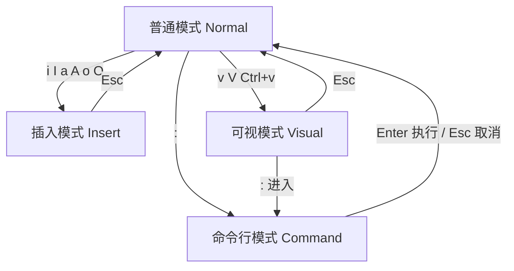
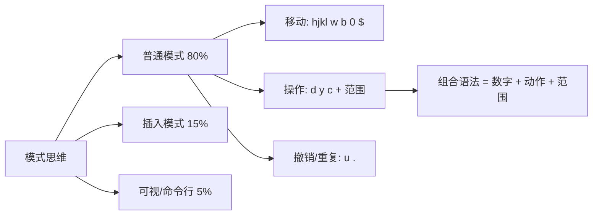

# 1. Vim 概述

Vim（Vi IMproved）是 Linux 系统上广泛使用的文本编辑器，几乎所有 Linux 发行版都预装了它。

Vim 的核心设计理念是**模态编辑**——在不同模式下，相同的按键代表不同的操作。这使 Vim 在熟练后编辑效率极高，但也是初学者最大的门槛。

> [!summary]
> Vim 的本质：用模式切换替代组合键（如 Ctrl+...），将编辑操作拆分为**移动**和**动作**两个独立维度，通过组合实现高效编辑。

# 2. 模态编辑核心

## 2.1 四大模式



| 模式 | 进入方式 | 用途 | 时间占比 |
|---|---|---|---|
| **普通模式** | 启动 Vim / 按 `Esc` | 浏览、复制、删除、粘贴 | ~80% |
| **插入模式** | `i` `a` `o` 等 | 真正输入文字 | ~15% |
| **可视模式** | `v` `V` `Ctrl+v` | 选中文本块后批量操作 | ~4% |
| **命令行模式** | `:` | 保存、退出、替换、搜索 | ~1% |

> [!warning]
> **万能键 `Esc`**：无论处于什么模式，按 `Esc` 都会回到普通模式。卡住时连按两下 `Esc`。

## 2.2 模式思维

Vim 的操作逻辑不是"按住 Ctrl 再按某个键"，而是：

```text
切换模式 → 执行操作 → 回到普通模式
```

普通模式下的按键不是输入字符，而是**命令**。这是在 Vim 中高效编辑的认知基础。

# 3. 文件操作

## 3.1 保存与退出

在普通模式下输入 `:` 进入命令行模式后：

| 指令 | 作用 | 记忆 |
|---|---|---|
| `:w` | 保存 | Write |
| `:q` | 退出 | Quit |
| `:wq` | 保存并退出 | Write + Quit |
| `:x` | 保存并退出（有修改才写入） | 同 `:wq` 但更智能 |
| `:q!` | 强制退出不保存 | 放弃所有修改 |
| `ZZ` | 保存并退出 | 普通模式下直接按，无需 `:` |

> [!tip]
> `ZZ`（两个大写 Z）是退出 Vim 最快的方式，无需进入命令行模式。

# 4. 插入模式

从普通模式进入插入模式的六种入口：

| 指令 | 位置 | 记忆 |
|---|---|---|
| `i` | 光标**前** | Insert |
| `a` | 光标**后** | Append |
| `I` | 行**首** | 大写，行首插入 |
| `A` | 行**尾** | 大写，行尾追加 |
| `o` | 光标**下方**新开一行 | Open below |
| `O` | 光标**上方**新开一行 | Open above |

# 5. 光标移动

## 5.1 基础移动

| 指令 | 方向 | 推荐理由 |
|---|---|---|
| `h` | 左 | 手不离开主键盘区 |
| `j` | 下 | 最常用 |
| `k` | 上 | 与 `j` 配对 |
| `l` | 右 | 与 `h` 配对 |

> [!tip]
> 方向键虽然也能用，但养成 `hjkl` 的肌肉记忆后，移动光标无需右手离开主键区，编辑效率会显著提升。

## 5.2 单词移动

| 指令 | 行为 |
|---|---|
| `w` | 跳到下一个单词的**词首** |
| `e` | 跳到当前/下一个单词的**词尾** |
| `b` | 跳到上一个单词的**词首** |

大写变体（`W` `E` `B`）：以空格为界跳转，忽略标点符号，跳得更远。

## 5.3 行内移动

| 指令 | 行为 | 使用场景 |
|---|---|---|
| `0` | 跳到绝对行首 | 极少使用 |
| `^` | 跳到行首第一个非空白字符 | 写代码最常用 |
| `$` | 跳到行尾 | 行尾追加或修改 |

## 5.4 页面与文件移动

| 指令 | 行为 |
|---|---|
| `gg` | 跳到文件**开头** |
| `G` | 跳到文件**末尾** |
| `Ctrl+f` | 向下翻一页（Forward） |
| `Ctrl+b` | 向上翻一页（Backward） |
| `:{行号}` Enter | 跳转到指定行（如 `:42`） |

# 6. 编辑与删除

Vim 的删除本质是**剪切**——删除的内容存入寄存器，可用 `p` 粘贴，相当于"移动"。

| 指令 | 行为 | 说明 |
|---|---|---|
| `x` | 删除光标处字符 | 等同于 Delete |
| `X` | 删除光标前字符 | 等同于 Backspace |
| `dd` | 删除（剪切）整行 | 最高频操作之一 |
| `dw` | 删除到下一个单词首 | |
| `d$` / `D` | 删除到行尾 | |
| `cc` / `S` | 删除整行，进入插入模式 | 改写整行 |
| `cw` | 删除单词，进入插入模式 | 改写单词 |
| `u` | **撤销** | Undo |
| `Ctrl+r` | **重做** | Redo |
| `.` | 重复上一次操作 | 极度高效，务必掌握 |

> [!tip]
> `.`（点号）是 Vim 最高效的命令之一。例如：用 `dd` 删一行后，按 `.` 会继续删下一行；用 `cw` 改一个词后，按 `.` 会改下一个词。

# 7. 复制与粘贴

| 指令 | 行为 | 记忆 |
|---|---|---|
| `yy` | 复制整行 | Yank line |
| `yw` | 复制一个单词 | Yank word |
| `y$` | 复制到行尾 | |
| `p` | 粘贴到光标**后** / 下一行 | Paste |
| `P` | 粘贴到光标**前** / 上一行 | Paste before |

> [!warning]
> `dd` 删除行后，内容进入寄存器，`p` 即可粘贴。这意味着 `dd` + `p` = **移动整行**（剪切+粘贴），而非单纯的删除。

# 8. 搜索与替换

## 8.1 搜索

普通模式下：

| 指令 | 行为 |
|---|---|
| `/关键词` | 向下搜索 |
| `?关键词` | 向上搜索 |
| `n` | 跳到**下一个**匹配项 |
| `N` | 跳到**上一个**匹配项 |

## 8.2 替换

命令行模式下：

| 指令 | 行为 |
|---|---|
| `:s/old/new/` | 替换**当前行**第一个匹配 |
| `:s/old/new/g` | 替换**当前行**所有匹配 |
| `:%s/old/new/g` | **全文替换** |
| `:%s/old/new/gc` | 全文替换，每次确认 |

> [!tip]
> `:%s/old/new/g` 是最高频的替换命令，`%` 表示全文范围，`g` 表示每行全部替换。

# 9. 可视模式

先选中文本块，再执行操作。三种进入方式：

| 指令 | 模式 | 用途 |
|---|---|---|
| `v` | 字符可视 | 按字符精确选择 |
| `V` | 行可视 | 按整行选择 |
| `Ctrl+v` | 块可视 | **列选择**，批量操作 |

选中后的操作：

| 指令 | 行为 |
|---|---|
| `d` | 删除选中内容 |
| `y` | 复制选中内容 |
| `>` | 右缩进 |
| `<` | 左缩进 |

> [!tip]
> `Ctrl+v` 列选择 + `I` 插入 + `Esc` 是批量注释/编辑多行的经典组合。选中多行第一列 → `I` → 输入 `# ` → `Esc`，即可为所有选中行添加注释。

# 10. 命令组合语法

Vim 的命令遵循**操作符 + 范围**的组合模式，掌握后无需死记具体命令。

## 10.1 基本组合规则

```text
[数字] + 操作符 + 范围
```

| 组件 | 示例 | 含义 |
|---|---|---|
| 数字 | `3` | 重复次数 |
| 操作符 | `d`（删除）, `y`（复制）, `c`（修改） | 执行什么动作 |
| 范围 | `w`（单词）, `$`（行尾）, `j`（下一行） | 作用范围 |

## 10.2 组合示例

| 命令 | 拆解 | 含义 |
|---|---|---|
| `dw` | d + w | 删除一个单词 |
| `y$` | y + $ | 复制到行尾 |
| `cb` | c + b | 删上一个单词并进入插入模式 |
| `3dd` | 3 + dd | 删除 3 行 |
| `5j` | 5 + j | 向下移动 5 行 |
| `2dw` | 2 + d + w | 删除 2 个单词 |
| `d5w` | d + 5 + w | 删除 5 个单词 |
| `c2w` | c + 2 + w | 修改 2 个单词 |
| `yyp` | yy + p | 复制一行并粘贴（复制行） |
| `ddp` | dd + p | 剪切一行并粘贴（交换两行） |
| `>>>` | > + > + > | 右缩进当前行三次 |

> [!summary]
> 核心公式：**数字（可选）+ 动作（d/y/c） + 范围（w/b/$/j/行号）**。学会这个规则，你就能"创造"命令，而不需要"背诵"命令。

# 11. 学习路径

## 11.1 生存期（第一周）

先掌握这些，保证基本使用：

```text
i → 插入
Esc → 回普通模式
:wq → 保存退出
dd → 删行
yy → 复制行
p  → 粘贴
u  → 撤销
```

## 11.2 效率期（第二周起）

逐步加入：

```text
w / b / 0 / $  → 快速移动
.              → 重复操作
ciw            → 修改当前单词
/ 搜索 + n     → 导航
V 行选中       → 批量操作
```

## 11.3 精通期（持续积累）

```text
Ctrl+v 块编辑
宏录制 q + @
寄存器 ""
多窗口 :split / :vsplit
缓冲区 :bn / :bp
```

> [!tip]
> 不需要一次全部记住。把每个新命令当作一个"工具"——遇到具体场景时学一个，用熟了再学下一个。

# 12. 总结



> [!summary]
> **本节核心**
>
> - Vim 的灵魂是**模态编辑**：普通模式下按键都是命令而非字符。
> - 编辑效率来自**组合语法**：`数字 + 操作符 + 范围`，而不是死记命令。
> - 三条生命线：`Esc`（回普通模式）、`u`（撤销）、`:q!`（放弃退出）。
> - `.`（重复）和 `hjkl`（移动）是效率分水岭，越早养成肌肉记忆越好。