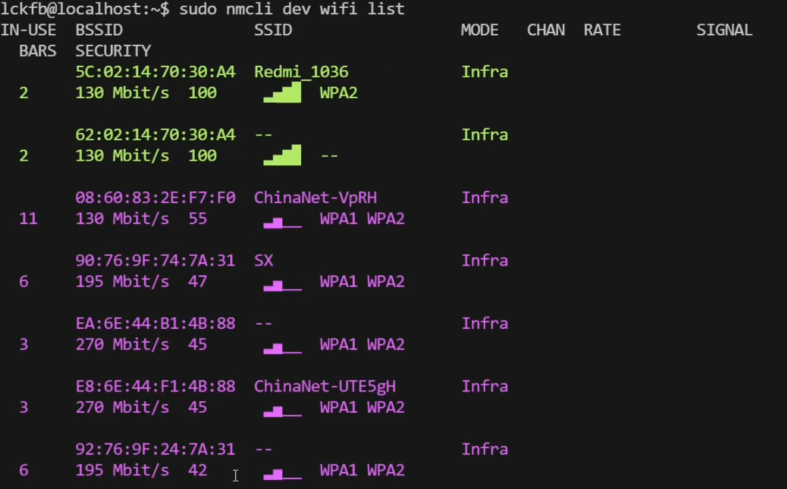

# 1.下载镜像

下载 [NixOS ISO 镜像](https://mirror.nju.edu.cn/nixos-images/)。

>> 推荐下载 `minima` 镜像，通过 CLI 方式安装，这样安装的时候可以使用镜像源。

---

# 2.开始安装

进入 `root shell`：

```bash
sudo -i
```

## 2.1 网络连接

1. 有线以太网连接：主机连上网线即可。

2. USB 热点：通过 USB 连接手机，手机共享热点。

3. WIFI 连接：

- 查看可用的网络设备：

```bash
nmcli
```

- 列出可用的无线网络：

```bash
nmcli device wifi list
```



主要是为了获得 `SSID`。

连接网络：

```bash
nmcli --ask device wifi connect
```

进入交互模式，根据要求依次输入要连接 WIFI 的 SSID 和密码即可。

也可以直接连接：

```bash
nmcli device wifi connect your_SSID password your_password
```

或者采用 TUI 的方式（如果支持的话）：

```bash
nmtui
```

4. 测试网络是否可用：

```bash
# 若此项不通优先先检查域名解析服务器
ping www.baidu.com -c 4

# 腾讯 DNSPod，若不通请检查网络连接
ping 119.29.29.29 -c 4
```

## 2.2 分区

1. 列出系统中的所有块设备（主要是找磁盘）：

```bash
lsblk
```

输出如下：

```bash
[root@nixos:~]$ lsblk
NAME  MAJ:MIN RM  SIZE RO TYPE MOUNTPOINTS
loop0   7:0    0  1.4G  1 loop /nix/.ro-store
sda     8:0    0   40G  0 disk
sr0    11:0    1  1.5G  0 rom  /iso
```

`sda` 就是磁盘设备，这些设备一般都是在 `/dev` 目录下。

2. 在 TUI 交互模式下进行分区：

```bash
cfdisk /dev/sda
```

在界面里，操作示例如下：

```bash
#   → 选 Label type: gpt (UEFI) 或 dos (Legacy)
#   → New → 输入 512M → Type → EFI System        (/boot/efi)
#   → New → 输入 4G   → Type → Linux swap       (swap)
#   → New → 剩余全部 → Type → Linux filesystem  (/)
#   → Write → 输入 yes → Quit
```

>> `swap` 分区可以不用设置，可以在安装好系统后看需要进行设置。上述各个分区大小根据自己的实际需求调整，一般 EFI 分区也就在 `300MB - 1GB` 之间。

分好区后如下所示：

```bash
[root@nixos:~]$ lsblk
NAME   MAJ:MIN RM  SIZE RO TYPE MOUNTPOINTS
loop0    7:0    0  1.4G  1 loop /nix/.ro-store
sda      8:0    0   40G  0 disk
├─sda1   8:1    0  400M  0 part
└─sda2   8:2    0 39.6G  0 part
sr0     11:0    1  1.5G  0 rom  /iso
```

## 2.3 逻辑格式化

1. 创建根文件系统，把 `/dev/sda2` 格式化为 `ext4` 文件系统。

```bash
mkfs.ext4 -L nixos /dev/sda2
```

>> `-L nixos` 表示设置卷标（Lable)为 `nixos`。也可以叫 `system`、`data`或其它，具体看个人喜好。只是以后挂载可以用 `mount LABEL=root /mnt`，当然，这行指令是和 `mount /dev/sda2 /mnt` （用设备的绝对路径）是等价的。

2. 创建 EFI 启动分区，把 `/dev/sda1` 格式化成 **FAT32**（EFI 系统分区必须用 FAT32）。

```
mkfs.fat -F 32 -n boot /dev/sda1
```

>> 如果有警告提示，如 `mkfs.fat: Warning: lowercase labels might not work properly on some systems`，这是正常现象，可以不用管，和标签的大小写有关。

- `-F 32` → 强制使用 **FAT32** 而不是 FAT12/16。
    
- `-n boot` → **设置 FAT 卷标为 `boot`**（DOS 时代的“卷序列名”）。  
    你想叫 `EFI`、`ESP`、`DOODLE` 都可以；同样只在 `lsblk -f`、`blkid`、`/dev/disk/by-label/...` 里出现，**不影响启动**，因为 UEFI 规范靠 **分区类型 GUID（ESP）** 而不是卷标来找启动文件。

## 2.4 挂载分区

1. 先把“将来系统”的根文件系统（`ext4`）挂到 **临时挂载点 /mnt**。

```bash
mount /dev/sda2 /mnt
```

>> 此时 `/mnt` 里就是根分区的顶层目录（bin、etc、home … 还有空目录 boot）。

2. 然后把 **ESP（FAT32）** 挂到 `/mnt/boot`。

```bash
mount --mkdir /dev/sda1 /mnt/boot
```

>> 访问 `/mnt/boot` 时，实际走的是 `/dev/sda1` 的 FAT32；访问 `/mnt` 下除 `boot` 外的路径时，仍走 `/dev/sda2` 的 `ext4`。**并不是** `/dev/sda1` 被“装”进 `/dev/sda2`，而是**目录项 boot 被覆盖了**（挂载掩盖）。

>> 注意：**必须先挂根，再挂下级目录**，顺序反了会导致子挂载点被“隐藏”。

## 2.5 生成配置文件

执行指令：

```bash
nixos-generate-config --root /mnt
```

>> 根据当前挂载好的硬盘系统（在 `/mnt` 下），自动生成 NixOS 安装所需的硬件配置文件，放到 `/mnt/etc/nixos/` 里。

此时在 `/mnt/etc/nixos/` 下有两个配置文件：

| 文件                           | 作用                                                                  |
| ---------------------------- | ------------------------------------------------------------------- |
| `hardware-configuration.nix` | 自动探测并写出 **文件系统挂载表（UUID）、内核模块、驱动、交换、网络接口** 等硬件相关配置。                  |
| `configuration.nix`          | 给用户的“起点模板”，里面 `import` 了前者，并附带一些常用选项（时区、用户、SSH、GRUB 等），你可以直接改它定制系统。 |

## 2.6 修改配置文件

可以参考如下配置进行修改（`configuration.nix`）：

```bash
{ config, lib, pkgs, ... }:

{
  imports =
    [ # Include the results of the hardware scan.
      ./hardware-configuration.nix
    ];

  # 禁用 systemd-boot EFI boot loader.
  boot.loader.systemd-boot.enable = false;

  # 启用 GRUB + EFI 模式
  boot.loader.grub = {
    enable = true;
    efiSupport = true;          # 生成 grubx64.efi
    device = "nodev";           # EFI 模式不需要指定 MBR 设备
  };

  boot.loader.efi.canTouchEfiVariables = true;

  # Use latest kernel.
  boot.kernelPackages = pkgs.linuxPackages_latest;

  networking.hostName = "nixos"; # Define your hostname.

  # Configure network connections interactively with nmcli or nmtui.
  networking.networkmanager.enable = true;

  # set clash-verge-rev and enble TUN mode
  programs.clash-verge = {
    enable = true;
    package = pkgs.clash-verge-rev;
    serviceMode = true;
    tunMode = true;
  };
  # enable the systemd DNS resolver daemon
  services.resolved.enable = true;

  # Set your time zone.
  time.timeZone = "Asia/Shanghai";

  # Enable the X11 windowing system.
  # gnome desktop
  services = {
    xserver.enable = true;
    displayManager.gdm.enable = true;
    desktopManager.gnome.enable = true;
    # 设为 false，不使用 gnome 的应用程序
    # gnome.core-apps.enable = false;
  };

  # Enable sound.
  services.pipewire = {
    enable = true; # if not already enabled
    alsa.enable = true;
    alsa.support32Bit = true;
    pulse.enable = true;
  };


  # Enable touchpad support (enabled default in most desktopManager).
  # services.libinput.enable = true;

  # Define a user account. Don't forget to set a password with ‘passwd’.
  # TODO change sky to your username
  users.users.sky = {
    isNormalUser = true;
    extraGroups = [ "wheel" ]; # Enable ‘sudo’ for the user.
    packages = with pkgs; [
      tree
    ];
  };

  # programs.firefox.enable = true;

  # allow user to install unfree software
  nixpkgs.config.allowUnfree = true;

  # List packages installed in system profile.
  # You can use https://search.nixos.org/ to find more packages (and options).
  environment.systemPackages = with pkgs; [
    vim
    wget
  ];

  # set mirrorlist
  nix.settings.substituters = [
    "https://mirror.sjtu.edu.cn/nix-channels/store"
  ];

  # List services that you want to enable:
  # Enable the OpenSSH daemon.
  services.openssh.enable = true;

  system.stateVersion = "25.11"; # Did you read the comment?
}
```

这里不对每段配置进行说明，因为每段配置前均有注释。其它配置可以参考：
- [NixOS 中文：双系统安装](https://nixos-cn.org/tutorials/installation/DualBoot.html)

- [配置选项查询](https://search.nixos.org/options)

>> 第一次安装时，不建议修改太多的配置，简单修改下即可（先生成一个最简单的 generation，建议不要删除 `generation 1`），后续进了桌面环境再修改。`hardware-configuration.nix` 基本上不需要改动，除非你明确知道自己在做什么！

## 2.7 安装

添加 channel 镜像：

```bash
nix-channel --add https://mirrors.cernet.edu.cn/nix-channels/nixos-25.05 nixos
nix-channel --update
```

>> 版本可以自己指定，想要“激进”的软件包，就把 `nixos-25.05` 改成 `nixos-unstable`。

执行下面这条命令进行安装（通过镜像源）：

```bash
nixos-install --option substituters https://mirror.sjtu.edu.cn/nix-channels/store
```

[其它镜像源](https://help.mirror.nju.edu.cn/nix-channels/)。

---

# 3.基础配置

建议采用 [模块化系统配置](https://nixos-and-flakes.thiscute.world/zh/nixos-with-flakes/modularize-the-configuration)。

## 3.1 初始化用户密码

先以 `root` 身份登录，然后修改用户的密码，根据前面 `configuration.nix` 中的配置，我设置的用户名是 `sky`：

```bash
passwd sky
```

根据提示设置密码即可。

允许使用非自由软件：

```bash
{
  # 允许使用非自由软件
  nixpkgs.config.allowUnfree = true;
}
```

## 3.2 将系统语言设置为中文

在 `configuration.nix` 中添加：

```bash
i18n.defaultLocale = "zh_CN.UTF-8";
```

添加中文字体，建议创建一个 `packages.nix`，这个文件里专门管理包：

```bash
# /etc/nixos/packages.nix
{ config, lib, pkgs, ... }: 

{
  # 系统软件包
  environment.systemPackages = [
    pkgs.vim
    pkgs.git
    pkgs.wget
    pkgs.bat
    pkgs.fastfetch
    pkgs.zsh
    pkgs.btop
    pkgs.google-chrome
  ];
  
  # 字体设置
  fonts.packages = with pkgs; [
    # noto-fonts-cjk-sans        # 思源黑体，覆盖所有 CJK 字符
    # noto-fonts-cjk-serif       # 宋体
    noto-fonts-emoji
    # Maple Mono (Ligature TTF unhinted)
    maple-mono.truetype
    # Maple Mono NF (Ligature unhinted)
    maple-mono.NF-unhinted
    # Maple Mono NF CN (Ligature unhinted)
    maple-mono.NF-CN-unhinted
  ];
}
```

`gnome_pkgs.nix`：

```bash
# /etc/nixos/gnome_pkgs.nix
{ config, lib, pkgs, ... }: 

{
  # gnome 软件包
  environment.systemPackages = [
    pkgs.gnome-extension-manager
    pkgs.gnome-tweaks
  ];
}
```

## 3.3 输入法设置

创建 `input.nix`，然后导入进 `configuration.nix`，内容如下：

```bash
# /etc/nixos/input.nix
{ config, lib, pkgs, ... }: 

{
  # fcitx5
  environment.variables = {
    GTK_IM_MODULE = "fcitx";
    QT_IM_MODULE = "fcitx";
    XMODIFIERS = "@im=fcitx";
  };
  
  i18n.inputMethod = {
    enable = true;
    type = "fcitx5";
    fcitx5.addons = with pkgs; [
      fcitx5-rime
      qt6Packages.fcitx5-chinese-addons  # table input method support
      fcitx5-gtk             # alternatively, kdePackages.fcitx5-qt
      fcitx5-nord            # a color theme
    ];
  };
}
```

可以参考 [Fcitx5 配置](https://nixos.wiki/wiki/Fcitx5)。

---

# 4.常用配置

## 4.1 zsh 配置

创建 `/etc/nixos/shell.nix`，在里面添加下面内容，并把该文件导入到 `configuration.nix` 中：

```shell
# /etc/nixos/shell.nix
{ config, lib, pkgs, ... }:

{
  # 设置默认 Shell (用户名是 nixos)
  users.users.nixos.shell = pkgs.zsh;
  
  programs.zsh = {
    enable = true;
    # 启用自动建议
    autosuggestions.enable = true;
    # 启用语法高亮
    syntaxHighlighting.enable = true;
  };
}
```

## 4.2 docker 配置

创建 `/etc/nixos/docker.nix`，在里面添加下面内容，并把该文件导入到 `configuration.nix` 中：

```shell
# /etc/nixos/docker.nix
{ config, lib, pkgs, ... }: 

{
  virtualisation.docker = {
    # 启用 Docker 守护进程
    enable = true;
    # 具体版本名取决于你当前的 nixpkgs 仓库中包含哪些定义,你可以改为你需要的版本
    package = pkgs.docker_28;
  };
  
  # 将你的用户（我这里是 sky）加入 docker 组
  users.users.sky.extraGroups = [ "docker" ];
}
```

记得要要下载 docker，可以去官方仓库查看 docker 的版本，选择需要的版本下载。

如果要让 Nvidia GPU 直通进 docker 容器，还需要添加设置：

```shell
{
  hardware.nvidia-container-toolkit.enable = true;
  # Regular Docker
  virtualisation.docker.daemon.settings.features.cdi = true;
  # If using Rootless Docker
  # virtualisation.docker.rootless.daemon.settings.features.cdi = true;
}
```

然后，在使用 docker-cli 时，您应该能够执行以下操作：

```bash
docker run --rm -it --device=nvidia.com/gpu=all ubuntu:latest nvidia-smi
```

---

## 4.3 Clash-Verge-Rev TUN 配置

创建 `/etc/nixos/proxy.nix`，在里面添加下面内容，并把该文件导入到 `configuration.nix` 中：

```bash
# /etc/nixos/proxy.nix
{ config, lib, pkgs, ... }:

{
  programs.clash-verge = {
    enable = true;
    package = pkgs.clash-verge-rev;  # 下载 clah-verge-rev
    serviceMode = true;
    tunMode = true;
  };

  # 启用 systemd DNS 解析器守护程序 systemd-resolved
  services.resolved.enable = true;
}
```

如果启用了 `systemd-resolved`（或其他任何 DNS 解析器），但仍然无法使用 TUN，则可能是启用了默认的 NixOS 防火墙。完全关闭防火墙（设置 `networking.firewall.enable = false;`）可能不是个好主意，所以请尝试 `networking.firewall.checkReversePath = "loose";`。

---

# 5.Nvidia 配置

## 5.1 安装 Nvidia 驱动程序

创建 `/etc/nixos/gpu_modules/default.nix` ：

```bash
# /etc/nixos/gpu_modules/default.nix
let
  mode = "offload";   # 想切 sync 就改成 "sync"
in
{
  imports = [
    ./nvidia.nix
    ./${mode}_mode.nix
  ];
}

# 单显卡只用保留：
# {
#   imports = [
#     ./nvidia.nix
#   ];
#  }
```

在 `/etc/nixos/configuration.nix` 中这样导入：

```shell
{
  imports = [
    ./hardware-configuration.nix
    ./gpu_modules
    ...
  ];
}
```

创建 `/etc/nixos/gpu_modules/nvidia.nix`，在里面添加下面内容：

```shell
# /etc/nixos/gpu_modules/nvidia.nix
{ config, lib, pkgs, ... }:

{
  # Enable OpenGL
  hardware.graphics = {
    enable = true;
  };

  # Load nvidia driver for Xorg and Wayland（若是单显卡，就取消注释）
  # services.xserver.videoDrivers = [ "nvidia" ];

  hardware.nvidia = {

    # Modesetting is required.
    modesetting.enable = true;

    # 默认（false）情况下，系统休眠时只保存必要的 GPU 状态。
    # 开启后，它会将全部显存内容保存到磁盘。
    # 建议: 如果你休眠唤醒后发现桌面花屏、软件崩溃，请将其设为 true。
    powerManagement.enable = false;

    # true: 细粒度的电源管理，不使用时关闭 GPU。
    # 仅支持 Turing 架构 (RTX 20) 及之后的笔记本电脑。
    powerManagement.finegrained = false;

    # false (默认): 使用 Nvidia 的闭源内核模块。这是最稳定的选择，支持所有显卡。
    # true: 使用 Nvidia 官方近两年发布的开源内核模块，与 Linux 内核集成更好。仅支持 Turing (RTX 20) 架构及之后的新卡。
    open = false;

    # Enable the Nvidia settings menu
    nvidiaSettings = true;

    # 根据需要，你可能需要为你的特定显卡选择合适的驱动程序版本。
    package = config.boot.kernelPackages.nvidiaPackages.stable;
  };
}
```

>> 这是单显卡的配置，下面是双显卡（核显 + 独显）的配置方法。

## 5.2 双显卡配置

### 5.2.1 获取显卡总线 ID

执行 `nix-shell -p lshw` 或者 `nix-shell -p toybox` 获取相关软件包。可以通过下面指令来获取：

```bash
sudo lshw -c display

# 或者
lspci | grep -i vga
```

>> **注意**：获取的总线 ID（`bus info`）是十六进制的，需转成十进制：

```bash
# lshw 获取的输出
...
bus info: pci@0000:0e:00.0
...
configuration: depth=32 driver=nvidia ...
...
```

这表示 Nvidia 总线 ID 为 `0e:00.0`，转成十进制为 `14:0:0`。

```bash
{
  hardware.nvidia.prime = {
    # Make sure to use the correct Bus ID values for your system!
    intelBusId = "PCI:0:2:0";
    nvidiaBusId = "PCI:14:0:0";
    # amdgpuBusId = "PCI:54:0:0"; For AMD GPU
  };
}
```

>> 有 Offload Mode 和 Sync Mode，**这两种模式互斥**，不能同时启用。

### 5.2.2 Offload 模式（推荐）

- **节能优先**：默认使用集成显卡（Intel/AMD iGPU）处理所有显示任务（如桌面、浏览器等），NVIDIA dGPU 保持休眠。
- **按需使用独显**：仅当你显式加载某个程序到 NVIDIA GPU 时（如游戏、渲染软件），才激活 dGPU。
- 适用于大多数日常使用场景，兼顾续航与性能。

```bash
# /etc/nixos/gpu_modules/offload_mode.nix
{ config, lib, pkgs, ... }:

{
  # 如果是 amd 核显，就把 modesetting 改为 amdgpu
  # 注意：顺序不能换，必须是核显在前，独显在后
  services.xserver.videoDrivers = [ "modesetting" "nvidia" ];

  # Offload 模式
  hardware.nvidia.prime = {
    offload = {
      enable = true;
      enableOffloadCmd = true;  # 自动生成 nvidia-offload 命令
    };
    # Make sure to use the correct Bus ID values for your system!
    intelBusId = "PCI:0:2:0";
    nvidiaBusId = "PCI:14:0:0";
    # amdgpuBusId = "PCI:54:0:0"; For AMD GPU
  };
}
```

日常用法：

- 通过终端启动：

```bash
nvidia-offload glxgears

nvidia-offload steam

nvidia-offload blender
```

- Steam 游戏：在 Steam → Settings → Set Launch Options 里给“全局”或逐条游戏写 `nvidia-offload %command%`。

- 查看是否成功 offload：`nvidia-smi` 里只能看到你要跑的进程，其余时间为空。

### 5.2.3 Sync 模式

- **显示输出由 dGPU 渲染并同步到 iGPU 屏幕**，减少画面撕裂（tearing）。
- **性能优先**：即使没有运行图形密集型程序，NVIDIA GPU 也可能保持活跃（功耗更高）。
- 适合外接显示器、使用 clamshell 模式（合盖用外显）或对画面流畅性要求高的场景。

```bash
# /etc/nixos/gpu_modules/sync_mode.nix
{ config, lib, pkgs, ... }:

{
  # 如果是 amd 核显，就把 modesetting 改为 amdgpu
  # 注意：顺序不能换，必须是核显在前，独显在后
  services.xserver.videoDrivers = [ "modesetting" "nvidia" ];

  # Sync 模式
  hardware.nvidia.prime = {
    sync.enable = true;

    # Make sure to use the correct Bus ID values for your system!
    nvidiaBusId = "PCI:14:0:0";
    intelBusId = "PCI:0:2:0";
    # amdgpuBusId = "PCI:54:0:0"; For AMD GPU
  };
}
```

日常用法：

- 什么都不用管，所有程序默认走 Nvidia。

- `nvidia-smi` 里随时都能看到 Xorg 和正在跑的程序。

- 如果想临时让某个程序回核显，目前做不到（除非改配置切回 offload）。

## 5.3 参考文章

- [Nvidia - NixOS Wiki](https://nixos.wiki/wiki/Nvidia)

- [NVIDIA - NixOS 官方 Wiki](https://wiki.nixos.org/wiki/NVIDIA)

---

# 6.其它配置

后续的配置就跟据个人具体情况而定了。可以参考这个仓库终端配置 [my_nixos](https://github.com/loskyertt/my_nixos)。

---