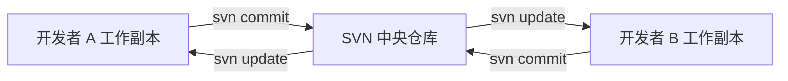
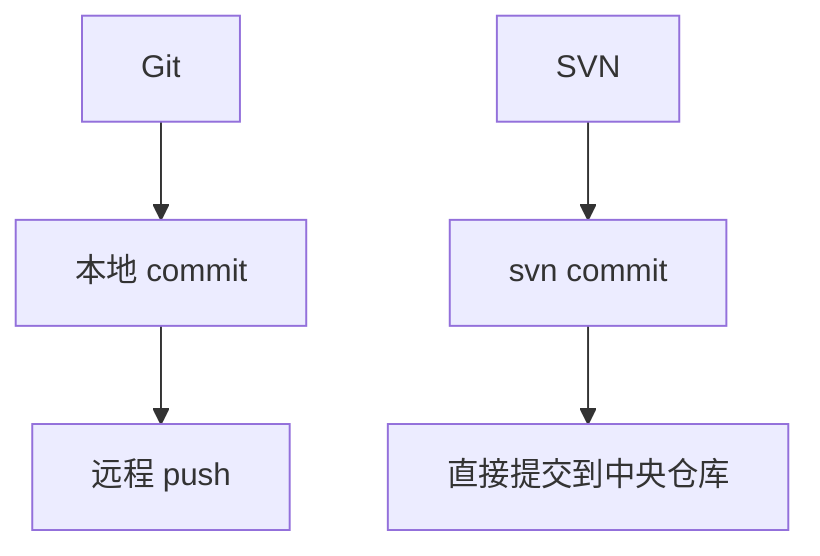

> [!abstract]
> **SVN（Subversion）是中心化版本控制系统**。它的核心使用逻辑是：从中央仓库检出工作副本，在本地修改文件，通过 `svn update` 同步服务器变更，再通过 `svn commit` 直接提交到服务器。

| 结论 | 说明 |
|---|---|
| SVN 是中心化版本控制 | 代码历史主要保存在中央服务器 |
| `svn commit` 是远程提交 | 不存在 Git 那种纯本地提交再推送的流程 |
| 工作副本依赖 `.svn/` | 删除 `.svn/` 后目录会变成普通目录 |
| 提交前必须先检查 | 固定执行 `svn up`、`svn status`、`svn diff` |
| 冲突解决后要显式标记 | 使用 `svn resolve --accept working file` |

> [!warning]
> ==不要把 `svn commit` 理解成 Git 的 `git commit`。== SVN 的 `commit` 会直接写入中央仓库，影响团队其他成员。

---

# 1. 安装与认证

## 1.1 安装 SVN 客户端

### 1.1.1 Ubuntu 与 Debian

```bash
sudo apt update
sudo apt install subversion
```

### 1.1.2 CentOS 与 RHEL

```bash
sudo yum install subversion
```

### 1.1.3 Fedora

```bash
sudo dnf install subversion
```

### 1.1.4 Arch Linux

```bash
sudo pacman -S subversion
```

## 1.2 首次认证

访问需要账号密码的仓库时，SVN 会提示输入用户名和密码：

```bash
svn co svn://xxx.xxx.1.9/xxxx/product/data
```

示例提示：

```text
Authentication realm: <svn://xxx.xxx.1.9:3690>
Username:
Password:
```

Linux 下认证缓存通常存放在：

```bash
~/.subversion/auth/
```

查看认证缓存目录：

```bash
ls ~/.subversion/auth/
```

清除认证缓存：

```bash
rm -rf ~/.subversion/auth/*
```

> [!warning]
> 清除认证缓存后，下次访问 SVN 会重新要求输入账号密码。

---

# 2. SVN 的概念模型

## 2.1 中心化版本控制

SVN 的典型结构如下：



开发者本地只有**工作副本**，版本历史主要保存在服务器中。

## 2.2 工作副本

通过 `svn checkout` 得到的目录称为**工作副本**。工作副本中包含 `.svn/` 元数据目录，用来记录远程地址、版本号、文件状态等信息。

```text
project/
├── .svn/
├── src/
├── docs/
└── README.md
```

| 对象 | 含义 |
|---|---|
| 中央仓库 | SVN 服务器上的完整版本库 |
| 工作副本 | 本地可编辑目录 |
| `.svn/` | 工作副本元数据 |
| Revision | SVN 全局版本号 |

> [!tip]
> 可以把 SVN 理解为：**所有人围绕同一个远程仓库协作，本地目录只是服务器某个版本的可编辑副本**。

## 2.3 常见仓库目录

SVN 项目通常采用如下约定：

```text
project/
├── trunk/
├── branches/
└── tags/
```

| 目录 | 含义 | 使用场景 |
|---|---|---|
| `trunk/` | 主干 | 日常主线开发 |
| `branches/` | 分支 | 功能开发、版本维护、实验性修改 |
| `tags/` | 标签 | 版本归档、发布快照 |

> [!warning]
> SVN 的标签通常也是目录复制结果。团队规范上一般要求 `tags/` 只读，不在标签目录继续开发。

---

# 3. SVN 与 Git 对比

## 3.1 命令对应关系

| Git | SVN | 说明 |
|---|---|---|
| `git clone` | `svn checkout` / `svn co` | 检出工作副本 |
| `git pull` | `svn update` / `svn up` | 从服务器更新 |
| `git status` | `svn status` / `svn st` | 查看本地状态 |
| `git diff` | `svn diff` | 查看差异 |
| `git add` | `svn add` | 添加到版本控制 |
| `git commit` | 无完全对应命令 | SVN 没有本地提交概念 |
| `git push` | `svn commit` / `svn ci` | 提交到中央仓库 |
| `git checkout -- file` | `svn revert file` | 放弃本地修改 |
| `git blame` | `svn blame` | 查看每行修改人 |
| `main` / `master` | `trunk` | 主干 |
| `branch` | `branches/xxx` | 分支目录 |
| `tag` | `tags/xxx` | 标签目录 |

## 3.2 工作流差异



| 对比点 | Git | SVN |
|---|---|---|
| 架构 | 分布式 | 中心化 |
| 本地历史 | 有完整本地仓库 | 主要依赖服务器 |
| 提交行为 | 先本地提交，再推送 | 直接提交服务器 |
| 版本号 | 每次提交有哈希 | 全仓库递增 Revision |
| 离线提交 | 支持 | 不支持真正提交 |
