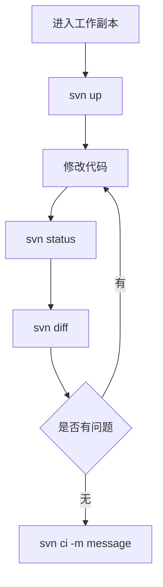
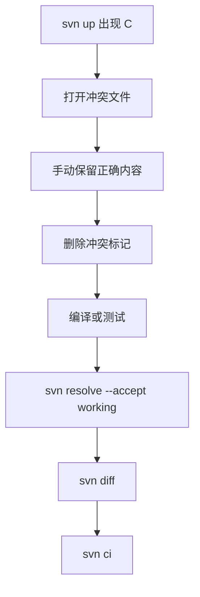

# 1. 仓库查看与项目检出

## 1.1 查看远程仓库目录

示例仓库地址：

```text
svn://xxx.xxx.1.9/xxxx
```

查看根目录：

```bash
svn ls svn://xxx.xxx.1.9/xxxx
```

输出示例：

```text
product/
server/
docs/
```

查看子目录：

```bash
svn ls svn://xxx.xxx.1.9/xxxx/server
svn ls svn://xxx.xxx.1.9/xxxx/server/trunk
```

## 1.2 检出项目

检出整个目录：

```bash
svn checkout svn://xxx.xxx.1.9/xxxx/product/data
```

简写形式：

```bash
svn co svn://xxx.xxx.1.9/xxxx/product/data
```

指定本地目录：

```bash
svn co svn://xxx.xxx.1.9/xxxx/product/data ~/workspace/data
```

检出主干示例：

```bash
svn co svn://192.168.1.10/server/trunk/server
```

## 1.3 查看工作副本信息

进入项目目录：

```bash
cd data
svn info
```

输出示例：

```text
URL: svn://xxx.xxx.1.9/xxxx/product/data
Repository Root: svn://xxx.xxx.1.9/xxxx
Revision: 1256
```

| 字段 | 含义 |
|---|---|
| `URL` | 当前工作副本对应的远程路径 |
| `Repository Root` | 仓库根地址 |
| `Revision` | 当前工作副本版本号 |

---

# 2. 日常开发工作流

## 2.1 标准流程



每天开始工作：

```bash
cd project

# 更新项目
svn up
```

修改代码后：

```bash
svn status
svn diff
svn ci -m "修复登录模块 Bug"
```

## 2.2 提交前检查清单

- 是否已执行 `svn up` 同步服务器最新代码。
- 是否已执行 `svn status` 查看所有本地变化。
- 是否已执行 `svn diff` 确认修改内容正确。
- 是否排除了日志、临时文件、编译产物。
- 是否解决所有冲突。
- 提交信息是否能说明修改目的。

> [!summary]
> SVN 日常开发可以记为：**先更新，再修改；先检查，再提交**。

---

# 3. 更新、状态与差异

## 3.1 更新代码

```bash
svn update
```

简写形式：

```bash
svn up
```

常见输出：

```text
U main.cpp
A test.cpp
D old.cpp
C config.xml
G merge.cpp
```

| 标记 | 含义 | 说明 |
|---|---|---|
| `U` | Updated | 服务器有更新 |
| `A` | Added | 服务器新增文件 |
| `D` | Deleted | 服务器删除文件 |
| `C` | Conflict | 更新时发生冲突 |
| `G` | Merged | 自动合并成功 |

更新到指定版本：

```bash
svn up -r 1200
```

恢复到最新版本：

```bash
svn up
```

## 3.2 查看状态

```bash
svn status
```

简写形式：

```bash
svn st
```

示例：

```text
M src/main.cpp
A src/test.cpp
D src/old.cpp
? temp.txt
! missing.cpp
C config.xml
```

| 标记 | 含义 | 常见处理 |
|---|---|---|
| `M` | 已修改 | 检查后提交或回滚 |
| `A` | 已加入版本控制 | 可提交 |
| `D` | 已标记删除 | 可提交 |
| `?` | 未纳入版本控制 | `svn add` 或忽略 |
| `!` | 文件丢失 | `svn rm` 或 `svn revert` |
| `C` | 冲突 | 手动解决后 `svn resolve` |

## 3.3 查看差异

查看全部差异：

```bash
svn diff
```

查看单个文件：

```bash
svn diff src/main.cpp
```

查看某次提交改了什么：

```bash
svn diff -c 1234
```

查看两个版本之间的差异：

```bash
svn diff -r 1200:1250
```

---

# 4. 文件增删与提交

## 4.1 添加文件

添加单个文件：

```bash
touch test.cpp
svn add test.cpp
```

添加目录：

```bash
svn add src/
```

批量递归添加新文件：

```bash
svn add * --force
```

> [!warning]
> 批量添加前必须先执行 `svn status`，避免把 `build/`、日志、缓存、临时文件加入版本控制。

## 4.2 删除文件

推荐使用 SVN 命令删除：

```bash
svn delete old.cpp
```

简写形式：

```bash
svn rm old.cpp
```

如果已经手动删除：

```bash
rm old.cpp
svn status
```

出现：

```text
! old.cpp
```

补充删除标记：

```bash
svn rm old.cpp
```

如果是误删：

```bash
svn revert old.cpp
```

## 4.3 提交修改

提交全部已纳入版本控制的修改：

```bash
svn commit -m "fix login bug"
```

简写形式：

```bash
svn ci -m "fix login bug"
```

提交指定文件：

```bash
svn ci src/main.cpp -m "修复登录模块 Bug"
```

提交成功示例：

```text
Sending        src/main.cpp
Adding         src/test.cpp
Committed revision 1257.
```

> [!tip]
> 提交信息建议写清楚“做了什么”和“为什么做”。例如 `修复登录超时后无法重连的问题`，比 `fix bug` 更利于团队追踪。

---

# 5. 历史查看与版本定位

## 5.1 查看日志

查看最近提交记录：

```bash
svn log
```

查看最近 10 条：

```bash
svn log -l 10
```

查看某个文件历史：

```bash
svn log src/main.cpp
```

查看某个版本的详细改动路径：

```bash
svn log -v -r 1234
```

输出示例：

```text
Changed paths:
   M /trunk/main.cpp
   A /trunk/test.cpp
```

> [!tip]
> 可以拆开理解：
> 
> ```
> svn log      查看提交历史
> -v           verbose（详细模式）
> -r 1234      revision（版本号），查看第 1234 号修订版本
> ```

## 5.2 查看责任人

```bash
svn blame src/main.cpp
```

输出示例：

```text
1234 tom    int main()
1235 jack   return 0;
```

`svn blame` 常用于定位某一行代码的历史作者和对应版本号。

## 5.3 查看指定版本内容

```bash
svn cat -r 100 src/main.cpp
```

将旧版本内容写回当前文件：

```bash
svn cat -r 100 src/main.cpp > src/main.cpp
svn diff src/main.cpp
svn ci -m "恢复 main.cpp 到 r100 的内容"
```

---

# 6. 回滚与冲突处理

## 6.1 放弃本地修改

放弃单个文件修改：

```bash
svn revert src/main.cpp
```

放弃整个目录修改：

```bash
svn revert -R .
```

> [!warning]
> ==`svn revert` 会丢弃本地未提交修改，且通常不可恢复。== 执行前先用 `svn diff` 确认没有需要保留的内容。

## 6.2 识别冲突

更新时如果出现：

```text
C main.cpp
```

表示本地修改和服务器修改冲突。文件中可能出现：

```cpp
<<<<<<< .mine
我的代码
=======
服务器代码
>>>>>>> .r1234
```

## 6.3 解决冲突流程



标记已解决：

```bash
svn resolve --accept working main.cpp
```

老版本 SVN 可能使用：

```bash
svn resolved main.cpp
```

接受服务器版本：

```bash
svn resolve --accept theirs-full main.cpp
```

保留本地版本：

```bash
svn resolve --accept mine-full main.cpp
```

> [!warning]
> 冲突解决后不要直接提交。先执行 `svn diff`，确认没有残留 `<<<<<<<`、`=======`、`>>>>>>>`。

---

# 7. 忽略文件

## 7.1 SVN 忽略规则的特点

SVN 的忽略规则通常通过目录属性 `svn:ignore` 设置，而不是像 Git 一样主要依赖 `.gitignore`。

| 特点 | 说明 |
|---|---|
| 作用范围 | 对设置该属性的目录生效 |
| 是否版本控制 | 忽略规则本身需要提交 |
| 常见用途 | 忽略编译产物、日志、临时文件 |

## 7.2 设置忽略规则

忽略当前目录下的 `build`、`*.log`、`*.tmp`：

```bash
svn propset svn:ignore "build
*.log
*.tmp" .
```

查看忽略规则：

```bash
svn propget svn:ignore .
```

编辑忽略规则：

```bash
svn propedit svn:ignore .
```

提交忽略规则：

```bash
svn ci -m "添加 SVN 忽略规则"
```

> [!summary]
> `svn:ignore` 是目录属性。设置后需要提交，团队其他成员更新后才会得到相同的忽略规则。

---

# 8. 分支、标签与合并

## 8.1 创建分支

### 8.1.1 命令行方式

SVN 分支通常通过远程目录复制创建：

```bash
svn copy \
  svn://xx.xx.xx.xx/server/project/trunk/server \
  svn://xx.xx.xx.xx/server/project/branches/dev \
  -m "create dev branch"
```

|部分|含义|
|---|---|
|`svn copy`|SVN 的复制命令，也是创建分支/标签的标准方式|
|`svn://server/project/trunk`|**源路径**：项目的主干（主线代码）|
|`svn://server/project/branches/dev`|**目标路径**：新分支的存放位置，名为 `dev`|
|`-m "create dev branch"`|**提交说明**：描述这次操作的备注信息|

### 8.1.2 客户端操作方式

#### 在当前工作副本上右键

进入：

```text
Z:\a5game\server\trunk\server
```

确保这里是带绿色勾的 SVN 工作副本（包含 `.svn`）。

右键：

```text
TortoiseSVN
    └── Branch/Tag...
```

#### 填写目标分支路径

假设当前 URL 是：

```text
svn://xx.xx.xx.xx/server/project/trunk/server
```

那么 **To URL:**

```text
svn://xx.xx.xx.xx/server/project/branches/dev
```

日志可以写：`create branch server_238`，再点击 **OK** 即可。创建完成后会弹出：

```text
Would you like to switch working copy to the newly created branch?
```

如果你还希望当前目录继续保持 trunk，就点击 **No**。

如下图所示：

![[imgs/01.png]]

#### 检出新分支

例如建立：

```text
Z:\a5game\
├── trunk_server
└── server_dev
```

右键 `server_dev` 目录，点击 `SVN Checkout...`，再填写：

```text
URL:
svn://svnserver/a5game/server/branches/server_238

Checkout directory:
Z:\a5game\server_238
```

### 8.1.3 说明

> [!note]
> SVN 的分支本质上是在 **SVN 仓库（Repository）里复制目录**，而不是在本地复制文件夹。

将 `trunk`（主干）的代码复制一份，在 `branches/dev` 创建一个名为 **dev 的开发分支**，并附上提交信息 `"create dev branch"`。

根据我们在前面所说的，SVN 项目通常遵循这样的目录约定：

```
project/
├── trunk/       ← 主干，改目录下存放稳定的主线项目
│   └── main/    ← 主干分支
├── branches/    ← 改目录下存放各种分支（开发、功能、修复等）
│   └── dev/     ← 刚创建的开发分支
└── tags/        ← 版本快照（如 v1.0、v2.0）
```

SVN 的分支本质上就是一次**服务端复制**，操作轻量且只记录差异，不会真正复制所有文件。逻辑上看，你看到的效果确实是“复制了整个 trunk，命名为 dev”，你可以在 dev 里看到所有文件。但物理存储上，SVN 服务端使用的是 **“廉价复制”（cheap copy）** 机制，底层并没有把文件内容复制一遍。

它的实现原理类似于“**指针**”：

```
创建分支前：
trunk/ ──→ [文件A v1] [文件B v1] [文件C v1]

创建分支后：
trunk/ ──→ [文件A v1] [文件B v1] [文件C v1]
              ↑            ↑            ↑
dev/   ────────────────────────────────── (只是指向同一份数据)
```

dev 分支刚创建时，**不存储任何新的文件内容**，只记录一条元数据：`dev 分支 = trunk 在某个版本号的快照`

只有当你修改文件时，才真正存储新内容：

```
修改 dev/文件A 之后：

trunk/ ──→ [文件A v1] [文件B v1] [文件C v1]
                          ↑            ↑
dev/   ──→ [文件A v2] ───────────────────── (只有改动的文件才产生新副本)
```

> [!tip] 就像 Linux 的 **硬链接** 或 Git 的对象存储一样——没有修改就不占用额外空间，修改了才写入新数据。这就是为什么即使 trunk 有几十万个文件，`svn copy` 也能**瞬间完成**。

## 8.2 创建标签

```bash
svn copy \
  svn://server/project/trunk \
  svn://server/project/tags/v1.0 \
  -m "release v1.0"
```

## 8.3 切换工作副本

切换到分支：

```bash
svn switch svn://server/project/branches/dev
```

切回主干：

```bash
svn switch svn://server/project/trunk
```

## 8.4 合并分支

在目标工作副本中执行：

```bash
svn merge svn://server/project/branches/dev
svn diff
svn ci -m "merge dev branch"
```

> [!warning]
> 合并前先执行 `svn up`，并确认 `svn status` 干净，避免把无关修改混入合并提交。

---

# 9. 导出代码

## 9.1 导出普通目录

如果只是拿代码，不需要 SVN 管理：

```bash
svn export svn://server/project/trunk
```

导出的目录不包含：

```text
.svn/
```

适合场景：

- 发布代码
- 打包源码
- 给第三方一份干净代码

## 9.2 `checkout` 与 `export` 对比

| 命令 | 是否包含 `.svn/` | 能否更新 | 能否提交 | 适用场景 |
|---|---|---|---|---|
| `svn checkout` | 是 | 是 | 是 | 日常开发 |
| `svn export` | 否 | 否 | 否 | 发布、打包、交付 |

---

# 10. 常见问题排查

## 10.1 连接失败

SVN 默认端口通常是 `3690`。测试端口：

```bash
nc -vz xxx.xxx.1.9 3690
```

或：

```bash
telnet xxx.xxx.1.9 3690
```

优先检查：

- SVN 服务是否启动。
- IP 或域名是否正确。
- 防火墙是否放行 `3690`。
- 当前网络是否能访问服务器。
- URL 协议是否正确，例如 `svn://`、`http://`、`https://`。

## 10.2 提交提示 `out of date`

原因是服务器已有更新，本地不是最新版本。

处理方式：

```bash
svn up
svn status
svn diff
svn ci -m "提交说明"
```

如果更新时产生冲突，先按 [[#6.3 解决冲突流程]] 处理。

## 10.3 `?` 文件太多

`?` 表示未加入版本控制。常见原因是编译产物、日志、临时文件没有忽略。

处理方式：

```bash
svn status
svn propset svn:ignore "build
*.log
*.tmp" .
svn status
```

确认无误后提交忽略规则：

```bash
svn ci -m "添加忽略规则"
```

## 10.4 手动删除文件后出现 `!`

如果确实要删除：

```bash
svn rm missing.cpp
svn ci -m "删除 missing.cpp"
```

如果是误删：

```bash
svn revert missing.cpp
```

## 10.5 想重新输入账号密码

清除本地认证缓存：

```bash
rm -rf ~/.subversion/auth/*
```

下次访问 SVN 时会重新提示输入账号密码。

---

# 11. 高频命令速查

## 11.1 日常开发命令

```bash
svn co URL              # 检出
svn up                  # 更新
svn st                  # 查看状态
svn diff                # 查看修改
svn add file            # 添加文件
svn rm file             # 删除文件
svn revert file         # 回滚文件修改
svn ci -m "msg"         # 提交
```

## 11.2 历史与定位命令

```bash
svn log -l 10           # 查看最近 10 条日志
svn info                # 查看仓库信息
svn blame file          # 查看每行修改人
svn diff -c REV         # 查看某次提交差异
svn cat -r REV file     # 查看指定版本文件内容
```

## 11.3 分支与维护命令

```bash
svn resolve --accept working file  # 标记冲突已解决
svn copy SRC DST -m "msg"          # 创建分支或标签
svn switch URL                     # 切换工作副本路径
svn merge URL                      # 合并分支
svn export URL                     # 导出干净代码
```

---

# 12. 易错点总结

## 12.1 操作层易错点

| 易错点 | 后果 | 正确做法 |
|---|---|---|
| 提交前不 `svn up` | 容易 `out of date` 或冲突 | 先更新再提交 |
| 不看 `svn diff` 直接提交 | 误提交调试代码或临时修改 | 提交前检查差异 |
| 手动删除文件后不 `svn rm` | 状态出现 `!` | 用 `svn rm` 标记删除 |
| 批量 `svn add * --force` | 误加入编译产物 | 先设置忽略规则 |
| 冲突后不 `svn resolve` | 无法正常提交 | 手动解决后标记已解决 |
| 把 `tags/` 当分支开发 | 破坏发布快照 | 标签只用于归档 |

## 12.2 记忆口诀

> [!tip]
> SVN 日常口诀：**先 `up`，再改；先 `st`，再 `diff`；确认无误再 `ci`。**

---

# 13. 主动回忆问题

## 13.1 基础概念

- SVN 为什么被称为中心化版本控制系统？
- `svn commit` 和 `git commit` 的最大区别是什么？
- 工作副本中的 `.svn/` 目录有什么作用？
- `Revision` 在 SVN 中表示什么？

## 13.2 日常操作

- 日常开发中，提交前为什么要先执行 `svn up`？
- `svn status` 中 `M`、`?`、`!`、`C` 分别表示什么？
- 新增文件后为什么必须执行 `svn add`？
- 手动删除文件后，为什么还需要执行 `svn rm`？

## 13.3 异常处理

- 出现 `out of date` 时应该如何处理？
- 冲突文件中的 `<<<<<<<`、`=======`、`>>>>>>>` 分别表示什么？
- 解决冲突后为什么还要执行 `svn resolve --accept working`？
- `svn revert -R .` 的风险是什么？
