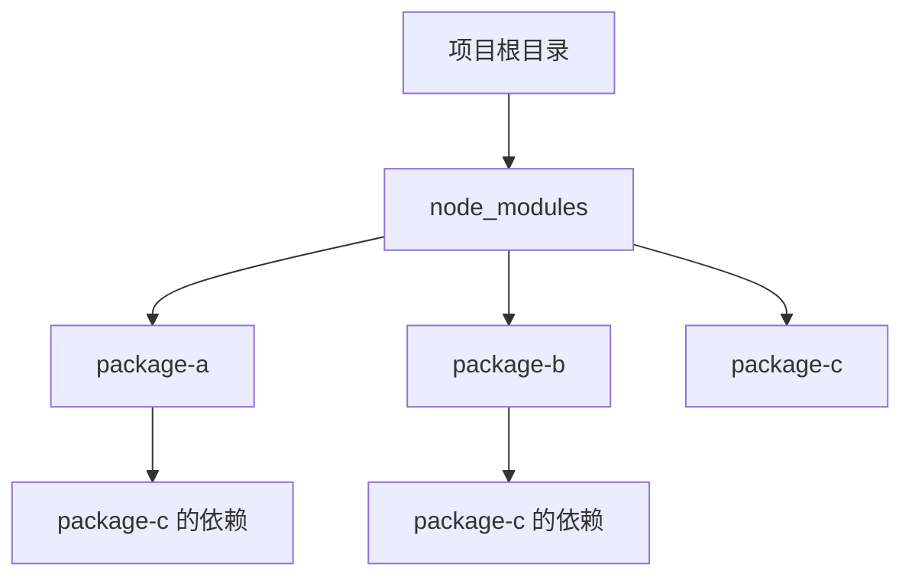
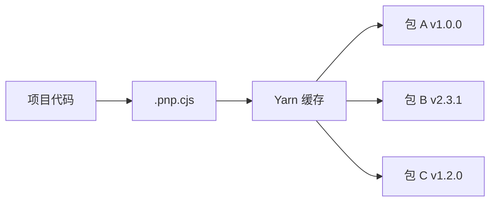
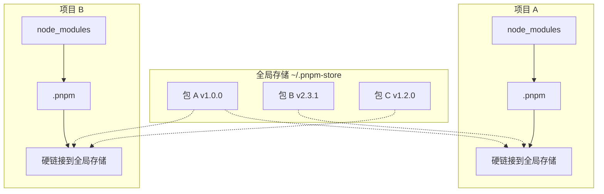
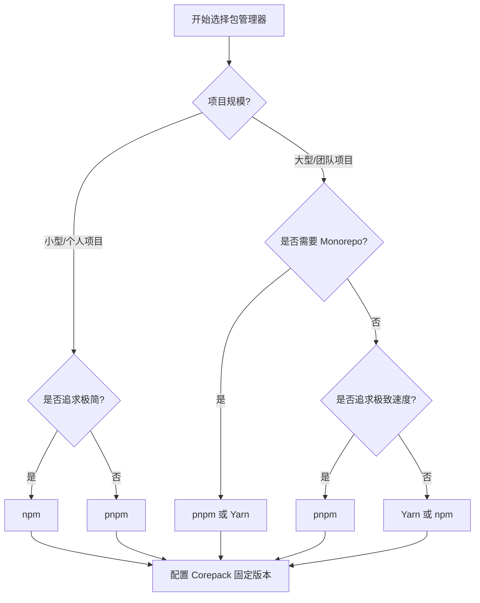

# 1. 概述

Node.js 生态的繁荣离不开成熟的包管理体系。包管理器（Package Manager）是开发者与 **npm registry** 之间的桥梁，负责依赖的解析、下载、安装、更新与移除。选择合适的包管理器直接影响开发效率、磁盘占用、构建速度及团队协作体验。

> [!info] 什么是包管理器？
> 包管理器是一种自动化工具，用于简化软件包的安装、升级、配置和移除过程。在 Node.js 世界中，它处理的是以 `package.json` 为清单的 JavaScript 模块。

## 1.1 为什么需要了解不同包管理器？

- **性能差异**：安装速度、磁盘占用、网络效率各不相同
- **安全性**：对幽灵依赖（Phantom Dependencies）的管控力度不同
- **协作一致性**：团队需要统一的依赖解析行为
- **Monorepo 支持**：大型项目对工作空间（Workspace）的需求日益增加
- **工具链整合**：现代前端工程化对包管理器提出了更高要求

---

# 2. 主流包管理器详解

## 2.1 npm (Node Package Manager)

### 2.1.1 定义与定位

npm 是 Node.js 的**默认包管理器**，随 Node.js 安装包一同提供。作为 JavaScript 生态的基石，npm 拥有全球最大的软件注册表，托管了数百万个开源包。

### 2.1.2 核心机制

npm 采用**扁平化 `node_modules` 结构**（v3+），通过依赖提升（Dependency Hoisting）减少嵌套层级：



### 2.1.3 优点

| 优点 | 说明 |
| :--- | :--- |
| **生态最庞大** | 拥有数百万个包，是 JavaScript 最大的软件注册表 |
| **零配置上手** | 无需额外安装，开箱即用 |
| **脚本功能强大** | 通过 `npm run` 可执行自定义脚本，支持生命周期钩子 |
| **官方支持** | 与 Node.js 同步更新，兼容性最好 |

### 2.1.4 缺点与局限

| 缺点 | 说明 |
| :--- | :--- |
| **安装速度较慢** | 早期版本按队列顺序安装，大型项目速度慢。新版虽有改进，但仍是相对短板 |
| **幽灵依赖风险** | 扁平化结构使项目可能引用 `package.json` 中未声明的包 |
| **磁盘占用高** | 不同项目若依赖同一包，会重复安装，浪费空间 |
| **确定性不足** | 早期版本缺少 lock 文件，不同环境安装结果可能不同 |

> [!warning] 幽灵依赖（Phantom Dependencies）
> 当依赖 A 依赖了 B，npm 将 B 提升到顶层后，项目代码可以直接 `require('B')`，但 B 并未在项目的 `package.json` 中声明。这会导致项目对间接依赖产生隐式耦合，一旦 A 升级不再依赖 B，项目代码就会崩溃。

### 2.1.5 核心命令

```bash
# 初始化项目，生成 package.json
npm init -y

# 安装项目全部依赖
npm install

# 安装指定包（生产依赖）
npm install <package-name>

# 安装指定包（开发依赖）
npm install <package-name> --save-dev

# 运行 package.json 中定义的脚本
npm run <script-name>

# 全局安装包（通常用于命令行工具）
npm install -g <package-name>

# 清理缓存
npm cache clean --force
```

---

## 2.2 Yarn

### 2.2.1 定义与定位

Yarn 由 Facebook（现 Meta）、Google、Exponent 和 Tilde 于 2016 年联合推出，旨在弥补 npm 早期版本（v3 之前）在性能、安全性和确定性方面的不足。

### 2.2.2 版本演进

| 版本 | 代号 | 核心机制 | 特点 |
| :--- | :--- | :--- | :--- |
| **v1** | Classic | 扁平化 `node_modules` + `yarn.lock` | 确定性安装，并行下载 |
| **v2+** | Berry | Plug'n'Play (PnP) | 零 `node_modules`，严格依赖管控 |

### 2.2.3 核心机制：Plug'n'Play (PnP)

Yarn Berry（v2+）引入了革命性的 PnP 模式，彻底抛弃了 `node_modules`：



> [!tip] PnP 的优势
> - **严格依赖管控**：项目只能访问显式声明的依赖，彻底杜绝幽灵依赖
> - **极速启动**：无需遍历庞大的 `node_modules` 目录
> - **零 `node_modules`**：告别 `node_modules` 黑洞

### 2.2.4 优点

| 优点 | 说明 |
| :--- | :--- |
| **安装速度快** | 并行下载安装，并优化了缓存机制 |
| **确定性安装** | 通过 `yarn.lock` 文件锁定依赖版本，确保不同环境一致性 |
| **输出简洁** | 命令行输出比 npm 更简洁、更易读 |
| **原生工作区支持** | 从 v1 起就对 monorepo 项目提供了良好的支持 |
| **PnP 严格性** | v2+ 的 PnP 模式彻底解决了幽灵依赖问题 |

### 2.2.5 缺点与局限

| 缺点 | 说明 |
| :--- | :--- |
| **需要额外安装** | 非 Node.js 内置 |
| **早期兼容性问题** | 某些 npm 包可能不完全兼容，但已大幅改善 |
| **v2+ 学习曲线** | PnP 模式改变了依赖解析方式，对部分工具和传统工作流有兼容性挑战 |

### 2.2.6 核心命令

```bash
# 安装项目全部依赖
yarn

# 安装指定包（生产依赖）
yarn add <package-name>

# 安装指定包（开发依赖）
yarn add <package-name> --dev

# 运行脚本
yarn run <script-name>

# 全局安装包
yarn global add <package-name>

# 启用 PnP 模式（v2+）
yarn set version stable
```

---

## 2.3 pnpm

### 2.3.1 定义与定位

pnpm（performant npm）是一个高性能、节省磁盘空间的包管理器，通过**内容寻址存储（Content-Addressable Storage）**和**硬链接/符号链接机制**管理依赖。它是现代前端项目（如 Vue 3、Vite）的默认选择。

### 2.3.2 核心机制：全局存储 + 链接

pnpm 的核心创新在于全局存储与链接机制：



> [!summary] pnpm 的存储原理
> 1. **全局存储**：所有包只下载一次，存储在全局位置
> 2. **硬链接**：项目 `node_modules` 中的文件是全局存储的硬链接，不占用额外磁盘空间
> 3. **符号链接**：依赖关系通过符号链接维护，保持 `node_modules` 结构清晰
> 4. **非扁平化**：只有直接依赖在顶层，间接依赖在 `.pnpm` 目录中

### 2.3.3 优点

| 优点 | 说明 |
| :--- | :--- |
| **极致节省磁盘空间** | 使用全局存储 + 硬链接/符号链接，同一依赖仅存储一份，多项目共享 |
| **安装速度快** | 得益于硬链接和并行安装，速度极快 |
| **严格规避幽灵依赖** | `node_modules` 结构非扁平化，项目只能访问显式声明的依赖，安全性高 |
| **原生强大的 Monorepo 支持** | 内置 workspace 功能，是现代大型项目的优选 |
| **严格的依赖隔离** | 每个包只能访问自己的依赖，避免隐式耦合 |

### 2.3.4 缺点与局限

| 缺点 | 说明 |
| :--- | :--- |
| **社区相对较小** | 生态和社区支持虽在增长，但不及 npm 和 Yarn |
| **潜在兼容性问题** | 极少数情况下可能遇到兼容性问题（如某些原生模块或旧版工具） |

### 2.3.5 核心命令

```bash
# 安装项目全部依赖
pnpm install

# 安装指定包（生产依赖）
pnpm add <package-name>

# 安装指定包（开发依赖）
pnpm add -D <package-name>

# 运行脚本
pnpm run <script-name>

# 全局安装包
pnpm add -g <package-name>

# 管理 pnpm 全局存储（节省磁盘的关键）
pnpm store path       # 查看存储路径
pnpm store prune      # 清理未引用的包

# Monorepo 工作区命令
pnpm -r run build     # 在所有工作区包中运行 build
pnpm --filter <pkg> add <dep>  # 为特定工作区包添加依赖
```

---

## 2.4 npx (Node Package Executor)

### 2.4.1 定义与定位

npx 是 npm 5.2.0+ 引入的**包执行器**，用于直接运行本地或远程的 npm 包命令。它并非包管理器，而是执行工具。

### 2.4.2 核心机制

npx 的执行逻辑：

1. 检查本地 `node_modules/.bin` 是否存在该命令
2. 若不存在，临时下载并执行最新版本
3. 执行完毕后，若包是临时下载的，则自动清理

### 2.4.3 优点

| 优点 | 说明 |
| :--- | :--- |
| **无需全局安装** | 临时执行命令行工具，避免全局环境污染 |
| **方便执行一次性任务** | 如创建项目 `npx create-react-app my-app` |
| **指定版本执行** | 可运行特定版本的包，如 `npx node@12 -v` |
| **自动解析路径** | 无需手动指定 `node_modules/.bin` 路径 |

### 2.4.4 缺点与局限

| 缺点 | 说明 |
| :--- | :--- |
| **非包管理器** | 核心功能是执行包，而非管理项目依赖 |
| **依赖 npm** | 其运行依赖于 npm 环境 |
| **网络延迟** | 临时下载包时，首次执行可能有网络延迟 |

### 2.4.5 核心命令

```bash
# 使用 create-react-app 创建项目（无需全局安装）
npx create-react-app my-app

# 临时运行一个包中的命令
npx <package-name> <command>

# 使用特定版本的 Node.js 运行命令
npx node@14 -e "console.log(process.version)"

# 执行本地安装的 CLI 工具
npx eslint src/
```

---

# 3. 其他包管理器与相关工具

## 3.1 国内加速工具

### 3.1.1 cnpm（淘宝镜像）

| 维度 | 说明 |
| :--- | :--- |
| **定位** | 淘宝团队提供的 npm 镜像客户端，加速国内下载 |
| **优点** | 国内下载速度快，完全兼容 npm 命令 |
| **缺点** | 非官方工具，可能存在稳定性问题；同步可能有延迟 |
| **安装** | `npm install -g cnpm --registry=https://registry.npmmirror.com` |
| **使用** | 将 `npm` 替换为 `cnpm`，命令完全一致 |

> [!tip] 更推荐的方案
> 与其安装 cnpm，不如直接为 npm/Yarn/pnpm 配置淘宝镜像源：
> ```bash
> npm config set registry https://registry.npmmirror.com/
> yarn config set registry https://registry.npmmirror.com/
> pnpm config set registry https://registry.npmmirror.com/
> ```

---

## 3.2 新兴与专用工具

| 工具名称 | 核心说明 | 优点 | 缺点/注意 | 适用场景 |
| :--- | :--- | :--- | :--- | :--- |
| **Bun** | 集成了运行时、打包器、测试运行器和包管理器的全能 JavaScript 工具链 | **速度极快**（包管理、启动、构建），零配置支持 TypeScript/JSX，内置工具链 | 生态兼容性（尤其原生 C++ 扩展）、企业级稳定性、Windows 支持仍在完善中 | 新项目、追求极致速度与效率 |
| **Rush** | 微软开发的可扩展 monorepo 管理器，专为大型项目设计 | 功能全面，管理大型 monorepo 能力强 | 学习曲线陡峭，对小型项目可能过于复杂 | 企业级大型 monorepo |
| **Volta** | 轻量级的 Node.js 版本和包管理器管理工具 | 专注于 Node.js 版本管理，简化包管理 | 不适用于复杂依赖管理的项目 | Node.js 版本切换频繁的场景 |
| **ied** | 另一个高性能包管理器，采用原子安装和 CAS | 安装速度极快，磁盘效率高，适合大型项目和 CI/CD | 社区非常小，学习资源少，稳定性待观察 | 大型项目、CI/CD |

### 3.2.1 Bun 详解

Bun 是近年来最受关注的 JavaScript 全能工具链：

```bash
# macOS / Linux
curl -fsSL https://bun.sh/install | bash

# Windows (在 PowerShell 中)
powershell -c "irm bun.sh/install.ps1 | iex"
```

```bash
# 安装项目全部依赖
bun install

# 安装指定包
bun add <package-name>

# 运行脚本
bun run <script-name>

# 直接运行 TypeScript 或 JavaScript 文件
bun run index.ts

# 运行测试
bun test
```

> [!warning] Bun 的当前局限
> - 原生 C++ 扩展（node-gyp 编译的模块）兼容性仍在完善
> - Windows 支持相对较新，可能存在边缘 case
> - 企业级生产环境的稳定性仍需时间验证

---

## 3.3 基础设施工具

### 3.3.1 Corepack（包管理器管理器）

Corepack 是 Node.js 官方提供的**包管理器版本管理代理**，而非包管理器本身。

> [!info] Corepack 的作用
> 统一管理项目所需的包管理器版本（如 `pnpm@9.6.0`），确保团队环境一致，无需全局安装多个版本的包管理器。

#### 核心使用

```bash
# 启用 Corepack（Node.js 16.13+ 内置）
corepack enable

# 在项目中准备特定版本的 Yarn
corepack prepare yarn@3.1.1 --activate

# 在项目中准备特定版本的 pnpm
corepack prepare pnpm@7.25.0 --activate

# 之后，在项目目录下直接使用 yarn 或 pnpm 命令，Corepack 会自动处理
yarn install
pnpm install
```

#### package.json 配置

在 `package.json` 中添加 `packageManager` 字段：

```json
{
  "packageManager": "pnpm@9.6.0"
}
```

> [!summary] Corepack 的价值
> - **解决环境一致性**：告别"在我机器上能跑"的问题
> - **简化 onboarding**：新成员无需手动安装特定版本的包管理器
> - **CI/CD 友好**：自动化流水线自动使用正确的工具版本

### 3.3.2 Verdaccio（私有 npm 仓库）

Verdaccio 是一个轻量级的、可自托管的 npm 代理注册表，适合企业内网搭建私有仓库。

```bash
# 安装
npm install -g verdaccio

# 启动 Verdaccio 服务（默认端口 4873）
verdaccio

# 添加用户
npm adduser --registry http://localhost:4873

# 发布包到私有仓库
npm publish --registry http://localhost:4873

# 从私有仓库安装包
npm install <package-name> --registry http://localhost:4873
```

---

# 4. 核心特性对比汇总

## 4.1 多维度横向对比

| 工具名称 | 核心机制 | 安装速度 | 磁盘效率 | 安全特性(依赖管控) | 主要优点 | 主要缺点 | 典型适用场景 |
| :--- | :--- | :--- | :--- | :--- | :--- | :--- | :--- |
| **npm** | 扁平化 `node_modules` | ⭐⭐ | ⭐⭐ | **低** (幽灵依赖) | 生态最大、零配置 | 速度慢、磁盘占用高 | 小型项目、需要最大生态兼容性 |
| **Yarn** | 扁平化 `node_modules` (v1) / PnP (v2+) | ⭐⭐⭐⭐ | ⭐⭐⭐ | **中** (v1 有幽灵依赖; v2+ 严格) | 速度快、确定性安装、原生工作区 | 需安装、v2+ 兼容性挑战 | 大型项目、需要速度和一致性 |
| **pnpm** | **全局存储 + 硬链接/符号链接** | ⭐⭐⭐⭐⭐ | ⭐⭐⭐⭐⭐ | **高** (严格规避幽灵依赖) | **极速、省空间、安全、强 monorepo** | 社区较小、偶有兼容性问题 | **大型项目、多项目开发、磁盘敏感环境** |
| **npx** | 包执行器 | - | - | - | 无需全局安装，临时执行 | 非包管理器，依赖 npm | 执行一次性命令、脚手架 |
| **cnpm** | npm 镜像 | ⭐⭐⭐⭐ (国内) | ⭐⭐ | 低 | 国内下载极快 | 非官方、同步延迟 | 国内网络环境 |
| **ied** | 原子安装 + CAS 存储 | ⭐⭐⭐⭐⭐ | ⭐⭐⭐⭐ | 高 | 极速、高效 | 社区极小 | 大型项目、CI/CD |
| **Bun** | 内置包管理器 | ⭐⭐⭐⭐⭐ | ⭐⭐⭐⭐ | 高 | **一站式、极速、零配置** | 生态兼容性、稳定性待验证 | 新项目、追求极致速度与效率 |

> 💡 **关于 Corepack 的说明**：它并非上表中的直接竞争者，而是一个**基础设施工具**。其作用是根据项目 `package.json` 中声明的 `"packageManager"` 字段（如 `"pnpm@9.6.0"`），自动下载、启用并使用指定版本的包管理器，从而**解决不同开发者、不同项目、CI/CD 环境中包管理器版本不一致的问题**。

---

# 5. 如何选择：决策指南

## 5.1 按场景选择



## 5.2 具体建议

| 场景 | 推荐选择 | 理由 |
| :--- | :--- | :--- |
| **新手或小型项目** | **pnpm** | 现代、快速、省空间，学习成本与 npm 相当 |
| **大型项目/Monorepo** | **pnpm** | 严格依赖管理、高效存储、原生 workspace 支持 |
| **国内网络环境** | **pnpm + 淘宝镜像** | 配置镜像源即可，无需额外工具 |
| **追求极致速度与一体化** | **Bun** | 关注其生态兼容性是否满足项目需求 |
| **团队协作/企业级项目** | **pnpm + Corepack** | 固定版本，确保环境一致性 |
| **已有 Yarn v1 项目** | **Yarn v1 或迁移至 pnpm** | Yarn v1 稳定，但 pnpm 是更现代的选择 |
| **需要严格确定性安装** | **Yarn Berry (PnP)** | 零 `node_modules`，最严格的依赖管控 |

## 5.3 趋势总结

Node.js 包管理器的发展方向是**更快、更省、更安全、更易协作**：

- **pnpm** 在效率和安全性上表现突出，已成为许多新项目和技术栈（如 Vue3、Vite）的默认选择
- **Yarn** 在企业级项目中仍保有重要地位，尤其是 Berry 的 PnP 模式
- **Bun** 代表了工具链整合的未来方向，但成熟度仍需时间
- **Corepack** 是解决协作环境一致性问题的官方方案，建议在所有项目中启用

> [!tip] 最终建议
> 对于新项目，**优先选择 pnpm**，并配合 Corepack 固定版本。这是当前最平衡性能、安全性和生态支持的选择。

---

# 6. 快速安装与配置

## 6.1 推荐安装方式汇总

| 工具名称 | 推荐安装方式 | 核心命令 |
| :--- | :--- | :--- |
| **npm** | 随 Node.js 安装 | `npm install`, `npm run <script>` |
| **Yarn** | `corepack enable` 后 `yarn set version stable` | `yarn add <pkg>`, `yarn run <script>` |
| **pnpm** | `corepack enable` 后 `corepack prepare pnpm@latest --activate` | `pnpm add <pkg>`, `pnpm run <script>` |
| **npx** | 随 npm (5.2.0+) 安装 | `npx create-react-app my-app` |
| **Bun** | 官方脚本安装 (curl/PowerShell) | `bun add <pkg>`, `bun run <script>` |
| **Corepack** | Node.js 内置，`corepack enable` | `corepack prepare pnpm@7.25.0 --activate` |

## 6.2 国内镜像配置

```bash
# npm
npm config set registry https://registry.npmmirror.com/

# Yarn
yarn config set registry https://registry.npmmirror.com/

# pnpm
pnpm config set registry https://registry.npmmirror.com/
```

## 6.3 团队协作最佳实践

1. 在 `package.json` 中声明 `packageManager` 字段
2. 启用 Corepack：`corepack enable`
3. 将 `.corepack` 或相关配置加入版本控制
4. 在 CI/CD 中启用 Corepack，确保构建环境一致性

---

# 7. 核心概念速查

## 7.1 关键术语

| 术语 | 解释 |
| :--- | :--- |
| **幽灵依赖** | 项目引用了未在 `package.json` 中声明的包，通常由扁平化 `node_modules` 导致 |
| **依赖提升** | 将间接依赖提升到 `node_modules` 顶层，减少嵌套层级 |
| **硬链接** | 指向同一文件数据的多个目录项，不占用额外磁盘空间 |
| **符号链接** | 指向另一个文件或目录的特殊文件，用于维护依赖关系 |
| **PnP** | Plug'n'Play，Yarn Berry 的机制，通过映射表而非 `node_modules` 解析依赖 |
| **Monorepo** | 单个仓库管理多个相关项目，需要工作区（Workspace）支持 |
| **Lock 文件** | 锁定依赖精确版本的文件（如 `package-lock.json`、`yarn.lock`、`pnpm-lock.yaml`） |

## 7.2 常见问题

> [!faq] npm 和 pnpm 可以混用吗？
> 不建议。不同包管理器生成的 lock 文件格式不同，混用会导致依赖解析不一致。应在团队中统一使用一种包管理器。

> [!faq] 为什么 pnpm 的 `node_modules` 结构不同？
> pnpm 使用非扁平化结构，只有直接依赖在顶层，间接依赖在 `.pnpm` 目录中。这确保了严格的依赖隔离，避免幽灵依赖。

> [!faq] Corepack 会影响 npm 的使用吗？
> Corepack 主要代理 Yarn 和 pnpm 的命令。对 npm 的拦截支持有限，npm 仍可正常使用。

---

# 8. 总结

> [!summary] 本节核心
> 1. **npm** 是生态基石，适合零配置上手，但性能和安全性有局限
> 2. **Yarn** 提供了确定性安装和 PnP 模式，适合大型项目
> 3. **pnpm** 是当前最推荐的现代选择，极速、省空间、严格安全
> 4. **npx** 是执行工具，用于临时运行命令
> 5. **Corepack** 是团队协作的必备工具，确保环境一致性
> 6. **Bun** 代表未来方向，但成熟度待验证
>
> 最终选择应根据项目需求、团队习惯和生态支持做出权衡。对于新项目，**pnpm + Corepack** 是最平衡的方案。
