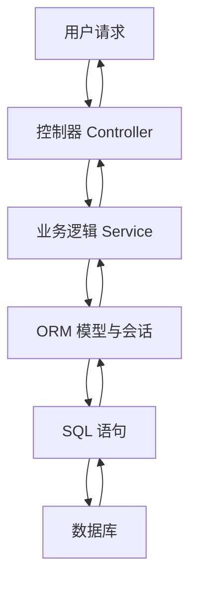
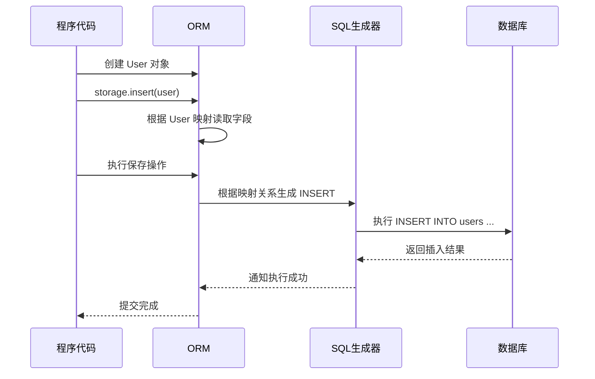
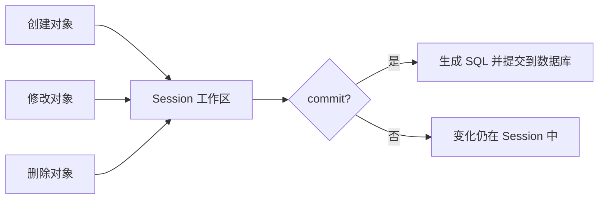
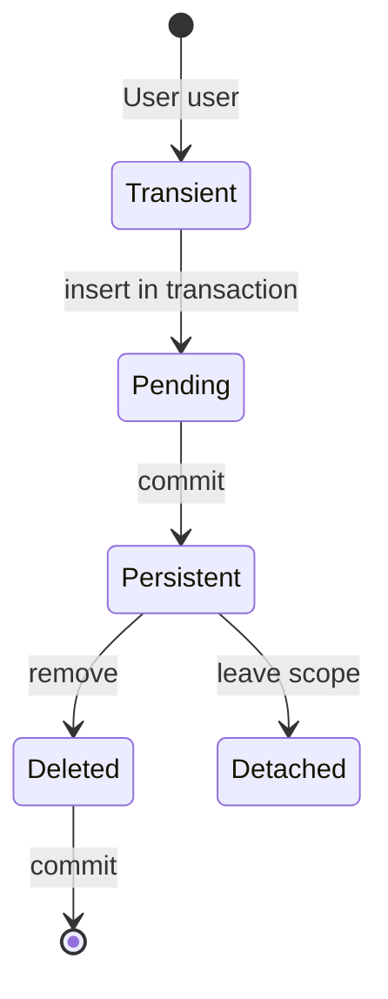
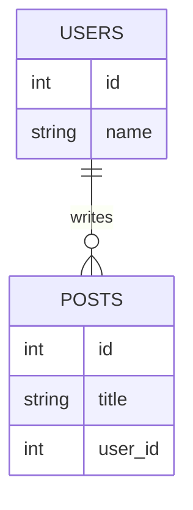
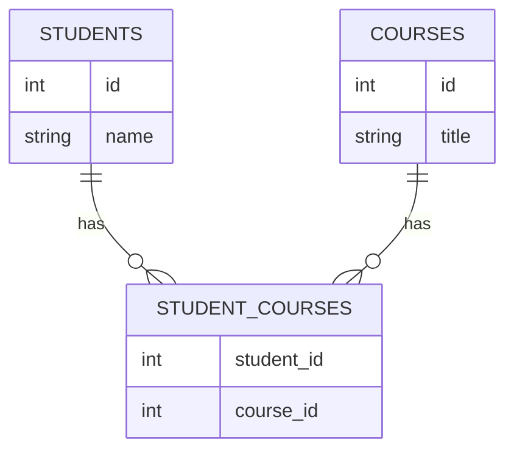
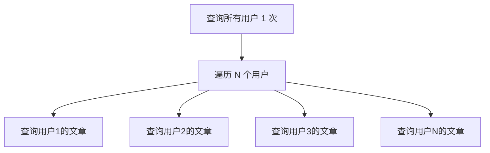
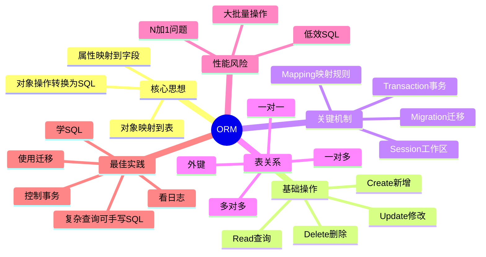

# 1. 背景与动机

## 1.1 学习 ORM 前必须先知道什么

在正式学习 **ORM** 之前，需要先建立 3 个最基础的概念：

| 概念 | 通俗描述 | 例子 |
|---|---|---|
| **数据库** | 专门保存数据的软件 | MySQL、PostgreSQL、SQLite |
| **表** | 像 Excel 表格一样存放同一类数据 | `users` 用户表 |
| **程序对象** | 程序代码里用来表示一个具体事物的数据结构 | `User` 用户对象 |

假设我们要做一个最简单的用户系统，需要保存用户信息：

| id | name | age | email |
|---|---|---|---|
| 1 | Alice | 18 | alice@example.com |
| 2 | Bob | 20 | bob@example.com |

在数据库中，这些数据通常放在一张叫 `users` 的表里；在程序代码中，我们更习惯把一个用户表示成一个对象：

```cpp
#include <string>

struct User {
    int id;
    std::string name;
    int age;
    std::string email;
};
```

这就出现了一个核心问题：

> 数据库喜欢用**表、行、列**来表示数据；程序喜欢用**类、对象、属性**来表示数据。

ORM 要解决的正是这两种世界之间的转换问题。

## 1.2 不使用 ORM 时如何操作数据库

如果不使用 ORM，程序通常需要直接写 SQL。

例如查询所有年龄大于 18 岁的用户：

```sql
SELECT id, name, age, email
FROM users
WHERE age > 18;
```

然后程序还要把查询结果一行一行转换成对象：

```cpp
std::vector<Row> rows = db.query(
    "SELECT id, name, age, email FROM users WHERE age > 18"
);

std::vector<User> users;
for (const Row& row : rows) {
    User user;
    user.id = row.getInt("id");
    user.name = row.getString("name");
    user.age = row.getInt("age");
    user.email = row.getString("email");

    users.push_back(user);
}
```

这个过程有几个明显问题：

| 问题 | 说明 |
|---|---|
| **重复代码多** | 每次查询都要手动写 SQL、手动组装对象 |
| **容易写错字段名** | `email` 写成 `emial` 就会出错 |
| **维护成本高** | 表结构变了，很多 SQL 和转换代码都要改 |
| **安全风险** | 拼接 SQL 时容易产生 SQL 注入 |
| **业务代码不够直观** | 业务逻辑中混杂大量数据库细节 |

> [!warning]
> SQL 本身不是坏东西，后端开发必须理解 SQL。ORM 的目标不是让你永远不学 SQL，而是减少重复的数据库操作代码，让业务开发更高效、更不容易出错。

## 1.3 ORM 的核心动机

ORM 的核心动机可以概括为一句话：

> **让程序员用操作对象的方式操作数据库。**

不用 ORM 时：

```sql
INSERT INTO users (name, age, email)
VALUES ('Alice', 18, 'alice@example.com');
```

使用 ORM 时可能变成：

```cpp
User user;
user.name = "Alice";
user.age = 18;
user.email = "alice@example.com";

storage.insert(user);
```

从人的理解角度看，第二种写法更接近业务语言：

- 创建一个用户对象
- 调用 ORM 的保存接口
- 由 ORM 生成并执行 SQL

这就是 ORM 的价值：**把数据库操作包装成面向对象的操作**。

---

# 2. 核心概念

## 2.1 ORM 定义

> **ORM（Object Relational Mapping，对象关系映射）**：一种把程序中的对象和关系型数据库中的表建立对应关系的技术，使开发者可以通过操作对象来完成增删改查。

拆开看：

| 单词 | 含义 | 对应内容 |
|---|---|---|
| **Object** | 对象 | 程序里的 `User`、`Order`、`Product` |
| **Relational** | 关系型数据库 | MySQL、PostgreSQL、SQLite 等 |
| **Mapping** | 映射 | 把类对应到表，把属性对应到字段 |

## 2.2 对象与表的对应关系

ORM 最重要的思想是“映射”：

| 程序世界 | 数据库世界 | 示例 |
|---|---|---|
| 类（Class） | 表（Table） | `User` 类 ↔ `users` 表 |
| 对象（Object） | 行（Row） | `User` 实例化出的一个对象 `user` ↔ `users` 表中的一行 |
| 属性（Attribute） | 字段/列（Column） | `user.name` ↔ `users.name` |
| 对象引用 | 外键关系 | `order.user` ↔ `orders.user_id` |

示意图：

```text
程序代码中的对象                         数据库中的表

class User                              users
+-------------+                         +----+--------+-----+-------------------+
| id = 1      |      映射到一行         | id | name   | age | email             |
| name=Alice  |  -------------------->  +----+--------+-----+-------------------+
| age = 18    |                         | 1  | Alice  | 18  | alice@example.com |
| email=...   |                         +----+--------+-----+-------------------+
+-------------+
```

## 2.3 常见术语

| 术语 | 含义 | 小白理解 |
|---|---|---|
| **Entity / Model** | 实体类或模型类 | 用代码表示一张表 |
| **Table** | 数据库表 | 保存同一类数据的表格 |
| **Column** | 字段/列 | 表中的一个属性，如 `name` |
| **Row / Record** | 行/记录 | 表中的一条数据 |
| **Primary Key** | 主键 | 唯一标识一条数据的字段，如 `id` |
| **Foreign Key** | 外键 | 表与表之间的关联字段 |
| **Session / Context** | 会话/上下文 | ORM 管理数据库操作的工作区 |
| **Migration** | 迁移 | 用代码记录和更新数据库表结构 |
| **Lazy Loading** | 懒加载 | 用到关联数据时才查询 |
| **Eager Loading** | 预加载 | 一开始就把关联数据查出来 |

> [!tip]
> 可以把 ORM 理解成一个“翻译官”：程序说“我要保存这个用户对象”，ORM 翻译成数据库能听懂的 `INSERT` 语句；程序说“我要查询用户对象”，ORM 翻译成 `SELECT` 语句并把结果组装回对象。

## 2.4 ORM 不等于数据库

这是初学者最容易混淆的地方：

| 项目 | 负责什么 | 示例 |
|---|---|---|
| **数据库** | 真正保存数据 | MySQL、PostgreSQL、SQLite |
| **SQL** | 操作数据库的语言 | `SELECT`、`INSERT`、`UPDATE` |
| **ORM** | 帮程序生成 SQL，并把结果转成对象 | SQLAlchemy、Hibernate、Django ORM |

> [!warning]
> ORM 只是数据库上面的一层工具。数据最终仍然存储在数据库中，最终执行的仍然是 SQL。

---

# 3. 整体架构

## 3.1 ORM 在程序中的位置

一个典型后端程序可以分成几层：



各层职责如下：

| 层级 | 职责 |
|---|---|
| **Controller** | 接收请求、返回响应 |
| **Service** | 编写业务规则，如注册、下单、支付 |
| **ORM** | 把对象操作转换成 SQL |
| **Database** | 真正保存和查询数据 |

## 3.2 ORM 的内部工作流程

当代码执行下面这几行时：

```cpp
User user;
user.name = "Alice";
user.age = 18;

storage.insert(user);
```

ORM 内部大致会做这些事：



## 3.3 ORM 映射关系

假设有一个用户类：

```cpp
struct User {
    int id;
    std::string name;
    int age;
    std::string email;
};
```

对应数据库表：

```sql
CREATE TABLE users (
    id INTEGER PRIMARY KEY,
    name VARCHAR(50),
    age INTEGER,
    email VARCHAR(100)
);
```

映射关系如下：

| `User` 类 | `users` 表 |
|---|---|
| `User` | `users` |
| `id` | `id` |
| `name` | `name` |
| `age` | `age` |
| `email` | `email` |

> [!summary]
> ORM 的核心不是神秘魔法，而是维护一张“类和表如何对应”的规则表，然后根据规则生成 SQL、解析结果。

---

# 4. 从零理解 CRUD

## 4.1 CRUD 是什么

数据库最常见的操作可以归纳成 **CRUD**：

| 缩写 | 英文 | 中文 | SQL |
|---|---|---|---|
| **C** | Create | 新增 | `INSERT` |
| **R** | Read | 查询 | `SELECT` |
| **U** | Update | 修改 | `UPDATE` |
| **D** | Delete | 删除 | `DELETE` |

几乎所有业务系统，本质上都离不开 CRUD：

- 注册用户：Create
- 查看用户资料：Read
- 修改昵称：Update
- 注销账号：Delete

## 4.2 Create：新增数据

### 4.2.1 SQL 写法

```sql
INSERT INTO users (name, age, email)
VALUES ('Alice', 18, 'alice@example.com');
```

含义逐句解释：

| 部分 | 含义 |
|---|---|
| `INSERT INTO users` | 往 `users` 表中插入数据 |
| `(name, age, email)` | 要填写哪些字段 |
| `VALUES (...)` | 每个字段对应的具体值 |

### 4.2.2 ORM 写法

```cpp
User user;
user.name = "Alice";
user.age = 18;
user.email = "alice@example.com";

storage.insert(user);
```

逐行解释：

| 代码 | 含义 |
|---|---|
| `User{...}` | 创建一个用户对象 |
| `storage.insert(user)` | 告诉 ORM：把这个对象插入数据库 |

> [!warning]
> 不同 C++ ORM 的接口不完全相同。有些 ORM 会立刻执行 `insert`，有些 ORM 会要求显式开启事务并提交。学习时要先看清楚所用 ORM 的事务模型。

## 4.3 Read：查询数据

### 4.3.1 SQL 写法

```sql
SELECT id, name, age, email
FROM users
WHERE age >= 18;
```

含义：

| 部分 | 含义 |
|---|---|
| `SELECT id, name, age, email` | 查询这些字段 |
| `FROM users` | 从 `users` 表查询 |
| `WHERE age >= 18` | 只要年龄大于等于 18 的用户 |

### 4.3.2 ORM 写法

```cpp
auto users = storage.get_all<User>(where(c(&User::age) >= 18));
```

可以像读句子一样理解：

```text
从 User 对应的表中查询，
筛选 age >= 18 的记录，
返回所有结果。
```

ORM 最终仍然会生成类似下面的 SQL：

```sql
SELECT users.id, users.name, users.age, users.email
FROM users
WHERE users.age >= 18;
```

## 4.4 Update：修改数据

### 4.4.1 SQL 写法

```sql
UPDATE users
SET age = 19
WHERE id = 1;
```

含义：

| 部分 | 含义 |
|---|---|
| `UPDATE users` | 修改 `users` 表 |
| `SET age = 19` | 把 `age` 字段改成 19 |
| `WHERE id = 1` | 只修改 id 为 1 的那一行 |

### 4.4.2 ORM 写法

```cpp
auto user = storage.get<User>(1);
user.age = 19;
storage.update(user);
```

步骤拆解：

1. 先查询 `id == 1` 的用户。
2. 修改这个对象的 `age` 属性。
3. 调用 `storage.update(user)`，ORM 根据对象主键生成 `UPDATE`。

> [!warning]
> 修改和删除数据时一定要有明确条件。没有 `WHERE` 的 `UPDATE` 或 `DELETE` 可能影响整张表。

## 4.5 Delete：删除数据

### 4.5.1 SQL 写法

```sql
DELETE FROM users
WHERE id = 1;
```

### 4.5.2 ORM 写法

```cpp
storage.remove<User>(1);
```

执行过程：

1. 指定要删除的模型类型 `User`。
2. 指定主键 `1`。
3. ORM 根据主键生成 `DELETE`。

---

# 5. ORM 示例：以 C++ sqlite_orm 为例

## 5.1 为什么选择 sqlite_orm 作为示例

不同语言有不同 ORM：

| 语言 | 常见 ORM |
|---|---|
| C++ | sqlite_orm、ODB、SOCI、QxOrm |
| Python | SQLAlchemy、Django ORM |
| Java | Hibernate、MyBatis-Plus |
| C# | Entity Framework Core |
| PHP | Eloquent、Doctrine |
| Node.js | Prisma、TypeORM、Sequelize |

本笔记使用 C++ 的 `sqlite_orm` 举例，是因为它比较适合入门：

- 使用 SQLite，学习时不需要单独安装 MySQL 服务器。
- 模型类就是普通 C++ `struct`。
- 映射关系能直接写在 C++ 代码里。
- 示例代码足够短，便于观察“对象如何映射到表”。

> [!info]
> 即使你以后使用 Java、C#、Python 或 Node.js，ORM 的核心概念依然类似：定义模型、建立映射、创建数据库连接、执行 CRUD、处理事务。

## 5.2 安装依赖

`sqlite_orm` 是一个 header-only 风格的 C++ ORM 库，常见使用方式是通过包管理器安装，或把头文件加入项目。

如果使用 `vcpkg`，可以安装：

```bash
vcpkg install sqlite-orm sqlite3
```

本示例使用 SQLite 数据库。SQLite 的特点是：

- 不需要单独安装数据库服务器
- 数据可以保存在一个 `.db` 文件里
- 非常适合学习和小型项目

## 5.3 定义模型类

完整示例：

```cpp
#include <iostream>
#include <string>
#include <vector>
#include "sqlite_orm/sqlite_orm.h"

using namespace sqlite_orm;

// 1. 定义 User 模型类
struct User {
    int id = 0;
    std::string name;
    int age = 0;
    std::string email;
};

// 2. 定义数据库和表映射
inline auto initStorage(const std::string& path) {
    return make_storage(
        path,
        make_table(
            "users",
            make_column("id", &User::id, primary_key().autoincrement()),
            make_column("name", &User::name),
            make_column("age", &User::age),
            make_column("email", &User::email, unique())
        )
    );
}

int main() {
    // 3. 创建数据库连接对象
    auto storage = initStorage("demo.db");

    // 4. 根据映射关系同步表结构
    storage.sync_schema();

    return 0;
}
```

逐段解释：

| 代码 | 作用 |
|---|---|
| `struct User` | 定义一个 C++ 模型类 |
| `make_storage(...)` | 创建数据库存储对象 |
| `make_table("users", ...)` | 指定 `User` 对应 `users` 表 |
| `make_column(...)` | 指定 C++ 成员变量对应数据库字段 |
| `primary_key().autoincrement()` | 设置自增主键 |
| `unique()` | 设置唯一约束 |
| `storage.sync_schema()` | 根据映射关系同步数据库表结构 |

## 5.4 模型类如何变成数据表

下面这段代码：

```cpp
struct User {
    int id = 0;
    std::string name;
    int age = 0;
    std::string email;
};

make_table(
    "users",
    make_column("id", &User::id, primary_key().autoincrement()),
    make_column("name", &User::name),
    make_column("age", &User::age),
    make_column("email", &User::email, unique())
)
```

大致对应下面的 SQL：

```sql
CREATE TABLE users (
    id INTEGER NOT NULL,
    name TEXT,
    age INTEGER,
    email TEXT,
    PRIMARY KEY (id),
    UNIQUE (email)
);
```

映射关系：

| C++ 代码 | SQL 含义 |
|---|---|
| `struct User` | 定义用户模型 |
| `make_table("users", ...)` | 映射到 `users` 表 |
| `make_column("id", &User::id, ...)` | `id` 成员映射到 `id` 字段 |
| `primary_key().autoincrement()` | `id` 是自增主键 |
| `make_column("name", &User::name)` | `name` 成员映射到 `name` 字段 |
| `make_column("age", &User::age)` | `age` 成员映射到 `age` 字段 |
| `make_column("email", &User::email, unique())` | `email` 成员映射到唯一字段 |

> [!tip]
> 初学时可以把模型类看成“用代码写出来的表结构说明书”。

## 5.5 新增用户

```cpp
User user;
user.name = "Alice";
user.age = 18;
user.email = "alice@example.com";

int id = storage.insert(user);
```

执行后，ORM 可能生成：

```sql
INSERT INTO users (name, age, email)
VALUES ('Alice', 18, 'alice@example.com');
```

此时数据库中会多一行：

| id | name | age | email |
|---|---|---|---|
| 1 | Alice | 18 | alice@example.com |

## 5.6 查询用户

查询所有用户：

```cpp
std::vector<User> users = storage.get_all<User>();

for (const User& user : users) {
    std::cout << user.id << " "
              << user.name << " "
              << user.age << " "
              << user.email << std::endl;
}
```

按条件查询：

```cpp
auto adultUsers = storage.get_all<User>(where(c(&User::age) >= 18));
```

查询第一条：

```cpp
auto users = storage.get_all<User>(
    where(c(&User::email) == "alice@example.com"),
    limit(1)
);

if (!users.empty()) {
    User user = users.front();
}
```

按主键查询：

```cpp
User user = storage.get<User>(1);
```

## 5.7 修改用户

```cpp
User user = storage.get<User>(1);
user.age = 19;
storage.update(user);
```

ORM 会跟踪对象变化，提交时生成类似 SQL：

```sql
UPDATE users
SET age = 19
WHERE id = 1;
```

## 5.8 删除用户

```cpp
storage.remove<User>(1);
```

对应 SQL：

```sql
DELETE FROM users
WHERE id = 1;
```

## 5.9 连接与资源释放

```cpp
{
    auto storage = initStorage("demo.db");
    storage.sync_schema();

    // 在这个作用域里使用 storage 操作数据库
}
```

C++ 中常见做法是依靠 **RAII** 管理资源：对象构造时获取资源，离开作用域时自动释放资源。

> [!warning]
> 不同 C++ ORM 对连接池、事务和资源释放的封装不同。真实项目中要明确数据库连接的生命周期，不要让临时对象、全局对象和多线程访问关系变得混乱。

---

# 6. Session 与事务

## 6.1 Session 是什么

> **Session** 是 ORM 和数据库之间的工作区，用来管理对象状态、生成 SQL、控制事务。

可以把 Session 理解为一个“购物车”：

1. `storage.insert(user)`：把要新增的对象交给 ORM 保存。
2. `user.age = 19`：修改购物车里某个对象的状态。
3. `storage.update(user)`：把修改后的对象同步到数据库。
4. `transaction.commit()`：在事务中统一提交变化。



## 6.2 对象状态

ORM 会管理对象的状态。常见状态如下：

| 状态 | 含义 | 示例 |
|---|---|---|
| **Transient** | 临时对象，尚未保存到数据库 | `User user{...}` |
| **Pending** | 已交给 ORM，等待插入或提交 | `storage.insert(user)` 或事务内操作 |
| **Persistent** | 已经和数据库记录关联 | `insert` / `update` 成功后 |
| **Deleted** | 标记为删除或已经删除 | `storage.remove<User>(id)` |
| **Detached** | 脱离 ORM 当前管理范围 | 对象离开作用域或连接关闭后 |

流程示意：



## 6.3 事务是什么

> **事务（Transaction）**：一组数据库操作，要么全部成功，要么全部失败。

例如转账：

1. A 账户减少 100 元。
2. B 账户增加 100 元。

这两个操作必须绑定在一起：

- 如果两个都成功，才算转账成功。
- 如果第二步失败，第一步也必须撤销。

否则就会出现钱从 A 扣了，但 B 没收到的严重问题。

## 6.4 `commit` 与 `rollback`

| 操作 | 含义 |
|---|---|
| `commit()` | 提交事务，把变化正式保存到数据库 |
| `rollback()` | 回滚事务，撤销还未提交的变化 |

典型写法：

```cpp
try {
    storage.begin_transaction();

    User user;
    user.name = "Alice";
    user.age = 18;
    user.email = "alice@example.com";

    storage.insert(user);
    storage.commit();
} catch (...) {
    storage.rollback();
    throw;
}
```

这段代码的含义：

1. 尝试新增用户。
2. 成功则 `commit()`。
3. 出错则 `rollback()`。
4. 回滚会撤销本次事务中尚未提交的修改。

> [!warning]
> 只要使用事务，就必须考虑异常处理。出错后不回滚，Session 可能处于异常状态，后续操作会继续失败。

---

# 7. 表关系映射

## 7.1 为什么需要表关系

真实业务中，数据通常不是孤立的。

例如一个用户可以拥有多篇文章：

```text
用户 Alice
  ├── 文章 A
  ├── 文章 B
  └── 文章 C
```

数据库中通常会拆成两张表：

| users 表 | 含义 |
|---|---|
| `id` | 用户 id |
| `name` | 用户名 |

| posts 表 | 含义 |
|---|---|
| `id` | 文章 id |
| `title` | 标题 |
| `user_id` | 作者 id，指向 users.id |

`posts.user_id` 就是外键。

## 7.2 一对多关系

一对多是最常见的关系：

> 一个用户可以有多篇文章，一篇文章只属于一个用户。



C++ sqlite_orm 示例：

```cpp
struct User {
    int id = 0;
    std::string name;
};

struct Post {
    int id = 0;
    std::string title;
    int userId = 0;
};

inline auto initStorage(const std::string& path) {
    return make_storage(
        path,
        make_table(
            "users",
            make_column("id", &User::id, primary_key().autoincrement()),
            make_column("name", &User::name)
        ),
        make_table(
            "posts",
            make_column("id", &Post::id, primary_key().autoincrement()),
            make_column("title", &Post::title),
            make_column("user_id", &Post::userId),
            foreign_key(&Post::userId).references(&User::id)
        )
    );
}
```

映射关系：

| 代码 | 含义 |
|---|---|
| `Post::userId` | C++ 中保存作者 id 的成员变量 |
| `make_column("user_id", &Post::userId)` | 映射到数据库的 `posts.user_id` 字段 |
| `foreign_key(&Post::userId).references(&User::id)` | 声明 `posts.user_id` 指向 `users.id` |
| `where(c(&Post::userId) == user.id)` | 查询某个用户的所有文章 |

## 7.3 如何使用关系

创建用户和文章：

```cpp
User user;
user.name = "Alice";

int userId = storage.insert(user);

Post post1;
post1.title = "ORM 入门";
post1.userId = userId;

Post post2;
post2.title = "SQL 基础";
post2.userId = userId;

storage.insert(post1);
storage.insert(post2);
```

查询用户的文章：

```cpp
User user = storage.get<User>(userId);

auto posts = storage.get_all<Post>(
    where(c(&Post::userId) == user.id)
);

for (const Post& post : posts) {
    std::cout << post.title << std::endl;
}
```

ORM 会根据关系配置，帮你找到 `posts.user_id = users.id` 的文章。

## 7.4 多对多关系

多对多也很常见：

> 一个学生可以选择多门课程，一门课程也可以被多个学生选择。

这种关系通常需要第三张中间表：



| 表 | 作用 |
|---|---|
| `students` | 保存学生 |
| `courses` | 保存课程 |
| `student_courses` | 保存学生和课程的对应关系 |

> [!tip]
> 多对多不要直接把多个 id 塞进一个字段里，例如 `"1,2,3"`。正确做法通常是使用中间表。

---

# 8. 懒加载、预加载与 N+1 问题

## 8.1 懒加载是什么

> **懒加载（Lazy Loading）**：先不查询关联数据，等真正访问时再查询。

例如：

```cpp
User user = storage.get<User>(1);

auto posts = storage.get_all<Post>(
    where(c(&Post::userId) == user.id)
);
```

执行过程可能是：

1. 查询用户时只执行一次 `SELECT * FROM users LIMIT 1`。
2. 当查询这个用户的文章时，才额外执行 `SELECT * FROM posts WHERE user_id = ?`。

优点：

- 初始查询更轻。
- 不访问关联数据时不会浪费查询。

缺点：

- 循环中容易产生大量额外 SQL。

## 8.2 N+1 问题

假设有 10 个用户，每个用户都有文章：

```cpp
auto users = storage.get_all<User>();

for (const User& user : users) {
    auto posts = storage.get_all<Post>(
        where(c(&Post::userId) == user.id)
    );

    std::cout << user.name << " has "
              << posts.size() << " posts" << std::endl;
}
```

可能执行：

```text
1 次查询所有用户
10 次分别查询每个用户的文章
```

总共执行 `1 + 10 = 11` 次查询，这就是 **N+1 问题**。

如果有 1000 个用户，就可能执行 1001 次查询，性能会很差。



> [!warning]
> N+1 问题是 ORM 初学者最常见的性能坑。代码看起来很简洁，但背后可能悄悄执行了大量 SQL。

## 8.3 预加载是什么

> **预加载（Eager Loading）**：查询主数据时，一起把关联数据查出来。

C++ sqlite_orm 示例：

```cpp
auto rows = storage.select(
    columns(&User::name, &Post::title),
    inner_join<Post>(on(c(&User::id) == &Post::userId))
);

for (const auto& row : rows) {
    const auto& userName = std::get<0>(row);
    const auto& postTitle = std::get<1>(row);

    std::cout << userName << " wrote " << postTitle << std::endl;
}
```

ORM 会尽量通过 `JOIN` 或额外批量查询，减少查询次数。

| 方式 | 特点 | 适用场景 |
|---|---|---|
| **懒加载** | 用到时才查 | 关联数据不一定会用到 |
| **预加载** | 一开始就查 | 明确需要关联数据 |
| **批量加载** | 分批查询关联数据 | 数据量较大时 |

---

# 9. ORM 与 SQL 的关系

## 9.1 ORM 会生成 SQL

ORM 代码：

```cpp
auto users = storage.get_all<User>(where(c(&User::age) >= 18));
```

可能生成 SQL：

```sql
SELECT users.id, users.name, users.age, users.email
FROM users
WHERE users.age >= 18;
```

所以 ORM 不是替代 SQL，而是帮你生成 SQL。

## 9.2 为什么仍然要学习 SQL

即使使用 ORM，也必须理解 SQL，原因如下：

| 原因 | 说明 |
|---|---|
| **排查性能问题** | 需要看 ORM 生成的 SQL 是否合理 |
| **理解索引** | 查询慢通常和索引设计有关 |
| **处理复杂查询** | 有些统计、报表、窗口函数用 SQL 更清晰 |
| **避免误用 ORM** | 不知道 SQL 就不知道 ORM 背后做了什么 |
| **面试与工程必备** | SQL 是后端开发基础能力 |

> [!summary]
> ORM 提升开发效率，SQL 决定你能不能理解数据库真正发生了什么。二者不是对立关系，而是配合关系。

## 9.3 什么时候应该直接写 SQL

以下情况可以考虑直接写 SQL：

| 场景 | 原因 |
|---|---|
| 复杂统计报表 | SQL 表达更直接 |
| 大批量更新 | ORM 一个对象一个对象处理可能太慢 |
| 性能敏感查询 | 需要精确控制 SQL |
| 使用数据库特有功能 | 如窗口函数、CTE、全文索引 |
| ORM 表达很绕 | 直接 SQL 更清楚 |

> [!tip]
> 好的工程实践不是“只用 ORM”或“只写 SQL”，而是简单 CRUD 用 ORM，复杂高性能查询谨慎使用手写 SQL。

---

# 10. 数据库迁移

## 10.1 迁移是什么

> **数据库迁移（Migration）**：用代码记录数据库表结构的变化，并按顺序应用到数据库。

例如项目一开始用户表只有：

```text
users(id, name)
```

后来需要加邮箱：

```text
users(id, name, email)
```

再后来需要加年龄：

```text
users(id, name, email, age)
```

如果没有迁移工具，开发者可能会手动在数据库里执行：

```sql
ALTER TABLE users ADD COLUMN email VARCHAR(100);
ALTER TABLE users ADD COLUMN age INTEGER;
```

问题是：

- 谁执行过？
- 什么时候执行过？
- 测试环境和生产环境是否一致？
- 新同事如何初始化数据库？

迁移工具就是为了解决这些问题。

## 10.2 迁移文件的作用

迁移文件通常记录两类操作：

| 操作 | 含义 |
|---|---|
| **升级 Up** | 把数据库结构变成新版本 |
| **回滚 Down** | 撤销本次结构变化 |

示例：

```sql
-- Up
ALTER TABLE users ADD COLUMN email VARCHAR(100);

-- Down
ALTER TABLE users DROP COLUMN email;
```

## 10.3 ORM 模型与迁移的关系

模型类描述“代码希望数据库长什么样”：

```cpp
struct User {
    int id = 0;
    std::string name;
    std::string email;
};

make_table(
    "users",
    make_column("id", &User::id, primary_key().autoincrement()),
    make_column("name", &User::name),
    make_column("email", &User::email)
)
```

迁移文件描述“如何把旧数据库改成新数据库”：

```sql
ALTER TABLE users ADD COLUMN email VARCHAR(100);
```

> [!warning]
> 修改 ORM 模型类不一定会自动修改真实数据库。真实项目中通常需要生成并执行迁移文件。

## 10.4 常见迁移工具

| 技术栈 | 迁移工具 |
|---|---|
| C++ | Flyway、Liquibase、手写 SQL 迁移脚本 |
| Python SQLAlchemy | Alembic |
| Django | Django Migrations |
| Java | Flyway、Liquibase |
| Ruby on Rails | Rails Migrations |
| Node.js Prisma | Prisma Migrate |

---

# 11. 优点与缺点

## 11.1 ORM 的优点

| 优点 | 说明 |
|---|---|
| **开发效率高** | 简单 CRUD 不必反复写 SQL |
| **代码更面向业务** | 操作 `User`、`Order` 对象比拼 SQL 更直观 |
| **减少重复转换** | 自动把查询结果转成对象 |
| **降低 SQL 注入风险** | 参数绑定通常由 ORM 处理 |
| **方便维护模型关系** | 一对多、多对多关系可以在模型中表达 |
| **跨数据库能力** | 一定程度上可切换不同数据库 |

## 11.2 ORM 的缺点

| 缺点 | 说明 |
|---|---|
| **隐藏 SQL 细节** | 初学者可能不知道背后执行了什么 |
| **性能不一定最优** | 可能生成低效 SQL |
| **复杂查询表达繁琐** | 有时比直接 SQL 更难读 |
| **容易出现 N+1 问题** | 关联查询使用不当会产生大量 SQL |
| **学习成本存在** | 需要理解 Session、事务、关系、迁移 |
| **过度抽象** | 可能让开发者忽略数据库本身的限制 |

## 11.3 ORM 适合什么场景

| 场景 | 是否适合 ORM | 说明 |
|---|---|---|
| 后台管理系统 | 适合 | CRUD 多，业务规则清晰 |
| 普通 Web 应用 | 适合 | ORM 能提升开发效率 |
| 中小型业务系统 | 适合 | 易维护、易迭代 |
| 复杂报表系统 | 部分适合 | 简单查询用 ORM，复杂统计写 SQL |
| 超高性能核心链路 | 谨慎 | 需要关注 ORM 生成 SQL 和性能 |
| 数据仓库分析 | 不太适合 | 通常直接写 SQL 更自然 |

---

# 12. 易错点

| # | 易错点 | 后果 | 规避方式 |
|---|---|---|---|
| 1 | **以为 ORM 不需要学 SQL** | 看不懂性能问题，排查困难 | 至少掌握 `SELECT`、`JOIN`、索引、事务 |
| 2 | **忘记 `commit()`** | 代码执行了但数据库没有保存 | 新增、修改、删除后确认提交 |
| 3 | **忘记 `rollback()`** | 出错后事务状态异常 | 使用 `try/catch`，异常时回滚 |
| 4 | **长期复用同一个 Session** | 连接泄漏、脏数据、状态混乱 | Web 项目通常每个请求一个 Session |
| 5 | **循环中访问懒加载关系** | 产生 N+1 查询 | 使用预加载或批量加载 |
| 6 | **随意删除关联数据** | 误删重要数据 | 明确外键、级联删除规则 |
| 7 | **只改模型不做迁移** | 代码结构和数据库结构不一致 | 使用迁移工具管理表结构 |
| 8 | **忽略唯一约束和非空约束** | 数据重复或脏数据 | 在模型和数据库中同时加约束 |
| 9 | **把 ORM 对象直接当接口返回** | 泄露内部字段或序列化失败 | 转换成 DTO / Schema 再返回 |
| 10 | **大批量数据逐个对象处理** | 性能很差 | 使用批量插入、批量更新或原生 SQL |

> [!warning]
> ORM 最危险的地方是：代码表面看起来很简单，但背后可能执行了很多 SQL。学习 ORM 时一定要养成查看 SQL 日志的习惯。

---

# 13. 最佳实践

## 13.1 建模实践

1. **表名和字段名保持清晰**：如 `users`、`orders`、`created_at`，避免随意缩写。
2. **每张表都设置主键**：通常使用 `id` 作为主键。
3. **重要字段加约束**：不能为空就设置 `nullable=False`，不能重复就设置 `unique=True`。
4. **关系字段明确外键**：如 `posts.user_id` 指向 `users.id`。
5. **不要把多个值塞进一个字段**：如 `"1,2,3"` 这种设计不利于查询和维护。

## 13.2 查询实践

1. **只查询需要的数据**：不要无脑查询整张表。
2. **分页查询大列表**：使用 `limit` / `offset` 或游标分页。
3. **关注 ORM 生成的 SQL**：开发环境开启 SQL 日志。
4. **避免 N+1 查询**：访问关联数据前考虑预加载。
5. **复杂统计优先评估 SQL**：不要强行用 ORM 拼出难懂查询。

## 13.3 事务实践

1. **一个业务动作对应一个事务边界**：如一次下单、一次转账。
2. **成功提交，失败回滚**：`commit()` 和 `rollback()` 必须配套考虑。
3. **事务里不要做太慢的外部操作**：如长时间调用第三方接口。
4. **不要随意扩大事务范围**：事务越长，锁竞争风险越高。

## 13.4 工程实践

1. **使用迁移工具管理表结构**：不要手动改生产数据库后忘记记录。
2. **区分模型对象和接口返回对象**：不要把数据库模型直接暴露给前端。
3. **对核心查询写测试**：尤其是带关系、分页、权限过滤的查询。
4. **为高频查询建立索引**：ORM 不会自动解决所有性能问题。
5. **定期检查慢 SQL**：生产环境要有监控和日志。

---

# 14. 学习路线

## 14.1 第一阶段：理解数据库基础

必须掌握：

- 表、行、列
- 主键、外键
- `SELECT`
- `INSERT`
- `UPDATE`
- `DELETE`
- `WHERE`
- `JOIN`

建议目标：

> 能够手写简单 SQL 查询用户、文章、订单等数据。

## 14.2 第二阶段：理解 ORM 基础

必须掌握：

- 模型类如何对应表
- 属性如何对应字段
- Session 如何管理对象
- `add`、`query`、`delete`、`commit`
- 事务提交和回滚

建议目标：

> 能够用 ORM 完成一个简单用户表的增删改查。

## 14.3 第三阶段：理解关系映射

必须掌握：

- 一对一
- 一对多
- 多对多
- 外键
- 懒加载
- 预加载
- N+1 问题

建议目标：

> 能够实现“用户发布文章”“学生选择课程”这类带关系的数据模型。

## 14.4 第四阶段：理解工程化

必须掌握：

- 数据库迁移
- 分页查询
- 索引基础
- 慢 SQL 分析
- 模型与接口 DTO 分离
- 批量操作

建议目标：

> 能够在真实项目中安全、可维护地使用 ORM。

---

# 15. 总结



- **ORM 是对象和关系型数据库之间的映射工具**，它让开发者可以用操作对象的方式完成数据库增删改查。
- **ORM 并不会取代 SQL**，它只是根据模型和查询代码生成 SQL，最终执行者仍然是数据库。
- **Session 是 ORM 的工作区**，负责跟踪对象变化、生成 SQL、提交或回滚事务。
- **关系映射是 ORM 的核心能力之一**，可以表达一对多、多对多等真实业务关系。
- **N+1 查询、事务错误、迁移缺失**是 ORM 初学者最容易踩的坑。
- 最好的学习方式是：**先学 SQL 基础，再学 ORM 用法，最后学习性能分析和工程实践**。

> [!summary]
> ORM 的本质是“翻译”：把程序里的对象操作翻译成数据库能执行的 SQL，再把数据库返回的表格结果翻译回程序对象。理解这一点，就抓住了 ORM 的主线。
