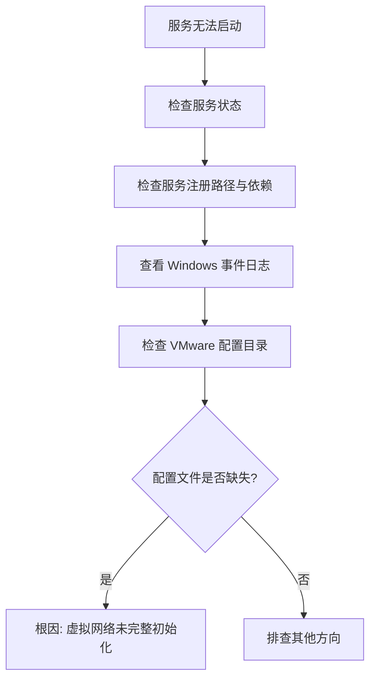

有时会遇到 VMware 上的 DHCP/NAT 服务无法启动的问题，尝试手动启动时可能显示：

```text
本地计算机上的 VMware DHCP Service 服务启动后停止。某些服务在未由其他服务或程序使用时将自动停止。
Windows 无法启动 VMware NAT Service 服务(位于本地计算机上)。错误 1067：进程意外终止。
```

> [!abstract]
> 本次故障的根因是 VMware 虚拟网络配置不完整：`C:\ProgramData\VMware` 下缺少 `vmnetdhcp.conf`、`vmnetnat.conf`，并且 VMnet1/VMnet8 虚拟网卡没有正确生成。通过 VMware 虚拟网络编辑器执行 `Restore Defaults` 后，配置文件、虚拟网卡和服务都恢复正常。

---

# 1. 故障现象

系统安装了 VMware Workstation，但以下两个服务无法正常启动：

| 服务名 | 显示名称 | 典型报错 |
|---|---|---|
| `VMnetDHCP` | VMware DHCP Service | 启动后自动停止 |
| `VMware NAT Service` | VMware NAT Service | 错误 1067：进程意外终止 |

手动启动时出现的完整错误信息：

```text
本地计算机上的 VMware DHCP Service 服务启动后停止。
某些服务在未由其他服务或程序使用时将自动停止。
```

```text
Windows 无法启动 VMware NAT Service 服务(位于本地计算机上)。
错误 1067：进程意外终止。
```

> [!warning]
> 这类报错容易误判为权限问题、服务依赖问题或端口占用问题，但本次真正的问题在 **VMware 虚拟网络配置层**。

# 2. 诊断过程

整体诊断流程如下：



## 2.1 检查服务状态

```powershell
Get-Service -Name 'VMnetDHCP','VMware NAT Service' |
  Format-List Name,DisplayName,Status,StartType,ServiceType,CanStop
```

若两个服务均为：

```text
Status    : Stopped
StartType : Automatic
```

说明服务注册存在，但启动后退出。

## 2.2 检查服务注册路径和依赖

```powershell
sc.exe qc VMnetDHCP
sc.exe qc "VMware NAT Service"
```

关键结果：

```text
SERVICE_NAME: VMnetDHCP
BINARY_PATH_NAME   : C:\Windows\SysWOW64\vmnetdhcp.exe
DEPENDENCIES       : VMnetuserif
SERVICE_START_NAME : LocalSystem

SERVICE_NAME: VMware NAT Service
BINARY_PATH_NAME   : C:\Windows\SysWOW64\vmnat.exe
DEPENDENCIES       : VMnetuserif
SERVICE_START_NAME : LocalSystem
```

> [!info]
> 服务可执行文件和服务注册项都在，优先排除"服务未安装"的方向。

## 2.3 查看 Windows 事件日志

```powershell
Get-WinEvent -FilterHashtable @{
  LogName='System'
  StartTime=(Get-Date).AddDays(-7)
} -ErrorAction SilentlyContinue |
  Where-Object {
    $_.ProviderName -match 'VMware|Service Control Manager|vmnet|vmnat|dhcp' -or
    $_.Message -match 'VMware|VMnetDHCP|VMware NAT|vmnat|vmnetdhcp'
  } |
  Select-Object -First 30 TimeCreated,ProviderName,Id,LevelDisplayName,Message |
  Format-List
```

最关键的错误：

```text
ProviderName : VMnetDHCP
Message      : Can't open C:\ProgramData\VMware\vmnetdhcp.conf:
               系统找不到指定的文件。
```

> [!tip]
> 这条日志直接指向 DHCP 配置文件缺失，是本次故障的**关键线索**。

## 2.4 检查 VMware 配置目录

```powershell
Get-ChildItem -LiteralPath 'C:\ProgramData\VMware' -Force
```

修复前只看到：

```text
C:\ProgramData\VMware\netmap.conf
```

缺少：

```text
C:\ProgramData\VMware\vmnetdhcp.conf
C:\ProgramData\VMware\vmnetnat.conf
```

同时也没有正常枚举出 `VMware Network Adapter VMnet1` 和 `VMware Network Adapter VMnet8`。

> [!bug] 根因判断
> VMware 虚拟网络组件的驱动和服务存在，但默认 VMnet 网络没有完整初始化。DHCP/NAT 服务启动时找不到配置文件，于是直接退出，表现为 DHCP 服务“启动后停止”和 NAT 服务 `1067`。

# 3. 修复方法

## 3.1 备份当前 VMware 网络配置

```powershell
$stamp = Get-Date -Format 'yyyyMMdd-HHmmss'
$backup = Join-Path (Get-Location) "vmware-network-backup-$stamp"
New-Item -ItemType Directory -Path $backup | Out-Null
Copy-Item -LiteralPath 'C:\ProgramData\VMware\netmap.conf' -Destination $backup -ErrorAction SilentlyContinue
Get-ChildItem -LiteralPath 'C:\ProgramData\VMware' -Filter 'vmnet*.conf' -ErrorAction SilentlyContinue |
  Copy-Item -Destination $backup -ErrorAction SilentlyContinue
Write-Output "Backup: $backup"
```

本次修复前能备份到的只有 `netmap.conf`，进一步证明 DHCP/NAT 配置文件确实缺失。

## 3.2 以管理员权限打开虚拟网络编辑器

```powershell
Start-Process -FilePath 'C:\Program Files (x86)\VMware\VMware Workstation\vmnetcfg.exe' -Verb RunAs
```

在 VMware 虚拟网络编辑器中执行：

```text
Change Settings -> Restore Defaults -> 等待重建完成 -> Apply/OK
```

> [!warning]
> `Restore Defaults` 不会删除虚拟机、虚拟磁盘或快照，但会**重置 VMware 虚拟网络配置**。如果之前手动设置过 VMnet 子网、NAT 端口转发、自定义 VMnet2-VMnet19，需要先截图或备份。

这一步会重新生成默认虚拟网络：

| 网络 | 类型 | 作用 |
|---|---|---|
| VMnet0 | Bridged | 桥接网络 |
| VMnet1 | Host-only | 仅主机网络 |
| VMnet8 | NAT | NAT 出网网络 |

它还会重新生成：

- `vmnetdhcp.conf`
- `vmnetnat.conf`
- `vmnetdhcp.leases`
- `vmnetnat-mac.txt`
- `VMware Network Adapter VMnet1`
- `VMware Network Adapter VMnet8`

# 4. 修复后验证

## 4.1 确认配置文件已生成

```powershell
Get-ChildItem -LiteralPath 'C:\ProgramData\VMware' -Force -File |
  Select-Object FullName,Length,LastWriteTime
```

修复后看到：

```text
C:\ProgramData\VMware\netmap.conf
C:\ProgramData\VMware\vmnetdhcp.conf
C:\ProgramData\VMware\vmnetdhcp.leases
C:\ProgramData\VMware\vmnetnat-mac.txt
C:\ProgramData\VMware\vmnetnat.conf
```

## 4.2 确认服务已运行

```powershell
Get-Service -Name 'VMnetDHCP','VMware NAT Service' |
  Format-List Name,DisplayName,Status,StartType
```

修复后结果：

```text
Name        : VMnetDHCP
DisplayName : VMware DHCP Service
Status      : Running
StartType   : Automatic

Name        : VMware NAT Service
DisplayName : VMware NAT Service
Status      : Running
StartType   : Automatic
```

## 4.3 确认 VMnet 虚拟网卡已出现

```powershell
ipconfig /all
```

修复后可见：

```text
Ethernet adapter VMware Network Adapter VMnet1:
Description . . . . . . . . . . . : VMware Virtual Ethernet Adapter for VMnet1
IPv4 Address. . . . . . . . . . . : 192.168.26.1
DHCP Server . . . . . . . . . . . : 192.168.26.254

Ethernet adapter VMware Network Adapter VMnet8:
Description . . . . . . . . . . . : VMware Virtual Ethernet Adapter for VMnet8
IPv4 Address. . . . . . . . . . . : 192.168.174.1
DHCP Server . . . . . . . . . . . : 192.168.174.254
```

## 4.4 检查 DHCP 配置内容

```powershell
Get-Content -LiteralPath 'C:\ProgramData\VMware\vmnetdhcp.conf'
```

修复后配置中包含两个虚拟网络段：

```text
subnet 192.168.26.0 netmask 255.255.255.0
subnet 192.168.174.0 netmask 255.255.255.0
```

| 子网 | 对应 VMnet | 用途 |
|---|---|---|
| `192.168.26.0/24` | VMnet1 | Host-only 仅主机 |
| `192.168.174.0/24` | VMnet8 | NAT 出网 |

# 5. 为什么不建议手写配置文件

虽然报错直接显示缺少 `vmnetdhcp.conf`，但不建议手动创建空文件或手写配置，原因是 VMware 虚拟网络不只依赖这两个文本文件，还涉及：

| 关联组件 | 说明 |
|---|---|
| VMnet 虚拟网卡 | Windows 网络适配器中必须存在对应虚拟网卡 |
| 网络适配器注册 | Windows 注册表中需要正确的网卡注册信息 |
| VMware 网络驱动 | 虚拟交换机与桥接驱动需正常加载 |
| DHCP/NAT 服务绑定 | 服务需绑定到正确的 VMnet 实例 |
| NAT 子网和网关地址 | NAT 网关 IP 必须与子网配置一致 |
| 虚拟网络编辑器内部状态 | 编辑器维护的 netmap.conf 等状态文件 |

> [!warning]
> 只补文件容易让服务能启动但虚拟机仍然无法联网。`Restore Defaults` 会一次性重建整套关联状态，更稳。

# 6. 后续排查清单

如果服务已经运行，但虚拟机仍无法通过 NAT 上网，按顺序检查：

- [ ] 虚拟机设置里的网络适配器是否选择 `NAT`
- [ ] 是否勾选“启动时连接”
- [ ] 虚拟机内部是否获得 `192.168.174.x` 地址
- [ ] 虚拟机内部网关是否为 `192.168.174.2`
- [ ] Windows 防火墙或第三方安全软件是否拦截 VMware NAT
- [ ] 是否曾手动改过 VMnet8 子网或端口转发

常用验证命令：

```powershell
Get-Service VMnetDHCP,"VMware NAT Service"
ipconfig /all
Get-ChildItem C:\ProgramData\VMware\vmnet*.conf
```

# 7. 结论

本次问题不是 VMware 主程序损坏，也不是简单的服务权限问题，而是 **VMware 默认虚拟网络配置缺失**。执行虚拟网络编辑器的 `Restore Defaults` 后，`vmnetdhcp.conf`、`vmnetnat.conf`、VMnet1/VMnet8 和 DHCP/NAT 服务全部恢复。

> [!success]
> 最终状态：`VMware DHCP Service` 和 `VMware NAT Service` 均为 `Running`，VMnet1/VMnet8 正常出现，NAT 网络恢复可用。
