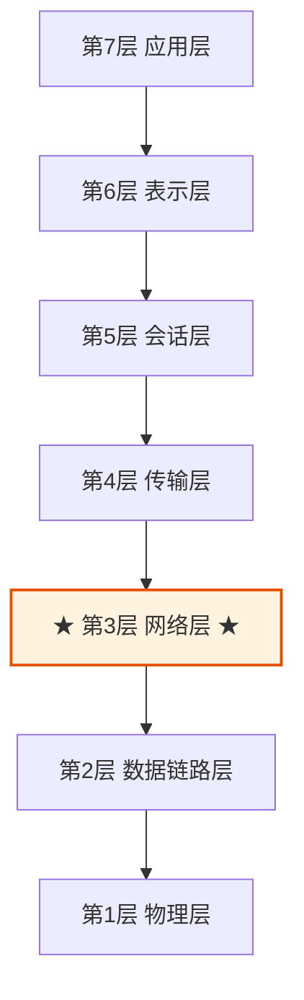
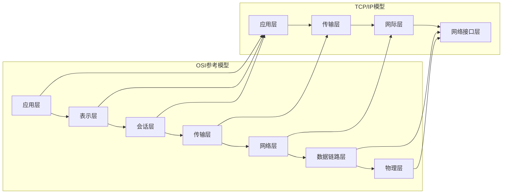
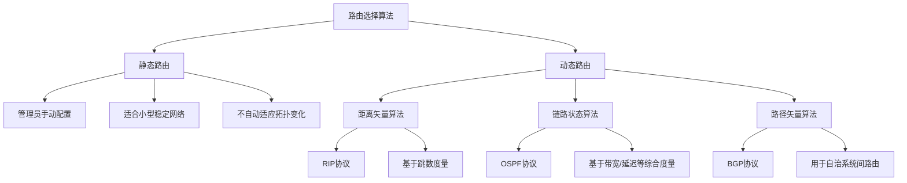
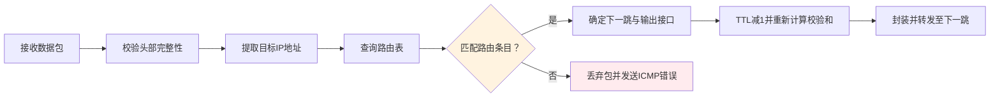
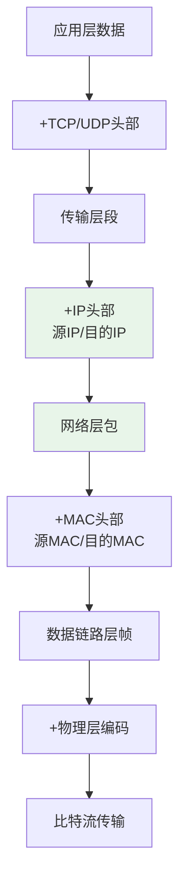
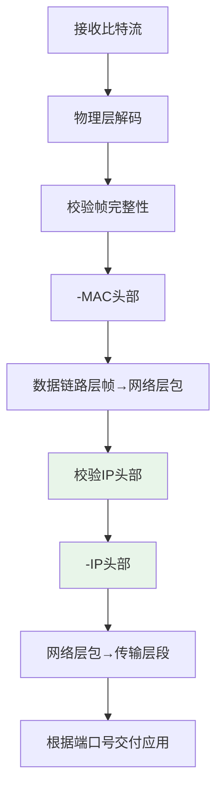
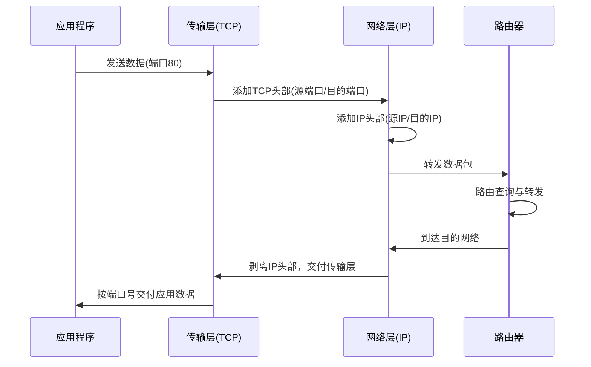
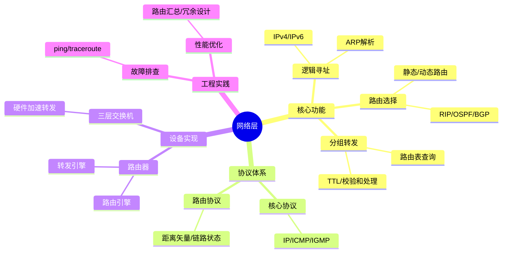

# 1. 网络层核心功能与协议机制

本笔记系统梳理计算机网络中网络层（Network Layer）的核心功能、协议机制与工程实践。通过对比分析各层寻址方式、设备特性与协议交互，建立对网络层"逻辑寻址与路由选择"本质的深刻理解。

## 1.1 网络层在分层模型中的定位

### 1.1.1 OSI七层模型架构



**层级功能速查表**：

| 层级 | 名称 | 核心功能 | 数据单元 | 典型协议 |
| :--- | :--- | :--- | :--- | :--- |
| 第7层 | 应用层 | 应用程序网络服务接口 | 报文（Message） | HTTP、FTP、SMTP |
| 第6层 | 表示层 | 数据格式转换、加密解密 | 报文（Message） | SSL/TLS、JPEG |
| 第5层 | 会话层 | 会话建立、管理与终止 | 报文（Message） | RPC、NetBIOS |
| 第4层 | 传输层 | 端到端通信、可靠传输 | 段（Segment） | TCP、UDP |
| **第3层** | **网络层** | **逻辑寻址、路由选择** | **包（Packet）** | **IP、ICMP、OSPF** |
| 第2层 | 数据链路层 | 物理寻址、帧传输、差错控制 | 帧（Frame） | Ethernet、PPP |
| 第1层 | 物理层 | 比特流传输、物理介质规范 | 比特（Bit） | RJ-45、光纤 |

> [!tip] 记忆口诀
> - 英文：`All People Seem To Need Data Processing`
> - 中文：**应**该**表**示**会**话**传**输**网**络**数**据**物**理

### 1.1.2 TCP/IP四层模型对比

实际工程中更常用简化的TCP/IP模型，需注意与OSI模型的映射关系。

| OSI七层模型 | TCP/IP四层模型 | 功能整合说明 |
| :--- | :--- | :--- |
| 应用层、表示层、会话层 | **应用层** | 高层协议统一归入应用层 |
| 传输层 | **传输层** | 端到端通信机制保持一致 |
| **网络层** | **网际层（Internet）** | 核心路由与寻址功能等价 |
| 数据链路层、物理层 | **网络接口层** | 底层传输细节抽象化 |



## 1.2 网络层核心功能详解

### 1.2.1 逻辑寻址机制

网络层通过逻辑地址（IP地址）实现跨网络的主机标识，与数据链路层的物理地址形成互补。

**地址类型对比**：

| 特性 | 逻辑地址（网络层） | 物理地址（数据链路层） |
| :--- | :--- | :--- |
| **地址类型** | 可配置的逻辑标识 | 固化的硬件标识 |
| **地址示例** | `192.168.1.100`（IPv4） | `00:1A:2B:3C:4D:5E`（MAC） |
| **地址长度** | IPv4: 32位 / IPv6: 128位 | 48位（6字节） |
| **作用范围** | 全局唯一（公网）或局部唯一（私网） | 局域网内唯一 |
| **可变性** | 可动态分配（DHCP） | 出厂固化，通常不可修改 |

**地址格式示例**：

```cpp
// IPv4地址结构（32位）
192.168.1.100
├─ 网络部分：192.168.1.0/24
└─ 主机部分：0.0.0.100

// IPv6地址结构（128位，压缩表示）
2001:0db8:85a3::8a2e:0370:7334
├─ 全局路由前缀：2001:0db8:85a3::/48
├─ 子网标识：::/64
└─ 接口标识：::8a2e:0370:7334
```

> [!note] 地址解析协议（ARP）
> ARP负责将网络层的逻辑地址（IP）解析为数据链路层的物理地址（MAC），是两层协同工作的关键桥梁。

### 1.2.2 路由选择策略

路由选择是网络层的核心决策过程，决定数据包从源到目的的最佳传输路径。

**路由表结构示例**：

```
目标网络        网关            子网掩码          接口        度量值
192.168.1.0     0.0.0.0         255.255.255.0     eth0        0
10.0.0.0        192.168.1.1     255.0.0.0         eth0        1
172.16.0.0      192.168.1.2     255.240.0.0       eth1        2
0.0.0.0         192.168.1.254   0.0.0.0           eth0        10  ← 默认路由
```

**路由算法分类**：



| 算法类型 | 代表协议 | 核心思想 | 适用场景 |
| :--- | :--- | :--- | :--- |
| **静态路由** | 手动配置 | 管理员预定义路径 | 小型网络、安全隔离环境 |
| **距离矢量** | RIP | 周期性交换路由表，选择跳数最少路径 | 小型自治系统 |
| **链路状态** | OSPF | 泛洪链路状态信息，构建全局拓扑图 | 中大型企业内部网络 |
| **路径矢量** | BGP | 基于策略的自治系统间路由选择 | 互联网骨干网 |

### 1.2.3 分组转发流程

分组转发是路由决策的执行阶段，将数据包从输入接口转发至输出接口。

**路由器转发处理流程**：



**关键字段处理**：

| 字段 | 处理动作 | 目的 |
| :--- | :--- | :--- |
| **TTL** | 每跳减1，归零则丢弃 | 防止路由环路导致无限转发 |
| **校验和** | 每跳重新计算 | 确保头部传输完整性 |
| **源/目的IP** | 保持不变（除非NAT） | 保证端到端通信语义 |
| **源/目的MAC** | 每跳重写 | 适配当前链路的物理寻址 |

## 1.3 网络层协议体系

### 1.3.1 核心协议功能对比

```
网络层协议族：
├── 核心协议
│   ├── IP（Internet Protocol）：无连接、不可靠的数据包传输
│   ├── ICMP（控制报文协议）：差错报告与网络诊断
│   └── IGMP（组管理协议）：组播组成员管理
│
├── 路由协议
│   ├── RIP（路由信息协议）：距离矢量，小型网络
│   ├── OSPF（开放最短路径优先）：链路状态，企业网
│   └── BGP（边界网关协议）：路径矢量，互联网骨干
│
└── 辅助协议
    ├── ARP（地址解析协议）：IP→MAC映射
    └── RARP（反向地址解析）：MAC→IP映射（已少用）
```

**协议功能速查**：

| 协议 | 协议号 | 核心功能 | 典型应用 |
| :--- | :--- | :--- | :--- |
| **IP** | - | 逻辑寻址、分组转发 | 所有网络通信基础 |
| **ICMP** | 1 | 差错报告、连通性测试 | `ping`、`traceroute` |
| **IGMP** | 2 | 组播组成员管理 | 视频直播、在线会议 |
| **OSPF** | 89 | 内部网关路由计算 | 企业网络路由 |
| **BGP** | - | 自治系统间路由交换 | 互联网骨干路由 |

> [!warning] ARP协议归属争议
> 严格来说，ARP工作在网络层与数据链路层之间。部分教材将其归入网络层，部分归入数据链路层。理解其"逻辑地址→物理地址"的转换本质比记忆归属更重要。

### 1.3.2 数据封装与解封装过程

**发送方封装流程**：



**接收方解封装流程**：



> [!note] 封装关键点
> - **网络层添加**：源IP地址、目的IP地址、协议类型、TTL
> - **数据链路层添加**：源MAC地址、目的MAC地址、帧类型
> - 每层仅处理本层头部，对上层数据透明传输

## 1.4 网络设备与层级映射

### 1.4.1 设备工作层级对比

| 设备 | 工作层级 | 核心功能 | 寻址依据 | 典型应用场景 |
| :--- | :--- | :--- | :--- | :--- |
| **路由器** | **网络层** | 路由选择、分组转发、协议转换 | **IP地址** | 网络互联、边界网关 |
| 三层交换机 | 网络层+数据链路层 | 高速路由+局域网交换 | IP+MAC | 企业核心网络 |
| 二层交换机 | 数据链路层 | MAC地址学习、帧转发 | MAC地址 | 局域网接入层 |
| 集线器 | 物理层 | 信号放大、广播转发 | 无寻址 | 已淘汰，仅教学用 |
| 防火墙 | 多层（3-7层） | 访问控制、流量过滤 | IP/端口/应用特征 | 网络安全边界 |
| 网关 | 应用层 | 协议转换、应用代理 | 应用层协议 | 异构网络互联 |

### 1.4.2 路由器工作原理详解

**路由器数据包处理七步法**：

```cpp
// 伪代码示意路由器转发逻辑
void router_forward(Packet* pkt) {
    // 1. 接收并校验
    if (!verify_checksum(pkt->header)) {
        drop_packet(pkt);
        return;
    }
    
    // 2. 提取目标IP
    IPAddress dest_ip = pkt->header.dest_ip;
    
    // 3. 路由表最长前缀匹配
    RouteEntry* entry = longest_prefix_match(routing_table, dest_ip);
    if (!entry) {
        send_icmp_unreachable(pkt);
        return;
    }
    
    // 4. TTL处理
    if (--pkt->header.ttl == 0) {
        send_icmp_time_exceeded(pkt);
        return;
    }
    
    // 5. 重新计算校验和
    pkt->header.checksum = calculate_checksum(pkt->header);
    
    // 6. 链路层重封装
    MACAddress next_hop_mac = arp_lookup(entry->next_hop_ip);
    Frame* frame = encapsulate_frame(pkt, next_hop_mac, entry->out_interface);
    
    // 7. 物理层发送
    transmit_frame(frame, entry->out_interface);
}
```

> [!tip] 最长前缀匹配原则
> 当路由表中存在多条匹配条目时，选择子网掩码最长（网络前缀最具体）的条目。例如目标`192.168.1.100`同时匹配`192.168.1.0/24`和`192.168.0.0/16`时，优先选择`/24`条目。

## 1.5 网络层与其他层的协同机制

### 1.5.1 与传输层的交互



**关键协同点**：
- 传输层负责**端到端**的可靠传输（端口寻址）
- 网络层负责**点到点**的路由转发（IP寻址）
- 两者结合实现"主机到主机"的完整通信

### 1.5.2 与数据链路层的边界

```
数据流视角：
应用数据
   ↓ [传输层：添加端口信息]
   ↓ [网络层：添加IP地址] ← 逻辑寻址边界
   ↓ [数据链路层：添加MAC地址] ← 物理寻址边界
   ↓ [物理层：比特流传输]
```

**边界划分原则**：
- **网络层以上**：关注逻辑连接与端到端语义
- **数据链路层以下**：关注物理介质与链路可靠性
- **网络层核心**：屏蔽底层链路差异，提供统一寻址与路由服务

## 1.6 工程实践与故障排查

### 1.6.1 常见网络层故障诊断

| 故障现象 | 可能原因 | 排查命令 | 解决思路 |
| :--- | :--- | :--- | :--- |
| 无法访问外网 | 默认路由缺失 | `route print` / `ip route` | 添加默认网关 |
| 部分网站无法访问 | 路由环路/黑洞 | `traceroute 目标IP` | 检查中间路由配置 |
| 网络时通时断 | TTL过小/路由震荡 | `ping -t 目标IP` | 调整路由策略或链路质量 |
| 跨网段通信失败 | 子网掩码配置错误 | `ipconfig /all` | 修正网络/主机位划分 |
| 组播无法接收 | IGMP未启用/防火墙拦截 | `netsh interface ip show joins` | 启用组播协议或调整防火墙 |

### 1.6.2 路由配置最佳实践

```bash
# Linux系统路由配置示例
# 查看路由表
ip route show

# 添加静态路由
ip route add 10.0.0.0/8 via 192.168.1.1 dev eth0

# 设置默认网关
ip route add default via 192.168.1.254

# 启用IP转发（路由器模式）
echo 1 > /proc/sys/net/ipv4/ip_forward

# 持久化配置（Debian/Ubuntu）
# 编辑 /etc/network/interfaces 或 /etc/netplan/*.yaml
```

> [!warning] 安全配置建议
> 1. 禁用不必要的路由协议（如RIP v1明文传输）
> 2. 启用路由认证（如OSPF MD5认证）
> 3. 配置访问控制列表（ACL）限制路由更新源
> 4. 定期审计路由表，防止路由劫持

### 1.6.3 性能优化要点

| 优化方向 | 具体措施 | 预期效果 |
| :--- | :--- | :--- |
| **路由收敛** | 调整OSPF定时器、启用BGP快速外部切换 | 减少网络故障恢复时间 |
| **转发效率** | 启用硬件转发（如CEF）、优化路由表结构 | 提升数据包处理吞吐量 |
| **资源占用** | 路由汇总（Route Summarization）、过滤冗余路由 | 降低内存与带宽消耗 |
| **可靠性** | 配置冗余链路、启用等价多路径（ECMP） | 提升网络容错能力 |

## 1.7 核心概念总结

### 1.7.1 知识图谱



### 1.7.2 关键结论

1. **网络层本质**：通过逻辑地址（IP）实现跨网络的端到端通信，屏蔽底层链路差异
2. **路由核心**：基于路由表的"最长前缀匹配"决策机制，平衡效率与灵活性
3. **协议协同**：IP提供基础传输，ICMP/IGMP辅助管理，路由协议动态维护拓扑
4. **设备分工**：路由器专注网络层转发，交换机专注链路层交换，各司其职
5. **工程原则**：配置简洁性、收敛快速性、转发高效性、安全可靠性四者平衡

> [!tip] 复习要点
> 1. 网络层负责**逻辑寻址（IP）**与**路由选择**，数据单元为**包（Packet）**
> 2. 路由器基于**最长前缀匹配**查询路由表，每跳重写MAC地址
> 3. `ping`使用ICMP协议，`traceroute`利用TTL机制探测路径
> 4. OSPF适合企业内部网，BGP用于互联网骨干，场景决定协议选择
> 5. 封装时网络层添加IP头部，解封装时按协议号交付上层

### 1.7.3 常见误区澄清

| 误区 | 正确理解 |
| :--- | :--- |
| "路由器修改源/目的IP" | 除非NAT场景，否则路由器保持端到端IP不变 |
| "路由表越大转发越快" | 路由表需平衡精确性与查找效率，汇总优于明细 |
| "动态路由一定优于静态路由" | 小型稳定网络中静态路由更简单可靠 |
| "网络层负责可靠传输" | 可靠传输由传输层（TCP）保证，网络层（IP）尽最大努力交付 |
| "交换机也能路由" | 仅三层交换机具备路由功能，普通二层交换机仅处理帧 |

> [!note] 学习建议
> 结合`Wireshark`抓包观察实际数据包的封装过程，通过`GNS3`/`EVE-NG`搭建实验环境验证路由配置，理论与实践结合深化理解。